<div align="center">


# ThrottleWatch

### ¿Tu CPU va lenta? Deja de adivinar. Averígualo.

ThrottleWatch observa tu procesador Intel o AMD en tiempo real y te dice, con evidencia y sin exagerar, si el calor está limitando tu rendimiento — o si el culpable es otra cosa.

[](LICENSE)


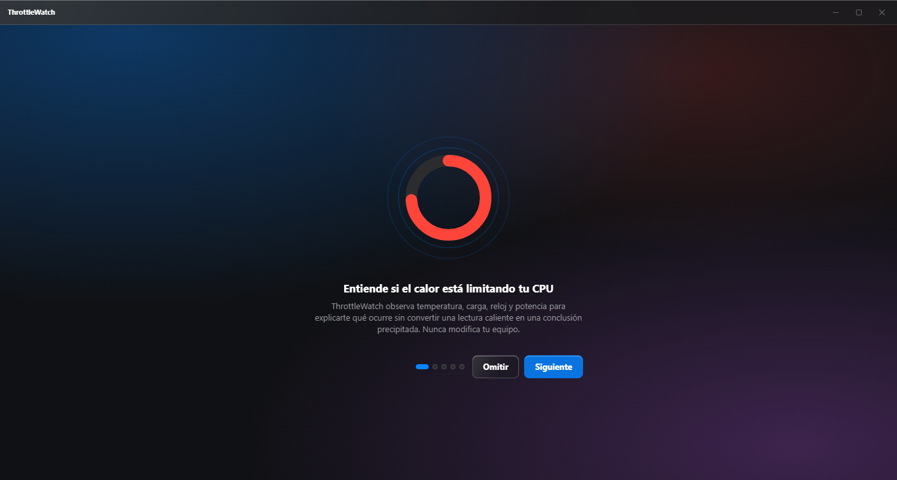

</div>

---

## ¿Qué es ThrottleWatch?

Notas el portátil caliente, el ventilador a tope, o que un juego o un render va más lento de lo esperado. La pregunta natural es «¿se está limitando mi CPU por el calor?» — y casi ninguna herramienta te da una respuesta honesta. Unas te enseñan un termómetro y te dejan sacar tus propias conclusiones; otras te sueltan un "throttling: 23%" sin explicar qué significa ni de dónde sale ese número.

**ThrottleWatch existe para responder tres preguntas concretas, con evidencia:**

1. 🌡️ **¿Mi CPU está demasiado caliente**, ahora mismo o bajo carga sostenida?
2. 🔍 **¿Ese calor está reduciendo realmente el rendimiento**, o es una temperatura alta sin consecuencias?
3. ⚖️ **¿Merece la pena mejorar la refrigeración**, o el límite real es otro (potencia, batería, perfil energético)?

Y lo hace sin inventarse nada: cuando la evidencia no alcanza para confirmar algo, ThrottleWatch lo dice explícitamente en lugar de rellenar el hueco con una suposición.

## El problema con las herramientas de monitorización habituales

| Lo que casi todas hacen | Lo que hace ThrottleWatch |
|---|---|
| Temperatura alta ⇒ "estás sufriendo throttling" | Una temperatura alta **no demuestra** pérdida de rendimiento; se mira **qué se queda clavado en su tope** (temperatura o potencia) y, si el equipo lo permite, el **motivo que declara el propio procesador** |
| La frecuencia baja al minuto de empezar ⇒ "se está calentando" | Eso suele ser el **fin del turbo de potencia**, previsto por el fabricante; ThrottleWatch lo marca como normal |
| Llegar a 95–100 °C ⇒ "problema" | En muchas CPU modernas es el comportamiento de diseño. El problema es bajar de la **frecuencia garantizada**, y así se distingue |
| Potencia limitada ⇒ "no es cosa de temperatura" | Muchos portátiles bajan la potencia porque **se calienta el chasis**; ThrottleWatch lo detecta y sí recomienda ventilar mejor |
| "% de tiempo en throttling" presentado como "% de rendimiento perdido" | Tiempo y rendimiento perdido **no son lo mismo**, y ThrottleWatch nunca confunde uno con otro |
| Compara tu frecuencia con el turbo máximo anunciado en la caja | El potencial se calcula con **la potencia que le queda por usar a tu procesador**, y en la prueba guiada el rendimiento se **mide** |
| Una sola cifra de "salud", sin decir de dónde sale | Cada conclusión distingue **observación → indicio → confirmación**, con las evidencias a un clic |
| CPU híbridas (P/E/LP) tratadas como un bloque homogéneo | Los núcleos de rendimiento, eficiencia y bajo consumo se **miden y muestran por separado** |

## Cómo se ve

### `Ahora` — tu estado en menos de cinco segundos

Un vistazo y ya sabes si todo va bien, si hace calor sin consecuencias demostradas, si el límite es térmico, de potencia, del propio equipo o mixto — y si es **normal** (por encima de la frecuencia garantizada) o **un problema** (por debajo). Cuando el equipo lo permite, también cuánto ganarías enfriando mejor. Temperatura, carga, frecuencia activa y potencia, con su procedencia y calidad — nunca un valor ausente disfrazado de `0`.

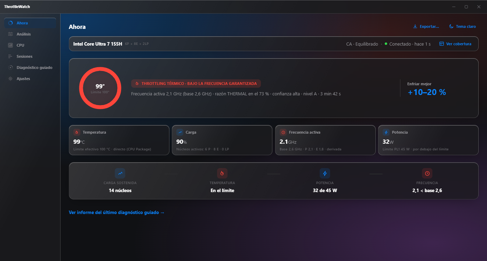

Tema claro incluido de fábrica, con el mismo material de vidrio adaptado al fondo:

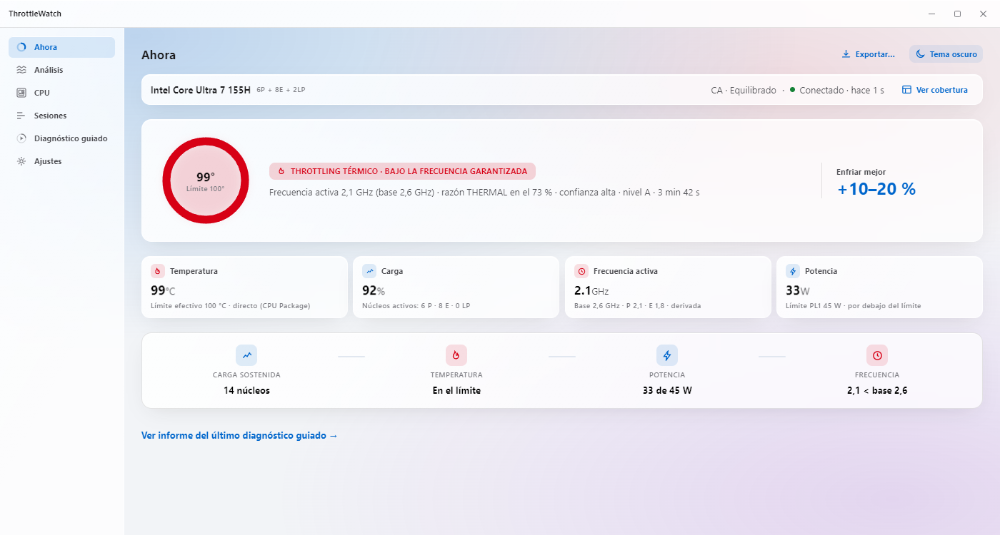

### `Análisis` — la secuencia completa, con eventos y evidencia

Cuatro series sincronizadas (temperatura, frecuencia activa, carga, potencia) con un único cursor. Las limitaciones térmicas, de potencia, del equipo y mixtas se marcan sobre el propio gráfico —y el fin del turbo, como simple marcador informativo— y, al seleccionarlas, abren el porqué: qué se observó, durante cuánto tiempo y con qué evidencia concreta.

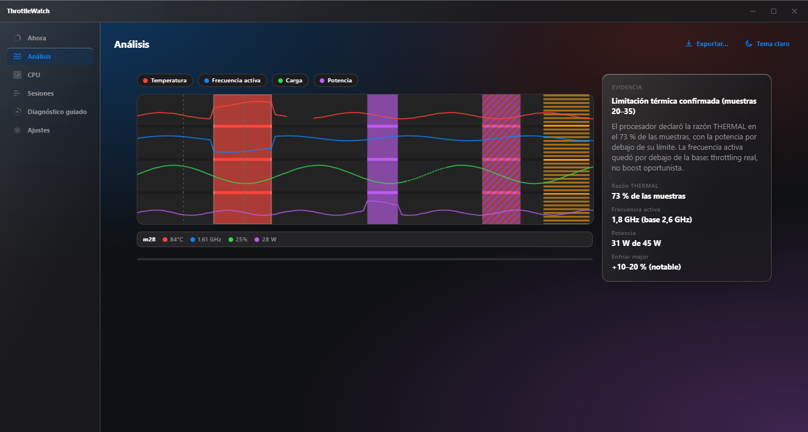

### `CPU` — un mapa real de tu procesador, núcleo a núcleo

Los procesadores híbridos modernos mezclan núcleos de rendimiento, eficiencia y bajo consumo con comportamientos térmicos distintos. ThrottleWatch los separa en el mapa en lugar de promediarlos, y avisa explícitamente cuando un núcleo no reporta datos.

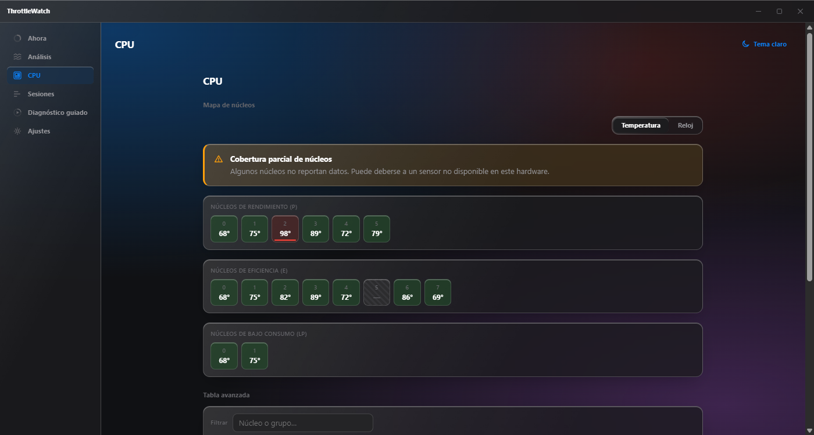

### `Sesiones` — tu historial, tuyo y solo tuyo

Monitorización continua, diagnósticos guiados y sesiones importadas, cada una con su clasificación y su estado. Los diagnósticos guiados pueden marcarse como referencia para comparar «antes/después» de limpiar el equipo o cambiar la pasta térmica.

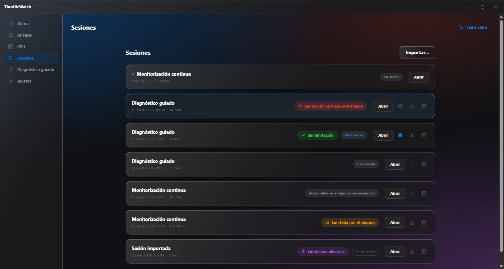

### `Diagnóstico guiado` — una prueba controlada, cuando la quieras

Una carga progresiva, voluntaria y cancelable en cualquier momento, que **mide el trabajo real** que hace tu procesador y te dice cuánto rinde al final frente al principio, y por qué (fin del turbo, potencia, temperatura o el equipo). Llegar al límite de temperatura no la detiene —el procesador se protege solo—, pero sí se para si ese control fallara. Nunca se lanza sola, y nunca toca voltajes, potencia, ventiladores ni BIOS.

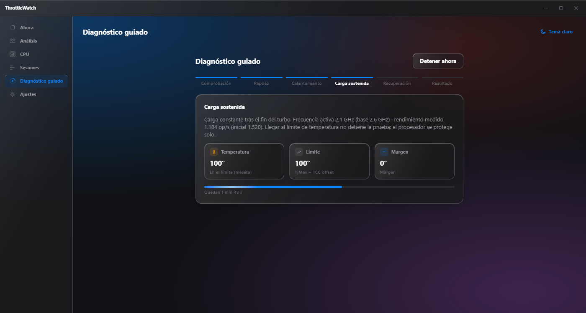

### `Informe` — la conclusión, explicada como a una persona

No un dashboard más: una narrativa. Qué se observó, cuánto ayudaría enfriar mejor (con el método y los datos usados a la vista, y solo cuando se puede calcular — nunca un porcentaje inventado), qué evidencias lo sostienen y qué no puede concluirse todavía.

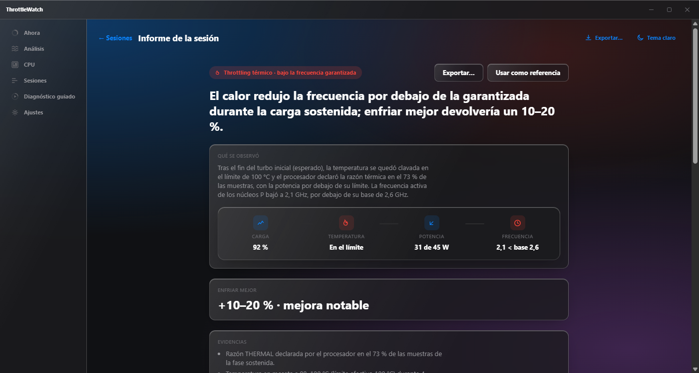

### `Ajustes` — todo configurable, nada sorprendente

Perfiles de muestreo en lenguaje llano, retención de datos, bandeja del sistema, notificaciones apagadas de fábrica, actualizaciones opcionales y firmadas. Los valores numéricos exactos quedan un nivel por debajo, en «Avanzado».

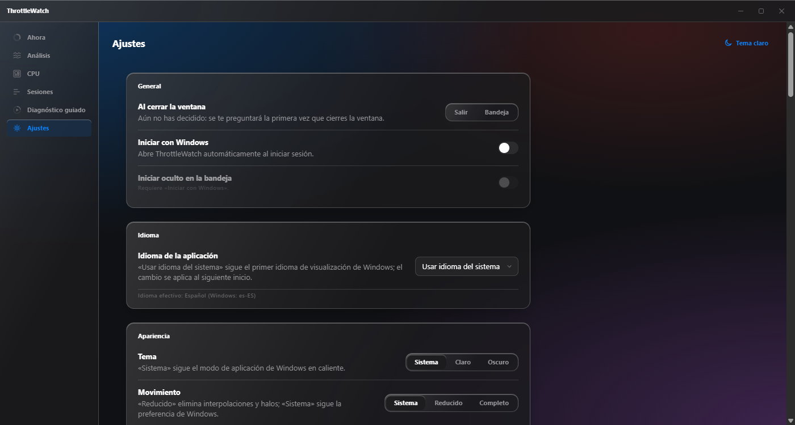

### Se adapta a cualquier tamaño de ventana

De ventana ancha de escritorio a una franja estrecha con navegación inferior — sin perder ninguna función, solo reordenándola.

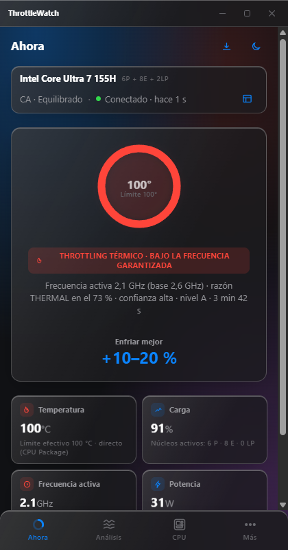

## Lo que ThrottleWatch nunca hace

- ❌ No modifica voltajes, potencia, frecuencias, ventiladores ni BIOS — **solo observa y explica**.
- ❌ No convierte "tiempo en throttling" en "porcentaje de rendimiento perdido".
- ❌ No usa el turbo anunciado en caja como referencia de rendimiento sostenido.
- ❌ No trata como problema lo que es comportamiento de diseño (fin del turbo, boost hasta el límite térmico por encima de la frecuencia garantizada).
- ❌ No muestra un `0` cuando un sensor no está disponible: dice explícitamente "No disponible".
- ❌ No envía **nada** por red salvo que actives voluntariamente el buscador de actualizaciones — y ni así envía identificadores.
- ❌ No necesita permisos de administrador para el uso diario.

## Principios de diseño

- **Evidencia antes que afirmación.** Toda conclusión distingue observación, indicio y confirmación, con intervalo y nivel de confianza visibles.
- **Privacidad por defecto.** Todo funciona sin internet; no hay telemetría remota; los datos nunca salen de tu equipo salvo que tú los exportes.
- **Degradación elegante.** Ningún sensor se da por garantizado: si tu hardware no expone algo, la aplicación lo dice y sigue funcionando con lo que sí tiene.
- **Accesible de verdad.** Navegación completa por teclado, contraste AA, modo de movimiento reducido, lector de pantalla, español e inglés desde el primer día.
- **Se siente nativa, no una web.** Sin subrayados al pasar el ratón, sin cursores de mano en botones, con el acabado de vidrio propio de una aplicación de escritorio moderna — nunca una página disfrazada de programa.

## Qué puede saber en tu equipo

No todos los equipos dejan leer lo mismo, y ThrottleWatch te dice desde el principio hasta dónde llega en el tuyo:

| Nivel | Qué lee | Qué puede decirte |
|---|---|---|
| **A · completo** (con el acceso avanzado instalado, recomendado) | Además de lo básico, el motivo por el que el procesador se limita, sus límites de potencia y su límite térmico real | Confirma la causa, distingue calor de la CPU, límite de potencia y gestión del fabricante, y estima cuánto ayudaría enfriar mejor |
| **B · con potencia** | Temperatura, frecuencia, carga por núcleo y potencia | Infiere la causa con confianza media, sin confirmarla ni dar cifras |
| **C · básico** | Temperatura, frecuencia y carga | Solo detecta el caso claro (temperatura en el límite y frecuencia bajo la garantizada) |

En Intel, el nivel A depende de poder leer ciertos registros del procesador; en AMD de consumo esa información no está documentada y el techo habitual es el nivel B. La viabilidad del nivel A sin pedir permisos de administrador en cada arranque es lo primero que se valida antes de implementar (véase [`plan.md`](specs/001-cpu-thermal-diagnostics/plan.md), fase 0).

## Cómo está construido

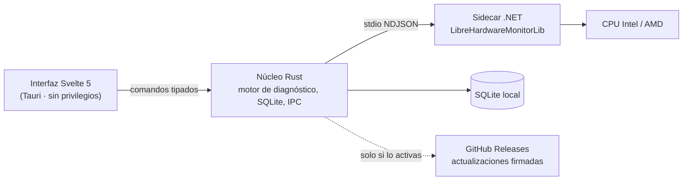

- **Interfaz**: Tauri 2 + Svelte 5 + TypeScript estricto, sin ejecutarse con privilegios elevados.
- **Motor**: Rust puro y determinista. Clasifica por niveles de cobertura, ignora la ventana de turbo, atribuye la causa por la magnitud que se estabiliza en su tope y mide la gravedad frente a la frecuencia garantizada. Se valida con trazas reales etiquetadas con los motivos que declara el propio procesador, y con copias degradadas para medir cuánto se equivoca en equipos que no los exponen.
- **Sensores**: un sidecar .NET que integra [`LibreHardwareMonitorLib`](https://github.com/LibreHardwareMonitor/LibreHardwareMonitor) (MPL-2.0), aislado del proceso visual y hablando un protocolo IPC cerrado y versionado.
- **Datos**: SQLite local, retención configurable, exportación CSV/JSON anonimizable.
- **Gráficos**: un componente SVG propio (`AnalysisChart`), sin dependencias de terceros, pensado para huecos reales, calidad de dato y accesibilidad por teclado.

El detalle completo — contratos IPC, modelo de datos, motor de clasificación y sus umbrales — está en [`specs/001-cpu-thermal-diagnostics/`](specs/001-cpu-thermal-diagnostics/).

## Estado del proyecto

Este repositorio se desarrolla **especificación primero**, con [GitHub SpecKit](https://github.com/github/spec-kit). Hoy existe:

- ✅ Especificación funcional completa, con criterios de aceptación verificables ([`spec.md`](specs/001-cpu-thermal-diagnostics/spec.md)).
- ✅ Modelo de datos, contratos IPC y de comandos, esquema JSON versionado ([`data-model.md`](specs/001-cpu-thermal-diagnostics/data-model.md), [`contracts/`](specs/001-cpu-thermal-diagnostics/contracts/)).
- ✅ Sistema de diseño Svelte 5 completo y verificado (`design/`), con todos los componentes que aparecen en las capturas de arriba.
- ✅ Un **mockup navegable con datos simulados** — el que has visto en las capturas — que puedes ejecutar tú mismo ahora mismo (siguiente sección).
- ⏳ **Implementación real pendiente**: el núcleo Rust, el sidecar .NET y la conexión a hardware todavía no existen. Nada de lo que ves en las capturas lee sensores reales todavía.

La hoja de ruta detallada, tarea a tarea, está en [`tasks.md`](specs/001-cpu-thermal-diagnostics/tasks.md).

## Pruébalo tú mismo (el mockup)

No hace falta compilar nada de Rust ni de .NET para ver la interfaz funcionando, con datos ficticios coherentes:

```powershell
git clone https://github.com/danimardo/ThrottleWatch.git
cd ThrottleWatch\design\mockup
npm install
npm run dev
```

Abre la URL que indique Vite y navega libremente: Ahora, Análisis, CPU, Sesiones, Diagnóstico guiado, Ajustes, temas claro/oscuro, ancho compacto/medio/expandido. No se conecta a tu hardware ni a internet.

También puedes explorar cada componente del sistema de diseño por separado:

```powershell
cd ThrottleWatch\design\harness
npm install
npm run dev
```

## Hoja de ruta

| Fase | Contenido |
|---|---|
| 0 — Riesgos y viabilidad | **Puerta de viabilidad**: ¿se alcanza el nivel A sin pedir administrador en cada arranque? Corpus de trazas etiquetadas, protocolo IPC, presupuesto del gráfico |
| 1 — Vertical slice pasivo | Onboarding, descubrimiento de CPU, cuatro métricas en vivo, primera sesión guardada |
| 2 — Diagnóstico y visualización | Motor por niveles de cobertura, ventana de turbo, gravedad frente a la frecuencia garantizada, potencial con mejor refrigeración, gráficos sincronizados, mapa de núcleos, informe |
| 3 — Operación de escritorio | Bandeja, ajustes, exportación/importación, recuperación del colector, actualizaciones firmadas |
| 4 — Prueba guiada y endurecimiento | Carga guiada, matriz de hardware real, accesibilidad, rendimiento, empaquetado |

## Estructura del repositorio

```text
.specify/memory/constitution.md   principios y puertas de calidad del proyecto
historias.md                      necesidades de usuario, en lenguaje llano
specs/001-cpu-thermal-diagnostics/
├── spec.md                       qué debe hacer la aplicación (verificable)
├── plan.md, research.md          cómo se construye y por qué
├── data-model.md, contracts/     modelo de datos y contratos IPC/comandos
├── ux-visual-spec.md             especificación visual y de interacción
├── tasks.md                      hoja de ruta implementable
└── gap-analysis.md               revisión de huecos y registro de decisiones
design/                           sistema de diseño Svelte 5 (fuente canónica de UI)
├── components/, tokens/, icons/  componentes, tokens de diseño, iconografía
├── mockup/                       prototipo navegable — el de las capturas
└── harness/                      catálogo aislado de componentes
docs/screenshots/                 las capturas de este README
```

### Cómo consumir este paquete con SpecKit

1. Inicializa un repositorio con SpecKit.
2. Copia `.specify/memory/constitution.md`, `historias.md` y `specs/001-cpu-thermal-diagnostics/` a sus rutas equivalentes.
3. Pide al agente que revise primero `constitution.md` y `spec.md`.
4. Continúa con el flujo `plan → tasks → implement → converge`.

## Contribuir

El proyecto todavía está en fase de especificación e implementación temprana. Si quieres proponer un cambio de comportamiento, empieza por [`spec.md`](specs/001-cpu-thermal-diagnostics/spec.md) y [`gap-analysis.md`](specs/001-cpu-thermal-diagnostics/gap-analysis.md); si es sobre la interfaz, por `design/AGENTS.md`. Los issues y las discusiones son bienvenidos.

## Licencia

ThrottleWatch se distribuye bajo la **GNU General Public License v3.0** — ver [`LICENSE`](LICENSE). En corto: puedes usar, estudiar, modificar y redistribuir este software libremente, siempre que cualquier versión modificada que distribuyas siga siendo libre bajo la misma licencia.

ThrottleWatch se apoya en [`LibreHardwareMonitorLib`](https://github.com/LibreHardwareMonitor/LibreHardwareMonitor) (MPL-2.0) para el acceso a sensores; los avisos de terceros se incluyen en la aplicación empaquetada (`Ajustes → Acerca de → Licencias de terceros`).

---

<div align="center">

**ThrottleWatch no adivina. Observa, mide y explica.**

</div>
