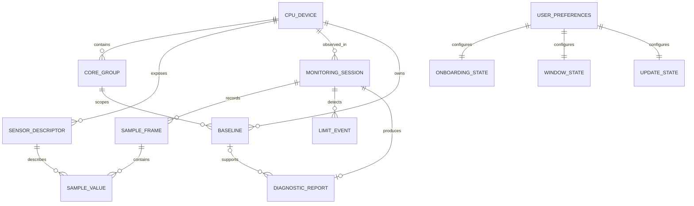
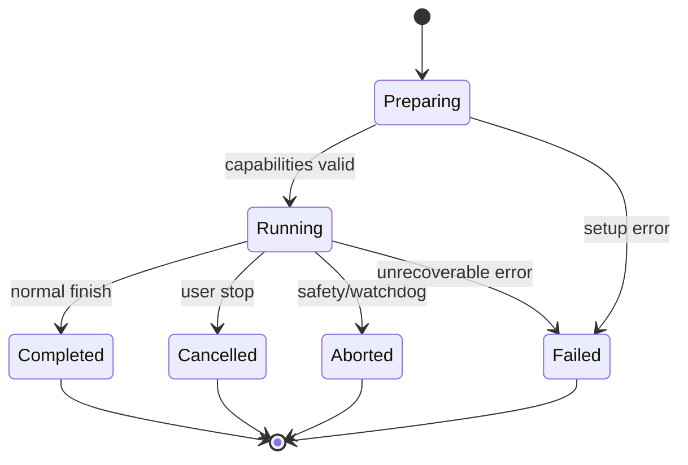

# Modelo de datos

## Convenciones

- IDs: UUID v7 o equivalente ordenable, generados por Rust.
- Tiempo persistido: UTC ISO-8601 y nanosegundos monotónicos relativos a la sesión.
- Unidades canónicas: °C, %, MHz, W, V y segundos.
- Los valores ausentes son `NULL`; cero es una medida válida.
- Cada dato derivado conserva `source_quality` y versión del algoritmo.

## Entidades

### `cpu_device`

| Campo | Tipo | Descripción |
|---|---|---|
| `id` | text PK | Identificador local estable derivado de identidad no sensible |
| `vendor` | enum | `intel`, `amd`, `other`, `unknown` |
| `display_name` | text | Nombre comunicado por el sistema |
| `family/model/stepping` | text nullable | Identificación técnica si existe |
| `architecture` | text nullable | Arquitectura inferida |
| `logical_processors` | integer | Procesadores lógicos visibles |
| `physical_cores` | integer nullable | Núcleos detectados |
| `hybrid` | boolean | Indica grupos heterogéneos |
| `fingerprint_version` | integer | Método usado para detectar cambios |
| `first_seen_at/last_seen_at` | datetime | Rango observado |

No guardar números de serie en esta tabla.

### `core_group`

| Campo | Tipo | Descripción |
|---|---|---|
| `id` | text PK | Identificador dentro del dispositivo |
| `cpu_id` | FK | CPU propietaria |
| `kind` | enum | `p`, `e`, `lp_e`, `homogeneous`, `unknown` |
| `physical_count` | integer nullable | Núcleos del grupo |
| `logical_count` | integer | Hilos del grupo |
| `topology_json` | json | Mapeo normalizado, sin lógica de negocio |

### `sensor_descriptor`

| Campo | Tipo | Descripción |
|---|---|---|
| `id` | text PK | ID normalizado estable durante la sesión |
| `cpu_id` | FK | CPU asociada |
| `source_id` | text | ID original del colector |
| `source_name` | text | Nombre original para auditoría |
| `metric` | enum | `temperature`, `thermal_headroom`, `load`, `effective_clock`, `clock`, `power`, `voltage`, `thermal_flag`, `power_flag`, `current_flag` |
| `scope` | enum | `package`, `group`, `core`, `thread`, `system` |
| `scope_ref` | text nullable | Grupo/núcleo/hilo |
| `unit` | text | Unidad canónica |
| `quality` | enum | `direct`, `derived`, `substitute`, `unknown` |
| `is_representative` | boolean | Elegido para el resumen |
| `metadata_json` | json | TjMax, offset, procedencia u otros datos |

### `capability_snapshot`

Registra en cada sesión qué magnitudes existen, qué calidad tienen y qué confianza máxima permiten. Evita reinterpretar informes históricos con capacidades actuales.

### `low_level_access` (estado en memoria, no persistido)

Estado del acceso avanzado que la UI recibe ya traducido desde `hello_ack.low_level_access.state`:

| IPC | UI | Efecto |
|---|---|---|
| `available` | `available` | sin acción |
| `reduced`, `missing` | `installable` | único estado que muestra «Instalar/Reparar acceso avanzado» |
| `denied` | `denied` | explica que una política o el antivirus lo bloquea; enlace a ayuda |
| `error`, `unknown` | `error` | ofrece reintentar y ver resumen técnico |
| cualquiera, si `capabilities` ya cubre todas las magnitudes críticas sin acceso avanzado | `not_needed` | lo decide Rust; texto «No hace falta acceso avanzado en este equipo» |

### `monitoring_session`

| Campo | Tipo | Descripción |
|---|---|---|
| `id` | text PK | Sesión |
| `cpu_id` | FK | CPU observada |
| `kind` | enum | `passive`, `guided`, `imported`, `replay` |
| `status` | enum | `preparing`, `running`, `completed`, `cancelled`, `aborted`, `failed` |
| `started_at/ended_at` | datetime | Intervalo civil |
| `monotonic_duration_ms` | integer | Duración sin saltos de reloj |
| `power_source_start/end` | enum nullable | CA, batería, desconocida |
| `power_profile` | text nullable | Identificador disponible |
| `protocol_version` | integer | Contrato IPC |
| `ruleset_version` | text | Reglas usadas |
| `incomplete_reason` | text nullable | Motivo de cancelación/fallo |
| `is_reference` | boolean | Marcada por el usuario como referencia (origina un `baseline` `user_marked`) |
| `split_reason` | enum nullable | `start`, `gap`, `resume`, `collector_restart`, `max_duration` — por qué empezó esta sesión pasiva |

**Límites de una sesión pasiva** (FR-067): comienza al iniciar el muestreo; se cierra y abre otra tras un hueco > 60 s (suspensión, reinicio del sidecar, pausa) o al alcanzar 24 h continuas. Su `diagnostic_report` se congela al cerrarla; mientras está `running`, el diagnóstico mostrado se calcula en memoria y no se persiste. Con `history.retention = session`, todas las sesiones pasivas se eliminan al salir de la aplicación.

**Mapeo a la UI (`SessionCard.status`)**: `preparing`+`running` → `active`; `completed` → `completed`; `cancelled` → `cancelled`; `aborted`+`failed` → `incomplete` (con `incomplete_reason` localizado en `statusLabel`); `kind=imported` → `imported`. Las sesiones `kind=replay` son de desarrollo y no se listan.

### `sample_frame`

Cabecera de una muestra coincidente:

| Campo | Tipo | Descripción |
|---|---|---|
| `session_id` | FK | Sesión |
| `sequence` | integer | Secuencia creciente |
| `captured_at` | datetime | Tiempo civil |
| `monotonic_ms` | integer | Tiempo relativo |
| `collector_lag_ms` | integer | Retraso observado |
| `quality_flags` | bitset/json | stale, partial, after_resume, etc. |
| `power_source` | enum | `ac`, `battery`, `unknown` — leído por Rust (Win32), no por el sidecar |
| `power_scheme_hash` | text nullable | hash estable del GUID del plan energético activo (nunca el GUID en exportaciones anónimas) |
| `battery_percent` | integer nullable | 0..100 cuando existe batería |

Clave primaria compuesta: (`session_id`, `sequence`).

El contexto energético se captura en Rust mediante `GetSystemPowerStatus` y `PowerGetActiveScheme` y se refresca ante `WM_POWERBROADCAST`; el sidecar no lo conoce. Un cambio de `power_source` o de `power_scheme_hash` dentro de una sesión no la parte, pero invalida la comparabilidad con baselines de otro contexto.

### `sample_value`

| Campo | Tipo | Descripción |
|---|---|---|
| `session_id/sequence` | FK | Frame |
| `sensor_id` | FK | Descriptor |
| `value_real` | real nullable | Valor numérico |
| `value_bool` | boolean nullable | Bandera |
| `status` | enum | `ok`, `missing`, `stale`, `invalid`, `unsupported` |

La implementación puede usar columnas anchas optimizadas para métricas representativas y conservar esta forma para detalle; cualquier duplicación debe probar consistencia.

Correspondencia con el IPC: `value_real` ↔ `number`, `value_bool` ↔ `boolean`. Los nombres difieren a propósito (el almacén describe el tipo de columna; el protocolo, el tipo JSON) y el adaptador de persistencia es el único lugar donde se traduce.

Persistencia por núcleo: los valores con `scope = core`/`thread` solo se escriben en SQLite en perfil `diagnostic`, durante sesiones guiadas o con `sampling.per_core_history = true`; en el resto de casos se agregan por grupo antes de persistir. En memoria siempre se conserva el último frame completo por núcleo para la pantalla CPU.

### `analysis_window` (modelo derivado, no persistido)

Respuesta de consulta que Rust entrega a `AnalysisChart` para un intervalo y resolución concretos:

| Campo | Tipo | Descripción |
|---|---|---|
| `session_id` | FK | Sesión consultada |
| `start_ms/end_ms` | integer | Intervalo monotónico incluido |
| `resolution_ms` | integer | Anchura temporal nominal de cada cubo |
| `is_aggregated` | boolean | Distingue puntos crudos de resolución reducida |
| `tracks` | lista | Hasta cuatro pistas con unidad, escala y puntos ordenados |
| `events` | lista | Bandas cuyos límites se conservan exactamente |

Cada punto agregado conserva tiempo inicial/final, primer/último valor válido, mínimo, máximo, promedio opcional, estado de calidad material y una marca de hueco. Una marca de hueco rompe el segmento y nunca se sustituye por interpolación. `is_aggregated` describe la resolución de la consulta y no convierte por sí solo una lectura en `reducedQuality`.

El backend limita normalmente la respuesta a 2.000–3.000 puntos por pista y 10.000–12.000 totales. Una consulta de zoom solicita otro `analysis_window` con intervalo menor o resolución superior; no modifica ni duplica las muestras persistidas.

### `baseline`

| Campo | Tipo | Descripción |
|---|---|---|
| `id` | text PK | Referencia |
| `cpu_id` | FK | CPU exacta |
| `source` | enum | `guided`, `learned`, `user_marked` |
| `group_id` | FK | Grupo de núcleos |
| `load_bucket_min/max` | real | Intervalo comparable |
| `power_context_hash` | text | Contexto normalizado |
| `clock_metric` | enum | effective o sustituto |
| `median_clock_mhz` | real | Centro de referencia |
| `dispersion_mhz` | real | MAD/variación robusta |
| `sample_count` | integer | Evidencia acumulada |
| `thermal_headroom_min` | real nullable | Calidad térmica de la referencia |
| `created_at/valid_until` | datetime nullable | Vigencia; `learned` caduca a los 30 días |
| `normalizer_version` | text | Compatibilidad |
| `validity` | enum | `candidate`, `valid`, `stale`, `invalid` |
| `session_id` | FK nullable | Sesión de origen para `guided` y `user_marked` |

Criterios de un baseline `learned` (ruleset v1): ventanas de ≥ 120 s con carga ≥ 70 % y variación ≤ 15 pp, margen térmico ≥ 15 °C y sin bandera eléctrica; pasa de `candidate` a `valid` con ≥ 3 ventanas. Se invalida al cambiar `cpu_device.fingerprint_version`, `normalizer_version` o `power_context_hash`. Prioridad de selección: `guided` > `user_marked` > `learned`. Retirar la marca de referencia de una sesión invalida su baseline `user_marked`. Un baseline importado nunca se usa para la CPU local.

### `limit_event`

| Campo | Tipo | Descripción |
|---|---|---|
| `id` | text PK | Evento |
| `session_id` | FK | Sesión |
| `kind` | enum | `thermal`, `power`, `current`, `mixed`, `unknown` |
| `certainty` | enum | `observed`, `inferred` |
| `start/end_sequence` | integer | Ventana |
| `severity` | enum | `info`, `warning`, `critical` |
| `confidence` | real | 0..1 interno; la UI lo convierte en categorías |
| `evidence_json` | json | Códigos y métricas, no prosa localizada |
| `ruleset_version` | text | Reglas |

**Mapeo a `AnalysisChart.events[].kind`**: `thermal` → `thermal`; `power` y `current` → `electrical`; `mixed` → `mixed`; `unknown` → no se dibuja como banda, solo aparece en la lista de eventos del panel de evidencias.

### `diagnostic_report`

| Campo | Tipo | Descripción |
|---|---|---|
| `id` | text PK | Informe |
| `session_id` | FK | Sesión |
| `classification` | enum | Clasificación principal |
| `confidence_band` | enum | `low`, `medium`, `high` |
| `available_perf_low/high` | real nullable | Rango 0..1 |
| `estimated_loss_low/high` | real nullable | Rango 0..1 |
| `baseline_id` | FK nullable | Obligatorio si hay porcentaje |
| `thermal_time_ratio` | real nullable | Tiempo, explícitamente no pérdida |
| `primary_evidence_json` | json | Evidencias |
| `alternative_causes_json` | json | Factores de confusión |
| `recommendations_json` | json | Códigos localizables |
| `created_at` | datetime | Momento de congelación |

Restricción: los cuatro campos de rendimiento son todos `NULL` o existe `baseline_id` válido.

### `user_preferences`

Clave/valor tipado con versión de esquema. Las claves conocidas son:

| Clave | Tipo/valores | Valor inicial | Restricción |
|---|---|---|---|
| `locale.mode` | `system`, `es`, `en` | `system` | el locale efectivo se resuelve al iniciar |
| `appearance.theme` | `system`, `light`, `dark` | `system` | `system` escucha cambios de Windows |
| `appearance.motion` | `system`, `reduced`, `full` | `system` | nunca ignora una elección reducida explícita |
| `appearance.glass` | `system`, `full`, `reduced`, `off` | `system` | `system` sigue «Efectos de transparencia» de Windows (`UISettings.AdvancedEffectsEnabled`); el host puede degradar temporalmente a `reduced` por rendimiento sin cambiar la preferencia |
| `sampling.profile` | `low_power`, `normal`, `diagnostic` | `normal` | intervalos 5 s / 1 s / 500 ms en configuración versionada |
| `sampling.on_battery` | `keep`, `low_power`, `pause` | `keep` | se aplica en la siguiente muestra tras cambiar la fuente |
| `sampling.per_core_history` | boolean | `false` | avanzado; persiste valores por núcleo fuera del perfil `diagnostic` |
| `history.retention` | `session`, `1d`, `7d`, `30d` | `7d` | controla purga, no exportaciones existentes |
| `notifications.enabled` | boolean | `false` | requiere permiso del sistema cuando proceda |
| `notifications.quiet_period` | `{ start, end }` nullable | `null` | avanzado; sin periodo de silencio por defecto |
| `tray.monitoring_enabled` | boolean | `false` | habilita continuar sin ventana visible; desactivarlo corrige `startup.mode` y `lifecycle.close_action` |
| `lifecycle.close_action` | `unset`, `exit`, `tray` | `unset` | `unset` provoca la pregunta de primera X; elegir `tray` activa `tray.monitoring_enabled` |
| `startup.enabled` | boolean | `false` | registro reversible de inicio con Windows |
| `startup.mode` | `window`, `tray` | `window` | `tray` exige monitorización de bandeja |
| `guided.duration` | `short`, `standard`, `long` | `standard` | 90 s / 180 s / 300 s de carga sostenida |
| `guided.require_ac` | boolean | `false` | con `true` la prueba no arranca en batería; con `false` solo advierte |
| `guided.notify_on_finish` | boolean | `false` | depende de `notifications.enabled` |
| `privacy.anonymize_exports` | boolean | `true` | puede cambiarse por exportación; solo afecta a ficheros, nunca hay envío por red |
| `updates.enabled` | boolean | `false` | `false` prohíbe tráfico del actualizador |
| `logging.level` | `info`, `debug` | `info` | avanzado; `debug` se desactiva solo al reiniciar la app |

Cada fila persiste `key`, `typed_value`, `schema_version` y `updated_at`. Un informe conserva una instantánea de las preferencias que afectaron a su interpretación. El plegado de los bloques «Avanzado» de Ajustes es estado de interfaz por sección y no se persiste.

### `onboarding_state`

| Campo | Tipo | Regla |
|---|---|---|
| `flow_version` | integer | versión del recorrido completo |
| `last_slide` | integer | `1..5`; se actualiza con la navegación |
| `status` | enum | `pending`, `completed`, `skipped` |
| `completed_at` | datetime nullable | presente para completado u omitido |
| `last_seen_notice_version` | integer | versión de novedades posteriores ya mostrada |

Repetir el recorrido desde Ayuda no cambia `status`. Un restablecimiento total elimina esta entidad.

### `window_state`

| Campo | Tipo | Regla |
|---|---|---|
| `window_key` | text PK | `main` en el MVP |
| `restored_x`, `restored_y` | integer | coordenadas lógicas validadas al restaurar |
| `restored_width`, `restored_height` | integer | nunca inferiores al mínimo de diseño (480×600 lógicos); primer arranque 1100×760 centrado |
| `maximized` | boolean | se restaura; minimizado no se persiste |
| `display_fingerprint` | text nullable | detecta cambios de monitores sin identificar al usuario |
| `updated_at` | datetime | última geometría estable |

### `update_state`

| Campo | Tipo | Regla |
|---|---|---|
| `last_automatic_check_at` | datetime nullable | limita automatismos a una vez cada 24 h |
| `available_version` | text nullable | versión semántica validada |
| `release_notes` | text nullable | contenido no ejecutable y sanitizado |
| `download_state` | enum | `idle`, `downloading`, `verified`, `failed` |
| `update_channel` | — | no existe: un único endpoint estable |
| `downloaded_bytes`, `total_bytes` | integer nullable | progreso; total puede ser desconocido |
| `artifact_path` | text nullable | ruta interna fija, nunca suministrada por la UI |
| `last_error_code` | text nullable | código estable y localizable |

Desactivar actualizaciones invalida versión y artefacto descargado. Nunca se almacena un identificador del equipo.

## Relaciones

## Transiciones de sesión

## Índices y volumen

- Índice `sample_frame(session_id, monotonic_ms)`.
- Índice `limit_event(session_id, start_sequence)`.
- Índice `baseline(cpu_id, group_id, validity, load_bucket_min)`.
- Un frame por segundo supone 604.800 frames en siete días continuos.
- Los valores por núcleo pueden multiplicar el volumen; se conservarán solo cuando el usuario active detalle o durante sesiones, y se agregarán para vista histórica.
- `onboarding_state`, `window_state` y `update_state` tienen una sola fila lógica y volumen constante.

## Migraciones

- Esquema inicial `v1`.
- Cada migración es ascendente, transaccional y probada sobre una copia.
- Los contratos exportados tienen su propia `schema_version`; no dependen directamente de la forma interna de SQLite.
- Una importación de versión futura se rechaza con mensaje accionable; una versión antigua se migra en memoria o mediante adaptador.
- Las migraciones de preferencias añaden claves con valores iniciales sin sobrescribir elecciones existentes.
- Una migración no vuelve a mostrar el onboarding completo; las novedades usan `last_seen_notice_version`.
- `Restablecer ThrottleWatch` elimina todas las tablas de usuario en una transacción y reconstruye valores iniciales; `Eliminar todos mis datos` excluye preferencias, onboarding y geometría.
