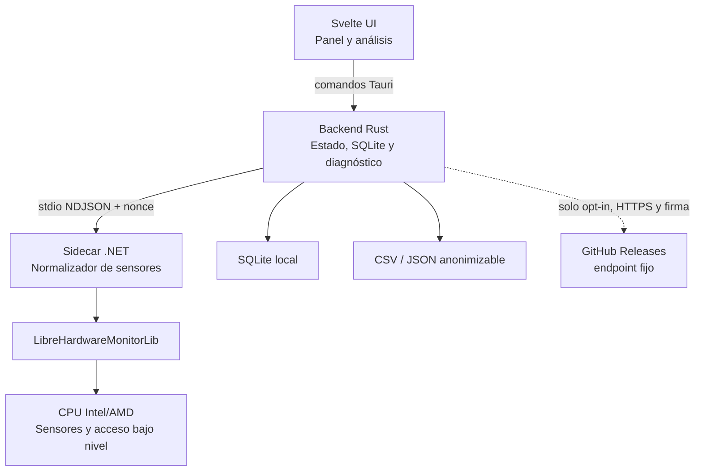

# Plan de implementación: diagnóstico térmico de CPU

**Rama**: `001-cpu-thermal-diagnostics` | **Fecha**: 2026-09-17 | **Spec**: `spec.md`

## Resumen

Construir ThrottleWatch, una aplicación de escritorio Windows local y visual que reciba sensores de CPU desde un colector .NET basado en LibreHardwareMonitor, normalice las diferencias Intel/AMD, conserve series temporales en SQLite y ejecute un motor determinista que distinga limitación térmica, eléctrica, mixta o indeterminada. Tauri aloja una interfaz Svelte/TypeScript bilingüe con onboarding, temas y barra de título propia; el backend Rust controla ciclo de vida, persistencia, seguridad IPC, diagnóstico, exportación y actualizaciones voluntarias firmadas.

## Contexto técnico

**Lenguajes/versiones**: Rust 1.98.1 (edición 2024); TypeScript 6.0.3 estricto; Svelte 5.57.0; .NET 10 LTS (SDK 10.0.401) / C# 14; SQL (SQLite 3.53.2 empaquetado). Versiones exactas de todo el stack: tabla «Versiones fijadas» de la constitución, que prevalece sobre este plan.  
**Dependencias principales**: Tauri 2.11 y sus plugins oficiales (notificaciones, autostart, updater, instancia única, diálogos, opener, process); Svelte + Vite 8 sin SvelteKit; Zod 4 en el puente de la interfaz; `loglevel` (interfaz), `tracing` (Rust) y `Microsoft.Extensions.Logging` (.NET) tras envoltorios propios; LibreHardwareMonitorLib 0.9.6; `rusqlite` con SQLite empaquetado y `rusqlite_migration`; JSON Schema (`jsonschema` en Rust). El gráfico de análisis es el componente SVG propio `AnalysisChart`; no se incorpora una biblioteca de gráficos.  
**Almacenamiento**: SQLite local con WAL, migraciones versionadas y exportación CSV/JSON  
**Pruebas**: `cargo nextest` + `proptest` + `insta` + `cargo-llvm-cov`; Vitest (proyectos `unit` y `component`, jsdom) + Testing Library; Playwright (proyectos `frontend` y `app`) + axe; xUnit v3 + coverlet para el colector; reproducción de trazas y corpus etiquetado para integración y aceptación. Estrategia completa: `historias.md` § «Estrategia integral de testing».  
**Plataforma objetivo**: Windows 11 24H2/25H2 x64 y Windows 10 22H2 x64 (mientras WebView2 y .NET 10 lo admitan); solo x64 en el MVP  
**Tipo de proyecto**: aplicación de escritorio con sidecar local  
**Objetivos de rendimiento**: UI fluida; muestra visible <1,5 s p95; monitorización pasiva <1 % CPU promedio; memoria total objetivo <180 MB  
**Restricciones**: funcionamiento offline completo; red del actualizador solo por opt-in; UI no elevada; sensores variables; ausencia de datos válida; no cambiar parámetros del hardware  
**Escala**: un equipo y una CPU; 1 muestra/s; 7 días de datos brutos por defecto; sesiones importables

> Las versiones se fijan en `rust-toolchain.toml`, `global.json`, `.nvmrc`, el campo `packageManager` y los archivos de bloqueo, según la «Política de dependencias y versiones» de la constitución. CI instala siempre en modo bloqueado; no se usan versiones flotantes.

## Comprobación de la constitución

| Puerta | Decisión de diseño | Estado |
|---|---|---|
| Evidencia antes que afirmación | Clasificación por niveles de cobertura + confianza con techo + evidencias; cifras solo por techo de potencia o medición guiada | Cumple |
| Degradación elegante | Modelo de capacidades y valores `null` con calidad | Cumple |
| Causalidad prudente | Motor térmico y motor eléctrico independientes; admite causa mixta | Cumple |
| Privilegio mínimo | UI sin elevar; instalación del acceso de bajo nivel separada | Cumple |
| Local y privado | SQLite local; cero red requerida; actualizador apagado por defecto; anonimización | Cumple |
| Visualización fiel | huecos reales, escalas etiquetadas, color + texto + icono | Cumple |
| Reproducibilidad | motor puro y reproducción de trazas | Cumple |
| Seguridad térmica | carga voluntaria, cancelable y con watchdog | Cumple |
| IX. Separación de capas | Motor puro en Rust sin E/S; comandos Tauri delgados; colector sin diagnóstico; interfaz sin lógica y con un único módulo puente; contratos en JSON Schema | Cumple |
| X. Almacenamiento | Una base SQLite escrita solo por Rust; sin almacenamiento web duradero; UTC y unidades canónicas; `NULL` + calidad para ausentes | Cumple |
| XI. Usabilidad | Conclusión primero, divulgación progresiva, glosario único, valores de fábrica prudentes, comportamiento nativo de Windows | Cumple |
| XII. Accesibilidad | WCAG 2.2 AA; teclado, lectores de pantalla, temas de contraste, 200 % (mínimo 480×500 en monitores bajos), movimiento reducido | Cumple; verificación en T106 |
| XIII. Testabilidad y cobertura | Puertos sustituibles; TDD en motor y paradas; 80/70 general y 95/90 en críticos | Cumple con la excepción E1 (umbrales bloqueantes desde CHK-L01) |
| XIV. Validación en fronteras | Zod en el puente; serde + `jsonschema` en Rust; comprobaciones semánticas en .NET; errores estructurados | Cumple |
| XV. Entorno | La versión instalada no lee variables ni `.env`; `PUBLIC_*` solo de compilación; `TW_DEV_*` solo en depuración y en la compilación `e2e` | Cumple |
| XVI. Verificación ejecutada | `pnpm check` y equivalentes en el orden del pipeline; resultado registrado en cada PR | Cumple |
| XVII. Registro | Envoltorio por capa; JSON UTC en fichero; formato humano en `Europe/Madrid`; redacción; `Registro detallado` temporal | Cumple |

Revisar de nuevo tras completar los spikes de acceso a sensores, prueba guiada y conducción de WebView2 por CDP (T-PLAY-002).

### Excepciones registradas

Según la «Gobernanza» de la constitución, toda excepción documenta motivo, alternativa descartada, riesgo y fecha de retirada.

| ID | Principio | Excepción | Motivo | Alternativa descartada | Riesgo y mitigación | Retirada |
|---|---|---|---|---|---|---|
| A1 | XVII (aclaración de ámbito, no excepción) | `scripts/**` (utillaje de desarrollo y de agentes, ejecutado con Node fuera de la aplicación) no pertenece a las tres capas del principio XVII y puede escribir en consola con `console.*`; ESLint excluirá `scripts/**` de `no-console` mediante `overrides` (T135). | Los scripts no se empaquetan ni se distribuyen y no tienen acceso al envoltorio de la interfaz. | Crear un envoltorio para scripts: complejidad sin beneficio. | Ninguno para el usuario; los scripts no manejan datos del usuario. | No aplica. |
| E1 | XIII (cobertura bloqueante en CI) | Durante el lote L00 y hasta cerrar CHK-L01, CI **publica** la cobertura de cada pila pero no bloquea por umbral. | Sin código de aplicación la cobertura no es medible o es trivialmente 0 %, y bloquear forzaría tests vacíos. | Bloquear desde el primer commit. | Código de L00/L01 sin umbral. Se mitiga porque L01 exige los tests de contrato en las tres pilas y CHK-L01 activa el bloqueo. | Al cerrar CHK-L01; fecha límite **2026-10-31**, ampliable solo mediante esta tabla. |

## Arquitectura



### Responsabilidades

**Frontend Svelte**

- Composición visual, onboarding, navegación, localización, temas, barra propia, accesibilidad y preferencias de presentación.
- Suscripción a un modelo ya normalizado; no interpreta nombres de sensores.
- Módulo puente único (`src/lib/bridge/`): es el único que importa `@tauri-apps/api`; valida con Zod cada respuesta y evento y devuelve resultados discriminados con errores estructurados (`code`, `path`, `message_key`). Los tipos se infieren de los esquemas.
- Módulo de configuración único (`src/lib/config/env.ts`): lee y valida con Zod `import.meta.env` (`PUBLIC_*`); no se usa `process.env`.
- Envoltorio de registro (`src/lib/logging/`): `createLogger(scope)` sobre `loglevel`; reenvía `warn` y `error` (y `debug` con registro detallado) al comando `log_frontend`. Prohibidos `console.*` y el almacenamiento web duradero.
- Renderizado de tarjetas, series, mapa de núcleos, evidencias e informes.
- Integración del sistema canónico de `design/`: tokens, componentes, contratos y composiciones de referencia. Las adaptaciones a datos reales se realizan mediante propiedades y adaptadores, no duplicando estilos o componentes dentro de cada feature.

**Backend Tauri/Rust**

- Inicia, supervisa y detiene el sidecar.
- Valida cada mensaje contra contrato y aplica límites de tamaño/frecuencia.
- Revalida los parámetros de cada comando (serde con `deny_unknown_fields` + comprobaciones semánticas); la WebView se trata como no confiable.
- Accede al exterior solo mediante puertos sustituibles (reloj, IDs, nonce, almacenamiento, diálogos, ventana, bandeja, notificaciones, autostart, HTTP del actualizador, energía, idioma y tema de Windows), con fakes en `test_support` para las pruebas.
- Inicializa el registro (`tracing` tras las macros `log_*!`): fichero JSON UTC rotado, formato humano `Europe/Madrid` solo en desarrollo, redacción, agrupación de repetidos; recibe y valida los eventos del colector (`stderr`) y de la interfaz (`log_frontend`, máximo 60 por minuto).
- Mantiene reloj monotónico, agrupa muestras y persiste lotes.
- Ejecuta el motor de diagnóstico puro y versionado.
- Expone comandos de lectura, sesión, exportación, configuración, ciclo de vida y actualización.
- Centraliza las API de ventana; ningún componente de pantalla llama directamente a Tauri.
- Lee el contexto energético (fuente, plan, batería) mediante Win32 y lo adjunta a cada frame; escucha `WM_POWERBROADCAST` para detectar suspensión/reanudación y cambios de alimentación.
- Calcula la frecuencia activa y la frecuencia base por procesador lógico con los contadores PDH `% Processor Performance` y `Processor Frequency`, y las registra como descriptores de origen `host` con calidad `derived`.
- Gestiona los límites de sesión pasiva (inicio, hueco > 60 s, 24 h) y congela informes.
- Aplica la instancia única, la bandeja (icono de cinco estados y menú), las notificaciones y sus reglas de persistencia/enfriamiento.
- Resuelve la geometría antes de mostrar la ventana y valida que quede dentro de monitores activos.
- Ejecuta comprobación y descarga fuera de la WebView y verifica Ed25519 antes de ofrecer instalar.
- No accede directamente a MSR/SMU en el MVP.

**Sidecar .NET**

- Integra LibreHardwareMonitorLib sin ejecutar su GUI.
- Mantiene un único `Computer` abierto durante toda la vida del proceso; `Close()` solo se ejecuta
  al salir. El catálogo se lee antes de cada sonda de acceso avanzado y la misma sesión de
  `Computer` se reutiliza al revalidar cobertura.
- Descubre hardware y sensores; conserva nombre/ID original.
- Normaliza magnitud, unidad, alcance y topología cuando puede.
- Emite capacidades y muestras; no emite diagnósticos de negocio.
- Acepta una lista mínima de comandos: `hello`, `start`, `set_rate`, `snapshot`, `stop`, `shutdown`.
- Clasifica los grupos P/E/LP con `GetLogicalProcessorInformationEx` y CPUID; LibreHardwareMonitorLib no lo expone.
- Intenta leer las banderas térmicas/eléctricas del MSR de estado (Intel `IA32_THERM_STATUS`, `IA32_PACKAGE_THERM_STATUS`, `MSR_CORE_PERF_LIMIT_REASONS`; equivalentes AMD) a través del acceso de bajo nivel disponible; sin acceso, no emite esos descriptores.
- Termina al recibir EOF en `stdin` o cuando desaparece el PID padre (comprobación cada 2 s).
- Registra solo mediante su clase `Log` (`[LoggerMessage]` sobre `Microsoft.Extensions.Logging`) en JSON por `stderr`; no escribe ficheros. `BannedApiAnalyzers` prohíbe `Console.Write*`.
- Trata como no confiables los valores de LibreHardwareMonitorLib (NaN, infinito o fuera de rango físico → ausente) y los comandos de `stdin` (lista permitida).

**Acceso de bajo nivel**

- La versión mínima aceptada y la versión empaquetada de PawnIO son `2.2.0`; la instalación del
  instalador oficial, si el usuario la acepta, ocurre en un paso explícito con UAC y nunca se
  descarga durante la ejecución.
- La aplicación intenta primero modo estándar. La cobertura reducida es un estado soportado.
- El MVP no elevará silenciosamente la UI ni ejecutará comandos arbitrarios.
- El lanzador elevado bajo demanda y la tubería autenticada quedan definidos por
  `docs/adr/0004-lanzador-elevado-del-sidecar.md`, aceptado con condiciones C1–C6 el 2026-09-19.
  Su implementación queda limitada por R1–R7 y no añade un servicio privilegiado persistente.

## Flujo de datos

1. Rust genera un nonce efímero, solicita el lanzador aprobado y este verifica la firma
   Authenticode/editor permitido o el manifiesto de release firmado del ejecutable en la ruta fija
   (`bundle.externalBin`) antes de iniciarlo. No se usa `tauri-plugin-shell`: la WebView no tiene
   ningún permiso para lanzar procesos.
2. Ambos negocian versión de protocolo y capacidades.
3. El sidecar envía catálogo de sensores y después una muestra normalizada por segundo.
4. Rust valida, marca calidad/lag, almacena en búfer y publica un snapshot agregado a la UI.
5. Cada ventana temporal actualiza eventos y diagnóstico.
6. Las muestras se escriben por lotes; la UI nunca espera a disco.
7. Al finalizar una sesión se congela un informe con versión de reglas, nivel de cobertura y, si es guiada, su resultado medido.

### Resolución temporal para análisis

- `AnalysisChart` dibuja hasta cuatro pistas sincronizadas mediante SVG y recibe puntos ya preparados; no consulta SQLite ni reduce datos en la UI.
- Una vista de sesión debería entregar aproximadamente 2.000–3.000 puntos como máximo por pista y 10.000–12.000 en total. Estos son límites de legibilidad y presupuesto objetivo, no una autorización para truncar datos silenciosamente.
- Para rangos que excedan el presupuesto, Rust agrega por cubos temporales ajustados a la resolución solicitada y conserva, como mínimo, primer/último valor válido, mínimo, máximo y promedio cuando correspondan.
- Un cubo que contiene un hueco no une segmentos a través de él. Debe emitir una discontinuidad explícita o dividir el tramo.
- La calidad agregada es la peor calidad material del cubo y conserva la distinción entre dato reducido por resolución y lectura originalmente degradada; `reducedQuality` no se reutiliza para significar downsampling.
- Los límites de eventos y cambios de clasificación se preservan como puntos/bordes obligatorios aunque no coincidan con un cubo.
- El zoom solicita a Rust una ventana de mayor resolución en lugar de estirar indefinidamente la serie agregada.

## Motor de diagnóstico

Revisado el 2026-09-18 (véase `gap-analysis.md` § 12). Los valores concretos están en `spec.md` § «Parámetros iniciales»; aquí se describe la estructura.

### Entradas

- Por procesador lógico: utilidad, frecuencia activa (`% Processor Performance` × `Processor Frequency`) y frecuencia base (`Processor Frequency`), leídas por Rust vía PDH.
- Temperatura representativa y **límite térmico efectivo** (TjMax − TCC offset, o tabla por familia en AMD).
- Potencia de paquete; en nivel A, límite de potencia efectivo (PL1/PL2/Tau) y razones de limitación como bits de registro.
- Contexto: alimentación, plan energético, fase de sesión y marca de ventana de turbo.

### Etapas

1. **Nivel de cobertura** (A/B/C) a partir del catálogo de capacidades; fija qué reglas pueden aplicarse y el techo de confianza.
2. **Núcleos activos**: utilidad ≥ 80 %; la carga sostenida y la frecuencia activa se calculan solo sobre ellos, por grupo P/E/LP.
3. **Ventana de turbo**: detecta inicios de carga y excluye `max(Tau, 60 s)`; emite `turbo_end` al ver el escalón de potencia.
4. **Rasgos de la ventana estable** (60 s, deslizante cada 10 s): ocupación de cada razón, meseta térmica, meseta de potencia, tendencia del límite o del nivel de meseta de potencia a lo largo de la sesión, razón frecuencia activa / base.
5. **Clasificación** por la tabla ordenada de `spec.md` (primera regla que se cumple), con subtipo de equipo y gravedad `boost`/`below_base`.
6. **Confianza**: puntuación de solidez con techo por nivel.
7. **Potencial** (cifra solo en nivel A y clases térmicas, mixta o chasis; en niveles B/C solo el tramo cualitativo sin cifra con `below_base`): método «techo de potencia» `g = (PL1_ref / P)^(1/3) − 1` (PL1_ref = PL1 efectivo actual; en chasis, el máximo de la sesión), acotado con `g ≤ f_turbo / f_activa − 1`, expresado como `[0,5·g, 1,0·g]` y redondeado a tramos.
8. **Eventos**: fusión de ventanas consecutivas de la misma clase en `limit_event` con evidencias como códigos; marcadores informativos `turbo_end` y `oem_mode_change`.
9. **Informe de sesión**: clase principal por tiempo acumulado según `spec.md` § «Clasificación de una sesión», con duración por clase e intervalo analizado.

### Por qué así

- **Mesetas en vez de caídas**: la limitación es un *estado* (una magnitud clavada en su tope), no un cambio. Así se detecta también el equipo que ya empieza caliente o que se degrada poco a poco, y no se confunde el fin del turbo con calor.
- **Frecuencia base como umbral de gravedad**: es la única frecuencia que el fabricante garantiza; por encima, la limitación térmica es el funcionamiento previsto del boost.
- **Techo de potencia en vez de baseline**: responde directamente a «¿cuánto ganaría enfriando mejor?» con una relación física, sin depender del tipo de carga ni de la calidad de una referencia aprendida.
- **Medición directa en la prueba guiada**: el generador cuenta trabajo; es la única cifra de rendimiento que no es una inferencia.

### Clasificaciones

- `normal`
- `hot_unproven`
- `thermal_probable`
- `thermal_confirmed`
- `power_limited`
- `platform_limited` (subtipos `chassis_thermal`, `external_prochot`)
- `mixed_limit`
- `indeterminate`

Atributo transversal: `limit_severity` = `boost` | `below_base`.

Las reglas, umbrales y la tabla `thermal-limits-v1` se almacenan en configuración versionada, no dispersos por la UI.

## Prueba guiada

Fases (valores en `spec.md` § Parámetros iniciales):

1. Comprobación de sensores y contexto (≤ 30 s).
2. Reposo opcional para estabilizar (60 s, omitible).
3. Calentamiento progresivo (90 s).
4. Carga sostenida con muestreo de diagnóstico (180/240/360 s según `guided.duration`); se analizan los últimos 120 s, siempre fuera de la ventana de turbo.
5. Recuperación (120 s).
6. Resultado e informe, con rendimiento medido y oferta de marcar como referencia.

El generador cuenta operaciones completadas por hilo y segundo (bucle de trabajo fijo y versionado, sin instrucciones AVX-512 y con AVX2 solo en un perfil documentado) y lo publica en cada muestra. Ese contador es la medida de rendimiento de la prueba.

Parada automática (FR-085): temperatura > límite efectivo + 2 °C durante 3 muestras, temperatura en el límite con frecuencia activa < 50 % de la base durante 10 s, 3 muestras consecutivas sin sensor crítico o 5 s sin latido del generador. Alcanzar el límite térmico no detiene la prueba: es lo que se mide y el propio procesador se protege. Ocultar la ventana o suspender el equipo cancela la prueba.

El generador de carga debe estar aislado del hilo de sensores, permitir cancelación inmediata, tener watchdog y detenerse ante pérdida del sensor crítico, proceso padre ausente o umbral de seguridad. Antes de implementar carga propia se realizará un spike para decidir entre carga integrada y guía sobre una carga externa reproducible.

## Almacenamiento y retención

- SQLite en el directorio de datos de aplicación, WAL, `foreign_keys = ON` en cada conexión y `busy_timeout`.
- Escritura de muestras en lotes pequeños transaccionales.
- Datos brutos según retención del usuario; por defecto siete días.
- Informes y resultados guiados se conservan hasta borrado explícito.
- Mantenimiento en segundo plano con límite de tiempo; nunca durante la fase estable de una prueba.
- Exportación desde una instantánea transaccional para evitar ficheros incoherentes.
- Preferencias tipadas, onboarding, geometría y actualización en tablas versionadas de volumen constante.
- Borrado de datos y restablecimiento total son transacciones distintas; el primero conserva preferencias.
- Ruta de datos `%LOCALAPPDATA%\ThrottleWatch`; registros en `logs/` con rotación 5 × 5 MB. `Eliminar todos mis datos`, `Restablecer` y la retención `solo sesión` (al salir) borran también los registros; su tamaño se suma a `get_storage_usage`.
- Disco lleno: modo solo memoria, aviso persistente y reintento cada 60 s. Base de datos dañada: renombrado a `.corrupt-<fecha>`, base nueva y oferta de exportar la dañada.
- Persistencia por núcleo solo en perfil `diagnostic`, sesiones guiadas o `sampling.per_core_history`; el resto se agrega por grupo antes de escribir.

## Primer inicio, localización y ventana

- El shell arranca oculto, aplica tema e idioma, restaura geometría válida y después muestra la ventana para evitar destellos o saltos.
- El router decide entre onboarding pendiente/reanudado y aplicación principal; omitir inicia o conserva la detección pasiva.
- Los catálogos `es` y `en` se validan en CI con igualdad de claves y detección de literales visibles.
- La resolución de locale es una función pura probada con `es`, `ca`, `gl`, `eu`, `ast`, `an`, `pt` y fallbacks desconocidos.
- El componente de barra es presentacional; un adaptador único encapsula minimizar, maximizar/restaurar, cerrar y eventos de tamaño.
- La acción de primera X se decide en Rust para cubrir también cierre nativo; `unset` abre el diálogo y una elección persistida decide cierres posteriores. Elegir bandeja activa `tray.monitoring_enabled`; `Esc` no persiste.
- Ventana mínima 480×600 (o 480×500 si la altura útil del monitor no alcanza 600, caso de 1080p al 200 %) e inicial 1100×760 ajustada al área útil; con altura útil inferior a 500 la ventana se maximiza y el contenido se desplaza con `TitleBar`, banner global y `Detener ahora` fijos. El mínimo se recalcula al cambiar de monitor o de escala. Instancia única mediante el plugin oficial.
- Números y fechas con `Intl` según el idioma efectivo; solo °C.
- El shell aplica `data-theme`, `data-motion` y `data-glass` en `<html>` (helpers `applyGlassLevel`/`applyMotionLevel` de `tokens.ts`) y monta la clase `tw-ambient` en el contenedor raíz; los cambios de «Efectos de transparencia» y «Reducir movimiento» de Windows se escuchan en caliente igual que el tema.

## Actualizaciones

- Endpoint de manifiesto fijo bajo GitHub Releases del proyecto, no configurable por UI ni argumentos.
- Interruptor apagado de fábrica; el backend no crea peticiones mientras sea `false`.
- Planificador automático con cadencia mínima de 24 h y comando manual separado que puede reintentar antes.
- Máquina de estados `idle → available → downloading → verified → installing`, con errores recuperables y descarte de parciales.
- Verificación Ed25519 durante la descarga antes de alcanzar `verified`; la canalización de release genera manifiesto y firmas.
- Instalar comprueba bloqueos de diagnóstico/exportación/importación/borrado, pide confirmación y lanza el instalador tras cierre ordenado.
- Sin canal de actualización; estados expuestos a la UI: `idle | checking | up_to_date | available | downloading | verified | installing | error`.

## Seguridad y privacidad

- Sidecar empaquetado, hash esperado y ruta fija; no se aceptan ejecutables configurables.
- Nonce de sesión por proceso; mensajes con versión, secuencia y tamaño máximo.
- Validación estricta de JSON; cierre del canal tras errores repetidos.
- Comandos Tauri con lista permitida y parámetros tipados.
- CSP restrictiva; sin contenido web remoto en la WebView.
- Logs rotados y depuración opt-in.
- Exportación anónima elimina los campos definidos en contrato y vuelve a validar el resultado.
- SBOM y avisos de MPL 2.0 y dependencias en el instalador y `Acerca de`.
- Variables de entorno (constitución XV): la versión instalada no lee `.env` ni variables. `PUBLIC_*` se incrustan al compilar y nunca son secretas; las claves de firma (`TAURI_SIGNING_PRIVATE_KEY*`, Authenticode) solo existen en los secretos de CI; `TW_DEV_*` solo en compilaciones de depuración y en la compilación `e2e`. `.env.example` documenta todas.
- La compilación `e2e` (característica de Cargo) activa la depuración remota de WebView2, el colector replay, el directorio de datos temporal, la inyección de fallos y el endpoint del actualizador de prueba. Nunca se publica.

## Observabilidad

- Registro según el principio XVII de la constitución: un envoltorio por capa (`createLogger` en la interfaz, macros `log_*!` en Rust, clase `Log` en .NET) y ninguna llamada directa a la biblioteca desde el código de las funcionalidades.
- Fichero JSON por líneas validado por el esquema `log-event` (`packages/contracts/`): `ts` UTC, `level`, `component` (`ui`/`core`/`agent`), `target`, `code` estable, `msg` en inglés, `session_id`, `protocol_version`, `fields` y `err`.
- Niveles: `info` en producción; `Registro detallado` (FR-086) sube a `debug` durante 24 h o hasta reiniciar; `trace` solo en desarrollo; `TW_DEV_LOG_LEVEL` y `PUBLIC_LOG_LEVEL` solo en compilaciones de desarrollo; `RUST_LOG` nunca.
- Salida para personas (consola de desarrollo y visor `pnpm logs:view`): `dd/MM/yyyy HH:mm:ss,SSS` en `Europe/Madrid` con abreviatura CET/CEST (`jiff` en Rust, `Intl` en TypeScript).
- Redacción con la misma lista permitida que la exportación anónima; repetidos agrupados cada 60 s; escritura no bloqueante con contador de descartes; ningún evento por muestra fuera de `trace`.
- Métricas locales de latencia de muestra, muestras descartadas, cola de persistencia y tiempo de render.
- Pantalla de diagnóstico técnico capaz de copiar un resumen sin identificadores y sin registros en bruto.

## Estrategia de pruebas

La estrategia operativa completa está en `historias.md` § «Estrategia integral de testing» (lotes, niveles, trazabilidad, suites y CI). Este apartado fija las decisiones de arquitectura de pruebas.

### Arquitectura de pruebas

- **Lotes funcionales con checkpoint:** las tareas se agrupan en lotes L00–L21; cada lote define su plan de pruebas antes de implementarse y se cierra con la tarea `CHK-Lxx`, que ejecuta solo la suite afectada. TDD obligatorio en el motor, el potencial, las paradas de seguridad, la anonimización y las transacciones destructivas.
- **Nivel más barato:** la mayoría de criterios se demuestran con pruebas Rust sin interfaz ni hardware; Playwright se reserva para lo que exige navegador o aplicación real.
- **Vitest:** proyectos `unit` (entorno node) y `component` (jsdom + Testing Library); el puente se simula con `mockIPC` o un `FakeBridge` validado con los mismos esquemas Zod. Vitest Browser Mode no se adopta de inicio.
- **Playwright:** proyecto `frontend` (build de Vite + backend simulado, Chromium) y proyecto `app` (compilación `e2e` de Tauri conducida por CDP sobre WebView2, con colector replay y SQLite temporal). El artefacto publicado se valida con una verificación nativa en VM limpias, porque no admite depuración remota.
- **Guardias comunes de E2E:** fallo ante `pageerror`, `console.error` o peticiones a otros orígenes no declaradas; almacenamiento web vacío al terminar cada test.
- **Matriz de entorno en lugar de cross-browser:** temas, idiomas, tamaños (480×600, 480×500, 840×760, 1100×760), escala 100/200 %, temas de contraste y movimiento reducido; Windows 11 24H2/25H2 y Windows 10 22H2 en release.
- **Regresión visual:** `toHaveScreenshot` con líneas base generadas solo en el runner Windows de CI y actualizadas mediante un workflow revisado.
- **Mutation testing:** piloto con `cargo-mutants` sobre `potential.rs` y `classifier.rs`; StrykerJS y Stryker.NET a evaluar. No forman parte del bucle normal y no entran en CI sin registrarse en la constitución.
- **Trazabilidad:** `traceability.md` enlaza cada HU, FR, NFR y SC con su test o con «manual» justificado; CI falla si falta una entrada.

### Unitarias

- Normalización de sensores y unidades.
- Agregación por topología.
- Reglas de clasificación y confianza: una prueba por fila de la tabla y por orden de precedencia.
- Detección de ventana de turbo, mesetas, núcleos activos y gravedad frente a la frecuencia base.
- Potencial por techo de potencia (acotación, tramos, redondeo hacia fuera) y ausencia de cifra sin PL1.
- Comparabilidad de resultados guiados y anonimización.

### Contrato

- JSON Schema para todos los mensajes.
- Compatibilidad de protocolo y rechazo de mensajes malformados/excesivos.
- Fixtures C# ↔ Rust para evitar divergencias de serialización.

### Integración

- Sidecar falso que reproduce trazas Intel, AMD, legado, híbrido y degradado.
- **Validación del motor con corpus etiquetado** (`research.md` § 15): trazas de nivel A etiquetadas con los bits de razón como verdad de referencia, y sus copias degradadas a B y C para medir SC-003, SC-004, SC-005 y SC-016 a SC-018 en CI.
- Caída/reinicio del sidecar, lag, secuencias perdidas y reanudación del sistema.
- SQLite: migraciones, retención, disco lleno simulado y exportación consistente.

### UI y accesibilidad

- Estados vacío, normal, caliente, térmico (`boost` y `below_base`), potencia, equipo (chasis y señal externa), mixto, fin de turbo y desconectado; niveles de cobertura A/B/C.
- Onboarding completo, omitido, reanudado y novedades versionadas.
- Matriz de locale, igualdad de catálogos y expansión de texto español/inglés.
- Tema sistema/claro/oscuro, cambio de Windows en caliente y movimiento reducido.
- Barra propia, geometría fuera de pantalla y pregunta de primera X.
- Gráfico SVG: cursor y selección por teclado, eventos accionables, resumen textual y tabla accesible del rango.
- Navegación completa por teclado, foco, lector de pantalla y movimiento reducido.
- Pruebas visuales a 100 %, 125 %, 150 % y 200 % de escala de Windows, incluido el mínimo 480×500 a 200 %.
- axe sin infracciones `serious` o `critical` por pantalla y estado; emulación de `forced-colors` y `reduced-motion`; revisión manual con Narrador y NVDA en cada release.

### Orden del pipeline de CI

Runner `windows-2025`. Orden (constitución XVI): instalación con archivos de bloqueo → formato y lint → `pnpm check` (`svelte-check --fail-on-warnings` + `tsc`) → pruebas unitarias, de componentes, integración y aceptación → compilación → E2E. Un paso fallido detiene los siguientes. PR: suites afectadas y `@smoke`; `main`: E2E, visual y accesibilidad completos; nocturna: matriz de entorno y detección de inestables; semanal: mutation; release: nivel completo y verificación del artefacto firmado.

### Hardware real

- Matriz mínima: Intel híbrido moderno, Intel anterior, AMD Ryzen moderno, AMD anterior y equipo con cobertura degradada.
- Equipos disponibles (2026-09-18): AMD Ryzen 5 2600X (Zen+, sobremesa, Windows 11 25H2; cubre «AMD anterior» y es el equipo de desarrollo), Intel híbrido de 12.ª generación o posterior, Intel de 11.ª generación o anterior, un portátil (batería, plan energético y gestión térmica del fabricante) y AMD Zen 3/4/5. La cobertura degradada se obtiene sin el acceso avanzado y en la VM de CI. Falta asignar quién ejecuta cada verificación manual.
- **Equipo de referencia para presupuestos** (NFR-001 a NFR-003, NFR-010, NFR-016, SC-006): el Intel híbrido de 12.ª generación o posterior de la matriz, con Windows 11 25H2 y WebView2 Evergreen actualizado. El Ryzen 5 2600X sirve de cota inferior informativa, no de referencia. El modelo exacto se registra en el ADR de release.
- **Hueco para SC-009:** SC-009 exige al menos dos generaciones anteriores de cada fabricante, y hoy solo hay una de Intel (≤ 11.ª) y una de AMD (Zen+). Antes de T109 hay que conseguir otra generación anterior de cada fabricante (por ejemplo, Intel 8.ª–10.ª y AMD Zen 2) o registrar en el ADR de release la verificación parcial de SC-009.
- Comparar mensajes con señales expuestas por herramientas de referencia, sin exigir igualdad exacta de muestreo.

## Estructura del proyecto

```text
apps/
├── desktop/
│   ├── src/                    # Svelte/TypeScript
│   │   ├── components/
│   │   ├── features/
│   │   ├── routes/
│   │   ├── stores/
│   │   ├── styles/
│   │   ├── lib/
│   │   │   ├── bridge/         # único importador de @tauri-apps/api; esquemas Zod
│   │   │   ├── config/         # env.ts (PUBLIC_*, Zod)
│   │   │   └── logging/        # createLogger sobre loglevel
│   │   └── test-support/       # builders, FakeBridge, escenarios de mock
│   ├── src-tauri/              # Rust/Tauri
│   │   ├── src/
│   │   │   ├── commands/
│   │   │   ├── diagnostics/
│   │   │   ├── telemetry/      # agregación de snapshot, frescura y búfer reciente
│   │   │   ├── ipc/
│   │   │   ├── storage/
│   │   │   ├── export/
│   │   │   ├── logging/        # macros log_*!, redacción, formato
│   │   │   ├── ports/          # reloj, IDs, diálogos, ventana, bandeja, HTTP, Win32…
│   │   │   └── test_support/   # TraceBuilder, FakeClock, fakes (cfg(test) / e2e)
│   │   ├── tests/              # integration_*.rs, acceptance_*.rs
│   │   └── proptest-regressions/
│   └── e2e/
│       ├── frontend/           # Playwright: Vite + backend simulado
│       ├── app/                # Playwright: compilación e2e + WebView2 por CDP
│       ├── support/            # fixtures de errores/red/almacenamiento, perfiles, allowlist
│       └── visual/
└── sensor-agent/               # .NET sidecar
    ├── Collector/
    ├── Normalization/
    ├── Protocol/
    └── Tests/
design/                         # fuente canónica de UI, tokens, ejemplos y harness
packages/
├── contracts/                  # schemas y fixtures compartidos
└── trace-fixtures/
scripts/
specs/
tests/
├── integration/
├── replay/
└── hardware/
```

**Decisión estructural:** monorepo con tres límites explícitos: UI, núcleo Tauri y colector. Los contratos y trazas son compartidos, pero la lógica de diagnóstico pertenece únicamente a Rust.

### Integración del sistema de diseño

- `design/tokens/tokens.css` alimenta los estilos de la aplicación; no se mantiene una copia divergente de los tokens.
- **Decisión (2026-09-18):** `design/` se **copia** a `apps/desktop/src/design-system/` mediante un script de sincronización (`pnpm design:sync`) y un test de CI comprueba la igualdad byte a byte de `brand/`, `components/`, `icons/`, `illustrations/`, `lib/` y `tokens/`. `design/` sigue siendo la única fuente editable; la app nunca modifica su copia. `design/examples/` y `design/harness/` no se copian ni se importan. Motivo: el harness fija Svelte 5.57 y Tauri fijará su propia versión; un paquete workspace contradice la decisión de `design/README.md` de no publicar paquete.
- `design/examples/` define la composición de referencia, mientras que las features conectan datos y comandos mediante adaptadores Svelte/Tauri.
- `design/harness/` es la prueba aislada del sistema: sus comandos de comprobación y compilación forman parte de CI.
- Cada pantalla se valida en español e inglés, claro y oscuro y tres niveles de ancho: compacto, medio y expandido. Cualquier excepción queda registrada en este plan o en un ADR.

## Fases

### Fase 0 — Riesgos y spikes

**Puerta de viabilidad del producto.** Antes de la fase 1 se decide si el nivel A es alcanzable en condiciones aceptables para un usuario corriente:

1. Con el proveedor de acceso de bajo nivel instalado una vez (PawnIO o equivalente firmado), ¿puede el sidecar leer `0x64F`, `0x1A2`, `0x610` y limpiar los bits de registro **sin pedir UAC en cada arranque**?
2. ¿Qué porcentaje de la matriz de hardware objetivo alcanza nivel A (Intel) y nivel B (con potencia) sin acceso?
3. En AMD, ¿qué versiones de la tabla PM del SMU se pueden incluir en la lista permitida?

Resultados posibles: **(a)** nivel A sin UAC recurrente → se continúa con el plan completo. **(b)** Nivel A solo con un lanzador elevado bajo demanda → se continúa únicamente después de aprobar ADR-0004 y completar la revisión de amenazas exigida por la constitución (principio IV); si no, (c). **(c)** Nivel A inalcanzable → el producto se reposiciona como explicador prudente (niveles B/C), se retiran la clasificación confirmada y el potencial cuantificado de la propuesta de valor y se decide explícitamente si continuar. La decisión se registra en un ADR.

- Confirmar sensores expuestos en Intel/AMD y comportamiento sin privilegios.
- Probar empaquetado del sidecar en x64 y validar firma/controlador.
- Validar IPC, latencia y reinicio.
- Verificar que `% Processor Performance` y `Processor Frequency` son fiables por procesador lógico en Intel híbrido y AMD (comparando con APERF/MPERF leídos por el sidecar cuando haya acceso), incluidos equipos con EcoQoS y modos de eficiencia.
- Grabar el corpus etiquetado inicial (véase `research.md` § 15) en al menos un Intel híbrido, un Intel anterior, un portátil con gestión térmica del fabricante y un AMD Zen 4.
- Validar en el hardware objetivo el presupuesto del `AnalysisChart` SVG con 4 pistas, 3.000 puntos por pista y eventos superpuestos; conservar el benchmark reproducible.
- Medir en WebView2 el coste del material de vidrio (`backdrop-filter` en tarjetas y chrome, fondo ambiental animado) en reposo y con el gráfico actualizándose; fijar el umbral de degradación automática a `reduced` (propuesta: < 50 fps sostenidos durante 3 s o > 1 % de CPU en reposo atribuible a composición) y leer `UISettings.AdvancedEffectsEnabled` para el modo `system` (T019c; umbrales provisionales `glass.*` en `spec.md`).
- Decidir estrategia segura de carga guiada (T053 en L03; ADR T054 al cerrar L12).
- Validar la conducción de WebView2 por CDP desde Playwright con la compilación `e2e` de Tauri en el runner `windows-2025` (T-PLAY-002); alternativa: WebDriver con `tauri-driver`, que exigiría enmienda del stack.
- Medir los tiempos base de cada suite y fijar el presupuesto del pipeline de PR (objetivo inicial: ≤ 15 min de mediana).
- Validar permisos mínimos de barra propia, inicio con Windows, notificaciones y actualizador (T019d).
- Definir pipeline de GitHub Releases, clave pública Ed25519 y custodia del secreto de firma.

### Fase 1 — Vertical slice pasivo

Resolver idioma/tema → recorrer u omitir onboarding → descubrir CPU → emitir muestras → validar en Rust → mostrar cuatro métricas → almacenar una sesión → reproducirla.

### Fase 2 — Diagnóstico y visualización

Normalización completa, ventana de turbo, mesetas, eventos, clasificación con gravedad, potencial por techo de potencia, gráficos sincronizados, mapa de núcleos e informe.

### Fase 3 — Operación de escritorio

Bandeja, primera acción de cierre, geometría, inicio con Windows, ajustes, alertas, retención, exportación/importación, recuperación del sidecar, instalador y actualizaciones firmadas.

### Fase 4 — Prueba guiada y endurecimiento

Carga segura si el spike la aprueba, matriz de hardware, accesibilidad, rendimiento, firma y documentación.

## Seguimiento de complejidad

| Complejidad | Por qué es necesaria | Alternativa descartada |
|---|---|---|
| Sidecar .NET además de Rust | LibreHardwareMonitorLib es .NET y evita reimplementar familias de CPU | Portar acceso MSR/SMU a Rust aumenta riesgo y reduce cobertura |
| Tres niveles de evidencia | Los sensores difieren y la causalidad no siempre es directa | Un umbral de temperatura produciría falsos positivos |
| Resultado guiado medido como única referencia | Carga idéntica por construcción; permite comparar «antes/después» con rendimiento real | Tabla global o baselines aprendidos: no capturan firmware, chasis ni tipo de carga |
| Barra de título propia | Identidad visual coherente y comportamiento aprobado por el usuario | La decoración nativa no permite la experiencia solicitada |
| Actualizador firmado opcional | Entrega correcciones sin renunciar a control ni funcionamiento offline | Una actualización silenciosa viola privacidad y consentimiento |
| Gráfico SVG propio | Cumple huecos, calidad, eventos y teclado con una API Svelte controlada y sin dependencia de gráficos | ECharts duplicaría interacción/ARIA y ampliaría tamaño/superficie; reconsiderar solo si el benchmark real incumple el presupuesto |
| Frecuencia activa por contador PDH en Rust | Es la frecuencia mientras el núcleo ejecuta (APERF/MPERF de Windows) y está disponible sin driver; es la métrica correcta para detectar limitación | El reloj nominal de LHM no refleja la frecuencia real; el «effective clock» con reposo mezcla carga y frecuencia |
| Lectura MSR de razones, límites y TCC offset en el sidecar | Sin razones directas no hay confirmación ni atribución fiable, y sin TCC offset el margen es falso en muchos portátiles | Inferir «confirmada» desde el margen es una inferencia disfrazada de confirmación |
| Clasificación por mesetas y ventana de turbo | Evita el falso positivo PL2→PL1 y detecta estados, no solo cambios | La regla anterior (caída de reloj tras calor) confundía el fin del turbo con limitación térmica |
| Potencial por techo de potencia y medición guiada | Fundamento físico o medido, independiente del tipo de carga | Baselines aprendidos: sesgados hacia momentos de poca exigencia y dependientes del tipo de carga |
| Contexto energético en Rust | El motor necesita batería/plan como factor de confusión y el sidecar no debe conocer Win32 de energía | Emitirlo como sensores mezcla contexto con hardware y amplía el contrato privilegiado |
| Copia sincronizada del sistema de diseño | Aísla versiones de Svelte entre harness y app manteniendo una única fuente | Importar por ruta relativa acopla versiones; paquete workspace contradice `design/README.md` |
| Compilación `e2e` separada | Permite conducir la WebView real, usar replay, datos temporales e inyección de fallos sin abrir esas puertas en la versión publicada (constitución XV y XVII) | Activar depuración remota o variables en producción viola la constitución |
| Dos proyectos de Playwright | `frontend` da feedback rápido con backend simulado; `app` prueba la integración real solo donde aporta | Solo E2E completos: lentos e inestables; solo backend simulado: no detecta fallos de integración |
| Puertos sustituibles en Rust | Hacen testables sin hardware ni ventana el ciclo de vida, la bandeja, los diálogos, el actualizador y Win32 | Probar solo manualmente lo nativo deja sin regresión automática los flujos críticos |
| Envoltorio de registro por capa | Una API uniforme con redacción y niveles comunes en tres lenguajes | Usar cada biblioteca directamente dispersa formato, niveles y redacción |
