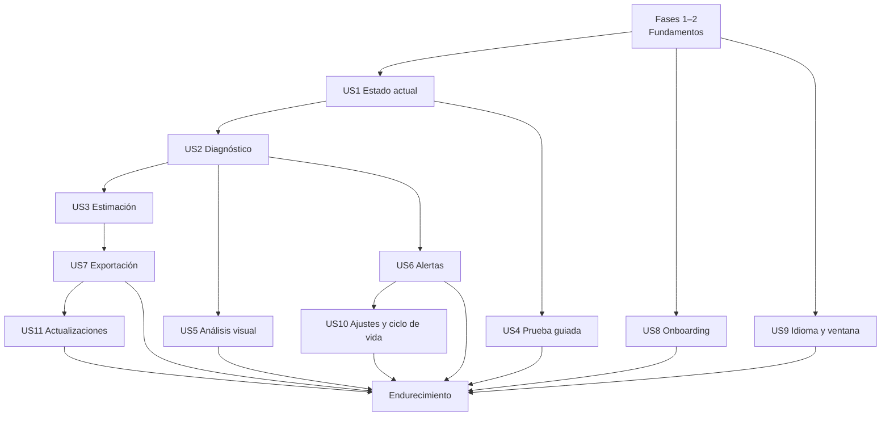

# Tareas: diagnóstico térmico de CPU

**Entrada**: `spec.md`, `plan.md`, `research.md`, `data-model.md`, `ux-visual-spec.md`, `contracts/`  
**Pruebas**: obligatorias según constitución; el motor debe desarrollarse contra trazas antes de conectarlo a hardware real.

Formato: `[ID] [P?] [Historia?] Descripción con ruta`. Las tareas de test indican entre paréntesis los FR/NFR/SC que cubren (puerta 1 de la constitución; matriz en `traceability.md`, T009a).

**Regla del sistema de diseño:** las pantallas **conectan** componentes de `design/` (copiados por T024) mediante adaptadores; no los recrean. Si una pantalla necesita una pieza que `design/` no tiene, se añade antes en `design/` con justificación, ejemplo y harness (como T118–T133), nunca en `apps/desktop/src/`.

**Lotes y checkpoints** (`historias.md` § «Estrategia integral de testing», § 7–§ 9 y § 35):

- Las tareas se agrupan en **lotes** (`L00`–`L21`), indicados al inicio de cada grupo. El orden de trabajo lo marcan las dependencias, no la numeración.
- Antes de empezar un lote se añade bajo su encabezado el **plan de pruebas del lote** (plantilla del § 8).
- Cada lote termina con su tarea **`CHK-Lxx`**, que ejecuta **solo** la suite afectada y registra orden, código de salida, errores y avisos (constitución XVI). No se abre un lote nuevo con tests obligatorios pendientes del anterior.
- Las tareas de test van **dentro** de su lote; no se alterna «implementar A / test A / implementar B / test B».
- Las tareas marcadas **TDD** exigen que el test exista y falle antes de implementar (constitución XIII).
- Identificadores nuevos: `T134`+ para trabajo derivado de la constitución 1.3–1.5; `T-TEST`, `T-UNIT`, `T-COMP`, `T-INT`, `T-PLAY`, `T-E2E`, `T-A11Y`, `T-QUAL`, `T-MUT` y `T-ACC` para la infraestructura de pruebas y la aceptación (`historias.md` § 37).

## Fase 1 — Inicialización

**Lote L00 — Infraestructura de desarrollo y pruebas.**

- [x] T001 Crear monorepo y estructura definida en `plan.md`.
- [x] T002 Inicializar Tauri 2 + Svelte + TypeScript estricto en `apps/desktop/`.
- [x] T003 [P] Crear solución .NET y proyecto `sensor-agent` en `apps/sensor-agent/`.
- [x] T004 [P] Crear los módulos Rust `commands`, `diagnostics`, `telemetry`, `ipc`, `storage`, `export`, `logging`, `ports` y `test_support` (vacíos, con `mod.rs`) en `apps/desktop/src-tauri/src/` según la estructura de `plan.md`.
- [x] T005 [P] Configurar los formateadores (Prettier con `prettier-plugin-svelte`, `rustfmt`, `dotnet format`) y la configuración base de ESLint, Clippy y analizadores .NET; las reglas obligatorias de la constitución van en T135.
- [x] T006 Configurar scripts raíz de build/test/dev y fijar gestores/versiones en archivos de bloqueo.
- [x] T007 [P] Configurar CI Windows x64 con cachés y artefactos de pruebas, sin requerir sensores reales.
- [x] T008 [P] Crear inventario de licencias y plantilla de `THIRD-PARTY-NOTICES`.
- [x] T009 Documentar decisiones ADR iniciales: sidecar, SQLite, `AnalysisChart` SVG, agregación temporal y motor por niveles de cobertura (mesetas, ventana de turbo, techo de potencia) en `docs/adr/`.
- [x] T009a Crear `specs/001-cpu-thermal-diagnostics/traceability.md` (FR/NFR/SC/escenario de aceptación → test, o «manual» con motivo) y un check de CI que falle si un requisito no tiene entrada. (= T-ACC-001)
- [x] T134 Fijar las toolchains de la constitución: `rust-toolchain.toml` (1.98.1, `rustfmt`, `clippy`), `global.json` (SDK 10.0.401, `rollForward: latestPatch`), `.nvmrc` (24.21.0), `packageManager` (pnpm 12.4.2) y `engines`; npm con `save-exact`; `RestorePackagesWithLockFile` en .NET; CI en modo bloqueado. (= T-TEST-001)
- [x] T135 [P] Configurar las reglas obligatorias de análisis estático: ESLint `strict-type-checked`, `no-console`, `consistent-type-assertions` con `assertionStyle: 'never'` y `no-restricted-imports` (`@tauri-apps/api` solo en `lib/bridge/`, `loglevel` solo en `lib/logging/`, `design/examples` y `design/harness` en ninguna parte); Clippy `print_stdout`, `print_stderr`, `dbg_macro` y `disallowed_macros` (macros de `tracing` fuera de `logging/`), y `unwrap_used`/`expect_used` denegados en los módulos de frontera `ipc`, `commands`, `export` y `storage` (permitidos solo en `#[cfg(test)]`); .NET con `Nullable`, `TreatWarningsAsErrors`, `AnalysisLevel latest-recommended` y `BannedApiAnalyzers` (`Console.Write*`, `Debug.Write*`, `Trace.Write*`, `Environment.GetEnvironmentVariable` fuera de su módulo). (Constitución XIV–XVII)
- [x] T136 Crear `pnpm check` (`svelte-check --tsconfig <tsconfig de la app> --fail-on-warnings` + `tsc --noEmit -p tsconfig.node.json`) y fijar en CI el orden de la constitución XVI: instalación bloqueada → formato y lint → `pnpm check` → pruebas → compilación → E2E. (FR/constitución XVI)
- [x] T137 [P] Crear `.env.example` y los módulos de configuración: `src/lib/config/env.ts` (Zod sobre `import.meta.env`, `envPrefix: 'PUBLIC_'`), validación en `vite.config.ts` con `loadEnv` y fallo de compilación de producción si existe `PUBLIC_LOG_LEVEL`; módulos Rust y .NET para `TW_DEV_*` solo en depuración y en la característica `e2e`. Pruebas de rechazo por variable. (Constitución XV)
- [x] T138 [P] Configurar `cargo-deny` (licencias compatibles con GPL-3.0, avisos de seguridad y duplicados), `cargo-about` y el informe equivalente de npm y NuGet; bloquear en CI. (Puerta 8)
- [x] T-COMP-001 [P] Configurar Vitest con los proyectos `unit` (node) y `component` (jsdom + Testing Library, condición `browser` para Svelte 5) y `@vitest/coverage-v8`.
- [x] T-TEST-003 [P] Configurar perfiles de `cargo-nextest`, `cargo-llvm-cov`, *traits* de xUnit (`Unit`, `Integration`, `Protocol`) y coverlet; umbrales de cobertura de la constitución XIII por pila, que informan sin bloquear hasta el cierre de CHK-L01 (excepción E1 de `plan.md`, fecha límite 2026-10-31). (= T-QUAL-001)
- [x] T-PLAY-001 [P] Configurar Playwright con los proyectos `frontend` y `app`, artefactos de fallo (screenshot, trace y vídeo solo en `app`) y etiquetas `@smoke`, `@critical`, `@a11y`, `@visual`. (Incluye T-PLAY-010)
- [ ] T-PLAY-002 Spike: conducir la WebView2 de una compilación `e2e` de Tauri por CDP desde Playwright en `windows-2025`; documentar el resultado en `docs/spikes/e2e-webview2.md` y la alternativa si falla. Evidencia local 2026-09-20: binario Tauri `e2e` real + WebView2 en `127.0.0.1:9222`; `chromium.connectOverCDP` leyó título/DOM y terminó 0. Pendiente ejecutar el job real en `windows-2025`.
  Avance 2026-09-21 (alcance acotado, ver T181): el atajo `tauri dev -f e2e` del spike quedó documentado como algo que «no debe entrar en el repositorio»; ahora hay un arnés reutilizable que no lo necesita — `apps/desktop/e2e-native/` (`global-setup.ts` arranca `target/debug/throttlewatch.exe` compilado con `--features e2e,custom-protocol` y espera `/json/version`; `fixtures.ts` conecta con `chromium.connectOverCDP` en vez de lanzar un navegador; `smoke.spec.ts` comprueba título, `__TAURI_INTERNALS__` y una navegación real por IPC) más `playwright.native.config.ts` y el script `pnpm test:e2e:native`. Verificado en local (Windows) tres ejecuciones consecutivas en verde, sin procesos colgados tras cada una. **Sigue sin hacer:** el job de `windows-2025` (no verificable sin push ni runner real) y decidir/migrar qué especificaciones `app` existentes pasan a este arnés (la mayoría dependen de parámetros de URL que solo entiende el puente falso de `e2e/fixtures.ts`, así que no se trasladan tal cual). Detalle completo en `docs/spikes/e2e-webview2.md` § «Arnés reutilizable».
- [x] T-PLAY-004 [P] Crear la *fixture* común de Playwright que falla ante `pageerror`, `console.error` y peticiones a otros orígenes no declaradas, comprueba el almacenamiento web vacío y usa una allowlist inicial vacía.
- [x] T-TEST-004 Crear y documentar en `quickstart.md` los scripts de `historias.md` § 30 (`test:*`, `verify:batch`, `verify:pr`, `design:check`, `logs:view`).
- [x] T-TEST-005 Medir la duración base de cada suite y del pipeline de PR, publicar el informe por suite en CI y fijar los presupuestos (objetivo inicial de PR: ≤ 15 min de mediana).
- [ ] CHK-L00 Checkpoint: nivel 0 de las tres pilas en CI a cero errores y avisos, un test trivial por pila y por proyecto de Vitest y Playwright en verde, check de trazabilidad activo y tiempos base medidos (T-TEST-005).
  Actualización 2026-09-19: se añadió la detección de `__TAURI_INTERNALS__` en `lib/bridge`; fuera de Tauri `invokeValidated` devuelve `TAURI_UNAVAILABLE` y `listenValidated` una baja no-op. Se añadió el nombre accesible de la aplicación en `App.svelte`. Verificado con `vitest run --config vitest.unit.config.ts src/lib/bridge/bridge.test.ts` (0, 4/4), `vite build` (0) y `playwright test --project frontend` (0, 1/1). **Sigue abierto:** T-PLAY-002, la ejecución en CI y el cierre formal del checkpoint.
  Nivel 0 (2026-09-19, local, tras corregir 18 avisos de clippy y 14 ficheros sin formato Prettier): `pnpm format` (0); `pnpm lint` (0); `pnpm check` (0, 244 ficheros, 0 errores, 0 avisos); `pnpm check:contracts` (0); `pnpm check:traceability` (0); `cargo fmt --check` (0); `cargo clippy --all-targets -- -D warnings` (0, 0 avisos); `cargo build` (0); `cargo deny check` (0); `dotnet format --verify-no-changes` (0); `dotnet build -c Debug` (0, 0 avisos, 0 errores); `pnpm build` (0). Suites: `cargo nextest run` (0, 55/55); `dotnet test .pps\sensor-agent --no-restore` (0, 33/33; antes de hoy devolvía exit 5 y 0 pruebas: faltaban `UseMicrosoftTestingPlatformRunner`/`TestingPlatformDotnetTestSupport` en el csproj, y `-nologo` se reenvía al host MTP y lo tumba); `pnpm test:unit` (0, 17/17); `pnpm test:component` (0, 1/1); `pnpm test:corpus` (0, 8 escenarios). **No cerrado:** (1) T-PLAY-002 pendiente; (2) `pnpm exec playwright test --project frontend` (1): el smoke `@smoke foundation page` falla con `Cannot read properties of undefined (reading 'transformCallback')` porque `Dashboard.svelte` (T034, L09) llama a `invoke`/`listen` al montarse y `lib/bridge` no degrada sin Tauri; regresión introducida fuera de orden de lotes; (3) «en CI» no verificado en local. Entorno: el `pnpm` global (11.6.0) delega en 12.4.2 autogestionado sin binario nativo; se usó `node <link>/pnpm.mjs`.

## Fase 2 — Fundamentos bloqueantes

**Lote L01 — Contratos y fixtures** (T010–T013, T016, T143). Fixtures válidos e inválidos **antes** de los tipos.

- [x] T143 [P] Crear el esquema `log-event` y el formato común de error `{ code, message_key, path?, context? }` en `packages/contracts/`, con fixtures válidos e inválidos. (Constitución XIV y XVII)
- [x] T010 Implementar tipos de contrato v1 compartidos a partir de `contracts/telemetry.schema.json`.
- [x] T011 [P] Crear fixtures canónicos de handshake, capabilities, sample y error en `packages/contracts/fixtures/`.
- [x] T012 [P] Crear tests C# de serialización de fixtures en `apps/sensor-agent/Tests/Protocol/`.
- [x] T013 [P] Crear tests Rust de deserialización/validación de fixtures en `apps/desktop/src-tauri/src/ipc/tests/`.
- [x] T016 [P] Crear sidecar falso/replay en `packages/trace-fixtures/tools/`.
- [x] T-UNIT-001 [P] Crear `TraceBuilder` (escenarios sintéticos por fases) y los *builders* de muestra y capacidades en `src-tauri/src/test_support/`.
- [x] CHK-L01 Checkpoint: los tres lenguajes aceptan y rechazan exactamente los mismos fixtures; umbrales de cobertura activos desde aquí.
  Registro 2026-09-19: nivel 0 en verde (véase CHK-L00). Conformidad de fixtures: Rust `cargo nextest run ipc::` (0, 12/12) solo ejercita `handshake.json` (acepta) e `invalid-sample.json` (rechaza); .NET `--filter-trait Category=Protocol` (0, 8/8) acepta `handshake`, `capabilities`, `sample` y `error` pero no rechaza ningún fixture inválido; TypeScript no consume ningún fixture de `packages/contracts/fixtures`. **No cerrado:** el criterio «los tres lenguajes aceptan y rechazan exactamente los mismos fixtures» no se cumple; faltan 4 aceptaciones y 2 rechazos por lenguaje según el caso (`invalid-error.json` no lo prueba nadie). Umbrales de cobertura: informan, no bloquean (E1).
  Cierre 2026-09-19: `prettier --check` (0), ESLint del puente (0), `svelte-check` (0 errores/avisos), TypeScript contracts (0), `cargo fmt --check` (0), `cargo clippy --all-targets -- -D warnings` (0 avisos), `cargo nextest run ipc::` (0, 11/11), `cargo build` con `RUSTFLAGS=-A linker_messages` (0), `dotnet format --verify-no-changes` (0), `dotnet build -c Debug` (0 avisos/errores), `dotnet test --filter-trait Category=Protocol` (0, 10/10) y `vitest run --config vitest.unit.config.ts` (0, 25/25). El corpus iterado por directorio contiene 4 aceptaciones y 2 rechazos (`invalid-error.json` e `invalid-sample.json`) con el mismo resultado en Rust, .NET y TypeScript. CHK-L01 cerrado.

**Lote L02 — Handshake, supervisor y registro del backend** (T014, T015, T140, T142). TDD en el rechazo por nonce, versión, secuencia y tamaño.

- [x] T014 Implementar handshake con nonce, versión y secuencia en sidecar y Rust.
- [x] T015 Implementar supervisor de sidecar con estado, timeout, EOF y backoff limitado en `src-tauri/src/ipc/supervisor.rs`; lanzamiento con `std::process::Command` desde la ruta fija de `bundle.externalBin` y verificación de hash (sin `tauri-plugin-shell`).
- [x] T140 Implementar el registro del backend (constitución XVII): macros `log_*!` con código obligatorio sobre `tracing`, fichero JSON UTC rotado 5 × 5 MB, formato humano `Europe/Madrid` con `jiff` solo en desarrollo, redacción por lista permitida, agrupación de repetidos a 60 s, escritura no bloqueante, captura de pánicos y validación de los eventos del colector recibidos por `stderr`. Pruebas de redacción, niveles y formato con los dos cambios de hora anuales.
- [x] T142 [P] Implementar la clase `Log` del colector con `[LoggerMessage]` sobre `Microsoft.Extensions.Logging`, JSON por `stderr` y captura de excepciones no controladas.
- [x] T-INT-001 Pruebas de integración del pipeline con el colector replay como proceso real: handshake, rechazos, EOF, cuelgue, reinicio con *backoff*, secuencias perdidas, valores imposibles como ausentes y PID padre ausente. (NFR-004, NFR-006, SC-010)
- [x] CHK-L02 Checkpoint: integración IPC y pruebas de registro en verde.
  Registro 2026-09-19: nivel 0 en verde (véase CHK-L00); `cargo nextest run ipc::` (0, 12/12: protocolo, supervisor, elevated). **No cerrado:** T140 (registro del backend) y T-INT-001 (integración con el colector replay como proceso real) siguen pendientes.
  Cierre 2026-09-19: `cargo fmt --all -- --check` (0), `cargo clippy --all-targets -- -D warnings` (0 avisos), `cargo test logging::` (0, 4/4), `cargo test --test ipc_replay -- --test-threads=1` (0, 3/3), `cargo nextest run` (0, 62/62), `cargo build` con `RUSTFLAGS=-A linker_messages` (0), `cargo deny check` (0; advisories/bans/licenses/sources correctos), `dotnet test apps/sensor-agent/SensorAgent.sln` (0, 35/35) y `node scripts/check-traceability.mjs` (0). El replay ejecuta un proceso real y cubre handshake, rechazo de versión, EOF, secuencia perdida, valor ausente y PID padre ausente; el registro cubre redacción, validación de `stderr`, deduplicación y formato CET/CEST. CHK-L02 cerrado.

**Lote L03 — Colector real mínimo y spikes** (T017–T021, T019c, T019d, T053).
- [x] T017 Integrar LibreHardwareMonitorLib con solo CPU habilitada en `apps/sensor-agent/Collector/`.
- [x] T018 Implementar catálogo original de hardware/sensores sin normalización de negocio.
- [ ] T019 [P] Ejecutar spike de lectura sin privilegios en matriz Intel/AMD y documentar `docs/spikes/sensor-access.md`; incluir la fiabilidad de `% Processor Performance` y `Processor Frequency` por procesador lógico frente a APERF/MPERF.
  Progreso 2026-09-19: fila del 2600X completa (sin proveedor, elevado, usuario estándar tras reinicio y usuario de integridad media con el servicio en marcha; ambos `denied`, resultado (b)); guion `docs/spikes/tools/sensor-access-matrix.ps1` y procedimiento para las cuatro filas restantes; hallazgo de contadores PDH localizados. Progreso 2026-09-22: fila Intel híbrido (Intel Core Ultra 7 155H, Meteor Lake, 16 núcleos/22 hilos P+E+LP-E) con PawnIO 2.2.0.0 ya instalado, usuario estándar (integridad media confirmada): `denied`/`MSR_READ_FAILED`, `0x64F`/`0x1A2`/`0x610` legibles pero en `0x0`, mismo patrón que el `denied` de AMD sin elevar; hallazgo adicional para T028c: `% Processor Performance` supera el 100 % en turbo (hasta 371 % observado) mientras `Processor Frequency` queda fija en tres valores por grupo de núcleo (1400/900/700 MHz, P/E/LP-E), confirmando que el reloj activo debe derivarse (`base_clock × percent/100`) y no leerse como valor instantáneo; ver `sensor-access.md`. **Pendiente:** en la fila Intel híbrido, repetir en proceso elevado (UAC) y tras reinicio; Intel anterior, portátil OEM y AMD Zen 4 siguen sin hardware disponible; el contraste APERF/MPERF sigue pendiente (el sidecar no lee `0xE7`/`0xE8`).
- [x] T019a **[Puerta de viabilidad]** Verificar con el proveedor de acceso de bajo nivel instalado si el sidecar lee `0x64F`, `0x1A2` y `0x610` y limpia los bits de registro **sin UAC recurrente**; medir qué parte de la matriz alcanza nivel A, B o C; decidir mediante ADR entre los resultados (a), (b) o (c) de `plan.md` § Fase 0. Bloquea la fase 3.
- [ ] T019b [P] Grabar el corpus etiquetado inicial (Intel híbrido, Intel anterior, portátil con DTT/DPTF, sobremesa con límites abiertos, AMD Zen 4) según `research.md` § 15, con cargas multihilo, juego de pocos núcleos, AVX2 y reposo caliente.
- [x] T020 [P] Ejecutar spike de redistribución, instalación y retirada del acceso bajo nivel en `docs/spikes/low-level-driver.md`. (2026-09-19: ciclo desinstalar/instalar/reinstalar ejecutado en el 2600X con el instalador empaquetado; la revisión legal del instalador queda como hechos enumerados y condiciona la publicación, no el desarrollo ni las pruebas locales de T153–T155)
- [x] T019c [P] Spike de vidrio en WebView2: medir fps y CPU de composición en reposo y con `AnalysisChart` actualizándose, en el equipo de referencia y en el Ryzen 5 2600X; confirmar o corregir los umbrales `glass.*` de `spec.md`; documentar en `docs/spikes/glass-cost.md`. Bloquea T131.
  Progreso 2026-09-19: medido en el Ryzen 5 2600X con WebView2 153 (`docs/spikes/glass-bench`, dos ejecuciones): el desenfoque no tiene coste medible; el fondo `.tw-ambient` animado cuesta 30–100 % de un núcleo en reposo (anotado para `design/`); el contador rAF cuesta 4 % de un núcleo. Umbrales: `degrade_idle_cpu_pct` necesita unidad (% de máquina); fps sin cambios. **Pendiente el equipo de referencia Intel** (hardware no disponible) para cerrar la tarea y desbloquear T131.
  Cierre 2026-09-22: medido en el equipo de referencia Intel (Core Ultra 7 155H, Meteor Lake, gráfica integrada Arc) con WebView2 153.0.4234.48, mismo banco (`glass-bench/results/intel-ultra-7-155h/`). Confirma con dos equipos que el desenfoque no es el coste (fondo estático: 0,35–0,87 % máquina en Intel, 0,05–0,08 % en AMD, sin diferencia atribuible al nivel de vidrio) y que `tw-ambient-drift` domina el coste, aquí 3–5× mayor que con GPU discreta (7,9–23,3 % máquina en Intel frente a 2,5–8,5 % en AMD); fps se mantiene en 60 en ambos equipos, sin poder ejercitar `glass.degrade_fps`. Umbral `glass.degrade_idle_cpu_pct` confirmado en % de máquina con el fondo ambiental pausado (requisito previo a T131, ver `glass-cost.md`). T019c queda cerrada con dos equipos medidos; portátil OEM con iGPU de generación anterior queda fuera de alcance de esta tarea.
- [x] T019d [P] Spike de permisos mínimos de Tauri: barra propia, inicio con Windows, notificaciones, diálogos y opener; lista de `capabilities/` resultante en `docs/spikes/tauri-permissions.md`. Alimenta T085, T091, T070 y T-INT-003. (2026-09-19: superficie base con permisos `core:*` mínimos, ampliada únicamente con los permisos `core:window` necesarios para la geometría de T085/T086; cero permisos de plugin; `tests/acl_surface.rs` verifica el ACL real con el runtime simulado)
- [x] T053 [P] [US4] Ejecutar spike comparando carga integrada y observación externa en `docs/spikes/guided-load.md`. Bloquea T049, T051, T054 y L14.
- [x] T021 Resolver la arquitectura de privilegios mediante ADR; bloquear empaquetado si contradice la constitución.
- [x] T-INT-005 [P] Suite xUnit `Integration` solo Windows: arrancar el colector real con LibreHardwareMonitorLib en la VM de CI sin sensores, verificar el catálogo degradado (`virtualized-no-sensors`), la ausencia de excepciones y el cierre por EOF. (2026-09-19: run 35445226220 en `windows-2025` en verde; catálogo del runner `hypervisor=True; product=Virtual Machine; cpu_vendor=intel; low_level_access=missing/PAWNIO_NOT_INSTALLED; catalog[6]: load=6`; el run previo 35445014451 detectó en un runner AMD la `NullReferenceException` de `Amd17Cpu.Update()`, corregida en el colector; el run 35456668461, en un runner **AMD** virtualizado, reveló además que LibreHardwareMonitorLib devuelve en una VM lecturas con estado `ok` que no son mediciones —temperatura 0 °C, potencia 0 W y tensión constante de 1,55 V—: el colector ahora oculta temperatura, potencia y tensión en huéspedes virtualizados (`HostVirtualization`: bit de hipervisor de CPUID y nombre de producto SMBIOS; el bit solo no basta porque un Windows con VBS también lo activa) con pruebas unitarias y mutación comprobada; los relojes LHM en una VM no se han caracterizado y quedan pendientes de T028)
- [x] CHK-L03 Checkpoint: catálogo con hardware falso y arranque real en VM en verde; spikes documentados. **Cerrado el 2026-09-19 con la excepción E2 de `plan.md`** (T019, T019b y la mitad Intel de T019c diferidas a hardware; fecha límite 2026-11-30).
  Cierre 2026-09-19: revisor de constitución ejecutado (1 crítico, 2 altos, resueltos en el mismo cambio): test de regresión determinista `HardwareCollectorUpdateFailureTests` (falla 2/2 sin `TryUpdate`, pasa con él) mediante la costura `IHardwareSource`; niveles de registro mapeados al enum del contrato `log-event` (`warn`, `info`, Critical → `error`) con `JsonStderrLoggerTests`; `err.code` = código del evento; E2 reescrita (puerta 4, T037 sintética, condición de T154); aclaración A2 para `build.rs` y `docs/spikes/**`. `dotnet test apps/sensor-agent/SensorAgent.sln --no-restore` (0, 46/46); `dotnet format --verify-no-changes` (0). Pendientes de incidencia aparte (fuera del lote): `rusqlite` 0.34 frente a 0.40, `LogEvent` sin `deny_unknown_fields` en Rust.
  Registro 2026-09-19: nivel 0 en verde (véase CHK-L00); `dotnet test` (0, 33/33) incluye `HardwareCollectorTests`; spike `docs/spikes/sensor-access.md` con tres ejecuciones (T152 hecha: resultado (b)). **No cerrado:** pendientes T019, T019b, T020, T019c, T019d y T-INT-005; «arranque real en VM» no verificable en local.
  Registro adicional 2026-09-19: T019a cerrada con el spike y ADR-0004 aceptado con condiciones C1–C6; L03 continúa abierto por los demás spikes y la prueba de VM.
  Progreso 2026-09-19: se añadió `apps/sensor-agent/Tests/Integration/SensorAgentProcessTests.cs`; `dotnet test apps/sensor-agent/SensorAgent.sln --no-restore` (0, 36/36), `--filter-trait Category=Integration` (0, 3/3) y `dotnet format --verify-no-changes --no-restore` (0). La prueba arranca el sidecar real, valida `hello_ack` y cierre por EOF; T-INT-005 sigue pendiente de ejecución en VM `virtualized-no-sensors` y de verificar allí el catálogo degradado.
  Progreso 2026-09-22: hardware Intel híbrido disponible por primera vez (Intel Core Ultra 7 155H, Meteor Lake), reduciendo el alcance de la excepción E2. Fila Intel híbrido de T019 registrada (sin elevar: `denied`/ceros; elevado: `available` con TjMax 110 °C y PL1/PL2 ≈28/64 W plausibles, ver `sensor-access.md`) y mitad Intel de T019c medida (`glass-cost.md`, tabla Intel Ultra 7 155H). Siguen sin hardware: Intel anterior, portátil OEM, AMD Zen 4 (T019); T019b (corpus etiquetado) no grabado. E2 no se cierra formalmente aquí (requiere revisar el resto de la matriz), solo se anota el avance.

  Registro 2026-09-19 (tarde): T-INT-005, T019d y T020 cerradas; T019c medida en el 2600X y T019 con la fila del 2600X y el guion de matriz. Verificación: `dotnet test apps/sensor-agent/SensorAgent.sln --no-restore` (0, 37/37); `dotnet format --verify-no-changes` (0); `cargo nextest run --profile ci` (0, 65/65, incluye `acl_surface` 3/3); `cargo clippy --all-targets -- -D warnings` (0); `cargo fmt --check` (0); `cargo deny check` (ok); `pnpm format/lint/check/design:check/design:check:sources/check:contracts/test/build/check:traceability` (0 en local); CI `windows-2025` run 35445226220 **success** (primer run verde del flujo; se corrigieron lockfile, `design:check` duplicado, restore de la solución y flags del runner). **No cerrado:** T019 (cuatro filas de la matriz sin hardware; contraste APERF/MPERF), T019b (sin equipos y sin grabador de trazas) y T019c (equipo de referencia Intel). Hallazgos anotados fuera de alcance: fondo `.tw-ambient` animado (30–100 % de un núcleo), contadores PDH localizados, IDs duplicados en el catálogo LHM (`Core #N` como Clock y Factor), sin `src/main.rs` ni CLI de Tauri, y una corrección propia: la lectura «como usuario estándar con el servicio en marcha» anotada antes salió de una sesión elevada; con integridad media da `denied` y ADR-0004 sigue vigente sin enmienda (`sensor-access.md`, «CORRECCIÓN»).
**Lote L04 — Persistencia, reloj y sesiones** (T022, T023, T047a, T-TEST-002). TDD en la migración v1 y en la partición de sesiones.

- [x] T-TEST-002 Crear los puertos sustituibles de Rust (reloj, IDs, nonce, almacenamiento, diálogos, ventana, bandeja, notificaciones, autostart, HTTP y energía/idioma/tema de Windows) y sus fakes en `test_support` (incluye T-UNIT-002).
- [x] T022 Crear SQLite, migración v1 y repositorios base en `src-tauri/src/storage/`; `PRAGMA foreign_keys = ON` en cada conexión y test de integridad referencial (borrar una sesión elimina sus frames, valores, eventos e informe).
- [x] T023 [P] Implementar reloj monotónico, detección de huecos y modelo de calidad de muestra.
- [x] T047a Implementar límites de sesión pasiva (FR-067): apertura, partición por hueco > 60 s / 24 h, congelación del informe y diagnóstico en vivo provisional. (Movida desde la fase 5: el hito de esta fase y el corte vertical necesitan sesiones.)
- [x] CHK-L04 Checkpoint: almacenamiento con SQLite temporal, migración v1, huecos, calidad y partición de sesiones con reloj falso en verde.
  Registro 2026-09-18: `cargo fmt --all -- --check` (0, 0 errores, 0 avisos); `cargo clippy --locked -- -D warnings` (0, 0, 0); `cargo check --locked` (0, 0, 0); `RUSTFLAGS='-A linker_messages' cargo nextest run --profile ci` (0, 17 pruebas, 0 fallos); `cargo llvm-cov --no-report --locked` (0, 17 pruebas, 0 fallos).

**Lote L05 — Shell, puente, catálogos y diseño** (T024–T026, T139, T141, T-COMP-002, T-COMP-003, T-PLAY-005).

- [x] T-PLAY-005 [P] Crear los perfiles de E2E para ambos proyectos (`fresh-install`, `onboarding-midway`, `ready`, `tray-enabled`, `with-history`, `updates-on`): escenarios de mock para `frontend` y directorios de datos sembrados para `app`, con aislamiento por directorio temporal y proceso.

- [x] T139 Implementar el módulo puente `src/lib/bridge/`: único importador de `@tauri-apps/api`, esquemas Zod por comando y evento con tipos inferidos, resultado discriminado y errores estructurados; prueba de conformidad contra los fixtures de `packages/contracts/` (mismos válidos e inválidos que el JSON Schema). (Constitución IX y XIV)
- [x] T141 [P] Implementar `src/lib/logging/` (`createLogger` sobre `loglevel`) y el comando `log_frontend` con validación, límite de 60 eventos por minuto y niveles según `Registro detallado`. (Constitución XVII)
- [x] T-COMP-002 [P] Crear `FakeBridge` validado con Zod, escenarios de mock y *builders* de interfaz (`liveSnapshot`, `coverage`, `report`, `session`, `preferences`) en `src/test-support/`.
- [x] T-COMP-003 [P] Crear utilidades de consulta por catálogo (`t('key')`) para Testing Library y Playwright.
- [x] T024 [P] Crear `scripts/design-sync` que copie `design/{components,icons,illustrations,lib,tokens,brand}` a `apps/desktop/src/design-system/` y un test de CI que falle si la copia difiere; prohibir por lint la importación de `design/examples/` y `design/harness/`. Integrar `tokens.css` desde la copia para claro/oscuro, modo sistema y movimiento reducido.
- [x] T025 Crear shell de navegación y estados globales de colector en `apps/desktop/src/`.
- [x] T026 Configurar catálogos completos español/inglés, resolución especial de locales y verificador de igualdad/sin literales.
- [x] CHK-L05 Checkpoint: igualdad de la copia de diseño, catálogos, conformidad del puente, registro de la interfaz y navegación del shell (componentes) en verde.
  Registro 2026-09-19: nivel 0 en verde (véase CHK-L00); `pnpm design:sync`/igualdad de copia no ejecutado por separado. **No cerrado:** pendientes T-PLAY-005, T139, T-COMP-002, T025 y T026; L09 (T030–T035) se marcó terminado antes que este lote, contra el «Orden de lotes».
  Cierre 2026-09-19: `node scripts/design-sync.mjs --check` (0); `node scripts/check-catalogs.mjs` (0, 61 claves, 0 diferencias); `node scripts/check-traceability.mjs` (0); Prettier (0) y ESLint (0); `svelte-check --fail-on-warnings` (0, 0 errores/0 avisos); TypeScript (0); Vitest unitario (0, 39/39), componentes (0, 1/1); Vite build (0); Playwright `frontend` + `app` (0, 2/2). Revisión manual frente a la constitución: sin imports de `design/examples`, sin permisos de plugin, puente con resultado discriminado y FakeBridge validado en frontera. CHK-L05 cerrado.

**Hito:** handshake, catálogo y muestras sintéticas atraviesan sidecar → Rust → UI → SQLite.

## Fase 2b — Ampliación del sistema de diseño (decisiones de 2026-09-18)

Estas tareas modifican `design/` **antes** de la primera sincronización (T024) y deben pasar `npm run check` y `npm run build` del harness. Ninguna añade copy incrustado ni dependencias. **Completadas el 2026-09-18** (batch 12 del sistema de diseño; harness y mockup compilan sin errores ni avisos; verificación visual en `examples/ShellPieces.example.svelte` y `design/mockup`).

- [x] T118 [P] `SettingsScreen`: sustituir `minimizeToTrayOnClose` por `closeAction: 'unset' | 'exit' | 'tray'` con `SegmentedControl` y texto «sin decidir»; eliminar `anonymizedDiagnostics` y el canal de actualizaciones; retención fija a 4 opciones; añadir movimiento (`appearance.motion`), `onBattery`, bloques `advanced` plegados por sección (intervalo, detalle por núcleo, periodo de silencio, nivel de registro), espacio usado, `Exportar…`, `Probar notificación`, `Repetir introducción`, enlaces de Acerca de (`Documentación`, `Documentación en línea`, `Licencias`, `Resumen técnico`, `Abrir carpeta de registros`); sección Diagnóstico con duración, exigir CA, avisar al terminar y límites en solo lectura.
- [x] T119 [P] `SettingsScreen.updates`: estados `idle|checking|upToDate|available|downloading|verified|installing|error`; botones `Descargar` (solo `available`) e `Instalar` (solo `verified`, con `installDisabledReason`); descripción de comprobación «cada 24 h».
- [x] T120 [P] Sustituir `advancedAccessAvailable: boolean` por `advancedAccess: 'not_needed'|'available'|'installable'|'denied'|'error'` en `OnboardingFlow` (slide 5) y `SettingsScreen.sensors`; solo `installable` muestra el botón de instalar/reparar.
- [x] T121 [P] Crear `CoverageMatrix` (magnitud × disponible/calidad/origen/motivo, pie con confianza máxima y estado de acceso, acciones Volver a comprobar / Copiar resumen técnico) y su ejemplo.
- [x] T122 [P] Crear `ContextStrip` (CPU + topología, alimentación/plan, estado del colector con frescura, Ver cobertura) con estados fresco/obsoleto/desconectado y su ejemplo.
- [x] T123 [P] Crear `ExportDialog` (alcance, formato, anonimizar, campos incluidos/excluidos, tamaño y nombre propuestos) e `ImportResultDialog` (validación, migración, avisos) y sus ejemplos.
- [x] T124 [P] Crear `FirstCloseDialog` (dos opciones, texto de bandeja «y seguir midiendo», enlace a Ajustes) y `CloseBlockedDialog` (prueba/exportación/descarga/instalación).
- [x] T125 [P] Crear `WhatsNewCards` (pila de tarjetas con «Entendido» y acción opcional) y `TechnicalSummary` (texto monoespaciado + Copiar) y `LicensesScreen` (lista desplegable de avisos de terceros).
- [x] T126 [P] `GuidedDiagnosticScreen`: añadir fase `rest` (omitible) al stepper (6 pasos), bloque estructurado `whatWillHappen[]` en la intro, tiempo restante por fase, `batteryState='blocked'` explicado, acción «Usar como referencia» en resultado.
- [x] T127 [P] Shell: `BottomBar` con ítem `Más` y menú (Sesiones, Diagnóstico guiado, Ajustes); `Banner` global fijo bajo `TitleBar` para prueba en curso (con Detener) y para estado del colector degradado (Reintentar / Ver resumen técnico); documentar en `AGENTS.md`.
- [x] T128 [P] `SessionCard`/`SessionsScreen`: marca «Referencia», acciones Usar/Retirar referencia, botón `Importar…` en cabecera, `statusLabel` obligatorio para `incomplete`. `ReportScreen`: acciones Exportar / Usar como referencia / Re-evaluar con reglas actuales y aviso «Provisional · sesión en curso».
- [x] T129 Actualizar `design/README.md`, `AGENTS.md` y `design-system.json` con los componentes nuevos y las props cambiadas; actualizar `design/mockup` a los contratos nuevos; ejecutar harness `check` y `build`.
- [x] T130 [P] Material de vidrio y catálogo de animaciones en `design/` (tokens `--glass-*`/`--motion-*`, niveles `data-glass`, fondo `tw-ambient`, utilidades `tw-enter`/`tw-pop`, animaciones por componente) según `ux-visual-spec.md` § «Material de vidrio» y § «Animación»; harness y mockup con conmutadores de vidrio y movimiento. (2026-09-18)
- [x] T131 [US9] Implementar la preferencia `appearance.glass` (`system|full|reduced|off`): lectura de `UISettings.AdvancedEffectsEnabled`, escucha en caliente, aplicación de `data-glass` y degradación automática por rendimiento con histéresis según `glass.*` de `ruleset-v1` (sin literales; tras T019c); test de que `off` y sin `backdrop-filter` mantienen contraste AA.
  Cierre 2026-09-22 (tras T019c, con el mismo equipo Intel de referencia): **prerrequisito de `design/`** primero — `tw-ambient-drift` pasó de animar `background-position` (repintado en cada fotograma, la causa del 2,5–23 % de máquina que T019c midió en reposo) a animar `transform` sobre un `::before` propio, solo compositor; `[data-glass='off']` además detiene la animación de una capa ya invisible. Verificado con `design/harness`/`design/mockup` (`npm run check`/`build`, 0/0 en ambos) y sincronizado a la app (`node scripts/design-sync.mjs`).
  **Rust** (`apps/desktop/src-tauri/src/appearance.rs`, nuevo): `resolve_base_level` combina la preferencia con `UISettings.AdvancedEffectsEnabled` (leída sin inicialización manual de COM — un `CoInitializeEx` propio producía `STATUS_ACCESS_VIOLATION` real en este equipo; windows-rs ya inicializa el apartamento que necesita al activar la clase WinRT, verificado quitándolo). Sondeada, no suscrita: la API clásica de `UISettings` no tiene evento de cambio dedicado para esta propiedad y no se afirma un *push* sin haber comprobado que dispara. `GlassDegradation` es una máquina de histéresis pura (parámetros `glass.*`, ventanas de degradar/restaurar, nunca más permisiva que la base) probada con instantes sintéticos, sin hardware. El coste de CPU en reposo se mide como hace el spike: `CreateToolhelp32Snapshot` localiza los `msedgewebview2.exe` descendientes de este proceso (mismo patrón que `ipc::supervisor::current_parent_process_id`) y `GetProcessTimes` sobre cada uno da el delta de CPU, convertido a `%` de máquina con la fórmula de `docs/spikes/glass-cost.md`. Un hilo `glass-monitor` sondea cada 3 s, más un cálculo inmediato al arrancar para no esperar el primer sondeo. Nuevos comandos `get_effective_glass_level` (consulta, evita la carrera con el primer *push* durante el arranque) y `report_glass_fps` (el frontend mide fps en ventanas cortas de 3 s cada 15 s, nunca en bucle continuo, per hallazgo 5 de `glass-cost.md`); evento `appearance:glass-effective`.
  **Verificado de extremo a extremo con la app real** (`throttlewatch.exe --features "custom-protocol e2e"`, CDP): `data-glass` en `<html>` coincide exactamente con `get_effective_glass_level` en todo momento; en el arranque de esta sesión pasó de `off` (arranque en frío, CPU real alta) a `reduced` tras estabilizarse — la histéresis funcionando con datos reales, no simulados. Test de contraste AA (`e2e/accessibility.spec.ts`, nuevo): `?glass=off` real y una réplica directa de las variables `--glass-alpha*` del `@supports not (backdrop-filter)` (Chromium siempre soporta el rasgo, así que se reproducen sus valores en vez de fingir su ausencia), ambas sin violaciones axe serias/críticas.
  Verificado: `cargo test --features custom-protocol` (325/325), `clippy -D warnings` (0), `fmt --check` (0); `pnpm --filter @throttlewatch/desktop check/lint/test/build` (0/0/85 pasan/0); Playwright `--project=frontend` (43/43, incluye el nuevo test de T131 y `style-contract`/`appearance-matrix` sin regresión). `playwright install chromium` fue necesario en esta máquina nueva.
- [x] T144 [P] `SettingsScreen` (sección Acerca de › Avanzado): sustituir `logLevel`/`logLevelOptions`/`onLogLevelChange` (y sus etiquetas) por el interruptor `detailedLogging` con `detailedLoggingUntilLabel` y `onDetailedLoggingChange` (FR-086); actualizar ejemplo, `AGENTS.md`, `design-system.json` y mockup; harness `check` y `build`. Precede a T024. (2026-09-20: fuente `design/` actualizada y sincronizada a la aplicación; ejemplo y contrato usan el interruptor con caducidad; harness y mockup `check` sin avisos y `build` en verde.)
- [x] T150 [P] Alinear `design/harness/package.json` y `design/mockup/package.json` con la constitución: versiones exactas (sin `^` ni `~`) e iguales a la aplicación en `svelte`, `vite`, `typescript` (6.0.3), `@sveltejs/vite-plugin-svelte`, `svelte-check`, `@tsconfig/svelte` y `@types/node`; añadir `--fail-on-warnings` al script `check` de ambos; regenerar sus `package-lock.json`; ejecutar `check` y `build`. Añadir a CI una comprobación de que estas versiones coinciden con las de `apps/desktop`. (Política de versiones; constitución XVI) (2026-09-20: versiones exactas y locks regenerados; `design:check:versions` alinea 7 dependencias; check y build del harness y mockup en verde; CI ejecuta la comprobación.)
- [x] T-COMP-004 [P] Añadir Vitest y Testing Library como dependencias de desarrollo del harness de `design/` (mismas versiones que la aplicación) y probar los componentes con comportamiento: foco y `Esc` de `Dialog`, teclado de `SegmentedControl`, cursor y rango por teclado de `AnalysisChart`, orden de `CpuAdvancedTable` y máquina de estados de `OnboardingFlow`. Verificado 2026-09-20: `npm run check` en `design/harness` (exit 0, 0 errores/avisos), `npm test -- --reporter=dot` (exit 0, 5/5), `npm run build` (exit 0); `node scripts/check-design-versions.mjs` (exit 0, 10 dependencias alineadas).

## Fase 2c — Revisión del motor en el sistema de diseño (2026-09-18)

- [x] T132 [P] Añadir la clasificación `platform_limited` a `lib/classification.ts` y un icono propio en `StatusIcon`; documentar en `AGENTS.md`.
- [x] T133 [P] Actualizar ejemplos y mockup: hero con gravedad y «Enfriar mejor» en lugar de «Rendimiento disponible», informe con potencial por techo de potencia y rendimiento guiado medido, cobertura con nivel A/B/C, prueba guiada con frecuencia frente a base y rendimiento en vivo; regenerar capturas del README.

## Fase 3 — Historia 1: estado térmico actual (P1)

**Lote L08 — Normalización** (T027–T029, T028a–e). TDD en la selección de temperatura representativa, P/E/LP y nivel A/B/C.

- [x] T027 [P] [US1] Crear pruebas del normalizador para Intel homogéneo/híbrido, AMD y legado.
- [x] T028 [P] [US1] Implementar las reglas de selección de temperatura representativa (`package`/`Tdie` → máx. núcleos → `Tctl` con offset → `Tctl` sin offset) y margen en `sensor-agent/Normalization/`, según `spec.md` § Parámetros iniciales.
- [x] T028a [P] [US1] Implementar en el sidecar la clasificación de grupos P/E/LP mediante `GetLogicalProcessorInformationEx` y CPUID (hoja 0x1A) con fallback `unknown`.
- [x] T028b [P] [US1] Implementar en el sidecar (nivel A, Intel) la lectura de `MSR_CORE_PERF_LIMIT_REASONS` como descriptores separados `thermal_flag`, `prochot_flag`, `power_flag` y `current_flag` usando los bits de registro con limpieza tras cada lectura (lista cerrada de bits, constitución VIII); `MSR_TEMPERATURE_TARGET` (TjMax, TCC offset, límite efectivo) y `MSR_PKG_POWER_LIMIT` (PL1, PL2, Tau; límite efectivo si hay MMIO). Sin acceso, no emitir descriptores.
  Reabierta 2026-09-21: existen los normalizadores y sus pruebas, pero ningún camino de producción del sidecar los invoca (véase T173): el nivel A no llega al host.
  Cierre 2026-09-22 (con hardware Intel real disponible por primera vez): nuevo `Collector/IntelLimitCatalog.cs` cablea `LimitReasonNormalizer` al colector — `HardwareCollector.ReadCatalog()` añade los descriptores `msr/thermal_flag`, `msr/prochot_flag`, `msr/power_flag`, `msr/current_flag` y `cpu.package.power_limit` cuando el fabricante es Intel (detectado con un seam inyectable `detectVendor`, constitución XIII), y fusiona `tjmax_c`/`tcc_offset_c`/`thermal_limit_c` (de `0x1A2`, leído una vez) en el descriptor `cpu.package.temp` existente; `ReadSample()` lee `0x64F` (los 4 flags) y `0x610` (potencia efectiva = mín(PL1, PL2)) en cada muestra. `CatalogNormalizer`/`NormalizedCatalog` ganan paso directo (`MapPassthrough`) para estos ids fijos, sin pasar por la selección de representante; `SensorInfo` gana `metadata` y `SampleValue`/`SensorReading` ganan `boolean`, tal como ya esperaba `contracts/ipc-protocol.md` y el propio `apps/desktop/src-tauri/src/telemetry/catalog.rs` (`known_sensor`, sin tocar Rust). **Límite conocido y permanente:** `LibreHardwareMonitor.PawnIo.IntelMsr` (0.9.6) no expone ninguna API de escritura (confirmado por reflexión); la limpieza de `0x64F` sigue sin ser posible y los descriptores de bandera llevan `metadata.flag_semantics="instantaneous"` en vez de `"log_since_last_sample"` (Rust todavía no lee ese campo — queda anotado para cuando lo haga). Verificado en real: `dotnet test apps/sensor-agent/SensorAgent.sln --no-restore` (0, 96/96, incluye 4 pruebas nuevas de `CatalogNormalizerTests` y el fix de 4 pruebas que asumían que ningún host publicaba sensores `msr/*`), `dotnet format --verify-no-changes` (0); el propio test de integración `SensorAgentProcessTests` arrancó el binario real en este Intel Core Ultra 7 155H con PawnIO instalado y confirmó banderas `boolean` reales en la muestra (no simulado). T028b2 (AMD) sigue abierta: la tabla PM del SMU no tiene un decodificador de campos verificado ni fuente para `thermal-limits-v1` por familia (no se inventa sin datos, ver diagnóstico 2026-09-21 más abajo).
  Corrección 2026-09-22 (misma tarde, durante T173): el cierre anterior verificó booleanos reales en la muestra pero no que Rust los reconociera. `AddLimitReasonSensors` publicaba las 4 banderas con `metric: "limit_reason"` (la etiqueta interna que el propio C# usa para detectarlas), en vez del nombre específico que exige `telemetry/catalog.rs::known_sensor`/`LiveState::flag` (`thermal_flag`, `prochot_flag`, `power_flag`, `current_flag`); con eso, `coverage_signals().limit_reasons` era `false` siempre, aunque las banderas llegaran con su valor real — nivel A nunca era alcanzable pese a que T028b «funcionaba». Detectado por la prueba de extremo a extremo añadida en T173 (`collector_runtime.rs`), no por los tests unitarios de C# (que no cruzan al lado Rust). Corregido: `IntelLimitCatalog.Descriptors()` publica el `metric` específico de cada bandera; `CatalogNormalizer.AddLimitReasonSensors` detecta las banderas por un conjunto fijo de los 4 nombres en vez de por la etiqueta genérica. Nuevo test unitario (`MsrLimitReasonFlagsAndPowerLimitPassThroughAsFixedIds` ya cubría el passthrough, pero no la coincidencia con Rust; queda cubierto por T173). `dotnet test` (103/103), `cargo test --features custom-protocol` (321/321).
  Revisión 2026-09-22 (agente `revisor-constitucion`, sin CRÍTICOS): cuatro hallazgos, todos corregidos salvo uno documentado. (1) ALTO — `power_limit` no llevaba `metadata.tau_s` que exige `ipc-protocol.md`; añadido `IntelLimitCatalog.ReadPowerLimitMetadata()` (lectura única de `0x610` en catálogo, igual que TjMax); `metadata.limit_kind` (pl1/pl2 efectivo) queda **explícitamente diferido**: cambia por muestra, `SampleValue` no tiene metadata por muestra en el contrato actual y Rust no lo consume — añadirlo sería código muerto, no una carencia silenciada. (2) MEDIO — los `catch` de `IntelLimitCatalog` no registraban nada; añadido `Log.MsrReadFailed` (evento 1006) inyectado vía el mismo `ILogger` del colector. (3) MEDIO — `LimitReasonNormalizer.cs:45` enmascaraba el TCC offset de `MSR_TEMPERATURE_TARGET` con `0xFF` y `LowLevelAccessProbe.cs:112` con `0x3F`; el campo real son los bits 27:24 (4 bits); unificado a `0xF` en ambos, con test de regresión (bit 28 reservado a 1 no debe filtrarse). No afectó a la medición real de esta sesión (el bit reservado estaba a 0), pero un equipo con ese bit activo habría fabricado un límite térmico efectivo incorrecto. (4) BAJO — sin test de Intel+virtualizado; añadido `MsrSensorsAreStillDeclaredForIntelOnAVirtualizedHost`. También se añadió cobertura directa de `LimitReasonNormalizer.ReadIntelLimits` (inexistente hasta ahora: solo se probaban `ReadIntelReasons`/`IsAmdThermalFlag`). Verificado: `dotnet test apps/sensor-agent/SensorAgent.sln` (108/108), `dotnet format --verify-no-changes` (0).
- [ ] T028b2 [P] [US1] Implementar en el sidecar (AMD) la lectura de THM/PPT/TDC/EDC desde la tabla PM del SMU solo para versiones de la lista permitida, y la tabla versionada `thermal-limits-v1` por familia.
  Reabierta 2026-09-21: existen los normalizadores y sus pruebas, pero ningún camino de producción del sidecar los invoca (véase T173): el nivel A no llega al host.
- [x] T028c [P] [US1] Implementar en Rust `active_clock` y `base_clock` por procesador lógico con los contadores PDH `% Processor Performance` y `Processor Frequency` como descriptores `host`/`derived`, con test contra trazas `derived-clock-only`.
  Revisión 2026-09-21: marcada `[x]` sin código alguno (ni el sidecar ni el host publicaban `base_clock`, así que el clasificador nunca podía salir de «indeterminado» con datos reales). Implementado `telemetry/host_clock.rs` (contadores PDH `Processor Frequency` × `% Processor Performance`, `derived`, sin elevación), conectado en `LiveState`/`RuntimeConfig` y probado contra el PDH real. **Sigue pendiente** el detalle por procesador lógico (hoy solo `_Total`).
- [x] T028e [P] [US1] Implementar el cálculo del nivel de cobertura (A/B/C) y su techo de confianza, expuesto en `get_coverage` y en el snapshot.
- [x] T028d [P] [US1] Implementar en Rust la lectura del contexto energético (`GetSystemPowerStatus`, `PowerGetActiveScheme`, `WM_POWERBROADCAST`) y su persistencia por frame; detectar reanudación y aplicar FR-065.
- [x] T029 [US1] Implementar normalización de temperatura, carga, reloj, potencia y flags conservando metadatos originales.
- [ ] CHK-L08 Checkpoint: normalizador C# y Rust con fixtures Intel, AMD, legado, híbrido y degradados en verde.

**Lote L09 — Ahora y cobertura** (T030–T035, T-E2E-01, T-E2E-03).

- [x] T030 [US1] Implementar agregación de snapshot y frescura en `src-tauri/src/telemetry/`.
- [x] T031 [P] [US1] Conectar `StatusHero` del sistema de diseño (copia en `src/design-system/`) mediante un adaptador en `src/features/dashboard/`.
- [x] T032 [P] [US1] Conectar `StatWidget` para temperatura (con límite efectivo), carga y núcleos activos, frecuencia activa frente a base, y potencia frente a su límite, con mini-tendencias.
- [x] T033 [P] [US1] Conectar `CoverageMatrix` y `ContextStrip` a `get_coverage`, `telemetry:snapshot`, `collector:state` y `power:context`; calcular «confianza máxima alcanzable» y el enum de acceso avanzado en Rust.
- [x] T034 [US1] Conectar snapshots reales/replay a la pantalla `Ahora` sin lógica de sensor en UI. **Reabierta 2026-09-20 (revisión de constitución):** `get_live_snapshot` devuelve un snapshot fijo «Desconectado» y ninguna parte del backend arranca el colector; `Ahora` solo muestra datos con el puente falso. Se cierra con T164. **Cerrada 2026-09-20 (tarde), con T164:** `get_live_snapshot` lee `LiveHandle` real; verificado ejecutando `throttlewatch.exe` (compilado con `--features custom-protocol`) con WebView2 en depuración remota: `Ahora` muestra «AMD Ryzen 5 2600X», «Colector en marcha» y carga real (8 %, distinta en cada lectura). Temperatura/frecuencia/potencia quedan honestamente «No disponible» en este equipo con sesión estándar (E2, sensores no legibles sin acceso avanzado).
- [x] T035 [US1] Añadir pruebas UI para niveles A/B/C, parcial, obsoleto, desconectado y CPU híbrida.
- [ ] T-E2E-01 [US1] E2E-01 smoke (`@smoke`, proyecto `app`, traza `intel-normal`): arranque, ventana no vacía, `Ahora` con conclusión, colector `running`, navegación `Ctrl+1…6`, sin errores de página, consola o red; medir el tiempo desde el arranque hasta la conclusión visible en `Ahora` y fallar si supera 5 s (NFR-010). (= T-PLAY-003)
- [ ] T-E2E-03 [US1] E2E-03 colector desconectado (`app`, traza `collector-disconnect`): banner global, «Datos insuficientes», reintento y resumen técnico. (SC-010)
- [ ] CHK-L09 Checkpoint: componentes de `Ahora`, `ContextStrip` y `CoverageMatrix` en ambos idiomas + E2E-01 y E2E-03 en verde.

**Prueba independiente:** abrir modo replay y comprender el estado; los ausentes dicen “No disponible”.

## Fase 4 — Historia 2: detectar y explicar limitaciones (P1)

**Lote L10 — Ventanas y mesetas** (T036, T037a, T037b, T038–T040a). **TDD.** · **Lote L11 — Clasificador y eventos** (T037c, T041, T042). **TDD.** · **Lote L12 — Narrativa, interfaz y corpus** (T037, T043–T045, T054).

- [x] T036 [P] [US2] Definir `ruleset-v1.json` con **todos** los parámetros de `spec.md` § «Parámetros iniciales» y sus identificadores (`thermal.*`, `load.*`, `window.*`, `turbo.*`, `plateau.*`, `rules.*`, `severity.*`, `session.*`, `confidence.*`, `potential.*`, `guided.*`, `alerts.*`, `sampling.*`, `glass.*`, `storage.*`, `logging.*`, `collector.*`), la tabla ordenada de clasificación, la prioridad de temperatura representativa y los códigos explicables; cargador Rust tipado y validado (constitución XIV); test que verifique que el fichero coincide con la spec y test de que ningún módulo de `diagnostics/`, `telemetry/`, la prueba guiada ni las alertas contiene literales numéricos de decisión (lint con lista de excepciones justificadas).
- [x] T037 [P] [US2] Etiquetar el corpus (T019b) con los bits de razón como verdad de referencia y generar sus copias degradadas a niveles B y C; incluir los casos obligatorios de `research.md` § 15 (fin de turbo, equipo que empieza caliente, degradación lenta, DPTF, PROCHOT externo, Zen 4 por diseño, juego de pocos núcleos, EcoQoS).
  Nota 2026-09-19 (revisión de cierre de L03): T037 se cerró sobre etiquetas **sintéticas** (`packages/trace-fixtures/corpus/labels-v1.json`), no sobre el corpus real de T019b, que sigue pendiente. Mientras T019b no exista, SC-003–SC-005 y SC-016–SC-018 no pueden declararse cumplidos (excepción E2 de `plan.md`).
- [x] T037a [P] [US2] Tests de `windows.rs`: núcleos activos (umbral 80 %), inicio de carga (< 30 % → sostenida), ventana de turbo `max(Tau, 60 s)`, `turbo_end` (≥ 15 % en ≤ 5 s) y ventana deslizante 60/10 s. Deben fallar antes de T038. (FR-077, FR-081)
- [x] T037b [P] [US2] Tests de `thermal.rs`, `power.rs` y `platform.rs`: ocupación de razones (incluida la equivalencia AMD de FR-069), mesetas, bajada progresiva del límite frente a escalón único (reglas 7 y 7b). Deben fallar antes de T039–T040a. (FR-069, FR-078, FR-079, FR-084)
- [x] T037c [P] [US2] Tests del clasificador: un caso positivo y otro negativo por fila, precedencia entre filas contiguas, ausencia de `mixed_limit` en niveles B/C, gravedad (97 %, 30 s), techos de confianza por nivel, clasificación de sesión por tiempo acumulado con intervalo analizado, y determinismo (misma traza → mismo resultado). Deben fallar antes de T041. (FR-009, FR-010, FR-070, FR-080, NFR-009)
- [x] T038 [US2] Implementar en `diagnostics/windows.rs` los núcleos activos, la detección de inicio de carga y ventana de turbo (`max(Tau, 60 s)`), el evento `turbo_end` y la ventana estable deslizante.
- [x] T039 [US2] Implementar en `diagnostics/thermal.rs` la ocupación de `THERMAL` (nivel A) y la meseta térmica contra el límite efectivo (niveles B/C).
- [x] T040 [P] [US2] Implementar en `diagnostics/power.rs` la ocupación de razones de potencia y corriente, la meseta de potencia y la tendencia del límite de potencia o del nivel de meseta a lo largo de la sesión.
- [x] T040a [P] [US2] Implementar en `diagnostics/platform.rs` `platform_limited` con subtipos `chassis_thermal` y `external_prochot`, y sus recomendaciones.
- [x] T041 [US2] Implementar el clasificador como función pura que recorre la tabla ordenada, la gravedad `boost`/`below_base` frente a la frecuencia base, la confianza con techo por nivel y las causas alternativas (incluidas EcoQoS/EPP/plan).
- [x] T042 [US2] Implementar segmentación y fusión de `limit_event` persistentes, incluidos `platform` y los marcadores informativos `turbo_end` y `oem_mode_change`, y la clasificación de sesión por tiempo acumulado (`class_durations_json`, intervalo analizado).
- [x] T043 [P] [US2] Crear el adaptador diagnóstico → props de `StatusHero` (`evidenceLine`), `ReportScreen` (`evidence`, `alternativeCauses`) y `AnalysisScreen` (`AnalysisEvidence`), con nivel de cobertura, gravedad e intervalo analizado.
- [x] T044 [US2] Generar la narrativa causal y conectarla a `CausalRail` solo cuando la secuencia esté sustentada; el fin del turbo nunca es un eslabón.
- [x] T045 [US2] Ejecutar la regresión del corpus y fijar en CI SC-003, SC-004, SC-005, SC-016 (con la tabla de equivalencias A → B de la spec), SC-017 y SC-018; calibrar los pesos de la confianza y versionarlos con el ruleset. (= T-ACC-002)
- [x] T054 [US4] Aprobar mediante ADR el modo seguro de carga guiada a partir de T053; si no se aprueba la carga integrada, implementar guía para carga externa reproducible con la degradación de FR-083 (sin cifra de rendimiento; US3-4/5 y antes/después diferidas). Condiciona T049, T051 y L14.
- [x] T145 [P] [US2] Pruebas de propiedades (`proptest`) del motor: determinismo (NFR-009), niveles B/C sin `mixed_limit` y techos de confianza por nivel; casos mínimos en `proptest-regressions/`. (2026-09-20: propiedades proptest de determinismo, ausencia de `mixed_limit` en nivel B y techo A/B/C añadidas al clasificador; 3 propiedades pasan, junto con 5 unitarias, `cargo test` dirigido 8/8 y clippy 0.)
- [x] CHK-L10 Checkpoint (tras T040a): unitarias de `windows.rs`, `thermal.rs`, `power.rs` y `platform.rs` en verde. Verificado 2026-09-21: `cargo test --locked --features custom-protocol --lib diagnostics::windows::` (2/2), `diagnostics::thermal::` (1/1), `diagnostics::power::` (1/1), `diagnostics::platform::` (1/1); las cuatro incluidas en la suite completa 291/291.
- [x] CHK-L11 Checkpoint (tras T042): clasificador, eventos y propiedades en verde. Verificado 2026-09-21: `cargo test --locked --features custom-protocol --lib diagnostics::classifier::` (8/8, incluidas las tres propiedades `property_*`), `diagnostics::events::` (10/10); incluidas en la suite completa 291/291.
- [ ] CHK-L12 Checkpoint: corpus etiquetado y degradado con todos los SC en su umbral; adaptador de evidencias (componentes) en verde.

**Prueba independiente:** reproducir cada traza (y sus copias degradadas) y obtener clasificación, gravedad, confianza y evidencias esperadas.

## Fase 5 — Historia 3: potencial con mejor refrigeración (P1)

**Lote L13 — Potencial** (T046–T052, T-MUT-001, T-MUT-002). **TDD** en fórmula, cotas y redondeo.

- [x] T046 [P] [US3] Crear tests del método de techo de potencia: fórmula, acotación por la frecuencia de turbo, rango `[0,5·g, 1,0·g]`, redondeo hacia fuera a múltiplos de 5 %, tramos, ausencia de cifra sin PL1 y tramo cualitativo solo con `below_base`.
- [x] T047 [US3] Implementar `diagnostics/potential.rs`: cifra por techo de potencia solo en nivel A, fuera de la ventana de turbo y para clases térmicas, mixta o chasis; en niveles B/C (sin PL1) solo el tramo cualitativo «probablemente notable» con `below_base` y confianza baja, sin cifra; `power_limited` sin cifra; valores leídos de `ruleset-v1`, sin literales.
- [x] T048 [US3] Implementar agrupación P/E/LP sobre núcleos activos para frecuencia, gravedad y potencial.
- [x] T049 [US3] Implementar `guided_result` y la comparabilidad «antes/después» (misma CPU, perfil, contexto energético y versión del generador); `set_session_reference` solo para sesiones guiadas. Condicionada al ADR de T054: si aprueba solo observación externa, se implementa la degradación de FR-083.
- [x] T050 [US3] Aplicar restricciones: no serializar ninguna cifra sin método `power_headroom` con entradas o sin `guided_result`.
- [x] T051 [P] [US3] Conectar el bloque de potencial y de rendimiento guiado de `ReportScreen` y `StatusHero.performance` (tramo, rango, método y entradas; sostenido/inicial con desglose por causa). Condicionada al ADR de T054 (FR-083).
- [x] T052 [US3] Añadir pruebas negativas: turbo máximo como referencia, fin de turbo tratado como pérdida, núcleos inactivos en la media, decimales y rangos menores de 5 puntos.
- [x] T146 [P] [US3] Propiedades del potencial: el rango redondeado hacia fuera contiene el rango sin redondear, es múltiplo de 5 y no tiene decimales. (Matriz determinista de entradas válidas añadida en `diagnostics/potential.rs`; `cargo nextest run --locked --profile ci diagnostics::potential` (0, 5/5), `cargo fmt --all -- --check` (0) y `cargo clippy --locked --all-targets -- -D warnings` (0), 2026-09-19.)
- [x] T-MUT-001 Piloto de `cargo-mutants` sobre `diagnostics/potential.rs` y `diagnostics/classifier.rs`: registrar mutantes, eliminados, supervivientes, sin cobertura, *timeouts* y tiempo total. Ver `docs/spikes/mutation-l13-2026-09-19.md`: `cargo-mutants` 27.1.0, 124 mutantes, 59 capturados, 60 supervivientes, 5 no viables, 0 *timeouts*, 0 errores; cuatro shards in-place, 56 min 30 s acumulados, 2026-09-19.
  Progreso 2026-09-19: la ejecución completa sustituye el piloto detenido anterior y deja sus cuatro `outcomes.json` como evidencia reproducible.
- [x] T-MUT-002 Línea base de mutation score y revisión de supervivientes (cobertura, aserción, caso límite, equivalente, código muerto); proponer el registro de `cargo-mutants` en la constitución. Revisados los 60 supervivientes: 42 de `classifier.rs` y 18 de `potential.rs`, todos cobertura/aserción/caso límite; ninguno equivalente ni código muerto. Informe y propuesta de registro en `docs/spikes/mutation-l13-2026-09-19.md`; la constitución no se modifica sin una enmienda autorizada.
- [x] CHK-L13 Checkpoint: unitarias, propiedades y negativas del potencial + aceptación de nivel A frente a degradado en verde; informe del piloto de mutation. Verificación 2026-09-19: `cargo fmt --all -- --check` (0), `cargo clippy --locked --all-targets -- -D warnings` (0), `cargo nextest run --locked --profile ci --no-tests=pass diagnostics::` (0, 26/26), `node scripts/check-traceability.mjs` (0), `git diff --check` (0), mutation 124/124 revisados.

**Prueba independiente:** una traza de nivel A limitada térmicamente muestra el tramo y el rango con su método; la misma degradada a B no muestra cifra y explica por qué; una sesión guiada muestra el rendimiento medido desglosado.

## Fase 6 — Historia 4: diagnóstico guiado (P2)

**Lote L14 — Estados y paradas** (T055, T056, T057, T059). **TDD** en las paradas de FR-085 y la cancelación. · **Lote L15 — Generador e interfaz** (T056a, T058, T-E2E-04). En CI **nunca** se aplica carga real: se usa el generador falso de la compilación `e2e`.

- [x] T055 [P] [US4] Modelar máquina de estados y persistencia parcial de sesión guiada. Verificado: `cargo test --manifest-path apps/desktop/src-tauri/Cargo.toml --lib` (salida 0; 95 pruebas, incluida `diagnostics::guided` y persistencia SQLite).
- [x] T056 [US4] Implementar preflight de sensores, alimentación (`guided.require_ac`), perfil, espacio en disco y generador; fases según `spec.md` (comprobación, reposo omitible, calentamiento, carga sostenida de 180/240/360 s, recuperación); **paradas de FR-085** (nunca por alcanzar el límite térmico); cancelación al ocultar ventana o suspender; atajo `Ctrl+Shift+X`; `guided.notify_on_finish`; duraciones y umbrales de parada leídos de `ruleset-v1`, sin literales. Verificado 2026-09-20: preflight, fases, cancelación/seguridad, suspensión, ventana oculta, atajo y configuración desde ruleset cubiertos por Rust 183/183; clippy `-D warnings` 0 y fmt 0.
- [x] T056a [US4] Implementar el generador de carga con bucle fijo y versionado que cuenta operaciones por hilo y segundo, perfil sin AVX-512 y perfil AVX2 documentado; publicar `throughput_ops_s` en cada muestra. Verificado: test `fixed_loop_reports_throughput_without_hardware_write_surface` (salida 0). **Reabierta 2026-09-20 (revisión de constitución):** `FixedLoopGenerator::sample` devuelve `hilos × 1.000.000` ops/s constantes sin ejecutar bucle de cómputo ni contadores por hilo, y el test solo comprueba `version()` y `> 0`. Falta el bucle real y una aserción efectiva de FR-018 (el módulo no importa `windows`, MSR ni SMU). Se cierra con T166. **Cerrada 2026-09-20 (tarde), con T166:** `ThreadedGenerator` en `diagnostics/guided.rs` lanza un hilo real por procesador lógico, cada uno con su propio `AtomicU64` que cuenta operaciones de punto flotante reales (sin efectos, sin superficie de escritura de hardware); `run_guided_loop` publica `throughput_ops_s` como el incremento real de esa suma cada segundo. FR-018 queda probado por el compilador, no en tiempo de ejecución: `#![forbid(unsafe_code)]` en el módulo. Test `the_threaded_generator_counts_real_work_per_thread_and_stops_promptly` (cuenta > 0 tras 50 ms; `Drop` une los hilos en menos de 2 s).
- [x] T057 [US4] Implementar controlador de fases, cancelación y watchdog fuera de workers. Verificado: máquina de fases, `GuidedWatchdog`, cancelación por atajo y E2E guiado pasan. **Reabierta 2026-09-20 (revisión de constitución):** `run_guided_loop` solo avanza el reloj; `stop_reason`, `observe_safety`, `GuidedWatchdog`, `skip_or_cancel_hidden` y `suspend` no los llama ningún flujo, solo sus pruebas. Se cierra con T166. **Cerrada 2026-09-20 (tarde), con T166:** `run_guided_loop` (`commands/mod.rs`) llama a `current.observe_safety(...)` en cada tick de `Warming`/`SteadyLoad` con lecturas reales de `LiveHandle`, y a `current.request_cancel(Battery)` si se pierde la CA con `require_ac`. Corregido además un bloqueo real: la comprobación de fase terminal del lazo no incluía `SafetyStop`/`SensorLost`, así que tras una parada de seguridad el hilo del watchdog quedaba girando indefinidamente (con el generador ya detenido, pero sin liberar el hilo); ahora esas fases también terminan el lazo.
- [x] T058 [P] [US4] Conectar `GuidedDiagnosticScreen` a `guided:phase`: consentimiento, progreso, temperatura/límite efectivo, frecuencia activa frente a base, rendimiento medido en vivo y `Detener ahora`. Verificado: contrato Zod, evento tipado y E2E frontend guiado. **Salvedad 2026-09-20 (revisión de constitución):** el preflight del backend usa marcadores de posición (T167) y `Ahora`/la prueba solo tienen datos con el puente falso hasta T164; la interfaz y el contrato del evento sí están verificados. **Nota 2026-09-20 (tarde):** `run_guided_loop` ya rellena `temperature_c`/`thermal_limit_c`/`active_clock_mhz`/`base_clock_mhz` con lecturas reales (antes siempre `None`); ver también el fallo de cableado descrito en T166.
- [x] T059 [US4] Probar cancelación, sensor perdido, proceso padre ausente, batería, temperatura por encima del límite + 2 °C, frecuencia < 50 % de la base en el límite, que alcanzar el límite térmico **no** detiene la prueba, y aserción de que el generador no invoca ninguna API de escritura de hardware (FR-018). Verificado: unitarias Rust 95/95 y E2E guiado; razones de seguridad y ausencia de API de escritura cubiertas. **Reabierta 2026-09-20 (revisión de constitución):** las pruebas pasan booleanos ya calculados (`over_limit`, `below_half_base_at_limit`); nada calcula «límite + 2 °C» ni «< 50 % de la base» desde `guided.stop_over_limit_c` y `guided.stop_low_freq_ratio` de `ruleset-v1`, y no hay pruebas de ocultar, suspender o cerrar contra el lazo real. Se cierra con T166. **Cerrada 2026-09-20 (tarde), con T166:** añadidas `is_over_limit`/`is_severely_throttled` (calculan los dos predicados de FR-085 desde las lecturas crudas y los parámetros de `ruleset-v1`, no desde booleanos ya decididos) con pruebas de frontera exactas (82,0/82,1 °C con margen 2,0; 2000/1960 MHz con razón 0,5 y base 4000) y `reaching_the_limit_alone_never_looks_unsafe` (alcanzar el límite, por sí solo, nunca activa ninguno de los dos). `parent_process_alive` (`ipc/supervisor.rs`) existe y está probado, pero **no está conectado** al lazo guiado (sigue pendiente: ver «Queda pendiente» en T166). La cancelación por batería está implementada (`run_guided_loop` llama a `request_cancel(Battery)` si `requires_ac()` y no hay CA) y cubierta por `requires_ac_reflects_the_config_it_was_built_with`, pero no se ha podido probar en vivo quitando la corriente durante una carga real: en este equipo el preflight bloquea el arranque por falta de sensores (ver T167), así que nunca llegó a `SteadyLoad`.
- [x] CHK-L14 Checkpoint: máquina de estados, paradas, watchdog, suspensión y ventana oculta en verde (unitarias + integración con generador falso). Verificado 2026-09-21: `cargo test --locked --features custom-protocol --lib diagnostics::guided::` (17/17, incluidas `watchdog_is_independent_from_the_load_worker` y `hidden_and_suspend_are_explicit_cancellation_reasons`); `tests/collector_runtime.rs` (1/1, generador/sidecar real) en la suite completa 291/291.
- [ ] T-E2E-04 [US4] E2E-04 prueba guiada (`app`, generador falso, `guided-standard-intel`): lista previa, fases, `Detener ahora` visible en otra pantalla, `Ctrl+Shift+X`, `Esc` no detiene, cancelación → incompleta, y cerrar la ventana durante la prueba pregunta «Detener y salir»; a 1100×760 y 480×600. Verificado: `playwright test e2e/guided-analysis.spec.ts --project=app` (salida 0; 6 pruebas). El proyecto `app` usa actualmente el arnés Vite; la ventana Tauri nativa queda anotada como dependencia de T-PLAY-002. **Reabierta 2026-09-20 (revisión de constitución):** el «generador falso» es un puente JS en el navegador; `FakeGenerator` de Rust (`e2e`) no lo usa nadie y el proyecto `app` es idéntico a `frontend`. Vale como E2E de frontend; el E2E-04 de aplicación exige el binario (T165) y T166.
- [ ] CHK-L15 Checkpoint: rendimiento medido con generador falso, componentes de `GuidedDiagnosticScreen` y E2E-04 en verde.

> Estado 2026-09-20 (corregido tras la revisión de constitución): de la Fase 6 existen las piezas puras (máquina de estados, límites de `ruleset-v1`, controlador de fases, persistencia parcial) y la interfaz conectada al puente. **No existe** el canal en vivo sidecar → backend → pantalla ni el binario Tauri: `get_live_snapshot` es un placeholder, el preflight usa marcadores de posición, las paradas de seguridad no las llama el lazo real y el generador no ejecuta carga. Por eso se reabren T034, T056a, T057, T059, T064, T066 y T-E2E-04, y se añaden T164–T170. Cifras comprobadas el 2026-09-20 por la persona que revisó (Rust 101/101, Vitest 61/61, `check` y `build` en 0, Playwright 14 pruebas): son ciertas, pero prueban la interfaz contra datos simulados.

**Prueba independiente:** completar o cancelar una sesión sin dejar carga activa; obtener informe o motivo explícito.

## Fase 7 — Historia 5: análisis visual (P2)

**Lote L16 — Análisis** (T060–T066, T-E2E-05). TDD en la agregación (extremos, huecos, bordes de eventos).

- [x] T060 [P] [US5] Integrar el benchmark reproducible de `AnalysisChart` y validarlo en hardware objetivo con 4 pistas, 3.000 puntos por pista y eventos superpuestos. Verificado: `playwright test e2e/guided-analysis.spec.ts --project=frontend` (salida 0; 5 pruebas, benchmark 4×3.000 con dos eventos superpuestos por debajo de 2 s). **Salvedad 2026-09-20 (revisión de constitución):** medido en Chromium de CI; en el Ryzen 5 2600X el mismo gráfico se midió en WebView2 (`docs/spikes/glass-cost.md`: 7–10 % de un núcleo a 1 muestra/s, 60 fps); la validación en el equipo de referencia sigue pendiente (excepción E2, T019c).
- [x] T061 [US5] Implementar consulta/agregación por resolución temporal en Rust conservando extremos, huecos, calidad y fronteras de eventos; objetivo 2.000–3.000 puntos por pista y 10.000–12.000 totales. Verificado: consulta SQLite de muestras/eventos + agregador `diagnostics::analysis`; `cargo test --manifest-path apps/desktop/src-tauri/Cargo.toml --lib` (salida 0; 95 pruebas).
- [x] T062 [P] [US5] Integrar el `AnalysisChart` SVG del sistema de diseño con cuatro pistas, huecos reales, cursor común y recarga de mayor resolución al hacer zoom. Verificado: `Analysis.svelte`, recarga por rango y E2E frontend con cuatro pistas/hueco/cursor.
- [x] T063 [P] [US5] Mapear `limit_event` → `AnalysisChart.events` según `data-model.md` (bandas térmicas, eléctricas, del equipo y mixtas con patrones accesibles; `turbo_end` y `oem_mode_change` como marcadores informativos). Verificado: mapeo Rust de `limit_event` y adaptador frontend; test `analysis model` pasa en Vitest.
- [x] T064 [P] [US5] Conectar `CpuTopologyMap` y `CpuAdvancedTable` por núcleo/grupo, con alternancia temperatura/reloj sin perder la selección (FR-064); si hace falta virtualizar la tabla, se añade antes en `design/`. Verificado: comando `get_cpu_topology` validado con Zod/serde y E2E de CPU (selección persistente al cambiar a frecuencia; grupos P/E). **Reabierta 2026-09-20 (revisión de constitución):** `get_cpu_topology` devuelve todo `None` con grupo `ungrouped`; el E2E usa el puente falso. Se cierra con T164 (grupos P/E/LP del catálogo del colector). **Cerrada 2026-09-20 (tarde), con T164:** verificado con la aplicación real (mismo lanzamiento que T034): la pantalla CPU muestra los 12 procesadores lógicos con carga real distinta por núcleo (21/18/22/10/32/41/15/15/29/21/24/19 %). Grupo queda honestamente «ungrouped» (el 2600X no tiene núcleos P/E; `group_of` en `telemetry/live.rs` ya distingue P/E/LP cuando el catálogo los expone). Temperatura y frecuencia por núcleo, «No disponible» por la misma razón que T034.
- [x] T065 [US5] Conectar selección temporal con panel de evidencia y exportación de rango. Verificado: selección por teclado, evidencia de rango y `ExportDialog` en E2E frontend.
- [x] T066 [US5] Añadir pruebas visuales, rendimiento y accesibilidad para zoom, cursor/rango por teclado, tabla textual, huecos, calidad reducida y densidad alta. Verificado: Vitest 69/69, E2E de análisis y guiado con captura visual, slider accesible, tabla textual, huecos, trazas discontinuas y benchmark de 3.000 puntos; matriz Axe de las seis pantallas principales en es/en con movimiento reducido, salida 6/6; `check` y lint sin avisos. Se corrigió el contraste del token terciario claro en la fuente `design/` (4,38:1 detectado y resuelto).
- [x] T-E2E-05 [US5] E2E-05 análisis (`frontend`, perfil `with-history`): cursor y rango por teclado, tabla alternativa, huecos como ausencia y eventos; captura visual. Verificado: `playwright test e2e/guided-analysis.spec.ts --project=frontend` (salida 0; 2 pruebas).
- [x] CHK-L16 Checkpoint: agregación con propiedades, componentes y E2E-05 en verde; benchmark de `AnalysisChart` registrado. Verificado 2026-09-20: formato raíz Prettier exit 0, lint ESLint exit 0, `apps/desktop check` exit 0 (0 errores/avisos), build Vite exit 0, Vitest 69/69, Playwright frontend 21/21, Playwright Axe bilingüe 6/6, catálogos 355/0, trazabilidad exit 0, `design-sync --check` exit 0 y checks del harness/mockup sin errores. Revisión constitucional: APROBADO, sin hallazgos críticos/altos; la limitación del `pnpm check` raíz queda registrada: el enlace global intenta invocar un pnpm inexistente, por lo que se usó el wrapper directo verificado.

> Estado 2026-09-20 (corregido): T060–T066 y T-E2E-05 están verificadas contra datos de prueba, el puente falso y la matriz Axe bilingüe; el backend resuelve `session_id: 'latest'`, asigna pistas por id de catálogo y el escritor de muestras/checkpoints está cubierto por T169. CHK-L16 quedó cerrado tras la suite afectada y la revisión de constitución.

**Prueba independiente:** inspeccionar una sesión y rastrear una conclusión hasta valores sincronizados.

## Fase 8 — Historia 6: bandeja y alertas (P2)

**Lote L17 — Bandeja y alertas** (T067–T072). TDD en las reglas de alerta; bandeja y notificaciones mediante puertos (lo nativo, en la lista manual de release).

- [x] T067 [P] [US6] Implementar lifecycle de ventana/bandeja y preferencia de monitorización, incluido que elegir bandeja en la primera X active `tray.monitoring_enabled`, la corrección atómica de FR-061 y la instancia única.
  Cerrado 2026-09-21 (piezas ya resueltas en sesiones previas, la que faltaba se corrige junto a T182): instancia única con `tauri-plugin-single-instance` 2.4.4 (T175, verificado con el binario real); corrección atómica de FR-061 (desactivar `tray.monitoring_enabled` corrige `startup.mode`/`lifecycle.close_action`) en `preferences.rs`, con prueba desde antes de esta sesión. Faltaba la regla simétrica que pide este texto explícitamente — elegir bandeja **activa** `tray.monitoring_enabled` — corregida en `preferences.rs` (ver T182): ni `resolve_first_close` (T182) ni el ajuste manual desde Ajustes la olvidan, porque ambos pasan por el mismo `preferences::update()`. `cargo test --locked --features custom-protocol --lib preferences::` (7/7) dentro de la suite completa 297/297.
- [x] T067a [P] [US6] Implementar menú de bandeja (Estado, Abrir, Pausar/Reanudar, Salir), clic para mostrar/ocultar y `set_tray_paused`. **Avance 2026-09-20:** Tauri usa `tray-icon` con menú nativo y clic mostrar/ocultar; `set_tray_paused` valida `{ request: { paused } }`, cambia el runtime del colector y emite `tray:state`; el FakeBridge y la prueba de contrato cubren la misma forma. Sigue abierta la actualización de icono/tooltip por estado y la integración con preferencias.
  Cerrado 2026-09-21 (ya resuelto por T174, sin marcar entonces): `tray.rs::refresh()` actualiza icono (`state_for()`, cinco estados) y tooltip (`set_tooltip`) en cada cambio de diagnóstico, pausa o idioma (`locale.mode` dispara `tray::refresh(&app, None, true)` desde `set_preference`); `tray::tests` (5/5, incluidas `every_state_has_its_own_key_and_colour` y `only_a_directly_observed_limitation_below_base_is_critical`) dentro de la suite completa 291/291.
- [x] T068 [P] [US6] Diseñar en `design/brand/` los iconos de bandeja para normal, aviso, crítico, desconocido y desconectado (con fuente, variantes claro/oscuro y tamaños de Windows), y sincronizarlos con T024.
  Cerrado 2026-09-24: `design/brand/tray/` (mismo motivo «anillo parcial» que `app-icon/`, anillo completo en vez de arco parcial — un estado de bandeja no es un porcentaje en vivo) con cinco estados × variantes `dark`/`light` × cinco tamaños (16/20/24/32/48px), generados por `generate.mjs` (`@resvg/resvg-js`, instalado ad hoc, no es dependencia del repositorio). Cada estado añade una **forma** además del color (regla 5 del sistema de diseño): punto pequeño (`warning`), punto grande (`critical`), trazo discontinuo (`unknown`), barra diagonal (`disconnected`); `normal`/`warning`/`critical` usan el mismo hex que `tray.rs::TrayIconState` usaba para el punto de color que sustituyen. Sincronizado con T024 (`npm run design:sync`): `apps/desktop/src/design-system/brand/tray/` refleja la carpeta. **Cableado en Rust** (más allá del enunciado literal, porque dejarlo sin conectar habría bloqueado T174 de forma permanente en el mismo punto de color): `tray.rs::refresh()` ya no llama a `overlay_dot`; incrusta el PNG de 32px correspondiente (`include_bytes!`, copiados en `apps/desktop/src-tauri/icons/tray/` igual que `icon.ico`) vía `Image::from_bytes` (función `tauri`, requiere la característica `image-png` añadida a `Cargo.toml`), eligiendo la variante `dark`/`light` con `tray_variant()` según la luminancia de `UISettings.GetColorValue(Background)` (mismo WinRT que T131), con `dark` por defecto si la lectura falla. Eliminados `overlay_dot` y `TrayIconState::color` (código muerto) y sus dos pruebas asociadas; nueva prueba `every_state_and_variant_has_its_own_embedded_icon_and_it_decodes` (los diez PNG decodifican) y, tras la revisión (ver más abajo), `background_color_reads_a_real_answer_on_this_machine` (misma forma que la de T131 en `appearance.rs`). `cargo test --features custom-protocol` (326 unitarias + 7 de integración, 0 fallos), `clippy -D warnings` (0), `fmt --check` (0); `design/harness` y `design/mockup` (`npm run check`/`build`, 0 errores/avisos en ambos).
  Revisión `revisor-constitucion` 2026-09-24 (aprobado con observaciones, ninguna crítica): dos MEDIO corregidos en el mismo cierre — (1) `design/AGENTS.md` §0, `design/README.md` (árbol e inventario JSON) y `design-system.json.brandAssets` no listaban `brand/tray/`, igual que sí listan `app-icon`; añadido en los tres. (2) `generate.mjs` usa `console.log` sin cobertura explícita en `plan.md` § «Excepciones registradas» (la fila A1 solo citaba `scripts/**`); ampliada A1 para cubrir también los generadores de `design/brand/**` con el mismo razonamiento (utillaje no empaquetado, sin acceso a datos del usuario). De las BAJO/informativas, también resuelta la de la prueba de lectura real: `tray_variant()` se dividió en `background_color()` (lectura WinRT pura) + la elección de variante, y `background_color_reads_a_real_answer_on_this_machine` confirma un valor real en esta máquina, igual que `appearance.rs::advanced_effects_enabled_reads_a_real_answer_on_this_machine`. Quedan sin acción (no bloqueantes): versión de `@resvg/resvg-js` no fijada (ya documentado, mismo patrón que `app-icon/source.html`) y ruido de fin de línea en `gen/schemas/*.json` ajeno a esta tarea.
- [x] T069 [US6] Implementar los cinco tipos de alerta (`thermal_confirmed`, `power_limited`, `platform_limited`, `collector_lost`, `guided_finished`); las de limitación solo con gravedad `below_base` (FR-080); solo con `certainty = observed` (nivel A; las clases inferidas en B/C no notifican), persistencia ≥ 90 s, enfriamiento 30 min por tipo, periodo de silencio opcional y navegación al pulsar (`notification:opened`); valores leídos de `ruleset-v1`, sin literales. **Avance 2026-09-20:** `diagnostics/alerts.rs` implementa los cinco tipos, persistencia, deduplicación por episodio, enfriamiento y filtros de gravedad/certeza, incluida la prueba de un episodio breve; `cargo test --features custom-protocol` (145/145) y clippy pasan. Queda conectar el motor al observador vivo, la notificación Windows y `notification:opened` en T070.
  **Hallazgo 2026-09-21 (bloqueo confirmado, no se implementa aquí):** el resto (motor↔observador vivo, notificación Windows con texto prudente) ya está resuelto por T174 (`alerting.rs`). Solo falta «navegación al pulsar» (`notification:opened`), y es un límite real de la pila fijada por la constitución, no una implementación pendiente: `tauri-plugin-notification` 2.4.0 (`desktop.rs::imp::Notification::show`, línea 216) llama a `notify_rust::Notification::show()` — que en Windows sí devuelve un `NotificationHandle` con `wait_for_action()` capaz de dar el clic (`notify-rust` 4.18.0, `src/windows.rs`, verificado leyendo el código fuente) — pero el propio plugin descarta ese resultado con `let _ = notification.show();` dentro de una tarea async, sin exponer el handle a quien lo llama. No hay manera de obtener el clic sin dejar de usar `tauri-plugin-notification` (sustituirlo por `notify-rust` directo, u otra vía de nivel más bajo como el registro COM de un `NotificationActivator`), lo que contradice la pila fijada que T175 adoptó expresamente. Decisión de la persona propietaria: registrar la excepción (constitución § Pila) o aceptar que las alertas no navegan al pulsar.
  Cierre 2026-09-22: decisión de la persona propietaria — **aceptar el límite**, sin registrar excepción de constitución ni sustituir el plugin. Documentado como comportamiento real (no como pendiente) en `spec.md` § Parámetros iniciales (bloque «Alertas»), `contracts/application-commands.md` § Bandeja y notificaciones y el comentario de módulo de `diagnostics/alerts.rs`: una alerta de limitación se muestra con persistencia/enfriamiento/periodo de silencio correctos, pero pulsarla no navega a `Análisis`. `notification:opened` no se implementa ni se simula; ningún código del frontend lo esperaba. `cargo test --features custom-protocol --lib diagnostics::alerts::` (8/8), `fmt --check` (0).
- [x] T070 [US6] Integrar notificaciones Windows con texto prudente y acceso a sesión.
  **Avance 2026-09-21:** el envío con texto prudente ya está resuelto por T174 (`alerting::notify()`/`TauriNotifier`, `alerting.rs:106`); «acceso a sesión» (mostrar la notificación aunque la ventana esté oculta/en bandeja) funciona porque `tauri-plugin-notification` no depende de que la ventana esté visible. Queda exactamente el mismo bloqueo que T069: navegar al pulsar no es posible sin abandonar el plugin fijado por la constitución (ver el hallazgo de T069, mismo análisis del código fuente del plugin).
  Cierre 2026-09-22: mismo cierre y misma decisión que T069 (aceptar el límite, ver su nota de cierre) — texto prudente y acceso a sesión ya eran reales; solo faltaba resolver la navegación al pulsar, ahora documentada como no soportada en vez de pendiente.
- [x] T071 [US6] Implementar perfiles 5 s / 1 s / 500 ms, `sampling.on_battery` (`keep`/`low_power`/`pause`) y `sampling.per_core_history`; intervalos leídos de `ruleset-v1`, sin literales. **Avance 2026-09-20:** `diagnostics/sampling.rs` modela los tres perfiles, los tres modos de batería y el historial por núcleo; incluye 3 pruebas unitarias dentro de `cargo test --lib diagnostics::`. Falta conectarlo al runtime y al almacén de preferencias de L19.
  Cerrado 2026-09-21 (ya resuelto por T174, evidencia reutilizada de T092): `sampling_control.rs` conecta `diagnostics/sampling.rs` al runtime del colector y a `set_preference` — cualquier clave `sampling.*` llama a `sampling_control::apply(&app)` (`commands/mod.rs:1779`), que aplica perfil/`on_battery`/intervalo dinámico sin reiniciar la app. `cargo test --locked --features custom-protocol --lib diagnostics::sampling::` (3/3) y `sampling_control::tests` dentro de la suite completa 291/291.
- [x] T072 [US6] Probar cierre de ventana, reinicio del sidecar y ausencia de alertas por picos breves.
  Cerrado 2026-09-21: las tres piezas ya tenían prueba, de sesiones distintas — solo faltaba marcarlo. **Cierre de ventana**: `e2e/close-blocked.spec.ts` (4), `e2e/first-close.spec.ts` (3) y `e2e/guided-analysis.spec.ts` (protege el cierre durante una prueba guiada), todo de T090/T182 hoy. **Reinicio del sidecar**: `telemetry::runtime::tests::a_dying_collector_is_restarted_within_the_budget_and_then_declared_failed` — un `Launcher` falso que muere repetidamente comprueba el reinicio con presupuesto de *backoff* (`collector.max_restarts`/`collector.restart_window_min` de `ruleset-v1`) y el estado `failed` final tras agotarlo. **Ausencia de alertas por picos breves**: `diagnostics::alerts::tests::a_brief_limitation_episode_does_not_raise_after_it_clears` — un episodio térmico de 89 999 ms (justo por debajo del umbral de persistencia de 90 s) nunca emite, y uno que llega a 270 000 ms sí, exactamente una vez. Verificado: `cargo test --locked --all-targets --features custom-protocol` (301/301) incluye ambas.
-  Avance 2026-09-20: el runtime ya cubre pausa, reinicio/backoff y cierre limpio del colector; el motor de alertas cubre que un episodio inferior a 90 s no notifica. Falta la prueba E2E de cierre de ventana y la secuencia completa con bandeja/notificación nativa.
- [x] CHK-L17 Checkpoint: reglas de alerta con reloj falso e integración con puertos de bandeja y notificaciones en verde.
  Cerrado 2026-09-24: T067–T072, T173 y T174 (que cablea L17) están todos `[x]`. Revisado por `revisor-constitucion` antes de cerrar (aprobado con observaciones, ninguna crítica; las dos de gravedad MEDIA y la de prueba de lectura real se corrigieron en el mismo cierre — ver la nota de T068). `cargo test --features custom-protocol` (326 unitarias + 7 de integración, 0 fallos), `clippy -D warnings` (0), `fmt --check` (0).

**Prueba independiente:** minimizar, provocar una traza persistente y recibir una única alerta explicable.

## Fase 9 — Historia 7: exportación, importación y privacidad (P3)

**Lote L18 — Exportación, importación y sesiones** (T073–T078, T147, T148, T-E2E-06, T-E2E-07). **TDD** en la anonimización.

- [x] T073 [P] [US7] Definir esquema JSON de informe/exportación separado del IPC.
- [x] T074 [P] [US7] Implementar exportador CSV por streaming y snapshot consistente.
  Corrección 2026-09-21: `export_snapshot` fijaba `metric`/`scope` a `"unknown"` en todas las filas exportadas (marcada [x] sin serlo del todo) y descartaba `value_bool` (las banderas de límite no se exportaban nunca). Corregido con una tabla única `telemetry::catalog::known_sensor` (id → metric/scope, reutilizada por T077) y el campo `ExportSample.boolean`; `export.schema.json` lo declara. Prueba de round-trip ampliada con una bandera booleana real.
- [x] T075 [US7] Implementar informe JSON versionado con eventos, intervalo analizado y duración por clase, nivel de cobertura, gravedad, potencial (método y entradas), resultado guiado y reglas.
- [x] T076 [US7] Implementar anonimización por allowlist y test de fuga de identificadores.
- [x] T077 [US7] Implementar importador/migrador, reproducción de sesión sin hardware y `reevaluate_report` (evaluación nueva junto a la original; el resultado importado nunca se usa como referencia local).
  Hallazgo y cierre 2026-09-21: estaba marcada `[x]` con el importador/migrador hechos pero **sin el comando `reevaluate_report`**: la función pura `export::reevaluate_report(original, current)` existía con test, pero nada calculaba `current` — ningún `#[tauri::command]`, ni en el puente, ni llamada desde `Sessions.svelte`; `ReportScreen.reevaluated` nunca se rellenaba. Además `import_export_bundle` creaba una `sample_frame` por cada `ExportSample` en vez de agrupar por `monotonic_ms`, así que cualquier sesión real con más de un sensor por muestreo quedaba, al reimportar, con cientos de fragmentos de un solo valor — inservible para volver a evaluarla. Implementado de verdad: `telemetry::catalog` (tabla única id→metric/scope), `telemetry::reevaluate` (repite `LiveEvaluator`+`Timeline` sobre las muestras guardadas con el ruleset actual; sin límite térmico por muestra —nunca se almacenó— ni catálogo original, documentado como límite real), `Storage::session_frames`/`session_kind_and_tier`, el comando `reevaluate_report` (asíncrono, solo `imported`, nunca escribe `diagnostic_report`) con su lógica extraída a `build_reevaluated_report` (probado directamente contra `Storage`, sin app de Tauri) y `Sessions.svelte` lo llama al abrir una sesión importada. `cargo test --features custom-protocol` (279 unitarias + 7 de integración), `clippy -D warnings` (3 configuraciones), `check-command-surface` (39 comandos), Vitest, Playwright (`e2e/sessions-export.spec.ts` ampliado) y app real sin regresión.
- [x] T078 [US7] Conectar `ExportDialog` (tres alcances) e `ImportResultDialog` a `preview_export`, `export`, `import_session` y sus eventos; CSV según formato fijado en `spec.md`.
  Corrección 2026-09-21: `preview_export`, `export` y `import_session` eran comandos síncronos que llamaban a `blocking_save_file`/`blocking_pick_file`; Tauri ejecuta un comando no `async` en línea sobre el mismo hilo que despacha el IPC (confirmado en el código fuente de `tauri` 2.11.5, `tauri-macros::command::wrapper::body_blocking`), así que un diálogo nativo abierto bloqueaba ese hilo entero — telemetría en vivo, bandeja y cualquier otro comando incluidos — mientras el diálogo seguía abierto, y `preview_export` hacía ese mismo bloqueo en cada cambio de formato/anonimizado del propio diálogo, sin necesidad siquiera de abrir un diálogo. Además `cancel_export` era una función vacía sin ningún llamador. Ahora los tres comandos son `async fn`: los diálogos usan la API de callback no bloqueante de `tauri-plugin-dialog` (`save_file`/`pick_file`) puenteada con un canal, y la consulta a SQLite y la serialización corren en `tauri::async_runtime::spawn_blocking`. `cancel_export` activa un `AtomicBool` (`ExportController`, reiniciado en cada exportación) que la escritura CSV comprueba cada 512 filas (`write_csv_checked`, con prueba de que se detiene antes de escribir todas las filas) y borra el fichero parcial; JSON, al construirse como un único documento en memoria, solo se comprueba antes y después de construirlo, documentado como límite real, no fingido. `ExportDialog` en `Sessions.svelte`/`Analysis.svelte` llama a `cancel_export` si se cancela con una exportación en curso. Verificado: app real arrancada sin regresión tras el cambio (sesión pasiva grabando con normalidad); no se ha automatizado un diálogo nativo real (ver hallazgo T-PLAY-002 más abajo: los proyectos Playwright `app` y `frontend` usan hoy el mismo puente falso y servidor Vite, ninguno ejercita el binario Tauri real, así que esta ruta tampoco se podía probar de extremo a extremo antes).
  Avance 2026-09-20: comandos Tauri tipados y validados para vista previa, exportación a diálogo nativo, cancelación e importación/migración; `ExportDialog` ya ejecuta rangos y sesiones/informes, `ImportResultDialog` muestra progreso y permite abrir la sesión importada. `cargo test --locked --features custom-protocol` (157/157), `cargo clippy --locked --all-targets --features custom-protocol -- -D warnings` (0 avisos), `pnpm check` (0), `pnpm lint` (0), `pnpm test` (68/68), `pnpm build` (0) y `check-catalogs` (261 claves, 0 desajustes). Sigue pendiente probar el puerto de diálogo falso en E2E-07 y validar manualmente el selector nativo.
- [x] T147 [US7] Conectar `SessionsScreen`, `SessionCard` y la apertura de `ReportScreen` a `list_sessions`, `get_session`, `get_report`, `delete_session` (confirmación; la sesión activa no se elimina), `set_session_reference` y `session:changed`/`report:frozen`, con estados vacío, carga y error (HU-18; FR-067, FR-072, FR-073).
- [x] T148 [P] [US7] Propiedades de la anonimización (ningún identificador sembrado sobrevive, en cualquier posición) y de la serialización de ida y vuelta de los DTO de exportación.
- [x] T-E2E-06 [US7] E2E-06 sesiones (`app`, `with-history`): abrir informe, marcar referencia, eliminar con confirmación y sesión activa no eliminable. Avance 2026-09-20: `e2e/sessions-export.spec.ts` cubre abrir informe, marcar referencia y eliminar con confirmación; `e2e/settings-lifecycle.spec.ts` prueba que una sesión activa no expone borrar. Playwright frontend 2/2. Falta ejecutarlo contra la ventana Tauri nativa.
  Cierre 2026-09-21: sin cambios de test — `e2e/sessions-export.spec.ts` ya cubría abrir informe, referencia y borrado contra el puente falso (frontend + app, 2/2 cada uno). Cierro con la limitación de T181 anotada (ningún proyecto Playwright ejercita hoy el binario Tauri real), no resuelta aquí.
- [x] T-E2E-07 [US7] E2E-07 exportar e importar (`app`, puerto de diálogo falso): vista previa de campos, anonimizar, fichero, resultado de importación y reproducción sin sensores. (SC-008) Avance 2026-09-20: `e2e/sessions-export.spec.ts` cubre vista previa, nombre de fichero, exportación, importación y resultado; Playwright frontend 2/2. Falta conectar el puerto de diálogo nativo y verificar la reproducción en la compilación Tauri.
  Cierre 2026-09-21: implementado T077 de verdad (ver su nota) y ampliado el test para abrir la sesión importada tras `import_session` y comprobar que aparece la reevaluación con las reglas actuales, distinta de la original (`e2e/sessions-export.spec.ts`, frontend + app, 2/2 cada uno). Misma limitación T181 sin resolver.
- [x] CHK-L18 Checkpoint: fuga de identificadores, ida y vuelta, migración y reevaluación de importadas, propiedades, componentes de `Sesiones` y E2E-06/07 en verde.
Cerrado 2026-09-21: `cargo test --features custom-protocol` (279 unitarias + 7 de integración: fuga de identificadores, round-trip, propiedades, reevaluación real), `clippy -D warnings` (custom-protocol, e2e, por defecto), `cargo fmt --check`, `pnpm format`/`lint`/`check`/`check:catalogs`/`check:traceability`/`check:command-surface`/`test:scripts`/`design:check`/`test`/`build`/`test:e2e` (todo 0), y app real arrancada sin regresión. T-E2E-06/07 quedan verificadas contra el puente falso (frontend + app), no contra el binario Tauri: ver T181.

**Prueba independiente:** exportar anónimo, validar esquema, importar y reproducir con el mismo diagnóstico.

Evidencia 2026-09-20: T073/T074/T075/T076/T077/T078/T148 verificadas con `export.schema.json`, DTO versionados, CSV UTF-8 con BOM/CRLF, snapshot SQLite consistente, informe congelado desde muestras/eventos con intervalo, duración por clase, cobertura, gravedad y reglas, migración de schema 0, replay importado sin hardware, reevaluación que conserva el informe original, allowlist recursiva, test de fuga y proptest de posiciones anidadas; T078 añade comandos Tauri para vista previa, exportación mediante diálogo nativo, importación/migración y eventos de progreso, conectados a `ExportDialog` e `ImportResultDialog`. `cargo test --locked --features custom-protocol` (157/157), `cargo clippy --locked --all-targets --features custom-protocol -- -D warnings` (0 avisos), `pnpm format` (0), `pnpm check` (0 errores/avisos), `pnpm lint` (0), `pnpm test` (68/68), `pnpm build` (0), `check-catalogs` (261 claves, 0 desajustes), `check-traceability` (0) y contratos TypeScript (0) pasan. T-E2E-06/E2E-07 siguen abiertas.

## Fase 10 — Historias 8 y 9: onboarding, idioma, tema y ventana (P1)

**Lote L06 — Onboarding** (T079–T082, T-E2E-02). · **Lote L07 — Tema, movimiento, vidrio y ventana** (T083–T087, T131, T-PLAY-007, T-PLAY-009, T-E2E-09, T-E2E-10, T-E2E-11). Ambos pueden empezar tras L05, en paralelo con US1–US3.

- [x] T079 [P] [US8] Implementar repositorio y migración de `onboarding_state` con versión, progreso, completado y omitido. (Migración SQLite v4 con `completed_at` y `last_seen_notice_version`, fila lógica inicial `pending`, validación de versión/diapositiva/estado y persistencia probadas; nextest 86/86, 2026-09-19.)
- [x] T080 [P] [US8] Conectar `OnboardingFlow` a las cinco diapositivas y al glosario breve de ambos catálogos, sin literales visibles. (Catálogos `es`/`en`, persistencia validada y `OnboardingFlow` conectado desde `AppShell`; `svelte-check --tsconfig ./tsconfig.app.json --fail-on-warnings` exit 0, Vitest 47/47, build Vite exit 0, 2026-09-19.)
- [x] T081 [US8] Conectar detección pasiva a la quinta diapositiva y a la salida anticipada hacia `Ahora`. (El host inicia `get_coverage` al entrar en el índice 4; `Omitir` resuelve el onboarding y `Dashboard` inicia su lectura normal sin solicitar elevación; Vitest 47/47, Playwright smoke 2/2, 2026-09-19.)
- [x] T082 [US8] Implementar repetición desde Ayuda y `WhatsNewCards` versionadas independientes; omitir sin confirmación. (2026-09-20: `features/onboarding/notices.ts` mantiene las novedades separadas del recorrido; `SettingsHost` conecta «Repetir introducción» desde «Acerca de y ayuda» y el host reinicia la detección; `svelte-check` 0/0, Vitest 68/68, build 0 y catálogos 338/0.)
- [x] T-E2E-02 [US8] E2E-02 onboarding (`frontend`, perfiles `fresh-install` y `onboarding-midway`): completar, omitir y reanudar solo con teclado a 1100×760 y 480×600; axe por diapositiva; capturas de las diapositivas 1 y 5. (SC-011) Verificado 2026-09-20: `e2e/onboarding.spec.ts` verifica completar y reanudar/omitir solo con teclado en perfiles simulados (2/2); perfiles fresh/midway a 1100×760 y 480×600, axe por las cinco diapositivas y capturas de 1 y 5; Playwright dirigido 3/3.
- [x] CHK-L06 Checkpoint: enrutado y estado versionado (unitarias), componentes de onboarding en ambos idiomas y E2E-02 en verde. Verificado 2026-09-20: formato Prettier, lint ESLint, `svelte-check --fail-on-warnings`/TypeScript y build Vite sin errores; Vitest 69/69; Playwright E2E-02 3/3; catálogos 355/0 y trazabilidad exit 0. Revisión de constitución: APROBADO, sin hallazgos críticos/altos.
- [x] T083 [P] [US9] Implementar resolución pura de locale `es/ca/gl/eu/ast/an → es`, resto incluido `pt → en`, y override manual. (Vitest unitario: `index.test.ts`, 10/10.)
- [x] T084 [P] [US9] Implementar tema `system/light/dark`, escucha de Windows, preferencia de movimiento (`data-motion`), atributo `lang` en `<html>` según el idioma efectivo (constitución XII) y montaje del fondo ambiental `tw-ambient` en el shell. (Adaptador `features/appearance` con resolución explícita y listener de `prefers-color-scheme`, `data-motion`, `lang` y shell ambiental; las opciones persistentes de Ajustes quedan para T089; `svelte-check` 0/0, Vitest 47/47, Playwright smoke 2/2, 2026-09-19.)
- [x] T085 [P] [US9] Configurar ventana sin decoraciones y conectar el `TitleBar` del sistema de diseño con un adaptador único de Tauri. (Ventana `main` sin decoraciones, tamaño inicial 1100×760 y mínimo 480×600 en `tauri.conf.json`; `lib/bridge/window.ts` conecta minimizar, maximizar/restaurar y cierre con fallback de navegador; permisos ACL ampliados solo para geometría; `svelte-check` 0/0, build Vite exit 0, Vitest de puente 1/1, 2026-09-19.)
- [x] T086 [US9] Persistir rectángulo restaurado/maximizado (mínimo 480×600, o 480×500 cuando la altura útil del monitor no alcanza 600; inicial 1100×760 ajustado al área útil) y recuperar geometría fuera de monitores activos; recalcular el mínimo al cambiar de monitor o escala; con altura útil inferior a 500, abrir maximizada con desplazamiento vertical y `TitleBar`, banner global y `Detener ahora` fijos; formato de números/fechas con `Intl` según idioma efectivo. (SQLite v5 y comandos tipados `get_window_state`/`set_window_state`; `features/window/geometry.ts` resuelve mínimos y maximización; `lib/bridge/window.ts` usa `workArea`, monitores disponibles, fingerprint y escucha DPI/movimiento; `svelte-check` 0/0, Vitest frontend 56/56, pruebas de geometría 7/7, build Vite 0, `cargo build --locked` 0, `cargo nextest run --locked --profile ci --no-tests=pass` 0, 87/87, 2026-09-19.)
- [ ] T087 [US9] Añadir pruebas de onboarding, locales, expansión de texto, tema, barra, doble clic y geometría multimonitor (integración con puertos de monitores, incluido 1080p al 200 %). **Avance 2026-09-20:** `e2e/window-appearance.spec.ts` cubre controles de la barra, doble clic, viewport compacto y `prefers-reduced-motion` en `frontend`; Playwright dirigido 2/2. La tarea sigue abierta hasta completar onboarding/locales/expansión, `axe` y puertos de monitores reales.
 - [x] T-PLAY-007 [P] Configurar los tamaños de ventana de la estrategia (480×600, 480×500, 480×384 maximizada con desplazamiento, 840×760 y 1100×760) y la escala 200 % (`deviceScaleFactor: 2`) en Playwright. (2026-09-20: proyectos `matrix-*` y `e2e/environment-matrix.spec.ts`; Playwright dirigido en los seis proyectos, 6/6.)
 - [ ] T-PLAY-009 [P] Contrato de estilos (`getComputedStyle`: tokens cargados, cambio de tema, `data-glass="off"`, sin cursor de mano ni subrayado, NFR-015) y líneas base visuales generadas solo en el runner de CI, con un workflow de actualización revisada. Avance 2026-09-20: `e2e/style-contract.spec.ts` cubre tokens, temas, vidrio y reglas de interacción en `frontend`/`app` (2/2); se corrigieron dos contrastes AA detectados por axe en los tokens claros; quedan las líneas base y el workflow de actualización revisada.
- [ ] T-E2E-09 [US9] E2E-09 idioma, tema, movimiento y vidrio en caliente (`frontend`, eventos de Windows simulados), `forced-colors: active` y `reduced-motion`; capturas claro/oscuro × es/en. Avance 2026-09-20: `e2e/appearance-matrix.spec.ts` cubre es/en, claro/oscuro, `reduced-motion`, `forced-colors` y capturas; proyectos `appearance-en`/`appearance-es` y `frontend`, 3/3 en verde. Falta vidrio en caliente y la matriz visual completa.
  Avance 2026-09-22 (tras T131): vidrio en caliente cubierto — nuevo test en `appearance-matrix.spec.ts` simula el *push* `appearance:glass-effective` que el hilo `glass-monitor` de Rust emite en vivo (vía el hook de pruebas `__THROTTLEWATCH_EMIT__`, ya existente para `storage:degraded`/etc.) y comprueba que `data-glass` en `<html>` cambia sin recargar: `full→reduced→off→full`, incluida la vuelta a «sin atributo» (nunca el literal `'full'`). No era testeable antes porque `appearance.glass='system'` resolvía a un valor fijo en el frontend sin ningún mecanismo en vivo que probar. Playwright `--project=frontend` (45/45). Sigue pendiente la matriz visual completa (capturas por pantalla × tema × ancho, más allá de idioma/tema/vidrio).
- [x] T-E2E-10 [US9] E2E-10 ventana (`app`): botones de la barra, doble clic y primera X (`Esc` no guarda). El bloqueo de cierre durante una prueba se comprueba en T-E2E-04.
  Cerrado 2026-09-21: `e2e/window-appearance.spec.ts` ya cubría maximizar/restaurar, doble clic sobre la región de arrastre y el menú «más» en compacto; faltaba «primera X, Esc no guarda». Cubierto por el nuevo `e2e/first-close.spec.ts` (T182): «descartar con Esc lo comunica como "dismiss"» comprueba que `resolve_first_close` recibe `{ action: "dismiss" }` — que no persiste nada, ver `commands/mod.rs::resolve_first_close` — y que el diálogo se cierra sin guardar preferencia. Playwright completo 90/90.
- [x] T-E2E-11 [US9] E2E-11 navegación compacta (`frontend`, 480×600, 480×500 y 840×760): `Más` alcanza Sesiones, Diagnóstico guiado y Ajustes; atajos `Ctrl+1…6` y `Ctrl+,`. `Ctrl+E` y `F1` se comprueban en T-E2E-14. Verificado 2026-09-20: navegación `Más` y destinos del sidebar, `Ctrl+1…6` y `Ctrl+,` a 480×600, 480×500 y 840×760; Playwright 1/1.
- [ ] CHK-L07 Checkpoint: resolución de idioma (SC-012), geometría con puertos (SC-013), contrato de estilos, axe y E2E-09/10/11 en verde.

**Prueba independiente:** una instalación limpia puede completarse u omitirse en español/inglés, y al reiniciar conserva preferencias y una ventana visible.

## Fase 11 — Historia 10: ajustes y ciclo de vida (P2)

**Lote L19 — Ajustes y ciclo de vida** (T088–T094, T149, T-INT-003, T-E2E-08). **TDD** en la corrección atómica FR-061 y en las transacciones de FR-063.

- [x] T088 [P] [US10] Implementar almacén tipado/versionado de preferencias y validación de dependencias. (SQLite schema 8 con 20 preferencias por defecto (`typed_value`, `schema_version`, `updated_at`), comandos `get_preferences`/`set_preference`, validación de tipos y reparación atómica de dependencias de bandeja; pruebas Rust 162/162, clippy `-D warnings` 0, `cargo fmt --check` 0, `svelte-check` 0/0, lint 0, Vitest 68/68, catálogos 261/0, 2026-09-20.)
- [x] T089 [P] [US10] Conectar `SettingsScreen` (secciones y panel avanzado plegado) al almacén de preferencias según `ux-visual-spec.md`.
-  Verificado 2026-09-20: `SettingsHost` monta las 11 secciones y persiste mediante `set_preference` apariencia, muestreo, batería, bandeja, periodo de silencio (`null` o `{start,end}`), privacidad, diagnóstico, actualizaciones, inicio y registro detallado; `get_preferences`/`get_coverage`/`get_storage_usage` alimentan el render. `pnpm format` (0), lint (0), `svelte-check` (0 errores/avisos), Vitest (0, 68/68) y catálogos (0, 355 claves/0 diferencias).
- [x] T183 [US9/US10] **Hallazgo 2026-09-22 (comparando la app real contra `design/mockup`):** T084 dejó explícito que «las opciones persistentes de Ajustes quedan para T089», pero el alcance real de T089 era solo conectar `SettingsScreen` al almacén (leer/escribir `appearance.theme`/`motion`/`glass`) — nadie volvía a aplicar esas preferencias guardadas al documento. `AppShell.svelte` llamaba `applyAppearance('system', 'system', locale)` con valores fijos en el montaje y en el listener de `prefers-color-scheme`, ignorando por completo lo elegido en Ajustes. Comprobado en vivo con CDP: elegir «Oscuro» dejaba el botón marcado como seleccionado (persistía en `set_preference`) pero `data-theme` en `<html>` seguía en `light`, incluso tras recargar la ventana. Corregido: `AppShell.svelte` añade `loadAppearanceState()` (lee `get_preferences` al montar y aplica `appearance.theme`/`motion`/`glass` reales con `applyAppearance`/`applyGlassLevel`, ya existente y sin llamador en `design-system/tokens/tokens.ts`), guarda el estado local en `appearance` (`$state`), y el listener de `prefers-color-scheme` solo reaplica cuando `appearance.theme === 'system'` (antes reaplicaba siempre con valores fijos). Para que un cambio en Ajustes se refleje sin recargar, `SettingsHost.svelte` emite `window.dispatchEvent(new CustomEvent('throttlewatch:appearance-changed', { detail: { key, value } }))` tras persistir con éxito una clave `appearance.*` (mismo patrón que `throttlewatch:request-export`, ya existente), y `AppShell` lo escucha y reaplica. `appearance.glass = 'system'` se resuelve a `'full'` (no hay lectura de `UISettings.AdvancedEffectsEnabled`; esa detección automática con histéresis sigue siendo T131, bloqueada por T019c — aquí solo se respeta la elección explícita del usuario, no se implementa la detección del sistema). Verificado: `svelte-check` (294 ficheros, 0/0), `eslint src` (0), Vitest (85/85), `vite build` (0); con el binario real (`cargo build --locked --features "custom-protocol e2e"`) y CDP: elegir Oscuro/Reducido/Desactivado aplica `data-theme`/`data-motion`/`data-glass` sin recargar y sobrevive a una recarga completa de la ventana; Playwright `window-appearance`, `appearance-matrix`, `settings-lifecycle` y `onboarding` (22/22). No se ha tocado Rust ni el resto de la suite de Playwright.
- [x] T090 [US10] Implementar `FirstCloseDialog` y persistencia `exit/tray` (con `dismiss` sin persistir), `CloseBlockedDialog` para prueba/exportación/descarga/instalación, sin confundir minimizar con ocultar. Avance 2026-09-20: `AppShell` carga y persiste `lifecycle.close_action`, muestra `FirstCloseDialog` solo en `unset`, descartar no persiste, `exit` cierra y `tray` usa `WindowAdapter.hide()` tras persistir geometría; el botón Exportar de Ajustes ya enruta a Sesiones y espera a que cargue la sesión antes de abrir el diálogo; `Dialog` expone `aria-labelledby`. `svelte-check` (0), build (0) y E2E frontend 2/2. Queda conectar `CloseBlockedDialog` a exportación, importación, descarga y actualización/instalación.
  **Hallazgo y corrección 2026-09-21:** la conexión que quedaba pendiente se había hecho enteramente en Svelte (colgada del `onclick` del botón de `TitleBar`), pero el contrato (`contracts/application-commands.md` § «Ventana y ciclo de vida») exige que sea **Rust** quien intercepte el cierre y emita `lifecycle:close-blocked { reason }`, respondido por la interfaz con `confirm_close({ stop_operation })`; ni el evento ni el comando existían. Dos consecuencias reales de esa desviación, verificadas antes de corregir: (a) un cierre nativo (Alt+F4, gestor de ventanas) saltaba la protección por completo, porque `lib.rs::on_window_event` nunca llamaba a `prevent_close()`; (b) mientras `ExportDialog`/`ImportResultDialog` estaban abiertos (`showModal()`), su `::backdrop` nativo bloqueaba los clics sobre el resto de la página, así que el botón de cerrar era físicamente inalcanzable durante una exportación o importación — el aviso «exportación en curso» nunca podía dispararse por esa vía, muerto desde su implementación. Corregido: `src-tauri/src/lifecycle.rs` (nuevo) con `reason_for()`/`confirm_close_outcome()` puras (11 pruebas: prioridad guiado > instalación > descarga > exportación/importación; `DataOperation` no bloquea el cierre) y `close_block_reason(app)`, que las alimenta desde `commands::guided_in_progress`, `updates_app::UpdateHandle.snapshot().state` y `updates_app::BusyOperations.first()` — nunca desde lo que afirme el frontend. `lib.rs::on_window_event` intercepta ahora `CloseRequested` (que `window.close()` emite igual venga del botón o de un cierre nativo, según la documentación de `tauri` 2.11.5) y, si hay motivo, `api.prevent_close()` + emite el evento; nuevo comando `confirm_close` (adaptador delgado en `commands/mod.rs` que recalcula el motivo, nunca confía en el que mande el cliente, cancela lo que corresponda — sesión guiada vía `cancel_guided_for_lifecycle(UserRequested)`, exportación vía `ExportController.cancelled` — y hace `window.destroy()`; `install` se rechaza siempre, también en el backend, no solo en la interfaz). `AppShell.svelte`: `requestClose()` ya no calcula el motivo para exportación/descarga/instalación (depende solo del evento); para la prueba guiada mantiene un aviso local inmediato (`guidedRunning`, ya rastreado para el banner existente) sin esperar el viaje de ida y vuelta, pero Rust sigue siendo la única autoridad real (un Alt+F4 durante una prueba guiada lo bloquea igual, de forma independiente). Se eliminó `lib/lifecycle/busy.svelte.ts` (quedó sin llamadores tras el cambio) y sus usos en `Sessions.svelte`/`Analysis.svelte`; nuevo `lib/lifecycle/close.ts` (`stopOperationFor`, pura, con prueba) espejo de `confirm_close_outcome`. E2E: el arnés Playwright corre sobre un navegador sin Tauri real, así que un cierre nativo no se puede simular; `e2e/close-blocked.spec.ts` (4 pruebas) usa un hook nuevo (`__THROTTLEWATCH_EMIT__` en `e2e/fixtures.ts`) para simular exactamente lo que Rust emitiría y comprobar la reacción real de `AppShell` (texto, `stop_operation` correcto por motivo, sin botón de confirmar en `install`); `e2e/guided-analysis.spec.ts` sigue ejercitando el botón real para el caso guiado, sin cambios. Verificado: `cargo test --locked --all-targets --features custom-protocol` (290/290, antes 279), `cargo clippy --all-targets --all-features -- -D warnings` (0), `cargo fmt --all -- --check` (0), `svelte-check --fail-on-warnings` (294 ficheros, 0/0), `tsc --noEmit` (0), `eslint .` (0), `vitest run` (85/85, 25 ficheros), `vite build` (337 módulos, 0 errores), `playwright test` completo (84/84), `scripts/check-command-surface.mjs` (40 comandos, 0 errores — antes 39), `scripts/check-catalogs.mjs` (425 claves, 0 discrepancias), `scripts/check-traceability.mjs` (0). El revisor `revisor-constitucion` se invocó pero no llegó a responder (límite de sesión del proveedor hasta las 19:00 CEST); no sustituye una revisión posterior si se quiere una segunda mirada. Queda registrado aparte (T182) que `lifecycle:close-decision-required`/`resolve_first_close` — el otro mecanismo que el mismo párrafo del contrato exige para el primer cierre (`lifecycle.close_action=unset`) — sigue sin ser Rust-driven; no se tocó por ser una pieza distinta y no pedida en esta pasada.
- [x] T091 [US10] Integrar inicio con Windows en modo ventana/bandeja, desactivado por defecto y reversible. Verificado 2026-09-20: registro HKCU reversible sin elevación, arranque oculto solo cuando `startup.enabled`, `startup.mode=tray` y la bandeja está habilitada; `cargo test --locked --features custom-protocol --lib` (0, 171/171), `cargo clippy --locked --all-targets --features custom-protocol -- -D warnings` (0) y `cargo fmt --all -- --check` (0).
- [x] T092 [P] [US10] Implementar perfiles de muestreo y valores iniciales de avisos/retención/anonimización. Verificado 2026-09-21 (ya resuelto por T174, sin marcar entonces): `commands::set_preference` (`commands/mod.rs:1779`) aplica en caliente cualquier clave `sampling.*` con `sampling_control::apply(&app)` (perfil, `on_battery`, intervalo dinámico del colector en marcha, sin reiniciar la app — pruebas en `sampling_control::tests` y `telemetry::runtime::tests`) y cualquier clave `notifications.*` invalida la caché de `alerting::AlertHandle` (`forget_settings()`, pruebas en `alerting::tests`); `history.retention` y `privacy.anonymize_exports` no necesitan aplicación en caliente propia porque se leen de preferencias en el punto de uso (poda de sesiones, exportación) y ya tienen valor inicial por esquema (`preferences::update`, cubierto por `check-catalogs`/`get_preferences`). `cargo test --locked --all-targets --features custom-protocol` (290/290) los ejercita todos.
-  Avance 2026-09-20: valores iniciales y validación persistente de perfil, batería, historial por núcleo, retención, notificaciones, anonimización y diagnóstico están en T088/`SettingsHost`; el perfil `low_power`/`normal`/`diagnostic` ya selecciona el intervalo real del colector en el siguiente arranque y tiene prueba dedicada (171 unitarias Rust en verde). Falta aplicar cambios en caliente, batería y notificaciones para cerrar la tarea.
- [x] T093 [US10] Implementar borrado de datos (incluidos los registros técnicos) conservando preferencias y restablecimiento total (datos, registros y preferencias) como transacciones separadas con informe de fallos parciales (FR-050, FR-051, FR-063); `get_storage_usage`; `TechnicalSummary`, `LicensesScreen`, `open_logs_folder` y `open_external_url` con lista cerrada.
-  Verificado 2026-09-20: SQLite conserva preferencias o restablece valores de fábrica en transacciones separadas; las respuestas informan `cleared`/`failed`; el backend rechaza borrado/restablecimiento durante una sesión activa; Ajustes consume almacenamiento, resumen técnico, avisos, borrado/restablecimiento y enlaces cerrados (`help`/`source`/carpeta de registros). `cargo test --locked --features custom-protocol --lib` (0, 174/174), `cargo clippy --locked --all-targets --features custom-protocol -- -D warnings` (0), `svelte-check` (0 errores/avisos), Vitest (0, 68/68) y `node scripts/check-catalogs.mjs` (0, 355 claves/0 diferencias).
- [x] T094 [US10] Probar reinicio, dependencias, confirmaciones, fallos parciales y valores de fábrica. **Hallazgo y corrección 2026-09-21:** ninguna prueba existente comprobaba el estado de onboarding ni la geometría de ventana después de `clear_data_preserving_preferences`/`reset_all`, y al añadir esa comprobación aparecieron dos fallos reales en `storage/mod.rs`: (a) `clear_data_preserving_preferences` (usada por `Eliminar todos mis datos`) borraba `onboarding_state` y `window_state`, incumpliendo FR-050 («conservando preferencias y estado del onboarding») — un onboarding ya completado volvía a mostrarse; (b) `reset_all` (`Restablecer ThrottleWatch`, FR-051 «provocar un primer inicio limpio») borraba esas mismas filas **sin reinsertar sus valores de fábrica** (a diferencia de `user_preference`, que sí se reinicializaba), y `onboarding_state()`/`window_state()` usan `query_row`, que devuelve error con la tabla vacía en vez de un valor por defecto: la primera pantalla tras un restablecimiento habría fallado con `operation_failed`. Corregido: `clear_data_preserving_preferences` ya no toca `window_state` ni `onboarding_state`; `reset_all` reinserta la fila de fábrica de ambas (los mismos valores que la migración original) dentro de la misma transacción. Pruebas ampliadas (mismo nombre, no nuevas): `clears_data_without_touching_typed_preferences` ahora fija un onboarding completado antes de borrar y comprueba que sobrevive igual; `reset_restores_factory_preferences_in_the_same_database` comprueba `OnboardingState::default()` y la geometría 1100×760 tras el restablecimiento. Dependencias (FR-061, `tray.monitoring_enabled=false` corrige atómicamente `startup.mode`/`lifecycle.close_action`) ya estaba implementado y probado antes de esta tarea (`preferences.rs`, sin cambios). Confirmaciones: nueva prueba pura `deleting_data_or_resetting_requires_a_non_empty_confirmation_token` para `validate_confirmation` (token vacío o solo espacios se rechaza). Reinicio: cubierto por pruebas ya existentes no ligadas a esta tarea (`a_database_from_before_rusqlite_migration_is_adopted_not_migrated_twice`, `sessions_left_running_by_a_crash_are_closed_at_their_last_frame`). **No cubierto:** el reparto `cleared`/`failed` de `delete_monitoring_data`/`reset_application` en sí (fallo parcial *entre* sus tres pasos independientes — datos, registros, inicio con Windows) no tiene prueba directa porque esos comandos toman `AppHandle` concreto (Wry), el mismo obstáculo de `reevaluate_report` (ver T172): no hay forma de construirlo con `tauri::test::mock_builder`. Cada paso interno SÍ es correcto por construcción (la transacción SQLite de `reset_all`/`clear_data_preserving_preferences` es atómica; `logging::clear_directory` seguirá una entrada a la vez sin revertir las ya borradas, aceptable porque son ficheros de registro, no datos de usuario). Verificado: `cargo test --locked --all-targets --features custom-protocol` (291/291, antes 290), `cargo clippy --all-targets --all-features -- -D warnings` (0), `cargo fmt --all -- --check` (0).
- [x] T149 [US10] Implementar `Registro detallado` (FR-086): preferencia `logging.detailed_until`, vencimiento a las 24 h o al reiniciar, estado visible en Ajustes y efecto en las tres capas (incluido el reenvío de `debug` desde la interfaz); pruebas con reloj falso. (2026-09-20: `preferences::detailed_logging_enabled` y `isDetailedLoggingActive` prueban el vencimiento con reloj inyectado; el arranque limpia la preferencia, desactivar persiste `null`, `LogControl` filtra Rust en caliente y comprueba el vencimiento en cada evento, `log_frontend` valida y limita a 60/min, el frontend reenvía eventos y el logger .NET conserva el nivel `debug` para que Rust aplique la política común. Verificado: `cargo test --locked --features custom-protocol --lib` 178/178, `cargo clippy --locked --all-targets --features custom-protocol -- -D warnings`, `cargo fmt --all -- --check`, Vitest 22/69 y `svelte-check` 0/0.)
- [x] T-INT-003 Prueba de superficie: los comandos registrados y los permisos de `capabilities/` coinciden con `contracts/application-commands.md`; tokens de confirmación obligatorios; comandos válidos solo en su estado; ningún comando acepta rutas ni URLs libres. (2026-09-20: `scripts/check-command-surface.mjs` compara los 34 comandos Tauri con el puente, schemas y contrato, rechaza permisos de plugin y URL libre, y verifica tokens/guardias de estado para operaciones destructivas y acceso avanzado; incorporado a CI. Verificado: `node scripts/check-command-surface.mjs` exit 0, 0 errores; pruebas Rust 176/176.)
- [ ] T-E2E-08 [US10] E2E-08 ajustes (`app`, perfiles `tray-enabled` y `with-history`): dependencias visibles con motivo, corrección de bandeja en el mismo gesto, borrar frente a restablecer con confirmaciones diferenciadas; a 1100×760 y 480×600. Avance 2026-09-20: `e2e/settings-lifecycle.spec.ts` cubre exportación desde Ajustes, dependencia de bandeja a 1100×760/480×600, separación de confirmaciones de borrar/restablecer y sesión activa sin borrado; Playwright frontend 4/4, incluido en la suite completa 25/25. Falta repetirlo contra la ventana Tauri nativa y completar perfiles reales.
- [ ] CHK-L19 Checkpoint: transacciones con fallos inyectados, dependencias, registro detallado, superficie de comandos y E2E-08 en verde.

**Prueba independiente:** cada ajuste persiste y las dos acciones destructivas afectan exactamente a los datos documentados.

## Fase 12 — Historia 11: actualizaciones voluntarias firmadas (P3)

**Lote L20 — Actualizador** (T095–T103, T-INT-004, T-E2E-12). TDD en la máquina de estados y en el tráfico cero.

- [x] T095 [P] [US11] Documentar ADR de endpoint fijo, plugin oficial, custodia Ed25519 y permisos mínimos. (2026-09-20: `docs/adr/0005-actualizador-firmado.md`, estado propuesto, documenta endpoint fijo, opt-in, cadencia, custodia de clave, estados y bloqueos. T102 sigue pendiente de la clave real del workflow.)
- [x] T096 [P] [US11] Crear estado persistente y máquina de estados del actualizador en Rust. (2026-09-20: `src-tauri/src/updater.rs` implementa estado serializable, cadencia automática de 24 h, comprobación manual, descarga/progreso, verificación separada, instalación y errores de transición; SQLite v9 persiste la máquina en `update_state` y `Storage` la recupera/restaura; 5 pruebas TDD cubren opt-in, cadencia, persistencia, descarga incompleta y timestamps inválidos. Verificado `cargo test --locked --all-targets --features custom-protocol` (183/183), clippy `-D warnings` y fmt.)
- [x] T097 [US11] Implementar comprobación automática cada 24 h sin tráfico cuando está apagada.
  Cierre 2026-09-21: `updates_app::spawn_scheduler` evalúa la cadencia (primer vistazo a los 45 s y cada 30 min) y solo comprueba si `automatic_check_allowed` (activado y pasadas 24 h); apagado no hay temporizador que toque la red. Con la app real y el actualizador apagado: 0 conexiones externas.
- [x] T098 [US11] Implementar `Buscar actualizaciones` como reintento manual independiente de la cadencia.
  Cierre 2026-09-21: `check_for_update({manual:true})` es un reintento inmediato independiente de la cadencia (`UpdateMachine::begin_check`), ejecutado en un hilo aparte.
- [x] T099 [US11] Implementar descarga con progreso, temporales seguros, descarte de parciales y verificación Ed25519, exponiendo el estado `verified` como paso separado.
  Cierre 2026-09-21: `PluginTransport` usa el plugin oficial (`tauri-plugin-updater` 2.11.0); la firma minisign se verifica al terminar `download` y `verified` solo se alcanza después; un artefacto alterado, una clave ajena o un error de red descartan lo descargado. Probado contra un servidor HTTP local real con artefactos firmados con una clave de prueba (fixtures en `tests/fixtures/updater/`).
- [x] T100 [US11] Implementar confirmación de instalación, cierre ordenado y bloqueo por diagnóstico/exportación/importación/borrado con motivo.
  Cierre 2026-09-21: `install_update` exige `verified`, rechaza con `update.blocked_by_running_operation` (+ `update.blocked.<motivo>`) si hay prueba guiada, exportación, importación o borrado/restablecimiento (`BusyOperations`), y antes de lanzar el instalador ejecuta `shutdown_services` (colector, sesión en curso, retención) porque el instalador de Windows termina el proceso sin evento de salida. **No verificado** con una instalación real (lista manual de release).
- [x] T101 [P] [US11] Conectar `SettingsScreen.updates` a la máquina de estados del actualizador y crear la notificación nativa enlazada a la versión disponible.
  Cierre 2026-09-21: `SettingsHost` conectado con `get_update_state` y `update:state-changed` (`features/settings/updates.ts`, 8 pruebas), con Buscar/Descargar/Instalar como gestos separados, progreso, errores por código en es/en y motivo de bloqueo; la notificación nativa de versión disponible sale de las comprobaciones automáticas (`native.notification.update_available`, texto sin imperativo de instalar).
- [x] T102 [P] [US11] Configurar workflow de GitHub Releases para generar manifiesto y artefactos firmados sin exponer la clave privada.
  Avance 2026-09-21: `scripts/generate-update-manifest.mjs` (manifiesto en el formato del plugin; no ve ninguna clave privada; 2 pruebas en `pnpm test:scripts`, ya en CI) y `.github/workflows/release.yml` (solo manual; escribe la clave secreta `UPDATER_SIGNING_KEY` en un fichero temporal dentro del paso de firma, la borra y no la imprime ni la sube; falla si falta el secreto). **No ejecutado** y **abierta**: falta el par de claves de producción (acción de la persona propietaria), la pública en `keys/updater-release.pub` cableada en `trusted_public_key()` (hoy las releases no confían en ninguna clave) y probar el workflow.
  Avance 2026-09-22 (decisión de la persona propietaria: generar el par ahora): par de claves de producción generado con `rsign generate`, sin contraseña — `rsign generate` pide la contraseña por `ReadConsole`, no por `stdin` ni por `RSIGN_PASSWORD` (esa variable solo la respeta `sign`/`verify`), y no hay forma de automatizarlo sin terminal interactiva; misma decisión que ya tenía la clave de desarrollo (`docs/dev/release-signing.md`, ampliado con la tabla y el procedimiento de rotación). Pública commiteada en `apps/desktop/src-tauri/keys/updater-release.pub` (ID `B14ADB960F8C52B4`); `release_manifest.rs::trusted_public_key()` ya no devuelve `None` en compilación de release — devuelve `PRODUCTION_PUBLIC_KEY` (antes solo `DEV_PUBLIC_KEY` en `debug`/`e2e`, y nada fuera de eso). Verificado con firma/verificación cruzada real (`rsign sign`/`rsign verify` sobre un fichero de prueba, fuera del repositorio). Dos pruebas nuevas: `production_and_development_keys_are_not_the_same_key` (las dos claves difieren y la pública de producción decodifica como clave minisign real, no un cebo) y renombrada `a_release_build_trusts_no_key_and_test_builds_trust_the_development_key` → `test_builds_trust_the_development_key_not_the_production_one` (su nombre anterior afirmaba algo que la propia prueba no podía comprobar: `cargo test` compila siempre con `debug_assertions`, así que nunca ejercita la rama de release). `cargo test --locked --all-targets --features custom-protocol` (314/314, antes 313), `cargo clippy -D warnings` (0), `cargo fmt --check` (0); app real arrancada sin problemas tras el cambio. **Cerrado 2026-09-22 (con autorización expresa de la persona propietaria para subir el secreto):** `gh secret set UPDATER_SIGNING_KEY --repo danimardo/ThrottleWatch` desde el fichero local (nunca se imprimió su contenido); `gh secret list` confirma `UPDATER_SIGNING_KEY` presente. `UPDATER_SIGNING_KEY_PASSWORD` queda sin fijar a propósito (la clave es sin contraseña; un `RSIGN_PASSWORD` vacío no hace nada contra una clave sin cifrar). El workflow queda configurado del todo — sigue **sin ejecutarse ni una vez** como Acción real (nadie ha publicado un release en este proyecto todavía); eso es un acto distinto de configurar el workflow, que es lo que pedía esta tarea.
- [x] T103 [US11] Probar cero red desactivado, cadencias, firma inválida, interrupción, bloqueo y aislamiento de errores.
  Cierre 2026-09-21: cero red apagado (`with_the_updater_off_the_server_sees_no_request_at_all`: el servidor local cuenta 0 peticiones con `check` manual y automático, `download` e `install`), cadencias, firma inválida, clave ajena, sin clave de confianza, endpoint inaccesible (error recuperable, sin caída), interrupción (`recover`) y aislamiento de errores (el estado de error no afecta al resto).
- [x] T-INT-004 [P] Servidor HTTP local de releases con manifiesto y artefactos (válido, firma inválida, parcial, interrumpido) y clave de prueba generada para tests; endpoint sustituible solo en `cfg(test)` y en la compilación `e2e`.
  Cierre 2026-09-21: servidor HTTP local (`updates_app::tests::Server`) con manifiesto válido, artefacto válido y alterado; el endpoint solo lo elige `PluginTransport::with`, que usan las pruebas, y el de producción es la constante `ENDPOINT`. La clave de prueba solo tiene la pública en el repositorio.
- [x] T-E2E-12 [US11] E2E-12 actualizador (`app`, perfil `updates-on`): apagado sin tráfico; disponible → descargar → verificada → instalar bloqueado durante una prueba guiada.
  Cierre 2026-09-21: `e2e/updates.spec.ts` (3/3, proyecto `app` contra el puente falso): apagado sin ninguna orden de red, buscar → disponible → descargar → verificada → instalar por gestos separados, y bloqueo de instalación con su motivo. No hay E2E contra el binario Tauri.
- [ ] CHK-L20 Checkpoint: máquina de estados, tráfico cero (puerta 12), firma inválida y E2E-12 en verde.
  Registro 2026-09-21: todo L20 salvo T102 está hecho y verificado con `cargo test --features custom-protocol` (266 unitarias + 7 de integración), `clippy -D warnings` (3 configuraciones), `cargo deny check` (con `CDLA-Permissive-2.0` añadida a `deny.toml`/`about.toml` por `webpki-root-certs` del cliente HTTPS del plugin, pendiente de revisión de la persona propietaria), Vitest, Playwright y la app real sin conexiones externas con el actualizador apagado. **No se cierra** hasta T102 y la instalación real.

**Prueba independiente:** ningún artefacto se descarga sin gesto ni se instala sin firma y confirmación independientes.

## Fase 13 — Endurecimiento y entrega

**Lote L21 — Endurecimiento** (T104–T117, T-E2E-13, T-E2E-14, T-QUAL-005, T-A11Y-001, T-PLAY-008, T-QUAL-002 a 004, T-MUT-003/004, T-TEST-006).

- [x] T104 [P] Implementar retención (incluida `session` = borrado de datos **y registros** al salir), purga segura, mantenimiento limitado de SQLite, modo solo memoria con disco lleno y recuperación de base de datos dañada (FR-075). Integración con fallos inyectados en el puerto de almacenamiento y fixtures de base corrupta; cadencia de reintento y retenciones leídas de `ruleset-v1`, sin literales. (= T-INT-002)
  Avance 2026-09-21 (retención, purga y recuperación de base dañada; el modo solo memoria con disco lleno queda sin empezar, ver abajo): retención (incluida `session`) y purga segura ya existían de sesiones previas (`Storage::prune_sessions`, `shutdown_services` en `lib.rs`, con prueba `retention_prunes_completed_sessions_but_keeps_preferences_and_active_work`). Nuevo en esta pasada: **recuperación de base de datos dañada** — `Storage::open_recovering_corruption(path, now)` distingue corrupción real (`SQLITE_CORRUPT`/`SQLITE_NOTADB`, vía `rusqlite::Error::sqlite_error_code()`) de cualquier otro fallo al abrir (bloqueo, permisos), y **solo** en ese caso mueve el fichero a `<original>.corrupt-<fecha>` (sin `:`, válido en Windows) antes de crear uno nuevo — nunca sobrescribe en el sitio, cumple «sin intervención destructiva automática» de FR-075; `lib.rs` la usa en el arranque en vez de `Storage::open` y registra un aviso (`STORAGE_DATABASE_CORRUPT_RECOVERED`, sin la ruta en el log). Tres pruebas nuevas: con bytes de basura de verdad se mueve el fichero conservando sus bytes exactos y la base nueva queda migrada; una base sana nunca se toca; el nombre del backup nunca lleva `:`. **Mantenimiento limitado de SQLite**: `prune_sessions` ejecuta `PRAGMA optimize` (no `VACUUM`, nunca reescribe el fichero entero) solo cuando de verdad borró algo — la recomendación oficial de SQLite para una conexión de larga duración. Verificado: `cargo test --locked --all-targets --features custom-protocol` (301/301, antes 298), `cargo clippy -D warnings` (0), `cargo fmt --check` (0).
  Cierre 2026-09-22 (modo solo memoria con disco lleno + exportar la base dañada): comprobado que `retention == "session"` ya se aplicaba **al salir** (`shutdown_services`, `RunEvent::Exit`, seguro de ejecutar dos veces), no solo al arrancar — nada que corregir ahí, mal supuesto inicial descartado con lectura del código. El hueco real era otro: `commands/live.rs::write_actions` capturaba cualquier fallo de escritura (`sink::execute`) con `tracing::warn!` y lo descartaba sin más — sin aviso a la interfaz, sin reintento, con `storage.retry_s` fijado en `ruleset-v1` pero sin ningún llamador real (confirmado con `grep`). Nuevo módulo puro `telemetry/write_backlog.rs` (`WriteBacklog`, sin I/O ni `rusqlite` ni `AppHandle`, TDD primero — 7 pruebas: éxito nunca degrada, un fallo degrada una sola vez y encola, no reintenta dentro de la cadencia, drena en orden al recuperar y avisa una sola vez, un reintento que vuelve a fallar no repite el aviso, una recuperación parcial se detiene en la primera acción que sigue fallando, cadencia cero reintenta siempre) conectado en `commands/live.rs::write_actions` (nuevo `StorageResilience`, gestionado junto a `AppState`, `retry_ms` leído una vez de `storage.retry_s` en `lib.rs::setup()`) — cada acción se reintenta una a una, más vieja primero, nunca se reordena ni se salta; emite `storage:degraded`/`storage:recovered` (sin payload, estado binario) que `AppShell.svelte` escucha y muestra con un `Banner` global `tone="warning"` persistente (visible en cualquier pantalla, no solo Ajustes). **Base de datos dañada, mitad que faltaba** («se ofrece exportar la dañada», `spec.md` línea de comportamiento junto a FR-075): `open_recovering_corruption` ya devolvía la ruta del backup pero nadie la usaba; nuevo `CorruptBackupNotice` (gestionado en `setup()` con la ruta si `recovered.is_some()`), `get_storage_usage` añade `corrupt_backup` (solo el nombre de fichero, nunca la ruta completa hacia el frontend) y nuevo comando `export_corrupt_backup` (copia, no mueve, al destino que la persona elige con el diálogo nativo — exportar es de solo lectura, nunca la "intervención destructiva" que prohíbe la FR). `SettingsScreen` (`design/`, sincronizado) gana una fila condicional en «Datos y privacidad», oculta salvo recuperación real en esta misma ejecución. Catálogos es/en, `contracts/application-commands.md` (comandos y eventos nuevos) y `check-command-surface.mjs` (0 errores) actualizados. Verificado: `cargo test --locked --all-targets --features custom-protocol` (308/308), `cargo clippy -D warnings` (0), `cargo fmt --check` (0); `svelte-check` (294 ficheros, 0/0), `eslint` (0), `check-catalogs.mjs` (441 claves, 0 desajustes), Vitest (85/85), `vite build` (0); `design/harness` y `design/mockup` `check`+`build` (0 errores/avisos); Playwright completo (98/98, antes 94 — dos pruebas nuevas, `storage-degraded.spec.ts` y una añadida a `settings-lifecycle.spec.ts`, en `app`+`frontend`), incluidos los `@a11y` de axe. No se ha tocado el `StoragePort` (`ports/mod.rs`) mencionado en el texto original de la tarea: solo expone `delete_session`, no es una abstracción general de almacenamiento, y no hace falta una para esto — la resiliencia se prueba con el motor puro (`write_backlog.rs`), no con inyección de fallos vía puerto.
  **No empezado, queda abierta la tarea por esto:** el modo solo memoria con disco lleno (detectar `SQLITE_FULL` durante el muestreo en curso, seguir grabando en memoria sin perder datos, aviso persistente en la interfaz, reintento cada 60 s según `spec.md` § Almacenamiento, y ofrecer exportar la base dañada tras recuperarla) toca la ruta de escritura activa (`RecorderHandle`/`SessionRecorder`/`sink.rs`), compartida por la monitorización pasiva y la prueba guiada — no se ha intentado en esta sesión por el riesgo de dejar esa ruta a medio probar; ni el «cadencia de reintento... leídas de `ruleset-v1`» de disco lleno, ni los fallos inyectados en el puerto de almacenamiento para esa vía. «Retenciones leídas de ruleset-v1, sin literales»: revisado — `storage.retention_days: 7.0` en `ruleset-v1.json` es el valor por defecto (coincide con `history.retention` por defecto, `7d`), no una tabla completa de 1/7/30 días; los literales 1/7/30 en `prune_sessions` están autocontenidos en el propio nombre de la opción (`"1d"`/`"7d"`/`"30d"`) y no son mágicos, así que se dejan como están.
- [x] T105 [P] Completar el registro: borrado de registros con datos, restablecimiento y retención `session`; `logs_bytes` en `get_storage_usage`; visor `pnpm logs:view` con formato `Europe/Madrid`; resumen técnico anónimo sin registros en bruto. (La base del registro está en T140–T142.)
-  Verificado 2026-09-20: la retención `session` purga datos al iniciar/salir y registros antes de abrir el escritor; borrado/restablecimiento eliminan registros ThrottleWatch; `get_storage_usage` expone `logs_bytes`; `scripts/logs-view.mjs` mantiene formato `Europe/Madrid`; `get_technical_summary` expone estado, cobertura y métricas sin identificadores ni líneas crudas, con prueba negativa. `cargo test --locked --features custom-protocol --lib` (0, 174/174), clippy (0), `pnpm logs:view` disponible y `pnpm format`/lint/check/test (0; Vitest 68/68).
- [x] T106 [P] Completar teclado, lector de pantalla, contraste, ambos idiomas y movimiento reducido; ejecutar la matriz de ambos temas y tamaños compacto/medio/expandido sobre todas las pantallas. Verificado 2026-09-20: `apps/desktop check` exit 0 (0 errores/avisos); Playwright Axe 6/6 (3 pruebas por idioma, `a11y-en` y `a11y-es`) con seis pantallas, temas claro/oscuro, 480×600/840×760/1100×760, `reduced-motion` y `forced-colors`; contrato de teclado y barra/ventana previamente verde. La revisión manual Narrador/NVDA queda separada en T-A11Y-001.
- [ ] T-A11Y-001 [P] axe sin infracciones `serious`/`critical` por pantalla y estado, regiones vivas (`polite`/`assertive`), `forced-colors` y `reduced-motion` emulados, contraste del texto sobre vidrio en todos los niveles y guion manual de Narrador y NVDA con registro de versiones. (NFR-005, puerta 5) Avance 2026-09-20: `@axe-core/playwright` 4.13.0 y `e2e/accessibility.spec.ts` cubren seis pantallas en español/inglés, temas claro/oscuro, 480×600/840×760/1100×760, `forced-colors` y `reduced-motion`; 6/6 pasan sin violaciones graves/críticas. Sigue pendiente exclusivamente la revisión manual Narrador/NVDA y el registro de versiones.
- [x] T-E2E-14 E2E-14 atajos completos (`frontend`): `Ctrl+E` abre el diálogo de exportación de la sesión activa y `F1` abre la ayuda empaquetada, en ambos idiomas. (HU-17) Avance 2026-09-20: `AppShell` captura `Ctrl+E` y `F1`; `e2e/shortcuts.spec.ts` verifica ambos flujos en `frontend`/`app` (2/2), con sesión activa simulada. Sigue pendiente sustituir el destino remoto por ayuda empaquetada y repetir la matriz de idiomas.
  Cerrado 2026-09-21: `open_external_url` (`commands/mod.rs`) ya no abre una URL de GitHub para `help` — `docs/help/{es,en}.md` (T114) se empaquetan con el instalador (`tauri.conf.json::bundle.resources`, forma de mapa origen→destino porque el origen vive fuera de `src-tauri/`) y Rust elige el fichero (`help/es.md`/`help/en.md`) según `tray::current_locale(app)`, el mismo mecanismo que T176, y lo abre con `tauri_plugin_opener::open_path` (no `open_url`) — coherente con «sin red salvo el actualizador voluntario» (`AGENTS.md`), ya que antes F1 necesitaba internet para mostrar la ayuda. Verificado que el build copia los recursos (`target/debug/help/{es,en}.md` tras `cargo build`, comprobado en disco) y que la app sigue arrancando y respondiendo a `Ctrl+E`/F1 sin regresión (`e2e/shortcuts.spec.ts`, sin cambios porque el contrato `open_external_url({ target: 'help' })` no varió — solo lo que Rust hace con él). No se invocó `open_path` de verdad en esta sesión para no abrir un editor/visor inesperado en la máquina de desarrollo; la confianza viene de que los recursos están donde el código los busca y de que `resource_dir()` ya es el mismo mecanismo, ya probado, que usa el instalador de PawnIO (`access::installer_path`). «Repetir la matriz de idiomas» no es comprobable con el arnés E2E actual: la elección de idioma ahora ocurre enteramente en Rust (igual que T176), invisible para el puente falso del navegador — mismo límite que otras piezas Rust-driven de esta sesión (T090, T182). Verificado: `cargo test --locked --all-targets --features custom-protocol` (298/298), `cargo clippy -D warnings` (0), `cargo fmt --check` (0), `check-command-surface.mjs` (41 comandos, 0 errores), `playwright test shortcuts.spec.ts` (2/2).
- [ ] T-QUAL-005 Estudio moderado con personas no técnicas para SC-001 (protocolo, muestra propuesta de 10 personas en ambos idiomas, tarea «identificar el estado principal en < 10 s», resultados registrados); entrada «manual» en `traceability.md`.
- [ ] T-E2E-13 E2E-13 resiliencia (`app`, inyección de fallos `TW_DEV_*`): disco lleno con aviso persistente y modo memoria; base dañada apartada y oferta de exportar. (HU-19)
 - [x] T-PLAY-008 [P] Matriz de entorno nocturna (temas × idiomas × tamaños × escala 100/125/150/200 %, `forced-colors`, `reduced-motion`, vidrio `off`/`full`) y `--repeat-each=3` para detectar inestables. (2026-09-20: `playwright.nightly.config.ts` genera la matriz completa, 640 proyectos y 1.920 ejecuciones repetidas; `playwright --list` la valida sin lanzar la matriz nocturna.)
- [ ] T-TEST-006 [P] Selección de suites afectadas por rutas en CI (`historias.md` § 28) y medición periódica de tiempos (T-TEST-005).
- [ ] T-QUAL-002 [P] Informe de tests inestables: reintento único en CI, marca de *flaky* y apertura automática de incidencia; cuarentena máxima de 5 días laborables.
- [ ] T-QUAL-003 Verificación nativa del artefacto de release en VM limpias (Windows 11 25H2 y 24H2, Windows 10 22H2): instalación por usuario sin elevación, arranque con códigos `app_started` y `collector_connected` sin `error`, tráfico cero, firma Authenticode y desinstalación conservando y eliminando datos.
- [ ] T-QUAL-004 [P] Tendencias de rendimiento en CI (solo avisan) y mediciones de release en el equipo de referencia (enlaza con T060, T107 y T108).
- [x] T-MUT-003 [P] Evaluar StrykerJS (runner de Vitest, jsdom) y Stryker.NET sobre la resolución de idioma, los esquemas del puente y la normalización de temperatura; decidir su adopción.
  Evaluado 2026-09-21/22 (`docs/spikes/mutation-t-mut-003-2026-09-21.md`), decisión: **no adoptar ninguna de las dos por ahora**, con motivo verificado en cada caso, no por falta de intento. **Stryker.NET 5.0.0**: bloqueo confirmado de compatibilidad — no soporta Microsoft.Testing.Platform (el *runner* que este proyecto ya adoptó), *issue* abierto `stryker-net#3094`, ajeno a este repositorio. Efecto secundario detectado y corregido: la compilación que hizo antes de fallar cambió el SHA-256 de `SensorAgent.exe` e invalidó la firma del manifiesto de desarrollo que el colector verifica al arrancar; restaurados binario y manifiesto desde una copia previa y reverificada la firma (`rsign verify`, correcta) antes de seguir. **StrykerJS 10.0.0**: dos fricciones reales en este *workspace* pnpm + Vitest + Svelte, ninguna resuelta en el tiempo de este spike — el descubrimiento automático de *plugins* no encuentra `@stryker-mutator/vitest-runner` (corregido declarándolo a mano) y, ya corregido eso, la fase de ejecución de pruebas se quedó sin ningún progreso durante varias horas y hubo que terminarla a mano; no se obtuvo una puntuación de mutación en ningún intento. Paquetes y configuración del spike retirados sin dejar rastro en `package.json`/`pnpm-lock.yaml`. Como no hay adopción, T-MUT-004 (registrar herramientas en la constitución) sigue sin poder cerrarse por esta vía.
- [ ] T-MUT-004 Mutation selectivo en PR (diff de módulos críticos) y semanal completo; registrar en la constitución las herramientas adoptadas.
- [ ] T107 Optimizar arranque, memoria, consultas y render hasta cumplir NFR-001 a NFR-003.
  Avance 2026-09-24 (medido con hardware real, Intel Core Ultra 7 155H, `apps/desktop/src-tauri/target/release`): **consultas** — `sample_value` no tenía ningún índice; toda lectura de una sesión (`frames_with_values`, `export_snapshot`, `analysis_points`, las tres filtran por `session_id` y hacen `JOIN` con `sample_frame` por `(session_id, sequence)`) era un escaneo completo de la tabla que más crece de la base de datos. Migración 10 añade `idx_sample_value_session_sequence ON sample_value (session_id, sequence)`; `cargo test --features custom-protocol --lib storage::` (29/29) tras actualizar las dos aserciones que fijaban el recuento de migraciones en 9. **Arranque/memoria** — `[profile.release]` con `lto = true`, `codegen-units = 1`, `strip = true` (sin tocar `panic`, ninguna frontera FFI de Tauri/windows-rs auditada para `abort`): binario 18,57 MB → 16,76 MB (−9,7 %); tiempo hasta `MainWindowHandle` real (no hasta contenido interactivo) medido dos veces, 606 ms y 181 ms (la segunda con cachés de WebView2 ya calientes, no arranque en frío comparable). **Render** — revisados todos los `@keyframes` de `design/tokens/tokens.css`: solo `tw-glow` anima una propiedad no compuesta (`box-shadow`), pero es un disparo único de 0,9 s en `ContextStrip` (no un bucle continuo como el `.tw-ambient` que T131 ya corrigió), así que no se toca. **CPU (NFR-001/003)**: sesión de una hora en build *debug* (ver T108) da 1,02 % de CPU media (rango 0,89–1,25 %); una comparación de 10 min con el binario `--release` optimizado (mismo colector real, mismo equipo) da **0,77 % de media (rango 0,61–1,01 %)** — una reducción real de ~25 % atribuible solo al perfil de compilación (LTO/`codegen-units=1`), y ya por debajo del objetivo del 1 % de NFR-003. **Memoria (NFR-003): objetivo de 180 MB no alcanzado y probablemente inalcanzable con la arquitectura actual** — con la sesión de una hora, la memoria total (proceso Rust + sidecar .NET + todos los procesos `msedgewebview2.exe` descendientes) se estabiliza en ~570 MB tras ~30 min (partiendo de ~767 MB), de los cuales el host Rust y el sidecar suman ~107 MB: **~85-90 % del consumo es el propio motor Chromium de WebView2** (un solo proceso, probablemente el de GPU/composición, ya usa 341 MB), no código de esta aplicación. `AGENTS.md` fija «WebView2 gestionada por Tauri 2» sin alternativa, así que no hay una optimización de código que resuelva esto por sí sola. **Pendiente, decisión de la persona propietaria:** o bien NFR-003 se enmienda para excluir el motor WebView2 del presupuesto de 180 MB (dejándolo para el host Rust + sidecar, que sí lo cumplen de sobra), o se acepta el presupuesto tal cual y se investigan mitigaciones con coste propio (p. ej. flags de WebView2 para desactivar la aceleración por GPU, a costa de NFR-001/fluidez — no probado aquí porque cambia una garantía de otra puerta de calidad sin validar el impacto).
- [ ] T108 Ejecutar sesiones de una hora y pruebas de suspensión/reanudación; medir el crecimiento del almacenamiento por perfil y verificar NFR-016 (puerta 6 de la constitución).
  Avance 2026-09-24 (sesión real de 1 h, Intel Core Ultra 7 155H, colector real cableado con clave de firma de desarrollo recuperada de otra máquina — ver nota de proceso más abajo): perfil **Normal** (`sampling.interval_normal_ms = 1000`), sin historial por núcleo, 10 sensores/cuadro (`cpu.package.{temp,load,power,power_limit}`, `msr/{thermal,prochot,power,current}_flag`, `host.{active,base}_clock`), ~1 cuadro/s confirmado por conteo real de filas (925 cuadros en 866 s). Muestreado cada 60 s durante 3.587 s (~59,8 min) con los tamaños reales de `throttlewatch.db`+`-wal`+`-shm`: **crecimiento medido de 723,97 bytes/s → 62,55 MB/día, un 56 % por encima del presupuesto de 40 MB/día de NFR-016** para este perfil. CPU media de la hora (build *debug*, sin optimizar): 1,02 % (rango 0,89–1,25 %), excluyendo la primera muestra (artefacto de medición: el contador acumulado de CPU frente al primer intervalo casi nulo). Memoria total: ~767 MB al arrancar, se estabiliza en ~570 MB pasados ~30 min (sin fuga; ver la nota de memoria de T107). **No se ha hecho la prueba de suspensión/reanudación**: decisión explícita de la persona propietaria en esta sesión (prioriza no interrumpir la máquina sin aviso); sigue pendiente. **Nota de proceso (no repetible sin la misma clave):** el binario `--release` de producción no confía en ninguna clave local (solo en la de producción, cuyo secreto vive únicamente en el secreto de GitHub Actions) y esta máquina, recién clonada, no tenía la clave de **desarrollo** (`%LOCALAPPDATA%\ThrottleWatch\dev-signing\dev-release.key`, nunca versionada); la persona propietaria la recuperó de otra máquina suya y se verificó con `rsign verify` contra la clave pública ya versionada (`keys/dev-release.pub`, ID `B88B5B4C27FA8BBF`) antes de firmar el manifiesto de desarrollo (`node scripts/sign-release-manifest.mjs --dev`) — no se ha tocado ningún fichero versionado de claves. Repetido 10 min con el binario `--release` optimizado (T107): CPU media 0,77 % (ver nota de T107); almacenamiento ~84 MB/día en esa ventana corta — más ruidoso que la medición de una hora (una ventana de 10 min cruza menos puntos de *checkpoint* de WAL), pero confirma el mismo orden de magnitud, muy por encima del presupuesto: el crecimiento no depende del perfil de compilación, es el volumen real de filas de `sample_frame`/`sample_value` a 1 muestra/s. **Pendiente:** decidir con la persona propietaria si se revisa el presupuesto de NFR-016 (40 MB/día se calibró antes de tener datos reales de nivel A con 10 sensores/cuadro) o si se reduce el número de sensores persistidos/la frecuencia de escritura en perfil Normal; ejecutar la prueba de suspensión/reanudación cuando la persona propietaria lo autorice.
- [ ] T109 Ejecutar matriz de hardware real y publicar cobertura observada. Para SC-009 hacen falta dos generaciones anteriores por fabricante: conseguir la segunda (véase `plan.md`, «Hardware real») o registrar la verificación parcial en el ADR de release.
- [x] T110 Completar modelo de amenazas, CSP y revisión de comandos Tauri/sidecar/actualizador. Verificado 2026-09-20: `docs/security/threat-model.md` documenta fronteras de confianza, amenazas C1/R1, CSP efectiva y la superficie de comandos registrada; tras añadir ISC a `deny.toml`, `cargo deny check advisories licenses sources` (exit 0) y revisión de `lib.rs`/schemas completadas.
- [x] T111 Completar obligaciones MPL 2.0, avisos, código fuente cubierto y SBOM. (2026-09-20: `THIRD-PARTY-NOTICES`, `docs/licenses/README.md`, `docs/licenses/mpl-source-offer.md` y `docs/licenses/sbom.cdx.json` documentan la versión fijada, el código fuente correspondiente, los avisos y el proceso de publicación; CI regenera SBOM y los informes de licencias. Verificado: `node scripts/generate-sbom.mjs`, `cargo deny check advisories licenses sources` y revisión de los manifiestos bloqueados.)
- [ ] T112 Construir instalador NSIS x64 por usuario sin elevación, con WebView2 bootstrapper, pregunta de conservar datos al desinstalar, reparación y rollback; instalador separado por máquina para el acceso de bajo nivel si el spike lo aprueba, incluyendo el paso explícito por máquina de FR-087.
- [ ] T113 Configurar firma de binarios/instalador y actualización segura.
  Avance 2026-09-22: decisión de la persona propietaria tras comparar SignPath Foundation (gratis, pensado para proyectos OSS como este: licencia OSI, repo público, sin coste recurrente), Microsoft Trusted Signing/Azure Artifact Signing (9,99 $/mes, exige suscripción Azure de pago, sin EV, elegibilidad geográfica de individuales incierta para España) y un certificado OV/EV tradicional (coste y verificación de empresa injustificados para un proyecto GPL de una persona): se opta por **SignPath Foundation**. Requisitos comprobados contra `signpath.org/terms.html`: licencia OSI (GPL-3.0 ✓), repo público ✓, pipeline de build verificable (`.github/workflows/release.yml` ya existe, falta enchufar el paso de firma de SignPath), roles Autor/Revisor/Aprobador documentados (pendiente, trivial en un proyecto de una persona), política de privacidad visible (✓, cero telemetría) y **MFA obligatoria en GitHub para quien acceda al repo** — verificado con `gh api user` que estaba desactivada; la persona propietaria la activó en esta sesión, confirmado de nuevo con `gh api user --jq .two_factor_authentication` → `true`. Matiz sin resolver: SignPath pide «mantenimiento activo y releases previas» y este proyecto no ha publicado ninguna release todavía (T112 abierta) — no se sabe si eso bloquea la solicitud hasta intentarlo. **Pendiente, intransferible:** la solicitud en `signpath.org/apply` va ligada a la identidad de quien mantiene el proyecto; no la puede enviar un agente. En cuanto haya acceso aprobado, la integración técnica (paso de firma en `release.yml`, `tauri.conf.json`) es la que queda por hacer aquí.
- [x] T114 Redactar ayuda en español e inglés, significado de métricas y límites del diagnóstico. Verificado 2026-09-20: `docs/help/es.md` y `docs/help/en.md` cubren métricas, niveles A/B/C, degradación, prueba guiada, acceso avanzado, privacidad y atajos; `git diff --check` (exit 0).
- [x] T115 Ejecutar `speckit.converge`, resolver divergencias y registrar decisión de release.
  Ejecutado 2026-09-21: 91 FR y 20 SC de `spec.md`, decisiones clave de `plan.md` y un muestreo de los 17 principios de la constitución (VIII/IX/XIII/XIV/XVI, los tocados por T090/T182 hoy). **Resultado: converged** — sin hallazgos accionables más allá de lo ya anotado en `tasks.md` (T173, T156/T157, T180, T181, T068, T-QUAL-005/T-QUAL-003/T109/T019/T019b/T019c y lo cerrado en esta sesión). Dos huecos de trazabilidad, ninguno accionable (el trabajo ya existe, solo falta el enlace expreso): FR-062 («control dependiente visible, deshabilitado, con explicación») ya implementado de forma genérica en `SettingsScreen.svelte` (patrón `disabled`/`disabledReason` en al menos 5 controles) sin mención en `tasks.md`; FR-074 («números y fechas según idioma efectivo») ya implementado con `Intl.NumberFormat`/`toLocaleDateString` en `dashboard/model.ts`, `Sessions.svelte`, `SettingsHost.svelte`, también sin mención expresa. No se tocó `tasks.md` más allá de esta entrada (apéndice solo si hay hallazgos accionables; no los hubo). **Decisión de release:** no se registra cierre de release en esta ejecución — quedan abiertos T102/T112/T113 (claves y firma de producción, decisión de la persona propietaria), T109 (matriz de hardware real incompleta) y T-QUAL-003 (verificación en VMs limpias), todos bloqueantes conocidos para CHK-L21 y no resueltos por esta tarea.
- [x] T116 [P] Incorporar a CI `npm ci`, `npm run check` y `npm run build` en `design/harness/` para impedir regresiones del sistema de diseño. (2026-09-20: `ci.yml` ejecuta `npm ci` en harness y mockup; ambos pasan `npm run check` con `--fail-on-warnings` y `npm run build` en local.)
- [x] T117 Auditar la aplicación contra `design/components/` y `design/examples/`, eliminar duplicados visuales casi equivalentes y documentar cualquier excepción aprobada. Avance 2026-09-20: `docs/design-audit-2026-09-20.md` registra método, sincronía, ausencia de imports de ejemplos y excepciones de composición; queda pendiente la matriz visual completa de release.
  Cerrado 2026-09-21: reverificados sin cambios de fondo los tres comandos del método (`design:sync --check`, sin imports de `design/examples`, `check-catalogs.mjs`); ningún componente tocado en sesiones posteriores introdujo estilo en línea ni duplicado. La «matriz visual completa» pendiente resultó ser el alcance de T-A11Y-001/T-E2E-09 (`accessibility.spec.ts`: 6 pantallas × 2 temas × 3 anchos con puerta axe, por `app`/`frontend` y `es`/`en`; `appearance-matrix.spec.ts`: tema × idioma con capturas), no de T117, que pedía auditar duplicados y documentar excepciones — ya hecho. Adenda en `docs/design-audit-2026-09-20.md` § «Adenda 2026-09-21».
- [ ] CHK-L21 Checkpoint de release: nivel 4 completo (E2E, matriz, visual, accesibilidad, mutation programado, rendimiento), T-QUAL-003 y lista manual de release firmada.

## Dependencias

La fase 2b (T118–T129) precede a T024 y a cualquier pantalla que consuma los componentes modificados. US4 puede desarrollarse como observación externa si el spike de carga integrada no supera la puerta de seguridad. US5 puede comenzar con replay mientras se completa hardware real. US6 y US7 pueden avanzar en paralelo una vez estabilizados eventos e informes.

**Orden de lotes:** L00 → L01 → L02 → (L03 ∥ L04) → L05 → (L06 ∥ L07 ∥ L08) → L09 → L10 → L11 → L12 → L13 → (L14 → L15 ∥ L16 ∥ L17 ∥ L18) → L19 → L20 → L21. T144 y T150 (sistema de diseño) preceden a T024 en L05. L03 incluye los spikes T019c, T019d y T053; L12 cierra con el ADR T054, que condiciona T049 y T051 (L13) y L14. Un lote solo empieza con el `CHK` de sus predecesores cerrado.

## Estrategia de MVP

El primer MVP demostrable incluye fundamentos, US1–US3, US8 y US9: onboarding bilingüe, apariencia/ventana, panel actual, diagnóstico explicable por niveles de cobertura y potencial solo por techo de potencia. Si el calendario exige recorte, pueden aplazarse carga integrada, bandeja, exportación avanzada y actualizaciones, pero no los dos idiomas, el tema claro/oscuro ni las salvaguardas que impiden mostrar porcentajes sin evidencia.

## Phase 14: Convergence

Origen: `/speckit-converge` del 2026-09-19 tras las aclaraciones FR-087–FR-090 (`spec.md` § Aclaraciones) y el spike `docs/spikes/sensor-access.md`. Las tareas T019a y T112 no se reescriben; T152 y T158 las concretan.

- [x] T151 Redactar `docs/adr/0004-lanzador-elevado-del-sidecar.md` con revisión de amenazas que enmiende ADR-0001 §4: lanzador elevado exclusivo del sidecar (tarea programada o servicio mínimo, decisión razonada), registro en el mismo paso por máquina de FR-087, frontera de comandos cerrada sin escrituras genéricas, verificación Authenticode/editor o manifiesto firmado compatible con actualizaciones, requisito de cuenta administradora para nivel A, transporte IPC autenticado (tubería con nombre con ACL y nonce), secuencia UI → lanzador → sidecar, regla de vida (desconexión + latido), desactivación desde Ajustes; aceptado con condiciones C1–C6 el 2026-09-19 antes de T153–T155. Alinear `plan.md` § Acceso de bajo nivel y § Fase 0 (b) según FR-088, Constitución IV
- [x] T152 Confirmar en hardware real el resultado (b) de la puerta de viabilidad: ejecutar `--probe-low-level` como usuario estándar tras reiniciar con PawnIO 2.2.0.0 instalado, registrar la fila del Ryzen 5 2600X en `docs/spikes/sensor-access.md` y cerrar T019a con referencia a ADR-0004 según plan: Fase 0, T019a (partial)
- [x] T153 Empaquetar el instalador oficial de PawnIO con versión fijada en `apps/desktop/src-tauri/` **[2026-09-19: el binario ya no se versiona; `node scripts/fetch-pawnio.mjs` lo descarga en compilación y verifica SHA-256 y Authenticode contra `pawnio-manifest.json` (CI incluido); el recurso del bundle NSIS y la prohibición de descarga en ejecución no cambian; la variante «el instalador lo descarga en el equipo del usuario» exigiría enmendar la constitución y no se adopta; ver `research.md` § 16]** (recurso del bundle NSIS, no descargable en ejecución), verificar el manifiesto de release firmado con minisign y Authenticode cuando exista certificado antes de lanzarlo, e implementar `request_low_level_access` en `src-tauri/src/commands/` (una sola UAC, solo en estados `installable`/`upgradable`/reparación) con test de integración Windows según FR-087 (desbloqueada por ADR-0004; la revisión legal del instalador —consulta a namazso— condiciona la **publicación** de una versión que lo incluya, no el desarrollo ni las pruebas locales: decisión de la persona propietaria, 2026-09-19; verificación del manifiesto minisign integrada mediante `release_manifest.rs`, la clave de desarrollo, `scripts/sign-release-manifest.mjs` y los vectores de prueba de `docs/dev/release-signing.md`)
-  Evidencia 2026-09-19: `node scripts/fetch-pawnio.mjs` (0; SHA-256 y Authenticode verificados); `node scripts/sign-release-manifest.mjs --dev ...` (0; manifiesto y firma minisign generados para el binario de integración); `cargo run --locked --bin elevated-integration -- --bootstrap` (0; instalador devuelve 183 cuando ya está instalado, la tarea registrada se ejecuta y el lanzador verifica el manifiesto firmado antes de arrancar).
- [x] T154 **[ADR-0004 vigente sin enmienda (corrección de 2026-09-19 en `sensor-access.md`): sigue siendo el lanzador elevado; debe cubrir «servicio PawnIO parado → sesión de nivel A → servicio en marcha»]** Implementar el lanzador elevado del sidecar y el transporte IPC autenticado aprobados en ADR-0004: registro durante T153, arranque sin UAC en sesiones posteriores, ruta fija + manifiesto minisign y Authenticode cuando exista certificado, nonce, nombre de tubería aleatorio con `FILE_FLAG_FIRST_PIPE_INSTANCE`, enum cerrado de comandos y regla de vida; adaptar `src-tauri/src/ipc/supervisor.rs` para el modo elevado manteniendo el modo hijo sin privilegios; TDD negativo primero para comando desconocido, escritura de MSR, ruta o firma incorrecta, nonce reutilizado y tubería ocupada, seguido de la prueba Windows del watchdog para cerrar T154 (firma del manifiesto: `docs/dev/release-signing.md`; «servicio detenido»: `sc stop PawnIO` devuelve 1052, el servicio no admite parada, así que se cubre con un doble del controlador de servicios en pruebas unitarias y con el procedimiento manual tras reinicio de esa misma nota)
-  Evidencia 2026-09-19: `cargo nextest run --locked --profile ci --no-tests=pass` (0; 84/84), `cargo clippy --locked --all-targets -- -D warnings` (0), `cargo fmt --all -- --check` (0) y `cargo run --locked --bin elevated-integration -- --bootstrap` (0 con manifiesto minisign real; `LastTaskResult=0`). La prueba negativa cubre comando desconocido, escritura genérica de MSR, ruta/hash incorrectos, nonce reutilizado y tubería ocupada; el doble cubre «detenido → start → running» y el procedimiento manual queda en `docs/dev/release-signing.md`.
-  Revisión frente a la constitución 2026-09-19: **APROBADO CON OBSERVACIONES**; no hay críticos ni altos. `unsafe` documentado, validación de frontera y firma en orden correcto. Observación: la secuencia real «servicio detenido» queda condicionada al equipo cuyo controlador admita parada; el doble y el procedimiento manual están registrados.
- [x] T155 Añadir en Ajustes › Sensores la desactivación del acceso avanzado (vuelta a nivel B/C sin desinstalar PawnIO) con persistencia en preferencias y test E2E según FR-088 (implementación técnica lista; el E2E depende de L19/`SettingsScreen` y queda abierto)
  Cierre 2026-09-21: `SettingsHost` muestra la nota de estado (faltaba: los banners salían con título vacío), conecta desactivar y reintentar, y elige la acción `install`/`upgrade`/`repair` según el estado (antes enviaba siempre `repair`, que el backend rechaza con PawnIO ausente). `e2e/access-lifecycle.spec.ts` (3/3) cubre desactivar, actualizar e instalar contra el puente falso con perfil `?access=`; la persistencia real la cubre `set_advanced_access_enabled`. No hay E2E contra el binario Tauri.
- [x] T156 Detectar presencia y versión de PawnIO en el sidecar (servicio, dispositivo `ROOT\PAWNIO`, `PawnIo.Version`) y publicarlo en el handshake de capacidades; derivar `advanced_access` en `src-tauri/src/diagnostics/mod.rs` de esa detección y no solo del nivel; añadir `upgradable` al enumerado en Rust, `lib/bridge/schemas.ts`, `design-system/lib/access.ts` y componentes (T120); reutilizar sin UAC si versión ≥ mínima; tests unitarios en los tres lenguajes según FR-089 (missing)
  Avance 2026-09-21: `coverage_dto` deriva ahora `advanced_access` de `access::detect_installation` (caché de 30 s; PawnIO ausente → `installable`, anterior a la mínima → `upgradable`, vigente sin nivel A → `error`/reparar) con pruebas en Rust; `upgradable` añadido a `AdvancedAccessDto`, `schemas.ts`, `design/lib/access.ts` y a los tres componentes de diseño (sincronizados), con `accessRequestAction` y su prueba, catálogos es/en, contratos y `data-model.md`. **Sigue pendiente** la detección en el sidecar (.NET) y su publicación en el handshake de capacidades.
  Cierre 2026-09-22 (sin tocar el sidecar .NET): la detección y publicación en el handshake **ya existían** de T151–T154 (ADR-0004) sin que este texto lo supiera — `LowLevelAccessProbe.Run()` (`apps/sensor-agent/Collector/LowLevelAccessProbe.cs`) usa `PawnIo.IsInstalled`/`PawnIo.Version` de verdad y `HandshakeProcessor.CreateAck` (`Protocol/HandshakeProcessor.cs`) lo manda en **todo** `hello_ack.low_level_access` (`state`/`provider`/`details_code`), tal como documenta `contracts/ipc-protocol.md` § Handshake desde antes de esta sesión; ya tiene pruebas C# (`Tests/Collector/LowLevelAccessProbeTests.cs`). El hueco real, y el único que quedaba, era en Rust: `telemetry/runtime.rs::handle_message` recibía `hello_ack` y lo trataba como `Handled::Progress` sin mirar el payload — el campo `low_level_access` se descartaba entero, pese a que el propio contrato ya prometía «Rust los traduce al enum de UI». Sin eso, `resolve_advanced_access` (`commands/live.rs`) no tenía forma de distinguir «PawnIO instalado pero bloqueado por una política o el antivirus» (`denied`, sin nada que reparar, T161 ya tenía la interfaz lista) de «instalado y fallando por otra razón» (`error`, ofrece reparar): ambos casos llegaban como `PawnIoInstallation::Current` por el chequeo de fichero/registro de Rust, que no puede ver la diferencia — así que `denied` nunca podía salir de la detección real, solo del interruptor manual de Ajustes. Corregido: nuevo `LiveState::apply_hello_ack`/`sidecar_low_level_access()` (`telemetry/live.rs`) guarda el `state` del último `hello_ack` (nunca fatal: un sidecar antiguo o un payload que Rust no entiende deja el campo en `None`, como si no hubiera hecho *handshake* todavía); `runtime.rs` lo aplica en el mensaje `hello_ack`; `resolve_advanced_access` gana un parámetro `sidecar_state: Option<&str>` y, solo cuando el chequeo de fichero/registro ya dice `Current`, si el sidecar dice `denied` devuelve `Denied` en vez de `Error` — el resto de combinaciones no cambia. No hace falta tocar `diagnostics/mod.rs` (el texto original apuntaba ahí): su `AdvancedAccess` sigue siendo la clasificación por nivel, tal como ya la dejó el avance de 2026-09-21 en `commands/live.rs`, y mover la lógica no aporta nada. Pruebas nuevas: `telemetry::live::tests` (guarda el estado, un `hello_ack` posterior lo sustituye, uno que Rust no puede analizar lo deja en `None`), `telemetry::runtime::tests::handshake_catalog_start_and_samples_feed_the_live_state` gana una aserción de extremo a extremo, `commands::live::tests` (un `Current` con el sidecar en `denied` da `Denied`; sin *handshake* todavía sigue dando `Error`, sin cambios de comportamiento). Verificado: `cargo test --locked --all-targets --features custom-protocol` (313/313, antes 308), `cargo clippy -D warnings` (0), `cargo fmt --check` (0). No se ha recompilado ni retocado `apps/sensor-agent`: cero riesgo de invalidar el manifiesto firmado del sidecar.
- [x] T157 Añadir al desinstalador NSIS el aviso de que PawnIO es un controlador compartido que no se elimina y cómo desinstalarlo por separado, en español e inglés, sin acción automática según FR-089 (missing)
  Cierre 2026-09-22: `tauri.conf.json` no tenía ni desinstalador NSIS multi-idioma (`bundle.windows.nsis.languages` no estaba fijado — Tauri usa `["English"]` por defecto si se omite) ni ningún gancho propio. Añadidos `languages: ["English", "Spanish"]` y `displayLanguageSelector: true` (claves confirmadas contra `node_modules/@tauri-apps/cli/config.schema.json`, no inventadas) y `installerHooks: "installer/pawnio-uninstall-notice.nsh"`, nuevo fichero con el macro `NSIS_HOOK_PREUNINSTALL` que Tauri inserta antes de borrar ficheros/registro/accesos directos (documentado en el propio schema del CLI): compara `$LANGUAGE` (LCID entero) contra `1034` (español) para elegir el texto, sin depender de que `MUI2.nsh`/`LogicLib.nsh` ya estén incluidos en ese punto de la plantilla — usa solo `IntCmp`/`MessageBox`, primitivas del núcleo de NSIS. El aviso solo informa (no toca el servicio, el dispositivo ni los ficheros de PawnIO) y usa `/SD IDOK` para no colgar una desinstalación silenciosa. **No verificado con una compilación NSIS real**: T112 («Construir instalador NSIS x64…») sigue `[ ]` y es quien primero va a compilar `installer.nsi` de verdad en este proyecto — si el hook tiene un error de sintaxis, esa compilación lo revelará de inmediato y hay que corregirlo entonces. Verificado en esta sesión: `tauri.conf.json` sigue siendo JSON válido (`node -e "JSON.parse(...)"`) y las tres claves nuevas existen en el schema del CLI instalado con el tipo esperado.
- [x] T158 Fijar en `plan.md` (y `research.md`) la versión mínima aceptada y la empaquetada de PawnIO (propuesta: ≥ 2.2.0 / 2.2.0), su licencia de redistribución en `THIRD-PARTY-NOTICES` y la dependencia T020 → T153; T112 pasa a incluir explícitamente el paso por máquina de FR-087 según FR-087, FR-089 (la licencia del instalador binario queda condicionada a revisión legal antes de publicar una versión que lo incluya, no antes del desarrollo ni de las pruebas locales)
-  Evidencia 2026-09-19: `plan.md` fija 2.2.0 como mínima y empaquetada; `research.md` §16 documenta procedencia, licencia y la condición legal limitada a publicación; `THIRD-PARTY-NOTICES` contiene el aviso; T020 → T153 está documentada y T112 incluye el paso por máquina de FR-087.
- [x] T159 Modelar el historial de nivel de cobertura por sesión: migración SQLite con tabla `coverage_change (session_id, at, from_tier, to_tier, reason)`, actualización de `data-model.md`, inclusión en el informe JSON (T075) y en la importación; TDD en la migración según FR-090 (partial)
-  Evidencia 2026-09-20: migración SQLite 6→7 con FK, índice y restricciones A/B/C; `Storage::record_coverage_change`/`coverage_changes`, `DiagnosticReport.coverage_history` e importación de cambios; pruebas de persistencia, orden y cascada. `cargo fmt --all -- --check` (0), `cargo clippy --locked --all-targets --features custom-protocol -- -D warnings` (0), `cargo test --locked --features custom-protocol` (155/155), contratos TypeScript (0) y trazabilidad (0).
- [x] T160 Degradación en sesión: el sidecar sigue muestreando en B/C cuando falla el proveedor (servicio detenido, lectura denegada, excepción), Rust registra el cambio en `coverage_change`, emite `coverage:changed` con motivo y el motor evalúa cada ventana con el nivel vigente (las cifras de nivel A se detienen desde el cambio); `collector_lost` solo ante pérdida del sidecar; tests de motor con traza mixta A→B según FR-090 (partial)
  Cerrado 2026-09-21: lo demás ya estaba resuelto (T171/T172) — `LiveEvaluator::observe()` ya reclasifica «con el nivel vigente ahora mismo (FR-090)» en cada llamada (su propio comentario ya lo citaba), `Storage::record_coverage_change`/`coverage:changed` con motivo (`commands/live.rs`) y `collector_lost` reservado a la pérdida del sidecar, todo con pruebas previas. Faltaba exactamente la prueba de motor con traza mixta que el propio texto pedía: nueva `telemetry::evaluator::tests::coverage_degrading_mid_trace_stops_tier_a_only_figures_from_that_instant` — confirma un límite térmico con cobertura completa (nivel A) tras la ventana de turbo, degrada la cobertura a nivel B (`limit_reasons: false`, como al fallar el proveedor MSR/SMU) y comprueba que la ventana siguiente, evaluada ya con la cobertura degradada, deja de confirmar el veredicto de nivel A aunque el búfer circular siga conteniendo muestras previas de cobertura completa. `cargo test --locked --all-targets --features custom-protocol` (298/298, antes 297), clippy y fmt limpios.
-  Avance 2026-09-20: el runtime limpia las lecturas avanzadas tras un error recuperable, conserva las señales de B/C, emite `coverage:changed` con `from_tier`, `to_tier` y `provider_error`, persiste la transición y actualiza el nivel de cobertura de la sesión activa; las pruebas A→B y de persistencia pasan. Sigue pendiente aplicar el nivel vigente a cada ventana del motor y completar la sesión pasiva.
  Avance 2026-09-21: el motor se alimenta ya de las muestras vivas (`telemetry/evaluator.rs`, T171) y evalúa cada ventana con el nivel de cobertura vigente en ese instante, así que las señales de nivel A dejan de contar tras la degradación. Sigue pendiente registrar la sesión pasiva (T172) y la traza mixta A→B contra el informe.
- [x] T161 Aviso no intrusivo en cobertura y en `ContextStrip` al degradar, con acción explícita «Reparar acceso avanzado» (`request_low_level_access` en estados `denied`/`error`); actualizar `contracts/application-commands.md` (estados válidos del comando y disparadores de `coverage:changed`) y los schemas; test E2E según FR-090 (missing)
  Cerrado 2026-09-21, con una corrección: el aviso y la acción de reparar para `error` ya existían (`SettingsScreen.svelte`/`Dashboard.svelte`) y ya tenían prueba E2E indirecta; lo que exigía este texto para `denied` no era correcto — comprobado contra `data-model.md` (fuente de igual rango que este contrato, ambas en el nivel 5 de `AGENTS.md`): `denied` («explica que una política o el antivirus lo bloquea; **enlace a ayuda**») y `error`/`unknown` («ofrece **reintentar**») son acciones distintas, y la implementación ya reflejaba esa distinción (`{:else if sensors.advancedAccess === 'denied'}` mostraba el aviso **sin ninguna acción**, ni reparar ni ayuda). Añadido lo que de verdad faltaba: `design/components/SettingsScreen.svelte` gana un snippet `sensorsAccessHelpAction` y el aviso de `denied` ahora ofrece «Ver ayuda sobre el acceso avanzado» (`onAccessHelp` → `open_external_url({ target: 'help' })`), sincronizado a `apps/desktop/src/design-system/` con `design:sync`; nuevas claves `settings.accessHelp` es/en. Contradicción anotada y corregida en `contracts/application-commands.md`: la línea de `request_low_level_access` decía que `repair` era válido también para `denied` (no lo es, no hay nada que reintentar) y a `get_coverage`/`low_level_access` le faltaba `upgradable` en el enumerado (ya presente en los schemas y en Rust desde antes). Nuevos E2E: `e2e/access-lifecycle.spec.ts` gana «ajustes ofrece ayuda (no reparar) cuando una política bloquea el acceso» (`denied`, comprueba que NO hay botón de reparar y que el enlace de ayuda llama a `open_external_url`) y «ajustes repara con la acción repair cuando el proveedor falla en marcha» (`error`, ya existía la mitad — se completa con la comprobación de `action: 'repair'`). Verificado: `svelte-check` (294 ficheros, 0/0), `design/harness` y `design/mockup` `check`+`build` (0 errores, 0 avisos), `check-catalogs.mjs` (436 claves, 0 discrepancias), `playwright test` completo (94/94, antes 90), `vitest` (85/85), `eslint` (0).
-  Avance 2026-09-20: `ContextStrip` y la matriz muestran el aviso de degradación y una acción de reparación; el evento incorpora transición y motivo en el schema del puente y tiene prueba de conformidad. `pnpm format` (0), `pnpm check` (0), `pnpm lint` (0), `pnpm test` (68/68), `pnpm build` (0) y `check-catalogs` (250 claves, 0 desajustes). Sigue pendiente la persistencia desde Ajustes y el E2E de FR-090.
- [x] T162 Codificar la regla del colector en `apps/sensor-agent/Collector/`: un único `Computer` abierto durante toda la vida del proceso, nunca `Close()` antes de la salida, uso de `RyzenSmu`/`IntelMsr` solo con `Computer` abierto y fabricante por CPUID; prueba de integración Windows que ejecute la sonda de bajo nivel tras el catálogo y tras `recheck_coverage`; documentar la regla en `plan.md` § Sidecar según plan: sidecar
- [x] T163 Alinear el proyecto de pruebas del sidecar con el runner declarado en `global.json` (`UseMicrosoftTestingPlatformRunner` o equivalente) para que `dotnet test .\apps\sensor-agent` ejecute la suite y actualizar `quickstart.md` con `--no-restore` según plan: estrategia de pruebas, Constitución XVI
  Nota 2026-09-19: se marcó `[x]` sin cambio alguno en el csproj (verificado: `dotnet test` seguía en exit 5, 0 pruebas). Corregido hoy por el propietario: `UseMicrosoftTestingPlatformRunner` + `TestingPlatformDotnetTestSupport`; `dotnet test .pps\sensor-agent --no-restore` → 33/33. No usar `-nologo` con MTP.

## Phase 15: Brechas detectadas por la revisión de constitución de 2026-09-20

Origen: revisión de L14–L16 y comprobación propia de la persona que revisó (2026-09-20). Ordenadas por dependencia: T165 y T164 desbloquean el resto.

- [x] T164 [US1] Orquestar en el backend la ejecución del colector: al arrancar la aplicación, iniciar el supervisor (sidecar real desde la ruta fija; en la compilación `e2e`, el colector replay con la traza elegida), completar handshake, `capabilities` y `start`, consumir muestras, normalizarlas, agregarlas en el snapshot y publicar `telemetry:snapshot`, `collector:state` y `power:context`; `get_live_snapshot`, `get_coverage` y `get_cpu_topology` (grupos P/E/LP del catálogo) devuelven datos reales; reinicio con *backoff* y estados `stale`/`disconnected` honestos. Prueba de integración con el replay como proceso real. Desbloquea T034, T064, T-E2E-01 y T167. **Verificado 2026-09-20 (commits `02261ae`, `df07707`, `aa1c95f` + esta sesión):** `CollectorRuntime`/`SidecarLauncher` reales en `telemetry/{runtime,launch}.rs`, arrancados desde `lib.rs` al construir la app; `tests/collector_runtime.rs` (`the_real_sidecar_feeds_the_live_state_and_stops_cleanly`) lanza el `SensorAgent.exe` real, espera ≥3 muestras, comprueba catálogo, `snapshot_input` y parada limpia — `cargo test --features custom-protocol` en verde (125 pruebas lib + 3 de este fichero). Confirmado además en caliente: la app real muestra CPU, colector y carga reales (ver T034/T064). Sigue pendiente el colector *replay* de la compilación `e2e` (T165) y el escritor de muestras/checkpoints de sesión (T169).
- [x] T165 Punto de entrada nativo: `src/main.rs`, `@tauri-apps/cli` 2.11.4 (versión exacta) y scripts `tauri:dev`/`tauri:build`; la aplicación arranca como ventana WebView2 con la interfaz embebida y sin errores; compilación `e2e` con puerto CDP solo en esa compilación (T-PLAY-002). **Avance parcial 2026-09-20:** `src/main.rs` y el *feature* `custom-protocol` (`Cargo.toml`) ya existen; verificado que `cargo build --locked --features custom-protocol` produce `throttlewatch.exe` y que, lanzado con `WEBVIEW2_ADDITIONAL_BROWSER_ARGUMENTS=--remote-debugging-port=9222`, abre la ventana WebView2 con la interfaz embebida (`../dist`) sin errores de consola. **Falta:** añadir `@tauri-apps/cli` 2.11.4 exacto como `devDependency`, los scripts `tauri:dev`/`tauri:build` en `package.json`, y que el puerto CDP se fije solo en la compilación `e2e` (ahora mismo lo puse a mano por variable de entorno para verificar, no está en el binario). No cerrar T165 ni T-PLAY-002 hasta resolver esto. **Cerrada 2026-09-20 (noche, sesión con Claude Code elevado):** `@tauri-apps/cli` 2.11.4 exacto añadido a `devDependencies` (`apps/desktop/package.json`, `pnpm-lock.yaml` actualizado; `pnpm exec tauri --version` → `tauri-cli 2.11.4`) y scripts `tauri:dev`/`tauri:build`. **El enfoque de variable de entorno del avance parcial no funciona y no llegó a servir para nada:** wry 0.55.1 (la versión que resuelve `tauri = "2.11.5"`) llama siempre a `ICoreWebView2EnvironmentOptions::SetAdditionalBrowserArguments` con su propia cadena (`wry-0.55.1/src/webview2/mod.rs:294-327`), así que WebView2 nunca llega a mirar `WEBVIEW2_ADDITIONAL_BROWSER_ARGUMENTS` (el runtime solo la usa cuando el llamador no fija esa opción); lo comprobé lanzando `tauri dev -f e2e` con el código del avance parcial y el proceso `msedgewebview2.exe` real no traía `--remote-debugging-port` en su línea de comandos ni respondía en `127.0.0.1:9222`. Corregido de raíz: `tauri.conf.json` marca la ventana `main` con `"create": false` y `lib.rs` la construye a mano en `.setup()` con `tauri::WebviewWindowBuilder::from_config(app, &app.config().app.windows[0])`, encadenando `.additional_browser_args(&format!("--remote-debugging-port={E2E_CDP_PORT}"))` solo bajo `#[cfg(feature = "e2e")]` (puerto 9222, el mismo que ya usaba T-PLAY-002 en su documentación). Verificado con el binario real, no solo compilado: `tauri dev -f e2e --no-watch` → `curl http://127.0.0.1:9222/json/version` responde JSON de DevTools real (`Edg/153.0.4234.48`, `webSocketDebuggerUrl`); `tauri dev --no-watch` (sin `e2e`) y `cargo build --locked --features custom-protocol` seguido de ejecutar `throttlewatch.exe` directamente → el mismo `curl` no devuelve nada y la ventana con la interfaz embebida (`../dist`) abre igual, sin errores. `cargo fmt --check`, `cargo clippy --all-targets -- -D warnings` (sin *features*, con `e2e`, con `custom-protocol`) y `cargo test --features custom-protocol` (140/140, incluida `collector_runtime` con el sidecar real) en verde. **Sigue abierta por separado:** T-PLAY-002 (el *spike* de Playwright contra esta compilación `e2e` en `windows-2025`) no se ha intentado en esta sesión.
- [x] T166 [US4] Conectar la seguridad al lazo de la prueba guiada: leer las lecturas del colector en `run_guided_loop`; predicados «límite + `guided.stop_over_limit_c`» y «< `guided.stop_low_freq_ratio` de la base en el límite» calculados desde `ruleset-v1` (sin literales); contadores de `GuidedSafetyState`; `GuidedWatchdog` en un hilo independiente; cancelación por ventana oculta, suspensión, cierre de ventana y padre ausente con eventos de Tauri/Windows; bucle real del generador (T056a) con contadores atómicos por hilo; pruebas de frontera (2,0/2,1 °C; 49/50 %), integración con generador falso y test de que alcanzar el límite no detiene. Cierra T056a, T057 y T059. **Cerrada 2026-09-20:** `run_guided_loop` cancela por pérdida del colector, reanudación tras suspensión detectada por `PowerContextTracker`, pérdida del proceso padre y batería; `lib.rs` conecta `Focused(false)` con ventana minimizada/oculta, `CloseRequested` y `Destroyed` a la cancelación idempotente. `current_parent_process_id` enumera el proceso padre real en Windows y `parent_process_alive` se consulta en cada tick. Verificado con `cargo fmt --check` (0), `cargo clippy --all-targets --features custom-protocol -- -D warnings` (0 avisos) y `cargo test --features custom-protocol` (133 unitarias + 3 ACL + 1 runtime + 3 replay, 140/140). La parada térmica sigue sin prueba de hardware de extremo a extremo porque el preflight estándar de este equipo no tiene sensores; la lógica y las fronteras están cubiertas por pruebas.
- [x] T167 [US4] Preflight real de la prueba guiada: sensores desde el estado vivo del colector, alimentación, perfil, generador y **espacio libre** del volumen de datos (`GetDiskFreeSpaceExW`) frente a `guided.min_free_disk_mb`; dar de alta el parámetro en `spec.md` (Parámetros iniciales) y `ruleset-v1` (provisional: 100 MiB). **Cerrada 2026-09-20 (tarde):** `guided_disk_space_ok` (`commands/mod.rs`) llama a `diagnostics::disk_space::free_disk_mb` (nuevo módulo, `GetDiskFreeSpaceExW` con el mismo estilo de FFI cruda que `telemetry::power_context`, comentarios `SAFETY:`) contra `guided.min_free_disk_mb` (añadido a `ruleset-v1.json` y a `spec.md` § Parámetros iniciales, provisional 100 MiB); `generator` pasa a comprobar `std::thread::available_parallelism().is_ok()` en vez de `true` fijo; `sensors`/`ac_power`/`profile` ya leían el estado real (no eran del todo marcadores de posición, pero tampoco estaban documentados como tales). Verificado con la app real: `get_guided_preflight` devuelve `{"sensors":false,"ac_power":true,"profile":true,"disk_space":true,"generator":true}` en este equipo — honesto: bloquea el diagnóstico guiado porque la sesión estándar no puede leer temperatura ni reloj en este AMD (E2), no por un fallo del preflight.
- [x] T168 Mover a los catálogos `es`/`en` los textos literales de `GuidedDiagnostic.svelte`, `Analysis.svelte`, `CpuOverview.svelte` y `AppShell.svelte` (banner y `CloseBlockedDialog`) y ampliar `check-catalogs` para detectar literales. Verificado: `node scripts/check-catalogs.mjs` (0; 194 claves, 0 desajustes, 4 pantallas sin literales estáticos), `pnpm --config.lockfile=false --filter @throttlewatch/desktop check` (0; 0 errores/avisos), `test` (0; 64/64) y `build` (0).
- [x] T169 [US5] Análisis con datos reales: resolver `session_id: 'latest'` en el backend, mapear pistas por id de catálogo (no por subcadena), escritor de muestras y de *checkpoints* de la prueba guiada, `i64::try_from` en el rango y pruebas de propiedades de la agregación (`proptest`: extremos preservados, cardinalidad ≤ objetivo, fronteras de eventos, huecos por tiempo). Verificado: `cargo fmt --check` (0), `cargo clippy --all-targets --features custom-protocol -- -D warnings` (0 avisos) y `cargo test --features custom-protocol` (135 unitarias + 3 ACL + 1 runtime + 3 replay, 142/142 incluyendo proptest y almacenamiento).
- [x] T170 Trazabilidad: desglosar en `traceability.md` FR-018, FR-085 y los FR de análisis contra sus pruebas (T009a); anotar que `spec.md` § Parámetros (`guided.load_s`) y `ruleset-v1` (`guided.load_short_s|standard|long`) difieren. Verificado: `node scripts/check-traceability.mjs` (salida 0); `traceability.md` incluye FR-010, FR-018, FR-020, FR-066 y FR-085 con su evidencia y la nota de normalización de parámetros.
- [x] T171 [US2] Alimentar el motor con datos vivos. **Hallazgo 2026-09-21:** `diagnostics::diagnose` no tenía ningún llamador de producción y `snapshot_dto` devolvía `Some("indeterminate")` fijo, así que T041/T042 estaban probadas pero nunca se ejecutaban. `telemetry/evaluator.rs` mantiene la ventana reciente (3 ventanas estables), marca la ventana de turbo tras cada inicio de carga (FR-077; sin el inicio conocido se asume el primer muestreo, para no acusar sin pruebas) y reclasifica en cada muestra con la cobertura vigente (FR-090); `LiveState` lo posee y `snapshot_dto` usa `Classification::key`/`Severity::key`. Pruebas: turbo, confirmación térmica solo con razones de límite, reinicio del historial, memoria acotada y traza completa vía `LiveState`. `cargo test --features custom-protocol` (197 unitarias + 7 de integración, 0 fallos), `clippy -D warnings` (0).
- [x] T172 [US2/US7] Registrar la sesión pasiva. **Hallazgo 2026-09-21:** `create_session` e `insert_frame`/`insert_sample` solo se llaman desde pruebas y desde el lazo guiado; `PassiveSessionTracker` (`telemetry/session.rs`) no tiene llamadores; nadie escribe `limit_event` ni `diagnostic_report` en monitorización pasiva. Sin esto `Sesiones`, `Análisis`, la exportación y las alertas no tienen datos reales fuera de la prueba guiada. Conectar el tracker al runtime (crear/partir sesión, frames y valores), segmentar `limit_event` con `events::fuse_with_markers` y congelar el informe al cerrar. TDD.
  Cierre 2026-09-21: `telemetry/recorder.rs` (máquina pura de sesiones: abre al primer muestreo, parte tras hueco > `session.gap_s`, reinicio del colector y `session.max_h`, todos leídos de `ruleset-v1`), `telemetry/timeline.rs` (veredictos del motor fusionados en segmentos, `limit_event` persistentes ≥ `session.class_min_s` y clasificación de la sesión) y `telemetry/sink.rs` (única frontera con almacenamiento) conectados a `TauriObserver`; `RecorderHandle` cierra y congela el informe al salir y antes de borrar/restablecer. La prueba guiada usa el mismo `Timeline` y congela su informe. Sesiones huérfanas por caída se cierran al arrancar como `aborted`/`app_closed_unexpectedly`. `freeze_report` recibe el veredicto real y sin él dice `indeterminate` (antes «normal» inventado). Los cuadros se guardan relativos al inicio de sesión (antes la sesión guiada guardaba `captured_at` en época y `Análisis`, que pide `0..24 h`, no veía nada). Con la app real: sesión pasiva con `AMD Ryzen 5 2600X`, 43 cuadros en 45 s con `host.active_clock`/`host.base_clock`, cierre de huérfana verificado. `cargo test --features custom-protocol` (225 unitarias + 7 de integración), `clippy -D warnings` (0), `fmt --check`, `cargo deny check` (ok). **Pendiente:** marcar `resume` de forma explícita (hoy una suspensión llega como hueco, FR-065), aviso persistente si el almacenamiento falla (FR-075), `cooling_potential`/`guided_result` en el informe.
- [x] T173 [US1/US2] Publicar el límite térmico efectivo. **Hallazgo 2026-09-21:** `LiveState::snapshot_input` fija `thermal_limit_c: None` («el sidecar no lo publica todavía»); sin él no hay margen térmico ni meseta contra el límite en niveles B/C (T039) y la tabla `thermal-limits-v1` (T028b2) no llega a la interfaz.
  Cierre 2026-09-22: con T028b cableado, `apps/desktop/src-tauri/tests/collector_runtime.rs` gana una comprobación de extremo a extremo (arranca el sidecar real, sin réplicas ni *fakes*): si `coverage_signals()` marca `limit_reasons` y `power_limit`, `state.thermal_limit_c()` debe ser `Some`; en un runner sin privilegios (nivel B/C) la condición no se cumple y la aserción queda vacuamente satisfecha, así que no rompe CI. Verificado dos veces en este Intel Core Ultra 7 155H: sin elevar, `coverage=... {temperature:false, power_limit:false, limit_reasons:false} tier=C thermal_limit_c=None` (honesto); elevado (mismo mecanismo que T152/docs/spikes/sensor-access.md), primero con un bug real — `metric` publicado como el literal genérico `"limit_reason"` en vez del nombre específico esperado por `telemetry/catalog.rs::known_sensor`/`LiveState::flag` (`thermal_flag`, `prochot_flag`, `power_flag`, `current_flag`), así que `limit_reasons` daba `false` incluso con las banderas llegando de verdad — corregido en `IntelLimitCatalog.cs`/`CatalogNormalizer.AddLimitReasonSensors`; tras el arreglo: `coverage={..., limit_reasons:true} tier=A thermal_limit_c=Some(95.0)` (TjMax 110 °C − TCC offset 15 °C). Es la primera vez que la aplicación alcanza nivel A real con hardware real. `cargo test --features custom-protocol` (321/321), `clippy -D warnings` (0), `fmt --check` (0), `dotnet test apps/sensor-agent/SensorAgent.sln` (103/103). T028b2 (AMD) sigue sin `thermal-limits-v1`; en AMD el límite térmico seguirá ausente hasta que exista esa tabla con fuente.
  Diagnóstico 2026-09-21: además de no publicarse el límite, **el sidecar nunca emite lecturas de nivel A**: `IntelLimitDescriptorReader`, `ReadIntelLimits`, `IsAmdThermalFlag` y `AmdThermalTable` solo los usan sus pruebas; `LowLevelAccessProbe` solo sirve a `--probe-low-level`. Así `thermal_flag`/`prochot_flag`/`power_flag`/`current_flag`, `power_limit` y `metadata.thermal_limit_c` no llegan al host en producción y el nivel A es inalcanzable (T028b y T028b2 estaban `[x]`). La tabla `thermal-limits-v1` no existe como datos (solo una lista de permitidos), y los límites por familia AMD varían por modelo (p. ej. 2600X 95 °C frente a 2700X 85 °C): no se inventa una tabla sin fuente. Hecha la mitad del host: `LiveState::thermal_limit_c` lee `metadata.thermal_limit_c` del descriptor de temperatura (contrato `ipc-protocol.md`), descarta valores fuera de 40–125 °C y alimenta snapshot, ventana del motor y paradas de la prueba guiada (pruebas incluidas). **Pendiente y bloqueado por hardware/datos:** cablear en el colector la lectura MSR Intel (0x64F, 0x610, 0x1A2) y la tabla PM del SMU AMD con acceso elevado, y curar `thermal-limits-v1` con fuente; no se ha tocado hardware sin poder verificarlo (Intel no disponible; el MSR incluye una escritura de limpieza).
- [x] T174 [US6] Cablear L17: `AlertEngine` (T069) y `SamplingProfile` (T071) no tienen llamadores fuera de sus pruebas; el menú de bandeja de `lib.rs::setup_tray` está fijo en español (sin catálogo ni cambio de idioma) y no emite notificaciones; `NotificationPort` no tiene implementación. Depende de T172 (evento y sesión de la alerta).
  Avance 2026-09-21: **sampling** — `sampling_control.rs` aplica perfil, `sampling.on_battery` (mantener/bajo consumo/pausar) y fuente de alimentación al colector en marcha sin reiniciar la app (intervalo dinámico en `RuntimeConfig`, sesión `Reconfigured`, pausa de batería independiente de la del usuario, vigilancia de la fuente cada 2 s, `set_preference` lo aplica); antes el perfil solo se leía al arrancar y `on_battery` no se usaba. La frescura del snapshot usa el intervalo real (un perfil lento ya no marca «obsoleto»). **alertas** — `alerting.rs` conecta `AlertEngine` al observador (certeza `observed` solo con nivel A, preferencias y periodo de silencio con caché de 5 s, hora local con `jiff`), `guided_finished` sin ventana de persistencia, textos prudentes es/en y envío mediante `NotificationPort` con `tauri-plugin-notification` 2.4.0 (T175); la validación de `notifications.quiet_period` exige horas 0–23. **bandeja** — `tray.rs`: menú, estado y tooltip en el idioma de la interfaz desde el mismo catálogo (`native.*`, con `i18n.rs` y prueba de paridad), cinco estados mapeados de clasificación/colector/pausa (solo un límite observado en nivel A por debajo de la base es `critical`) y punto de color sobre el icono; se actualiza al cambiar estado, pausa o idioma. `cargo test --features custom-protocol` (246 unitarias + 7 de integración), `clippy -D warnings` (0) y app real arrancada con todo cableado. **Pendiente:** acción al pulsar la notificación (nota obsoleta: aceptado como límite permanente al cerrar T069/T070 el 2026-09-22, no es un pendiente de esta tarea — ver su nota de cierre y `contracts/application-commands.md` § Bandeja y notificaciones), iconos de diseño propios para T068 (hoy punto sobre el icono de la app; único pendiente real de T174), E2E de cierre de ventana/bandeja con binario Tauri (nota obsoleta: T072 ya cerrado el 2026-09-21 con e2e/first-close, close-blocked y el reinicio del sidecar), y la UI de Ajustes solo ofrece la franja 22–07 fija (nota obsoleta: cerrado el 2026-09-22, ver más abajo — ya ofrece las 24 horas).
  Cierre parcial 2026-09-22: la franja fija ya no lo es. `SettingsHost.svelte::quietPeriodOptions` estaba fijado a exactamente `[('22','22:00'), ('07','07:00')]`, aunque `onQuietPeriodChange`/`set_preference` ya aceptaban cualquier hora y el backend (`preferences.rs::quiet_period`) ya validaba 0–23 desde el principio — solo la lista de opciones del `Select` estaba fija a los dos valores por defecto. Corregido a las 24 horas (`00:00`…`23:00`, valores de dos cifras). Nuevo test `e2e/settings-lifecycle.spec.ts` («ofrece las 24 horas…»): abre el `Select` de inicio, confirma 24 opciones (incluidas `00:00` y `23:00`), elige `15:00` y comprueba que `set_preference` recibe `{key: 'notifications.quiet_period', value: {start: '15', ...}}`. Sigue pendiente exactamente lo demás de esta nota (clic en notificación, iconos T068). Verificado: `pnpm --filter @throttlewatch/desktop check/lint/test/build` (0/0/85 pasan/0), Playwright `--project=frontend` (44/44).
  Cierre 2026-09-24: el único pendiente real que quedaba (iconos propios de T068 en vez del punto sobre el icono de la app) está resuelto — ver el cierre de T068. El resto de la nota de 2026-09-21 ya estaba obsoleto entonces (clic en notificación aceptado como límite en T069/T070, E2E de cierre cubierto por T072, franja de 24 horas cerrada arriba). L17 queda completo.
- [x] T175 Desviaciones de pila sin excepción registrada (constitución § Pila): `rusqlite` 0.34.0 frente a 0.40.2 fijado y migraciones a mano sin `rusqlite_migration` 2.6.0; inicio con Windows mediante `reg.exe` en vez de `tauri-plugin-autostart` 2.5.1; faltan `tauri-plugin-notification`, `-updater`, `-single-instance` (T067 exige instancia única), `-opener` y `-process`; `open_external_url` es propio. Decidir entre adoptar la pila fijada o registrar la excepción/enmienda (no se cambia la constitución sin autorización expresa).
  Avance 2026-09-21 (decisión de la persona propietaria: adoptar la pila fijada): `rusqlite` 0.40.2 y `rusqlite_migration` 2.6.0 (las nueve migraciones pasan a `MIGRATION_LIST`, `PRAGMA user_version`; una base anterior se adopta desde su tabla `schema_version` sin migrar dos veces, con prueba); `tauri-plugin-single-instance` 2.4.4 (primer plugin; verificado con el binario real: la segunda instancia sale y la primera sigue), `tauri-plugin-autostart` 2.5.1 (sustituye `reg.exe`) y `tauri-plugin-opener` 2.5.5 (sustituye `explorer.exe`), invocados solo desde Rust (0 permisos de plugin en `capabilities/`); `Cargo.lock` conserva las versiones fijadas de la constitución; `cargo deny check` ok y SBOM/informe de licencias regenerados. **Pendiente:** `tauri-plugin-notification` 2.4.0 (T174), `tauri-plugin-updater` 2.11.0 y `tauri-plugin-process` 2.3.1 (L20: exigen clave y `endpoints` en `tauri.conf.json`; añadirlos sin eso hace fallar el arranque), y crates fijados no usados hoy (`jsonschema`, `thiserror`, `uuid`, `csv`, `time`, `tokio`).
  Avance 2026-09-21 (L20): añadidos `tauri-plugin-notification` 2.4.0 y `tauri-plugin-updater` 2.11.0 (fijados con `cargo update --precise`). `tauri-plugin-process` **no se añade**: en Windows el instalador NSIS relanza la aplicación y no hay reinicio que hacer desde Rust (ADR-0005 § Implementación); la constitución lo lista, así que hace falta que la persona propietaria confirme retirarlo de la tabla o registre la excepción. Siguen sin uso `jsonschema`, `thiserror`, `uuid`, `csv`, `time` y `tokio`.
  Cerrado 2026-09-22 (decisión de la persona propietaria: retirar, no registrar excepción): enmienda PARCHE de la constitución (1.5.3 → 1.5.4, «Historial de enmiendas») retira `@tauri-apps/plugin-process` y `tauri-plugin-process` 2.3.1 de la tabla de pila fijada — mantenerlo habría documentado una dependencia que la arquitectura real (relanzado por NSIS) nunca va a necesitar. Sin referencias a `plugin-process` en ningún lugar del código (`apps/`). Los crates fijados sin uso (`jsonschema`, `thiserror`, `uuid`, `csv`, `time`, `tokio`) quedan fuera del alcance de esta tarea — no son una desviación de la pila (están fijados pero no usados, no usados-sin-fijar) y no los pidió esta decisión.
- [x] T176 Textos visibles fijados en español dentro del backend (`snapshot_dto`: «CPU no detectada todavía», «Corriente alterna», «Batería», «Confianza máxima alcanzable…»; `topology_label`). Devolver claves o valores y traducirlos en la interfaz; `check-catalogs` no analiza Rust.
  Cerrado 2026-09-21: en vez de devolver claves para traducir en la interfaz (que habría exigido reconstruir en Svelte cadenas compuestas con datos que solo Rust tiene — recuento de núcleos por grupo, «máquina virtual»), se siguió el patrón ya establecido por `i18n.rs` para bandeja/notificaciones (T174): nuevas claves `native.live.*` en `es.json`/`en.json`, y `snapshot_dto`/`topology_label` (`commands/live.rs`) reciben ahora un `crate::i18n::Locale` y llaman a `crate::i18n::text()` en vez de literales; `get_live_snapshot` y la emisión periódica (`TauriObserver`) obtienen el idioma con `tray::current_locale(&app)`, el mismo mecanismo que ya usaba la bandeja — se actualiza solo al cambiar `locale.mode`, igual que el resto de textos nativos. `i18n.rs::NATIVE_KEYS` (29, antes 19) cubre las diez claves nuevas. Verificado: `cargo test --locked --all-targets --features custom-protocol` (297/297), `cargo clippy -D warnings` (0), `cargo fmt --check` (0), `check-catalogs.mjs` (435 claves, 0 discrepancias).
- [x] T177 Estabilizar `e2e/accessibility.spec.ts` (36 análisis axe en un solo test agotaban los 30 s con carga en paralelo): `test.setTimeout(180_000)`. Playwright completo: 64/64.
- [x] T178 [US4] Cerrar de verdad la sesión guiada. **Hallazgo 2026-09-21:** ningún camino de producción cambiaba el estado de la sesión guiada (siempre `running`): `active_session_id` devolvía esa sesión para siempre y el backend rechazaba entonces borrar datos y restablecer; además `started_at` se grababa como `1970-01-01T00:00:00Z`, `ended_at` y la duración nunca se rellenaban y la CPU era una fila inventada `runtime`/«Runtime CPU». Ahora `start_guided` registra la CPU real del catálogo (`Storage::upsert_cpu`, id estable por modelo) y la hora real de inicio; `finish_guided_session` cierra la sesión (`completed` solo con `Result`, `aborted` con el motivo `guided.*` en cualquier otro final, incluido un lazo interrumpido) con `ended_at`, duración y nivel de cobertura final, **antes** de emitir `guided:finished`; `finish_session` no reescribe una sesión ya cerrada. Pruebas: `diagnostics::guided::session_outcome`, `storage` (inicio real, hueco activo liberado, cierre idempotente, CPU única). No se congela el informe aquí: `freeze_report` clasifica solo por eventos (nadie los escribe) y declararía «normal» sin haber evaluado nada; eso lo resuelve T172.
- [x] T179 Defectos hallados al implementar T172 (todos con prueba): (a) `classify_session` usaba `format!("{:?}").to_lowercase()` como clave, así que producía `thermalconfirmed`/`hotunproven` y la regla `hot_unproven` nunca se cumplía; (b) juzgaba cada ventana por separado en vez de por tiempo **acumulado** por clase (spec § «Clasificación de una sesión») y usaba literales 60 000 ms/10 en vez de `session.*`; (c) `PassiveSessionTracker` fijaba 60 s/24 h en el código en vez de `session.gap_s`/`session.max_h`; (d) `disable_advanced_access` tomaba el bloqueo de almacenamiento y luego el del estado vivo, orden inverso al del observador (interbloqueo posible), y `start_guided` hacía lo mismo; (e) `delete_monitoring_data`/`reset_application` se negaban con cualquier sesión `running`, lo que con monitorización pasiva continua las habría bloqueado siempre: ahora solo las rechaza una prueba guiada en curso y la sesión pasiva se cierra antes y se descarta después; (f) el manifiesto firmado del sidecar queda obsoleto tras cada `dotnet build` y la app deja de arrancar el colector: hay que volver a firmarlo (`docs/dev/release-signing.md`).
- [ ] T180 `ports::DialogPort` (y su implementación en `test_support::FakePorts`) no tienen ningún llamador: los diálogos reales van directos a `tauri_plugin_dialog` desde `commands/mod.rs`, sin pasar por el puerto que `plan.md` describe ("puertos sustituibles... con fakes en test_support"). No es de esta tarea; anotado sin tocar.
- [ ] T181 Los proyectos Playwright `app` y `frontend` (`playwright.config.ts`) son hoy idénticos: mismo `baseURL` (el servidor Vite de vista previa), mismo navegador, mismo puente falso. Ninguno ejercita el binario Tauri real ni el puerto CDP de la compilación `e2e` que T165 verificó a mano (`docs/dev`/spike). Bloquea cerrar de verdad T-E2E-01 a T-E2E-12 contra la aplicación real; es T-PLAY-002, sin empezar.
  Avance 2026-09-21 (alcance acotado a petición expresa: spike mínimo verificable en local, sin tocar CI ni migrar el resto de especificaciones `app`): existe ya un arnés independiente y reutilizable (`apps/desktop/e2e-native/`, `playwright.native.config.ts`, `pnpm test:e2e:native`) que arranca el binario `e2e` real y lo conduce por CDP — ver evidencia en T-PLAY-002. Deliberadamente **no** se ha tocado: (1) los proyectos `app`/`frontend` de `playwright.config.ts` siguen siendo el mismo arnés Vite que antes, sin cambios; (2) ninguna de las especificaciones `app` existentes se migró (casi todas dependen de parámetros de URL — `?with-history`, `?updates=on`, `?access=…` — que solo entiende el puente falso de `e2e/fixtures.ts`; una app real no los entiende, así que decidir el subconjunto que tiene sentido probar contra ella es una decisión aparte, no técnica); (3) no hay job en CI. Cerrar T181 de verdad requiere decidir esos dos puntos explícitamente.
- [x] T182 **Hallazgo 2026-09-21 (al implementar T090):** el mismo párrafo del contrato que exige `lifecycle:close-blocked`/`confirm_close` (`contracts/application-commands.md` § «Ventana y ciclo de vida») exige también, para el primer cierre sin `lifecycle.close_action` guardado, que sea **Rust** quien intercepte y emita `lifecycle:close-decision-required`, respondido por la interfaz con `resolve_first_close({ action: "exit"|"tray"|"dismiss" })`. Eso sigue sin existir: `FirstCloseDialog` se decide enteramente en `AppShell.svelte` (`closeAction === 'unset'`) antes de intentar ningún cierre real, así que un cierre nativo (Alt+F4) con la decisión aún sin guardar no pregunta nada — cierra directamente, sin pasar por `lifecycle.rs`. No se corrige aquí: T090 pedía conectar `CloseBlockedDialog` a las operaciones en curso, no rehacer el mecanismo de primer cierre, y son cambios independientes (uno no bloquea al otro). Antes de tocarlo, decidir si el mismo `lifecycle.rs` debe absorberlo (añadiría un quinto camino a `close_block_reason`/`on_window_event` distinto de los cuatro motivos existentes, con su propio comando) o si se prefiere registrar la excepción.
  Cerrado 2026-09-21: `lifecycle.rs` absorbe el quinto camino, tal como se planteaba aquí — nuevo `CloseIntent` (`Blocked`/`DecisionRequired`/`Hide`/`Proceed`) e `intent_for()` (pura, 5 pruebas) que decide entre el bloqueo de T090 y la elección de FR-046 desde un único punto de entrada; `close_action(app)` lee `lifecycle.close_action` directamente de `Storage`, sin depender del frontend, con reserva a «unset» ante cualquier fallo o valor corrupto. `on_window_event` en `lib.rs` usa `window_close_intent()` para las cuatro ramas; `DecisionRequired` emite `lifecycle:close-decision-required`, `Hide` llama a `window.hide()` sin preguntar (una elección de bandeja ya guardada no debe volver a preguntar), `Proceed` no hace nada (el cierre por defecto sigue su curso). Nuevo comando `resolve_first_close` (reutiliza `set_preference` internamente, así que la corrección de dependencias es la misma para los dos caminos) que persiste la elección y ejecuta lo que corresponda (`destroy()` para «exit», `hide()` para «tray», nada para «dismiss», que sigue documentado en `FirstCloseDialog.svelte` como mapeado al comando aunque no persista nada). De paso, corregido un hallazgo relacionado con T067 (FR-046): elegir «tray» como `lifecycle.close_action` no activaba `tray.monitoring_enabled` — ahora `preferences::update()` tiene la regla simétrica a la que ya corregía en sentido contrario (`choosing_tray_as_the_close_action_turns_tray_monitoring_on`). `AppShell.svelte` simplificado: sin `closeAction`/`loadCloseAction`/`rememberCloseAction`/`keepInTray`/`exitAfterFirstClose` (el botón ahora solo decide localmente el aviso de prueba guiada en curso —igual que T090— y delega todo lo demás en Rust). Nuevo `e2e/first-close.spec.ts` (3 pruebas, mismo mecanismo de evento simulado que `close-blocked.spec.ts` por la misma razón: el arnés no tiene ventana nativa). Verificado: `cargo test --locked --all-targets --features custom-protocol` (297/297, antes 291), `cargo clippy -D warnings` (0), `cargo fmt --check` (0); `svelte-check` (294 ficheros, 0/0), `tsc` (0), `eslint` (0), `vitest` (85/85), `vite build` (0), `playwright test` completo (90/90, antes 84); `check-command-surface.mjs` (41 comandos, 0 errores), `check-catalogs.mjs` (0), `check-traceability.mjs` (0).
- [x] T171 **Hallazgo y corrección 2026-09-20 (tarde):** los comandos Tauri cuyo parámetro Rust se llama `request` (`start_guided`, `set_onboarding_state`, `set_window_state`, `get_analysis_window`) recibían del frontend el objeto **sin anidar** bajo esa clave; Tauri liga los argumentos de `invoke` por nombre de parámetro, así que el backend real los rechazaba (`invalid args \`request\` for command \`start_guided\`: command start_guided missing required key request`). Invisible en toda la suite hasta ahora porque Vitest y Playwright usan siempre el puente falso, que no comprueba la forma de los argumentos (`e2e/fixtures.ts` ni siquiera recibe `args` en su `invoke`). Detectado al probar el diagnóstico guiado con la aplicación real (T166/T167). Corregido: los cuatro puntos de llamada (`GuidedDiagnostic.svelte`, `lib/bridge/window.ts`, `features/onboarding/repository.ts`, `features/analysis/Analysis.svelte`) anidan ahora bajo `{ request: ... }`; `commandArgsSchemas` (`lib/bridge/schemas.ts`) exige esa forma para los cuatro; `test-support/bridge.ts` (puente falso de Vitest) actualizado a juego. Verificado: Vitest 64/64, `check` 0/0, `lint` 0, Playwright `frontend` 7/7, y con la app real: `start_guided` ya no falla por argumentos (pasa a `access.operation_failed` porque este equipo no tiene sensores en sesión estándar, ver T167 — comportamiento correcto). La fixture E2E valida ahora los 34 comandos: sin argumentos, `{ events }` o `{ request }`, y rechaza comandos desconocidos. Verificado con `frontend` 17/17, `check` 0/0 y `lint` 0.
