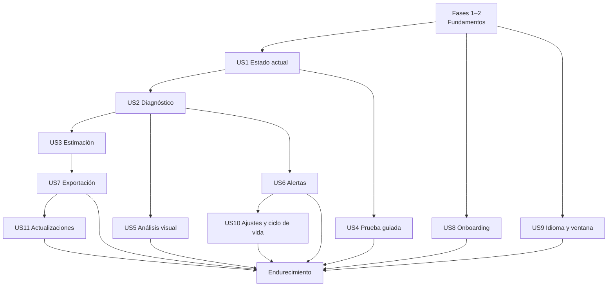

# Tareas: diagnóstico térmico de CPU

**Entrada**: `spec.md`, `plan.md`, `research.md`, `data-model.md`, `ux-visual-spec.md`, `contracts/`  
**Pruebas**: obligatorias según constitución; el motor debe desarrollarse contra trazas antes de conectarlo a hardware real.

Formato: `[ID] [P?] [Historia?] Descripción con ruta`. Las tareas de test indican entre paréntesis los FR/NFR/SC que cubren (puerta 1 de la constitución; matriz en `traceability.md`, T009a).

**Regla del sistema de diseño:** las pantallas **conectan** componentes de `design/` (copiados por T024) mediante adaptadores; no los recrean. Si una pantalla necesita una pieza que `design/` no tiene, se añade antes en `design/` con justificación, ejemplo y harness (como T118–T133), nunca en `apps/desktop/src/`.

**Lotes y checkpoints** (`historias.md` § «Estrategia integral de testing», § 7–§ 9 y § 35):

- Las tareas se agrupan en **lotes** (`L00`–`L21`), indicados al inicio de cada grupo. El orden de trabajo lo marcan las dependencias, no la numeración.
- Antes de empezar un lote se añade bajo su encabezado el **plan de pruebas del lote** (plantilla del § 8).
- Cada lote termina con su tarea **`CHK-Lxx`**, que ejecuta **solo** la suite afectada y registra orden, código de salida, errores y avisos (constitución XVI). No se abre un lote nuevo con tests obligatorios pendientes del anterior.
- Las tareas de test van **dentro** de su lote; no se alterna «implementar A / test A / implementar B / test B».
- Las tareas marcadas **TDD** exigen que el test exista y falle antes de implementar (constitución XIII).
- Identificadores nuevos: `T134`+ para trabajo derivado de la constitución 1.3–1.5; `T-TEST`, `T-UNIT`, `T-COMP`, `T-INT`, `T-PLAY`, `T-E2E`, `T-A11Y`, `T-QUAL`, `T-MUT` y `T-ACC` para la infraestructura de pruebas y la aceptación (`historias.md` § 37).

## Fase 1 — Inicialización

**Lote L00 — Infraestructura de desarrollo y pruebas.**

- [x] T001 Crear monorepo y estructura definida en `plan.md`.
- [x] T002 Inicializar Tauri 2 + Svelte + TypeScript estricto en `apps/desktop/`.
- [x] T003 [P] Crear solución .NET y proyecto `sensor-agent` en `apps/sensor-agent/`.
- [x] T004 [P] Crear los módulos Rust `commands`, `diagnostics`, `telemetry`, `ipc`, `storage`, `export`, `logging`, `ports` y `test_support` (vacíos, con `mod.rs`) en `apps/desktop/src-tauri/src/` según la estructura de `plan.md`.
- [x] T005 [P] Configurar los formateadores (Prettier con `prettier-plugin-svelte`, `rustfmt`, `dotnet format`) y la configuración base de ESLint, Clippy y analizadores .NET; las reglas obligatorias de la constitución van en T135.
- [x] T006 Configurar scripts raíz de build/test/dev y fijar gestores/versiones en archivos de bloqueo.
- [x] T007 [P] Configurar CI Windows x64 con cachés y artefactos de pruebas, sin requerir sensores reales.
- [x] T008 [P] Crear inventario de licencias y plantilla de `THIRD-PARTY-NOTICES`.
- [x] T009 Documentar decisiones ADR iniciales: sidecar, SQLite, `AnalysisChart` SVG, agregación temporal y motor por niveles de cobertura (mesetas, ventana de turbo, techo de potencia) en `docs/adr/`.
- [x] T009a Crear `specs/001-cpu-thermal-diagnostics/traceability.md` (FR/NFR/SC/escenario de aceptación → test, o «manual» con motivo) y un check de CI que falle si un requisito no tiene entrada. (= T-ACC-001)
- [x] T134 Fijar las toolchains de la constitución: `rust-toolchain.toml` (1.98.1, `rustfmt`, `clippy`), `global.json` (SDK 10.0.401, `rollForward: latestPatch`), `.nvmrc` (24.21.0), `packageManager` (pnpm 12.4.2) y `engines`; npm con `save-exact`; `RestorePackagesWithLockFile` en .NET; CI en modo bloqueado. (= T-TEST-001)
- [x] T135 [P] Configurar las reglas obligatorias de análisis estático: ESLint `strict-type-checked`, `no-console`, `consistent-type-assertions` con `assertionStyle: 'never'` y `no-restricted-imports` (`@tauri-apps/api` solo en `lib/bridge/`, `loglevel` solo en `lib/logging/`, `design/examples` y `design/harness` en ninguna parte); Clippy `print_stdout`, `print_stderr`, `dbg_macro` y `disallowed_macros` (macros de `tracing` fuera de `logging/`), y `unwrap_used`/`expect_used` denegados en los módulos de frontera `ipc`, `commands`, `export` y `storage` (permitidos solo en `#[cfg(test)]`); .NET con `Nullable`, `TreatWarningsAsErrors`, `AnalysisLevel latest-recommended` y `BannedApiAnalyzers` (`Console.Write*`, `Debug.Write*`, `Trace.Write*`, `Environment.GetEnvironmentVariable` fuera de su módulo). (Constitución XIV–XVII)
- [x] T136 Crear `pnpm check` (`svelte-check --tsconfig <tsconfig de la app> --fail-on-warnings` + `tsc --noEmit -p tsconfig.node.json`) y fijar en CI el orden de la constitución XVI: instalación bloqueada → formato y lint → `pnpm check` → pruebas → compilación → E2E. (FR/constitución XVI)
- [x] T137 [P] Crear `.env.example` y los módulos de configuración: `src/lib/config/env.ts` (Zod sobre `import.meta.env`, `envPrefix: 'PUBLIC_'`), validación en `vite.config.ts` con `loadEnv` y fallo de compilación de producción si existe `PUBLIC_LOG_LEVEL`; módulos Rust y .NET para `TW_DEV_*` solo en depuración y en la característica `e2e`. Pruebas de rechazo por variable. (Constitución XV)
- [x] T138 [P] Configurar `cargo-deny` (licencias compatibles con GPL-3.0, avisos de seguridad y duplicados), `cargo-about` y el informe equivalente de npm y NuGet; bloquear en CI. (Puerta 8)
- [x] T-COMP-001 [P] Configurar Vitest con los proyectos `unit` (node) y `component` (jsdom + Testing Library, condición `browser` para Svelte 5) y `@vitest/coverage-v8`.
- [x] T-TEST-003 [P] Configurar perfiles de `cargo-nextest`, `cargo-llvm-cov`, *traits* de xUnit (`Unit`, `Integration`, `Protocol`) y coverlet; umbrales de cobertura de la constitución XIII por pila, que informan sin bloquear hasta el cierre de CHK-L01 (excepción E1 de `plan.md`, fecha límite 2026-10-31). (= T-QUAL-001)
- [x] T-PLAY-001 [P] Configurar Playwright con los proyectos `frontend` y `app`, artefactos de fallo (screenshot, trace y vídeo solo en `app`) y etiquetas `@smoke`, `@critical`, `@a11y`, `@visual`. (Incluye T-PLAY-010)
- [ ] T-PLAY-002 Spike: conducir la WebView2 de una compilación `e2e` de Tauri por CDP desde Playwright en `windows-2025`; documentar el resultado en `docs/spikes/e2e-webview2.md` y la alternativa si falla.
- [x] T-PLAY-004 [P] Crear la *fixture* común de Playwright que falla ante `pageerror`, `console.error` y peticiones a otros orígenes no declaradas, comprueba el almacenamiento web vacío y usa una allowlist inicial vacía.
- [x] T-TEST-004 Crear y documentar en `quickstart.md` los scripts de `historias.md` § 30 (`test:*`, `verify:batch`, `verify:pr`, `design:check`, `logs:view`).
- [x] T-TEST-005 Medir la duración base de cada suite y del pipeline de PR, publicar el informe por suite en CI y fijar los presupuestos (objetivo inicial de PR: ≤ 15 min de mediana).
- [ ] CHK-L00 Checkpoint: nivel 0 de las tres pilas en CI a cero errores y avisos, un test trivial por pila y por proyecto de Vitest y Playwright en verde, check de trazabilidad activo y tiempos base medidos (T-TEST-005).
  Actualización 2026-09-19: se añadió la detección de `__TAURI_INTERNALS__` en `lib/bridge`; fuera de Tauri `invokeValidated` devuelve `TAURI_UNAVAILABLE` y `listenValidated` una baja no-op. Se añadió el nombre accesible de la aplicación en `App.svelte`. Verificado con `vitest run --config vitest.unit.config.ts src/lib/bridge/bridge.test.ts` (0, 4/4), `vite build` (0) y `playwright test --project frontend` (0, 1/1). **Sigue abierto:** T-PLAY-002, la ejecución en CI y el cierre formal del checkpoint.
  Nivel 0 (2026-09-19, local, tras corregir 18 avisos de clippy y 14 ficheros sin formato Prettier): `pnpm format` (0); `pnpm lint` (0); `pnpm check` (0, 244 ficheros, 0 errores, 0 avisos); `pnpm check:contracts` (0); `pnpm check:traceability` (0); `cargo fmt --check` (0); `cargo clippy --all-targets -- -D warnings` (0, 0 avisos); `cargo build` (0); `cargo deny check` (0); `dotnet format --verify-no-changes` (0); `dotnet build -c Debug` (0, 0 avisos, 0 errores); `pnpm build` (0). Suites: `cargo nextest run` (0, 55/55); `dotnet test .pps\sensor-agent --no-restore` (0, 33/33; antes de hoy devolvía exit 5 y 0 pruebas: faltaban `UseMicrosoftTestingPlatformRunner`/`TestingPlatformDotnetTestSupport` en el csproj, y `-nologo` se reenvía al host MTP y lo tumba); `pnpm test:unit` (0, 17/17); `pnpm test:component` (0, 1/1); `pnpm test:corpus` (0, 8 escenarios). **No cerrado:** (1) T-PLAY-002 pendiente; (2) `pnpm exec playwright test --project frontend` (1): el smoke `@smoke foundation page` falla con `Cannot read properties of undefined (reading 'transformCallback')` porque `Dashboard.svelte` (T034, L09) llama a `invoke`/`listen` al montarse y `lib/bridge` no degrada sin Tauri; regresión introducida fuera de orden de lotes; (3) «en CI» no verificado en local. Entorno: el `pnpm` global (11.6.0) delega en 12.4.2 autogestionado sin binario nativo; se usó `node <link>/pnpm.mjs`.

## Fase 2 — Fundamentos bloqueantes

**Lote L01 — Contratos y fixtures** (T010–T013, T016, T143). Fixtures válidos e inválidos **antes** de los tipos.

- [x] T143 [P] Crear el esquema `log-event` y el formato común de error `{ code, message_key, path?, context? }` en `packages/contracts/`, con fixtures válidos e inválidos. (Constitución XIV y XVII)
- [x] T010 Implementar tipos de contrato v1 compartidos a partir de `contracts/telemetry.schema.json`.
- [x] T011 [P] Crear fixtures canónicos de handshake, capabilities, sample y error en `packages/contracts/fixtures/`.
- [x] T012 [P] Crear tests C# de serialización de fixtures en `apps/sensor-agent/Tests/Protocol/`.
- [x] T013 [P] Crear tests Rust de deserialización/validación de fixtures en `apps/desktop/src-tauri/src/ipc/tests/`.
- [x] T016 [P] Crear sidecar falso/replay en `packages/trace-fixtures/tools/`.
- [x] T-UNIT-001 [P] Crear `TraceBuilder` (escenarios sintéticos por fases) y los *builders* de muestra y capacidades en `src-tauri/src/test_support/`.
- [x] CHK-L01 Checkpoint: los tres lenguajes aceptan y rechazan exactamente los mismos fixtures; umbrales de cobertura activos desde aquí.
  Registro 2026-09-19: nivel 0 en verde (véase CHK-L00). Conformidad de fixtures: Rust `cargo nextest run ipc::` (0, 12/12) solo ejercita `handshake.json` (acepta) e `invalid-sample.json` (rechaza); .NET `--filter-trait Category=Protocol` (0, 8/8) acepta `handshake`, `capabilities`, `sample` y `error` pero no rechaza ningún fixture inválido; TypeScript no consume ningún fixture de `packages/contracts/fixtures`. **No cerrado:** el criterio «los tres lenguajes aceptan y rechazan exactamente los mismos fixtures» no se cumple; faltan 4 aceptaciones y 2 rechazos por lenguaje según el caso (`invalid-error.json` no lo prueba nadie). Umbrales de cobertura: informan, no bloquean (E1).
  Cierre 2026-09-19: `prettier --check` (0), ESLint del puente (0), `svelte-check` (0 errores/avisos), TypeScript contracts (0), `cargo fmt --check` (0), `cargo clippy --all-targets -- -D warnings` (0 avisos), `cargo nextest run ipc::` (0, 11/11), `cargo build` con `RUSTFLAGS=-A linker_messages` (0), `dotnet format --verify-no-changes` (0), `dotnet build -c Debug` (0 avisos/errores), `dotnet test --filter-trait Category=Protocol` (0, 10/10) y `vitest run --config vitest.unit.config.ts` (0, 25/25). El corpus iterado por directorio contiene 4 aceptaciones y 2 rechazos (`invalid-error.json` e `invalid-sample.json`) con el mismo resultado en Rust, .NET y TypeScript. CHK-L01 cerrado.

**Lote L02 — Handshake, supervisor y registro del backend** (T014, T015, T140, T142). TDD en el rechazo por nonce, versión, secuencia y tamaño.

- [x] T014 Implementar handshake con nonce, versión y secuencia en sidecar y Rust.
- [x] T015 Implementar supervisor de sidecar con estado, timeout, EOF y backoff limitado en `src-tauri/src/ipc/supervisor.rs`; lanzamiento con `std::process::Command` desde la ruta fija de `bundle.externalBin` y verificación de hash (sin `tauri-plugin-shell`).
- [x] T140 Implementar el registro del backend (constitución XVII): macros `log_*!` con código obligatorio sobre `tracing`, fichero JSON UTC rotado 5 × 5 MB, formato humano `Europe/Madrid` con `jiff` solo en desarrollo, redacción por lista permitida, agrupación de repetidos a 60 s, escritura no bloqueante, captura de pánicos y validación de los eventos del colector recibidos por `stderr`. Pruebas de redacción, niveles y formato con los dos cambios de hora anuales.
- [x] T142 [P] Implementar la clase `Log` del colector con `[LoggerMessage]` sobre `Microsoft.Extensions.Logging`, JSON por `stderr` y captura de excepciones no controladas.
- [x] T-INT-001 Pruebas de integración del pipeline con el colector replay como proceso real: handshake, rechazos, EOF, cuelgue, reinicio con *backoff*, secuencias perdidas, valores imposibles como ausentes y PID padre ausente. (NFR-004, NFR-006, SC-010)
- [x] CHK-L02 Checkpoint: integración IPC y pruebas de registro en verde.
  Registro 2026-09-19: nivel 0 en verde (véase CHK-L00); `cargo nextest run ipc::` (0, 12/12: protocolo, supervisor, elevated). **No cerrado:** T140 (registro del backend) y T-INT-001 (integración con el colector replay como proceso real) siguen pendientes.
  Cierre 2026-09-19: `cargo fmt --all -- --check` (0), `cargo clippy --all-targets -- -D warnings` (0 avisos), `cargo test logging::` (0, 4/4), `cargo test --test ipc_replay -- --test-threads=1` (0, 3/3), `cargo nextest run` (0, 62/62), `cargo build` con `RUSTFLAGS=-A linker_messages` (0), `cargo deny check` (0; advisories/bans/licenses/sources correctos), `dotnet test apps/sensor-agent/SensorAgent.sln` (0, 35/35) y `node scripts/check-traceability.mjs` (0). El replay ejecuta un proceso real y cubre handshake, rechazo de versión, EOF, secuencia perdida, valor ausente y PID padre ausente; el registro cubre redacción, validación de `stderr`, deduplicación y formato CET/CEST. CHK-L02 cerrado.

**Lote L03 — Colector real mínimo y spikes** (T017–T021, T019c, T019d, T053).
- [x] T017 Integrar LibreHardwareMonitorLib con solo CPU habilitada en `apps/sensor-agent/Collector/`.
- [x] T018 Implementar catálogo original de hardware/sensores sin normalización de negocio.
- [ ] T019 [P] Ejecutar spike de lectura sin privilegios en matriz Intel/AMD y documentar `docs/spikes/sensor-access.md`; incluir la fiabilidad de `% Processor Performance` y `Processor Frequency` por procesador lógico frente a APERF/MPERF.
  Progreso 2026-09-19: fila del 2600X completa (sin proveedor, elevado, usuario estándar tras reinicio y usuario de integridad media con el servicio en marcha; ambos `denied`, resultado (b)); guion `docs/spikes/tools/sensor-access-matrix.ps1` y procedimiento para las cuatro filas restantes; hallazgo de contadores PDH localizados. **Pendiente:** Intel híbrido, Intel anterior, portátil OEM y AMD Zen 4 (hardware no disponible) y el contraste APERF/MPERF (el sidecar no lee `0xE7`/`0xE8`).
- [x] T019a **[Puerta de viabilidad]** Verificar con el proveedor de acceso de bajo nivel instalado si el sidecar lee `0x64F`, `0x1A2` y `0x610` y limpia los bits de registro **sin UAC recurrente**; medir qué parte de la matriz alcanza nivel A, B o C; decidir mediante ADR entre los resultados (a), (b) o (c) de `plan.md` § Fase 0. Bloquea la fase 3.
- [ ] T019b [P] Grabar el corpus etiquetado inicial (Intel híbrido, Intel anterior, portátil con DTT/DPTF, sobremesa con límites abiertos, AMD Zen 4) según `research.md` § 15, con cargas multihilo, juego de pocos núcleos, AVX2 y reposo caliente.
- [x] T020 [P] Ejecutar spike de redistribución, instalación y retirada del acceso bajo nivel en `docs/spikes/low-level-driver.md`. (2026-09-19: ciclo desinstalar/instalar/reinstalar ejecutado en el 2600X con el instalador empaquetado; la revisión legal del instalador queda como hechos enumerados y condiciona la publicación, no el desarrollo ni las pruebas locales de T153–T155)
- [ ] T019c [P] Spike de vidrio en WebView2: medir fps y CPU de composición en reposo y con `AnalysisChart` actualizándose, en el equipo de referencia y en el Ryzen 5 2600X; confirmar o corregir los umbrales `glass.*` de `spec.md`; documentar en `docs/spikes/glass-cost.md`. Bloquea T131.
  Progreso 2026-09-19: medido en el Ryzen 5 2600X con WebView2 153 (`docs/spikes/glass-bench`, dos ejecuciones): el desenfoque no tiene coste medible; el fondo `.tw-ambient` animado cuesta 30–100 % de un núcleo en reposo (anotado para `design/`); el contador rAF cuesta 4 % de un núcleo. Umbrales: `degrade_idle_cpu_pct` necesita unidad (% de máquina); fps sin cambios. **Pendiente el equipo de referencia Intel** (hardware no disponible) para cerrar la tarea y desbloquear T131.
- [x] T019d [P] Spike de permisos mínimos de Tauri: barra propia, inicio con Windows, notificaciones, diálogos y opener; lista de `capabilities/` resultante en `docs/spikes/tauri-permissions.md`. Alimenta T085, T091, T070 y T-INT-003. (2026-09-19: superficie base con permisos `core:*` mínimos, ampliada únicamente con los permisos `core:window` necesarios para la geometría de T085/T086; cero permisos de plugin; `tests/acl_surface.rs` verifica el ACL real con el runtime simulado)
- [x] T053 [P] [US4] Ejecutar spike comparando carga integrada y observación externa en `docs/spikes/guided-load.md`. Bloquea T049, T051, T054 y L14.
- [x] T021 Resolver la arquitectura de privilegios mediante ADR; bloquear empaquetado si contradice la constitución.
- [x] T-INT-005 [P] Suite xUnit `Integration` solo Windows: arrancar el colector real con LibreHardwareMonitorLib en la VM de CI sin sensores, verificar el catálogo degradado (`virtualized-no-sensors`), la ausencia de excepciones y el cierre por EOF. (2026-09-19: run 35445226220 en `windows-2025` en verde; catálogo del runner `hypervisor=True; product=Virtual Machine; cpu_vendor=intel; low_level_access=missing/PAWNIO_NOT_INSTALLED; catalog[6]: load=6`; el run previo 35445014451 detectó en un runner AMD la `NullReferenceException` de `Amd17Cpu.Update()`, corregida en el colector; el run 35456668461, en un runner **AMD** virtualizado, reveló además que LibreHardwareMonitorLib devuelve en una VM lecturas con estado `ok` que no son mediciones —temperatura 0 °C, potencia 0 W y tensión constante de 1,55 V—: el colector ahora oculta temperatura, potencia y tensión en huéspedes virtualizados (`HostVirtualization`: bit de hipervisor de CPUID y nombre de producto SMBIOS; el bit solo no basta porque un Windows con VBS también lo activa) con pruebas unitarias y mutación comprobada; los relojes LHM en una VM no se han caracterizado y quedan pendientes de T028)
- [x] CHK-L03 Checkpoint: catálogo con hardware falso y arranque real en VM en verde; spikes documentados. **Cerrado el 2026-09-19 con la excepción E2 de `plan.md`** (T019, T019b y la mitad Intel de T019c diferidas a hardware; fecha límite 2026-11-30).
  Cierre 2026-09-19: revisor de constitución ejecutado (1 crítico, 2 altos, resueltos en el mismo cambio): test de regresión determinista `HardwareCollectorUpdateFailureTests` (falla 2/2 sin `TryUpdate`, pasa con él) mediante la costura `IHardwareSource`; niveles de registro mapeados al enum del contrato `log-event` (`warn`, `info`, Critical → `error`) con `JsonStderrLoggerTests`; `err.code` = código del evento; E2 reescrita (puerta 4, T037 sintética, condición de T154); aclaración A2 para `build.rs` y `docs/spikes/**`. `dotnet test apps/sensor-agent/SensorAgent.sln --no-restore` (0, 46/46); `dotnet format --verify-no-changes` (0). Pendientes de incidencia aparte (fuera del lote): `rusqlite` 0.34 frente a 0.40, `LogEvent` sin `deny_unknown_fields` en Rust.
  Registro 2026-09-19: nivel 0 en verde (véase CHK-L00); `dotnet test` (0, 33/33) incluye `HardwareCollectorTests`; spike `docs/spikes/sensor-access.md` con tres ejecuciones (T152 hecha: resultado (b)). **No cerrado:** pendientes T019, T019b, T020, T019c, T019d y T-INT-005; «arranque real en VM» no verificable en local.
  Registro adicional 2026-09-19: T019a cerrada con el spike y ADR-0004 aceptado con condiciones C1–C6; L03 continúa abierto por los demás spikes y la prueba de VM.
  Progreso 2026-09-19: se añadió `apps/sensor-agent/Tests/Integration/SensorAgentProcessTests.cs`; `dotnet test apps/sensor-agent/SensorAgent.sln --no-restore` (0, 36/36), `--filter-trait Category=Integration` (0, 3/3) y `dotnet format --verify-no-changes --no-restore` (0). La prueba arranca el sidecar real, valida `hello_ack` y cierre por EOF; T-INT-005 sigue pendiente de ejecución en VM `virtualized-no-sensors` y de verificar allí el catálogo degradado.

  Registro 2026-09-19 (tarde): T-INT-005, T019d y T020 cerradas; T019c medida en el 2600X y T019 con la fila del 2600X y el guion de matriz. Verificación: `dotnet test apps/sensor-agent/SensorAgent.sln --no-restore` (0, 37/37); `dotnet format --verify-no-changes` (0); `cargo nextest run --profile ci` (0, 65/65, incluye `acl_surface` 3/3); `cargo clippy --all-targets -- -D warnings` (0); `cargo fmt --check` (0); `cargo deny check` (ok); `pnpm format/lint/check/design:check/design:check:sources/check:contracts/test/build/check:traceability` (0 en local); CI `windows-2025` run 35445226220 **success** (primer run verde del flujo; se corrigieron lockfile, `design:check` duplicado, restore de la solución y flags del runner). **No cerrado:** T019 (cuatro filas de la matriz sin hardware; contraste APERF/MPERF), T019b (sin equipos y sin grabador de trazas) y T019c (equipo de referencia Intel). Hallazgos anotados fuera de alcance: fondo `.tw-ambient` animado (30–100 % de un núcleo), contadores PDH localizados, IDs duplicados en el catálogo LHM (`Core #N` como Clock y Factor), sin `src/main.rs` ni CLI de Tauri, y una corrección propia: la lectura «como usuario estándar con el servicio en marcha» anotada antes salió de una sesión elevada; con integridad media da `denied` y ADR-0004 sigue vigente sin enmienda (`sensor-access.md`, «CORRECCIÓN»).
**Lote L04 — Persistencia, reloj y sesiones** (T022, T023, T047a, T-TEST-002). TDD en la migración v1 y en la partición de sesiones.

- [x] T-TEST-002 Crear los puertos sustituibles de Rust (reloj, IDs, nonce, almacenamiento, diálogos, ventana, bandeja, notificaciones, autostart, HTTP y energía/idioma/tema de Windows) y sus fakes en `test_support` (incluye T-UNIT-002).
- [x] T022 Crear SQLite, migración v1 y repositorios base en `src-tauri/src/storage/`; `PRAGMA foreign_keys = ON` en cada conexión y test de integridad referencial (borrar una sesión elimina sus frames, valores, eventos e informe).
- [x] T023 [P] Implementar reloj monotónico, detección de huecos y modelo de calidad de muestra.
- [x] T047a Implementar límites de sesión pasiva (FR-067): apertura, partición por hueco > 60 s / 24 h, congelación del informe y diagnóstico en vivo provisional. (Movida desde la fase 5: el hito de esta fase y el corte vertical necesitan sesiones.)
- [x] CHK-L04 Checkpoint: almacenamiento con SQLite temporal, migración v1, huecos, calidad y partición de sesiones con reloj falso en verde.
  Registro 2026-09-18: `cargo fmt --all -- --check` (0, 0 errores, 0 avisos); `cargo clippy --locked -- -D warnings` (0, 0, 0); `cargo check --locked` (0, 0, 0); `RUSTFLAGS='-A linker_messages' cargo nextest run --profile ci` (0, 17 pruebas, 0 fallos); `cargo llvm-cov --no-report --locked` (0, 17 pruebas, 0 fallos).

**Lote L05 — Shell, puente, catálogos y diseño** (T024–T026, T139, T141, T-COMP-002, T-COMP-003, T-PLAY-005).

- [x] T-PLAY-005 [P] Crear los perfiles de E2E para ambos proyectos (`fresh-install`, `onboarding-midway`, `ready`, `tray-enabled`, `with-history`, `updates-on`): escenarios de mock para `frontend` y directorios de datos sembrados para `app`, con aislamiento por directorio temporal y proceso.

- [x] T139 Implementar el módulo puente `src/lib/bridge/`: único importador de `@tauri-apps/api`, esquemas Zod por comando y evento con tipos inferidos, resultado discriminado y errores estructurados; prueba de conformidad contra los fixtures de `packages/contracts/` (mismos válidos e inválidos que el JSON Schema). (Constitución IX y XIV)
- [x] T141 [P] Implementar `src/lib/logging/` (`createLogger` sobre `loglevel`) y el comando `log_frontend` con validación, límite de 60 eventos por minuto y niveles según `Registro detallado`. (Constitución XVII)
- [x] T-COMP-002 [P] Crear `FakeBridge` validado con Zod, escenarios de mock y *builders* de interfaz (`liveSnapshot`, `coverage`, `report`, `session`, `preferences`) en `src/test-support/`.
- [x] T-COMP-003 [P] Crear utilidades de consulta por catálogo (`t('key')`) para Testing Library y Playwright.
- [x] T024 [P] Crear `scripts/design-sync` que copie `design/{components,icons,illustrations,lib,tokens,brand}` a `apps/desktop/src/design-system/` y un test de CI que falle si la copia difiere; prohibir por lint la importación de `design/examples/` y `design/harness/`. Integrar `tokens.css` desde la copia para claro/oscuro, modo sistema y movimiento reducido.
- [x] T025 Crear shell de navegación y estados globales de colector en `apps/desktop/src/`.
- [x] T026 Configurar catálogos completos español/inglés, resolución especial de locales y verificador de igualdad/sin literales.
- [x] CHK-L05 Checkpoint: igualdad de la copia de diseño, catálogos, conformidad del puente, registro de la interfaz y navegación del shell (componentes) en verde.
  Registro 2026-09-19: nivel 0 en verde (véase CHK-L00); `pnpm design:sync`/igualdad de copia no ejecutado por separado. **No cerrado:** pendientes T-PLAY-005, T139, T-COMP-002, T025 y T026; L09 (T030–T035) se marcó terminado antes que este lote, contra el «Orden de lotes».
  Cierre 2026-09-19: `node scripts/design-sync.mjs --check` (0); `node scripts/check-catalogs.mjs` (0, 61 claves, 0 diferencias); `node scripts/check-traceability.mjs` (0); Prettier (0) y ESLint (0); `svelte-check --fail-on-warnings` (0, 0 errores/0 avisos); TypeScript (0); Vitest unitario (0, 39/39), componentes (0, 1/1); Vite build (0); Playwright `frontend` + `app` (0, 2/2). Revisión manual frente a la constitución: sin imports de `design/examples`, sin permisos de plugin, puente con resultado discriminado y FakeBridge validado en frontera. CHK-L05 cerrado.

**Hito:** handshake, catálogo y muestras sintéticas atraviesan sidecar → Rust → UI → SQLite.

## Fase 2b — Ampliación del sistema de diseño (decisiones de 2026-09-18)

Estas tareas modifican `design/` **antes** de la primera sincronización (T024) y deben pasar `npm run check` y `npm run build` del harness. Ninguna añade copy incrustado ni dependencias. **Completadas el 2026-09-18** (batch 12 del sistema de diseño; harness y mockup compilan sin errores ni avisos; verificación visual en `examples/ShellPieces.example.svelte` y `design/mockup`).

- [x] T118 [P] `SettingsScreen`: sustituir `minimizeToTrayOnClose` por `closeAction: 'unset' | 'exit' | 'tray'` con `SegmentedControl` y texto «sin decidir»; eliminar `anonymizedDiagnostics` y el canal de actualizaciones; retención fija a 4 opciones; añadir movimiento (`appearance.motion`), `onBattery`, bloques `advanced` plegados por sección (intervalo, detalle por núcleo, periodo de silencio, nivel de registro), espacio usado, `Exportar…`, `Probar notificación`, `Repetir introducción`, enlaces de Acerca de (`Documentación`, `Documentación en línea`, `Licencias`, `Resumen técnico`, `Abrir carpeta de registros`); sección Diagnóstico con duración, exigir CA, avisar al terminar y límites en solo lectura.
- [x] T119 [P] `SettingsScreen.updates`: estados `idle|checking|upToDate|available|downloading|verified|installing|error`; botones `Descargar` (solo `available`) e `Instalar` (solo `verified`, con `installDisabledReason`); descripción de comprobación «cada 24 h».
- [x] T120 [P] Sustituir `advancedAccessAvailable: boolean` por `advancedAccess: 'not_needed'|'available'|'installable'|'denied'|'error'` en `OnboardingFlow` (slide 5) y `SettingsScreen.sensors`; solo `installable` muestra el botón de instalar/reparar.
- [x] T121 [P] Crear `CoverageMatrix` (magnitud × disponible/calidad/origen/motivo, pie con confianza máxima y estado de acceso, acciones Volver a comprobar / Copiar resumen técnico) y su ejemplo.
- [x] T122 [P] Crear `ContextStrip` (CPU + topología, alimentación/plan, estado del colector con frescura, Ver cobertura) con estados fresco/obsoleto/desconectado y su ejemplo.
- [x] T123 [P] Crear `ExportDialog` (alcance, formato, anonimizar, campos incluidos/excluidos, tamaño y nombre propuestos) e `ImportResultDialog` (validación, migración, avisos) y sus ejemplos.
- [x] T124 [P] Crear `FirstCloseDialog` (dos opciones, texto de bandeja «y seguir midiendo», enlace a Ajustes) y `CloseBlockedDialog` (prueba/exportación/descarga/instalación).
- [x] T125 [P] Crear `WhatsNewCards` (pila de tarjetas con «Entendido» y acción opcional) y `TechnicalSummary` (texto monoespaciado + Copiar) y `LicensesScreen` (lista desplegable de avisos de terceros).
- [x] T126 [P] `GuidedDiagnosticScreen`: añadir fase `rest` (omitible) al stepper (6 pasos), bloque estructurado `whatWillHappen[]` en la intro, tiempo restante por fase, `batteryState='blocked'` explicado, acción «Usar como referencia» en resultado.
- [x] T127 [P] Shell: `BottomBar` con ítem `Más` y menú (Sesiones, Diagnóstico guiado, Ajustes); `Banner` global fijo bajo `TitleBar` para prueba en curso (con Detener) y para estado del colector degradado (Reintentar / Ver resumen técnico); documentar en `AGENTS.md`.
- [x] T128 [P] `SessionCard`/`SessionsScreen`: marca «Referencia», acciones Usar/Retirar referencia, botón `Importar…` en cabecera, `statusLabel` obligatorio para `incomplete`. `ReportScreen`: acciones Exportar / Usar como referencia / Re-evaluar con reglas actuales y aviso «Provisional · sesión en curso».
- [x] T129 Actualizar `design/README.md`, `AGENTS.md` y `design-system.json` con los componentes nuevos y las props cambiadas; actualizar `design/mockup` a los contratos nuevos; ejecutar harness `check` y `build`.
- [x] T130 [P] Material de vidrio y catálogo de animaciones en `design/` (tokens `--glass-*`/`--motion-*`, niveles `data-glass`, fondo `tw-ambient`, utilidades `tw-enter`/`tw-pop`, animaciones por componente) según `ux-visual-spec.md` § «Material de vidrio» y § «Animación»; harness y mockup con conmutadores de vidrio y movimiento. (2026-09-18)
- [ ] T131 [US9] Implementar la preferencia `appearance.glass` (`system|full|reduced|off`): lectura de `UISettings.AdvancedEffectsEnabled`, escucha en caliente, aplicación de `data-glass` y degradación automática por rendimiento con histéresis según `glass.*` de `ruleset-v1` (sin literales; tras T019c); test de que `off` y sin `backdrop-filter` mantienen contraste AA.
- [ ] T144 [P] `SettingsScreen` (sección Acerca de › Avanzado): sustituir `logLevel`/`logLevelOptions`/`onLogLevelChange` (y sus etiquetas) por el interruptor `detailedLogging` con `detailedLoggingUntilLabel` y `onDetailedLoggingChange` (FR-086); actualizar ejemplo, `AGENTS.md`, `design-system.json` y mockup; harness `check` y `build`. Precede a T024.
- [ ] T150 [P] Alinear `design/harness/package.json` y `design/mockup/package.json` con la constitución: versiones exactas (sin `^` ni `~`) e iguales a la aplicación en `svelte`, `vite`, `typescript` (6.0.3), `@sveltejs/vite-plugin-svelte`, `svelte-check`, `@tsconfig/svelte` y `@types/node`; añadir `--fail-on-warnings` al script `check` de ambos; regenerar sus `package-lock.json`; ejecutar `check` y `build`. Añadir a CI una comprobación de que estas versiones coinciden con las de `apps/desktop`. (Política de versiones; constitución XVI)
- [ ] T-COMP-004 [P] Añadir Vitest y Testing Library como dependencias de desarrollo del harness de `design/` (mismas versiones que la aplicación) y probar los componentes con comportamiento: foco y `Esc` de `Dialog`, teclado de `SegmentedControl`, cursor y rango por teclado de `AnalysisChart`, orden de `CpuAdvancedTable` y máquina de estados de `OnboardingFlow`.

## Fase 2c — Revisión del motor en el sistema de diseño (2026-09-18)

- [x] T132 [P] Añadir la clasificación `platform_limited` a `lib/classification.ts` y un icono propio en `StatusIcon`; documentar en `AGENTS.md`.
- [x] T133 [P] Actualizar ejemplos y mockup: hero con gravedad y «Enfriar mejor» en lugar de «Rendimiento disponible», informe con potencial por techo de potencia y rendimiento guiado medido, cobertura con nivel A/B/C, prueba guiada con frecuencia frente a base y rendimiento en vivo; regenerar capturas del README.

## Fase 3 — Historia 1: estado térmico actual (P1)

**Lote L08 — Normalización** (T027–T029, T028a–e). TDD en la selección de temperatura representativa, P/E/LP y nivel A/B/C.

- [x] T027 [P] [US1] Crear pruebas del normalizador para Intel homogéneo/híbrido, AMD y legado.
- [x] T028 [P] [US1] Implementar las reglas de selección de temperatura representativa (`package`/`Tdie` → máx. núcleos → `Tctl` con offset → `Tctl` sin offset) y margen en `sensor-agent/Normalization/`, según `spec.md` § Parámetros iniciales.
- [x] T028a [P] [US1] Implementar en el sidecar la clasificación de grupos P/E/LP mediante `GetLogicalProcessorInformationEx` y CPUID (hoja 0x1A) con fallback `unknown`.
- [x] T028b [P] [US1] Implementar en el sidecar (nivel A, Intel) la lectura de `MSR_CORE_PERF_LIMIT_REASONS` como descriptores separados `thermal_flag`, `prochot_flag`, `power_flag` y `current_flag` usando los bits de registro con limpieza tras cada lectura (lista cerrada de bits, constitución VIII); `MSR_TEMPERATURE_TARGET` (TjMax, TCC offset, límite efectivo) y `MSR_PKG_POWER_LIMIT` (PL1, PL2, Tau; límite efectivo si hay MMIO). Sin acceso, no emitir descriptores.
- [x] T028b2 [P] [US1] Implementar en el sidecar (AMD) la lectura de THM/PPT/TDC/EDC desde la tabla PM del SMU solo para versiones de la lista permitida, y la tabla versionada `thermal-limits-v1` por familia.
- [x] T028c [P] [US1] Implementar en Rust `active_clock` y `base_clock` por procesador lógico con los contadores PDH `% Processor Performance` y `Processor Frequency` como descriptores `host`/`derived`, con test contra trazas `derived-clock-only`.
- [x] T028e [P] [US1] Implementar el cálculo del nivel de cobertura (A/B/C) y su techo de confianza, expuesto en `get_coverage` y en el snapshot.
- [x] T028d [P] [US1] Implementar en Rust la lectura del contexto energético (`GetSystemPowerStatus`, `PowerGetActiveScheme`, `WM_POWERBROADCAST`) y su persistencia por frame; detectar reanudación y aplicar FR-065.
- [x] T029 [US1] Implementar normalización de temperatura, carga, reloj, potencia y flags conservando metadatos originales.
- [ ] CHK-L08 Checkpoint: normalizador C# y Rust con fixtures Intel, AMD, legado, híbrido y degradados en verde.

**Lote L09 — Ahora y cobertura** (T030–T035, T-E2E-01, T-E2E-03).

- [x] T030 [US1] Implementar agregación de snapshot y frescura en `src-tauri/src/telemetry/`.
- [x] T031 [P] [US1] Conectar `StatusHero` del sistema de diseño (copia en `src/design-system/`) mediante un adaptador en `src/features/dashboard/`.
- [x] T032 [P] [US1] Conectar `StatWidget` para temperatura (con límite efectivo), carga y núcleos activos, frecuencia activa frente a base, y potencia frente a su límite, con mini-tendencias.
- [x] T033 [P] [US1] Conectar `CoverageMatrix` y `ContextStrip` a `get_coverage`, `telemetry:snapshot`, `collector:state` y `power:context`; calcular «confianza máxima alcanzable» y el enum de acceso avanzado en Rust.
- [x] T034 [US1] Conectar snapshots reales/replay a la pantalla `Ahora` sin lógica de sensor en UI.
- [x] T035 [US1] Añadir pruebas UI para niveles A/B/C, parcial, obsoleto, desconectado y CPU híbrida.
- [ ] T-E2E-01 [US1] E2E-01 smoke (`@smoke`, proyecto `app`, traza `intel-normal`): arranque, ventana no vacía, `Ahora` con conclusión, colector `running`, navegación `Ctrl+1…6`, sin errores de página, consola o red; medir el tiempo desde el arranque hasta la conclusión visible en `Ahora` y fallar si supera 5 s (NFR-010). (= T-PLAY-003)
- [ ] T-E2E-03 [US1] E2E-03 colector desconectado (`app`, traza `collector-disconnect`): banner global, «Datos insuficientes», reintento y resumen técnico. (SC-010)
- [ ] CHK-L09 Checkpoint: componentes de `Ahora`, `ContextStrip` y `CoverageMatrix` en ambos idiomas + E2E-01 y E2E-03 en verde.

**Prueba independiente:** abrir modo replay y comprender el estado; los ausentes dicen “No disponible”.

## Fase 4 — Historia 2: detectar y explicar limitaciones (P1)

**Lote L10 — Ventanas y mesetas** (T036, T037a, T037b, T038–T040a). **TDD.** · **Lote L11 — Clasificador y eventos** (T037c, T041, T042). **TDD.** · **Lote L12 — Narrativa, interfaz y corpus** (T037, T043–T045, T054).

- [x] T036 [P] [US2] Definir `ruleset-v1.json` con **todos** los parámetros de `spec.md` § «Parámetros iniciales» y sus identificadores (`thermal.*`, `load.*`, `window.*`, `turbo.*`, `plateau.*`, `rules.*`, `severity.*`, `session.*`, `confidence.*`, `potential.*`, `guided.*`, `alerts.*`, `sampling.*`, `glass.*`, `storage.*`, `logging.*`, `collector.*`), la tabla ordenada de clasificación, la prioridad de temperatura representativa y los códigos explicables; cargador Rust tipado y validado (constitución XIV); test que verifique que el fichero coincide con la spec y test de que ningún módulo de `diagnostics/`, `telemetry/`, la prueba guiada ni las alertas contiene literales numéricos de decisión (lint con lista de excepciones justificadas).
- [x] T037 [P] [US2] Etiquetar el corpus (T019b) con los bits de razón como verdad de referencia y generar sus copias degradadas a niveles B y C; incluir los casos obligatorios de `research.md` § 15 (fin de turbo, equipo que empieza caliente, degradación lenta, DPTF, PROCHOT externo, Zen 4 por diseño, juego de pocos núcleos, EcoQoS).
  Nota 2026-09-19 (revisión de cierre de L03): T037 se cerró sobre etiquetas **sintéticas** (`packages/trace-fixtures/corpus/labels-v1.json`), no sobre el corpus real de T019b, que sigue pendiente. Mientras T019b no exista, SC-003–SC-005 y SC-016–SC-018 no pueden declararse cumplidos (excepción E2 de `plan.md`).
- [x] T037a [P] [US2] Tests de `windows.rs`: núcleos activos (umbral 80 %), inicio de carga (< 30 % → sostenida), ventana de turbo `max(Tau, 60 s)`, `turbo_end` (≥ 15 % en ≤ 5 s) y ventana deslizante 60/10 s. Deben fallar antes de T038. (FR-077, FR-081)
- [x] T037b [P] [US2] Tests de `thermal.rs`, `power.rs` y `platform.rs`: ocupación de razones (incluida la equivalencia AMD de FR-069), mesetas, bajada progresiva del límite frente a escalón único (reglas 7 y 7b). Deben fallar antes de T039–T040a. (FR-069, FR-078, FR-079, FR-084)
- [x] T037c [P] [US2] Tests del clasificador: un caso positivo y otro negativo por fila, precedencia entre filas contiguas, ausencia de `mixed_limit` en niveles B/C, gravedad (97 %, 30 s), techos de confianza por nivel, clasificación de sesión por tiempo acumulado con intervalo analizado, y determinismo (misma traza → mismo resultado). Deben fallar antes de T041. (FR-009, FR-010, FR-070, FR-080, NFR-009)
- [x] T038 [US2] Implementar en `diagnostics/windows.rs` los núcleos activos, la detección de inicio de carga y ventana de turbo (`max(Tau, 60 s)`), el evento `turbo_end` y la ventana estable deslizante.
- [x] T039 [US2] Implementar en `diagnostics/thermal.rs` la ocupación de `THERMAL` (nivel A) y la meseta térmica contra el límite efectivo (niveles B/C).
- [x] T040 [P] [US2] Implementar en `diagnostics/power.rs` la ocupación de razones de potencia y corriente, la meseta de potencia y la tendencia del límite de potencia o del nivel de meseta a lo largo de la sesión.
- [x] T040a [P] [US2] Implementar en `diagnostics/platform.rs` `platform_limited` con subtipos `chassis_thermal` y `external_prochot`, y sus recomendaciones.
- [x] T041 [US2] Implementar el clasificador como función pura que recorre la tabla ordenada, la gravedad `boost`/`below_base` frente a la frecuencia base, la confianza con techo por nivel y las causas alternativas (incluidas EcoQoS/EPP/plan).
- [x] T042 [US2] Implementar segmentación y fusión de `limit_event` persistentes, incluidos `platform` y los marcadores informativos `turbo_end` y `oem_mode_change`, y la clasificación de sesión por tiempo acumulado (`class_durations_json`, intervalo analizado).
- [x] T043 [P] [US2] Crear el adaptador diagnóstico → props de `StatusHero` (`evidenceLine`), `ReportScreen` (`evidence`, `alternativeCauses`) y `AnalysisScreen` (`AnalysisEvidence`), con nivel de cobertura, gravedad e intervalo analizado.
- [x] T044 [US2] Generar la narrativa causal y conectarla a `CausalRail` solo cuando la secuencia esté sustentada; el fin del turbo nunca es un eslabón.
- [x] T045 [US2] Ejecutar la regresión del corpus y fijar en CI SC-003, SC-004, SC-005, SC-016 (con la tabla de equivalencias A → B de la spec), SC-017 y SC-018; calibrar los pesos de la confianza y versionarlos con el ruleset. (= T-ACC-002)
- [x] T054 [US4] Aprobar mediante ADR el modo seguro de carga guiada a partir de T053; si no se aprueba la carga integrada, implementar guía para carga externa reproducible con la degradación de FR-083 (sin cifra de rendimiento; US3-4/5 y antes/después diferidas). Condiciona T049, T051 y L14.
- [ ] T145 [P] [US2] Pruebas de propiedades (`proptest`) del motor: determinismo (NFR-009), niveles B/C sin `mixed_limit` y techos de confianza por nivel; casos mínimos en `proptest-regressions/`.
- [ ] CHK-L10 Checkpoint (tras T040a): unitarias de `windows.rs`, `thermal.rs`, `power.rs` y `platform.rs` en verde.
- [ ] CHK-L11 Checkpoint (tras T042): clasificador, eventos y propiedades en verde.
- [ ] CHK-L12 Checkpoint: corpus etiquetado y degradado con todos los SC en su umbral; adaptador de evidencias (componentes) en verde.

**Prueba independiente:** reproducir cada traza (y sus copias degradadas) y obtener clasificación, gravedad, confianza y evidencias esperadas.

## Fase 5 — Historia 3: potencial con mejor refrigeración (P1)

**Lote L13 — Potencial** (T046–T052, T-MUT-001, T-MUT-002). **TDD** en fórmula, cotas y redondeo.

- [x] T046 [P] [US3] Crear tests del método de techo de potencia: fórmula, acotación por la frecuencia de turbo, rango `[0,5·g, 1,0·g]`, redondeo hacia fuera a múltiplos de 5 %, tramos, ausencia de cifra sin PL1 y tramo cualitativo solo con `below_base`.
- [x] T047 [US3] Implementar `diagnostics/potential.rs`: cifra por techo de potencia solo en nivel A, fuera de la ventana de turbo y para clases térmicas, mixta o chasis; en niveles B/C (sin PL1) solo el tramo cualitativo «probablemente notable» con `below_base` y confianza baja, sin cifra; `power_limited` sin cifra; valores leídos de `ruleset-v1`, sin literales.
- [x] T048 [US3] Implementar agrupación P/E/LP sobre núcleos activos para frecuencia, gravedad y potencial.
- [x] T049 [US3] Implementar `guided_result` y la comparabilidad «antes/después» (misma CPU, perfil, contexto energético y versión del generador); `set_session_reference` solo para sesiones guiadas. Condicionada al ADR de T054: si aprueba solo observación externa, se implementa la degradación de FR-083.
- [x] T050 [US3] Aplicar restricciones: no serializar ninguna cifra sin método `power_headroom` con entradas o sin `guided_result`.
- [x] T051 [P] [US3] Conectar el bloque de potencial y de rendimiento guiado de `ReportScreen` y `StatusHero.performance` (tramo, rango, método y entradas; sostenido/inicial con desglose por causa). Condicionada al ADR de T054 (FR-083).
- [x] T052 [US3] Añadir pruebas negativas: turbo máximo como referencia, fin de turbo tratado como pérdida, núcleos inactivos en la media, decimales y rangos menores de 5 puntos.
- [x] T146 [P] [US3] Propiedades del potencial: el rango redondeado hacia fuera contiene el rango sin redondear, es múltiplo de 5 y no tiene decimales. (Matriz determinista de entradas válidas añadida en `diagnostics/potential.rs`; `cargo nextest run --locked --profile ci diagnostics::potential` (0, 5/5), `cargo fmt --all -- --check` (0) y `cargo clippy --locked --all-targets -- -D warnings` (0), 2026-09-19.)
- [x] T-MUT-001 Piloto de `cargo-mutants` sobre `diagnostics/potential.rs` y `diagnostics/classifier.rs`: registrar mutantes, eliminados, supervivientes, sin cobertura, *timeouts* y tiempo total. Ver `docs/spikes/mutation-l13-2026-09-19.md`: `cargo-mutants` 27.1.0, 124 mutantes, 59 capturados, 60 supervivientes, 5 no viables, 0 *timeouts*, 0 errores; cuatro shards in-place, 56 min 30 s acumulados, 2026-09-19.
  Progreso 2026-09-19: la ejecución completa sustituye el piloto detenido anterior y deja sus cuatro `outcomes.json` como evidencia reproducible.
- [x] T-MUT-002 Línea base de mutation score y revisión de supervivientes (cobertura, aserción, caso límite, equivalente, código muerto); proponer el registro de `cargo-mutants` en la constitución. Revisados los 60 supervivientes: 42 de `classifier.rs` y 18 de `potential.rs`, todos cobertura/aserción/caso límite; ninguno equivalente ni código muerto. Informe y propuesta de registro en `docs/spikes/mutation-l13-2026-09-19.md`; la constitución no se modifica sin una enmienda autorizada.
- [x] CHK-L13 Checkpoint: unitarias, propiedades y negativas del potencial + aceptación de nivel A frente a degradado en verde; informe del piloto de mutation. Verificación 2026-09-19: `cargo fmt --all -- --check` (0), `cargo clippy --locked --all-targets -- -D warnings` (0), `cargo nextest run --locked --profile ci --no-tests=pass diagnostics::` (0, 26/26), `node scripts/check-traceability.mjs` (0), `git diff --check` (0), mutation 124/124 revisados.

**Prueba independiente:** una traza de nivel A limitada térmicamente muestra el tramo y el rango con su método; la misma degradada a B no muestra cifra y explica por qué; una sesión guiada muestra el rendimiento medido desglosado.

## Fase 6 — Historia 4: diagnóstico guiado (P2)

**Lote L14 — Estados y paradas** (T055, T056, T057, T059). **TDD** en las paradas de FR-085 y la cancelación. · **Lote L15 — Generador e interfaz** (T056a, T058, T-E2E-04). En CI **nunca** se aplica carga real: se usa el generador falso de la compilación `e2e`.

- [ ] T055 [P] [US4] Modelar máquina de estados y persistencia parcial de sesión guiada.
- [ ] T056 [US4] Implementar preflight de sensores, alimentación (`guided.require_ac`), perfil, espacio en disco y generador; fases según `spec.md` (comprobación, reposo omitible, calentamiento, carga sostenida de 180/240/360 s, recuperación); **paradas de FR-085** (nunca por alcanzar el límite térmico); cancelación al ocultar ventana o suspender; atajo `Ctrl+Shift+X`; `guided.notify_on_finish`; duraciones y umbrales de parada leídos de `ruleset-v1`, sin literales.
- [ ] T056a [US4] Implementar el generador de carga con bucle fijo y versionado que cuenta operaciones por hilo y segundo, perfil sin AVX-512 y perfil AVX2 documentado; publicar `throughput_ops_s` en cada muestra.
- [ ] T057 [US4] Implementar controlador de fases, cancelación y watchdog fuera de workers.
- [ ] T058 [P] [US4] Conectar `GuidedDiagnosticScreen` a `guided:phase`: consentimiento, progreso, temperatura/límite efectivo, frecuencia activa frente a base, rendimiento medido en vivo y `Detener ahora`.
- [ ] T059 [US4] Probar cancelación, sensor perdido, proceso padre ausente, batería, temperatura por encima del límite + 2 °C, frecuencia < 50 % de la base en el límite, que alcanzar el límite térmico **no** detiene la prueba, y aserción de que el generador no invoca ninguna API de escritura de hardware (FR-018).
- [ ] CHK-L14 Checkpoint: máquina de estados, paradas, watchdog, suspensión y ventana oculta en verde (unitarias + integración con generador falso).
- [ ] T-E2E-04 [US4] E2E-04 prueba guiada (`app`, generador falso, `guided-standard-intel`): lista previa, fases, `Detener ahora` visible en otra pantalla, `Ctrl+Shift+X`, `Esc` no detiene, cancelación → incompleta, y cerrar la ventana durante la prueba pregunta «Detener y salir»; a 1100×760 y 480×600.
- [ ] CHK-L15 Checkpoint: rendimiento medido con generador falso, componentes de `GuidedDiagnosticScreen` y E2E-04 en verde.

**Prueba independiente:** completar o cancelar una sesión sin dejar carga activa; obtener informe o motivo explícito.

## Fase 7 — Historia 5: análisis visual (P2)

**Lote L16 — Análisis** (T060–T066, T-E2E-05). TDD en la agregación (extremos, huecos, bordes de eventos).

- [ ] T060 [P] [US5] Integrar el benchmark reproducible de `AnalysisChart` y validarlo en hardware objetivo con 4 pistas, 3.000 puntos por pista y eventos superpuestos.
- [ ] T061 [US5] Implementar consulta/agregación por resolución temporal en Rust conservando extremos, huecos, calidad y fronteras de eventos; objetivo 2.000–3.000 puntos por pista y 10.000–12.000 totales.
- [ ] T062 [P] [US5] Integrar el `AnalysisChart` SVG del sistema de diseño con cuatro pistas, huecos reales, cursor común y recarga de mayor resolución al hacer zoom.
- [ ] T063 [P] [US5] Mapear `limit_event` → `AnalysisChart.events` según `data-model.md` (bandas térmicas, eléctricas, del equipo y mixtas con patrones accesibles; `turbo_end` y `oem_mode_change` como marcadores informativos).
- [ ] T064 [P] [US5] Conectar `CpuTopologyMap` y `CpuAdvancedTable` por núcleo/grupo, con alternancia temperatura/reloj sin perder la selección (FR-064); si hace falta virtualizar la tabla, se añade antes en `design/`.
- [ ] T065 [US5] Conectar selección temporal con panel de evidencia y exportación de rango.
- [ ] T066 [US5] Añadir pruebas visuales, rendimiento y accesibilidad para zoom, cursor/rango por teclado, tabla textual, huecos, calidad reducida y densidad alta.
- [ ] T-E2E-05 [US5] E2E-05 análisis (`frontend`, perfil `with-history`): cursor y rango por teclado, tabla alternativa, huecos como ausencia y eventos; captura visual.
- [ ] CHK-L16 Checkpoint: agregación con propiedades, componentes y E2E-05 en verde; benchmark de `AnalysisChart` registrado.

**Prueba independiente:** inspeccionar una sesión y rastrear una conclusión hasta valores sincronizados.

## Fase 8 — Historia 6: bandeja y alertas (P2)

**Lote L17 — Bandeja y alertas** (T067–T072). TDD en las reglas de alerta; bandeja y notificaciones mediante puertos (lo nativo, en la lista manual de release).

- [ ] T067 [P] [US6] Implementar lifecycle de ventana/bandeja y preferencia de monitorización, incluido que elegir bandeja en la primera X active `tray.monitoring_enabled`, la corrección atómica de FR-061 y la instancia única.
- [ ] T067a [P] [US6] Implementar menú de bandeja (Estado, Abrir, Pausar/Reanudar, Salir), clic para mostrar/ocultar y `set_tray_paused`.
- [ ] T068 [P] [US6] Diseñar en `design/brand/` los iconos de bandeja para normal, aviso, crítico, desconocido y desconectado (con fuente, variantes claro/oscuro y tamaños de Windows), y sincronizarlos con T024.
- [ ] T069 [US6] Implementar los cinco tipos de alerta (`thermal_confirmed`, `power_limited`, `platform_limited`, `collector_lost`, `guided_finished`); las de limitación solo con gravedad `below_base` (FR-080); solo con `certainty = observed` (nivel A; las clases inferidas en B/C no notifican), persistencia ≥ 90 s, enfriamiento 30 min por tipo, periodo de silencio opcional y navegación al pulsar (`notification:opened`); valores leídos de `ruleset-v1`, sin literales.
- [ ] T070 [US6] Integrar notificaciones Windows con texto prudente y acceso a sesión.
- [ ] T071 [US6] Implementar perfiles 5 s / 1 s / 500 ms, `sampling.on_battery` (`keep`/`low_power`/`pause`) y `sampling.per_core_history`; intervalos leídos de `ruleset-v1`, sin literales.
- [ ] T072 [US6] Probar cierre de ventana, reinicio del sidecar y ausencia de alertas por picos breves.
- [ ] CHK-L17 Checkpoint: reglas de alerta con reloj falso e integración con puertos de bandeja y notificaciones en verde.

**Prueba independiente:** minimizar, provocar una traza persistente y recibir una única alerta explicable.

## Fase 9 — Historia 7: exportación, importación y privacidad (P3)

**Lote L18 — Exportación, importación y sesiones** (T073–T078, T147, T148, T-E2E-06, T-E2E-07). **TDD** en la anonimización.

- [ ] T073 [P] [US7] Definir esquema JSON de informe/exportación separado del IPC.
- [ ] T074 [P] [US7] Implementar exportador CSV por streaming y snapshot consistente.
- [ ] T075 [US7] Implementar informe JSON versionado con eventos, intervalo analizado y duración por clase, nivel de cobertura, gravedad, potencial (método y entradas), resultado guiado y reglas.
- [ ] T076 [US7] Implementar anonimización por allowlist y test de fuga de identificadores.
- [ ] T077 [US7] Implementar importador/migrador, reproducción de sesión sin hardware y `reevaluate_report` (evaluación nueva junto a la original; el resultado importado nunca se usa como referencia local).
- [ ] T078 [US7] Conectar `ExportDialog` (tres alcances) e `ImportResultDialog` a `preview_export`, `export`, `import_session` y sus eventos; CSV según formato fijado en `spec.md`.
- [ ] T147 [US7] Conectar `SessionsScreen`, `SessionCard` y la apertura de `ReportScreen` a `list_sessions`, `get_session`, `get_report`, `delete_session` (confirmación; la sesión activa no se elimina), `set_session_reference` y `session:changed`/`report:frozen`, con estados vacío, carga y error (HU-18; FR-067, FR-072, FR-073).
- [ ] T148 [P] [US7] Propiedades de la anonimización (ningún identificador sembrado sobrevive, en cualquier posición) y de la serialización de ida y vuelta de los DTO de exportación.
- [ ] T-E2E-06 [US7] E2E-06 sesiones (`app`, `with-history`): abrir informe, marcar referencia, eliminar con confirmación y sesión activa no eliminable.
- [ ] T-E2E-07 [US7] E2E-07 exportar e importar (`app`, puerto de diálogo falso): vista previa de campos, anonimizar, fichero, resultado de importación y reproducción sin sensores. (SC-008)
- [ ] CHK-L18 Checkpoint: fuga de identificadores, ida y vuelta, migración y reevaluación de importadas, propiedades, componentes de `Sesiones` y E2E-06/07 en verde.

**Prueba independiente:** exportar anónimo, validar esquema, importar y reproducir con el mismo diagnóstico.

## Fase 10 — Historias 8 y 9: onboarding, idioma, tema y ventana (P1)

**Lote L06 — Onboarding** (T079–T082, T-E2E-02). · **Lote L07 — Tema, movimiento, vidrio y ventana** (T083–T087, T131, T-PLAY-007, T-PLAY-009, T-E2E-09, T-E2E-10, T-E2E-11). Ambos pueden empezar tras L05, en paralelo con US1–US3.

- [x] T079 [P] [US8] Implementar repositorio y migración de `onboarding_state` con versión, progreso, completado y omitido. (Migración SQLite v4 con `completed_at` y `last_seen_notice_version`, fila lógica inicial `pending`, validación de versión/diapositiva/estado y persistencia probadas; nextest 86/86, 2026-09-19.)
- [x] T080 [P] [US8] Conectar `OnboardingFlow` a las cinco diapositivas y al glosario breve de ambos catálogos, sin literales visibles. (Catálogos `es`/`en`, persistencia validada y `OnboardingFlow` conectado desde `AppShell`; `svelte-check --tsconfig ./tsconfig.app.json --fail-on-warnings` exit 0, Vitest 47/47, build Vite exit 0, 2026-09-19.)
- [x] T081 [US8] Conectar detección pasiva a la quinta diapositiva y a la salida anticipada hacia `Ahora`. (El host inicia `get_coverage` al entrar en el índice 4; `Omitir` resuelve el onboarding y `Dashboard` inicia su lectura normal sin solicitar elevación; Vitest 47/47, Playwright smoke 2/2, 2026-09-19.)
- [ ] T082 [US8] Implementar repetición desde Ayuda y `WhatsNewCards` versionadas independientes; omitir sin confirmación.
- [ ] T-E2E-02 [US8] E2E-02 onboarding (`frontend`, perfiles `fresh-install` y `onboarding-midway`): completar, omitir y reanudar solo con teclado a 1100×760 y 480×600; axe por diapositiva; capturas de las diapositivas 1 y 5. (SC-011)
- [ ] CHK-L06 Checkpoint: enrutado y estado versionado (unitarias), componentes de onboarding en ambos idiomas y E2E-02 en verde.
- [x] T083 [P] [US9] Implementar resolución pura de locale `es/ca/gl/eu/ast/an → es`, resto incluido `pt → en`, y override manual. (Vitest unitario: `index.test.ts`, 10/10.)
- [x] T084 [P] [US9] Implementar tema `system/light/dark`, escucha de Windows, preferencia de movimiento (`data-motion`), atributo `lang` en `<html>` según el idioma efectivo (constitución XII) y montaje del fondo ambiental `tw-ambient` en el shell. (Adaptador `features/appearance` con resolución explícita y listener de `prefers-color-scheme`, `data-motion`, `lang` y shell ambiental; las opciones persistentes de Ajustes quedan para T089; `svelte-check` 0/0, Vitest 47/47, Playwright smoke 2/2, 2026-09-19.)
- [x] T085 [P] [US9] Configurar ventana sin decoraciones y conectar el `TitleBar` del sistema de diseño con un adaptador único de Tauri. (Ventana `main` sin decoraciones, tamaño inicial 1100×760 y mínimo 480×600 en `tauri.conf.json`; `lib/bridge/window.ts` conecta minimizar, maximizar/restaurar y cierre con fallback de navegador; permisos ACL ampliados solo para geometría; `svelte-check` 0/0, build Vite exit 0, Vitest de puente 1/1, 2026-09-19.)
- [x] T086 [US9] Persistir rectángulo restaurado/maximizado (mínimo 480×600, o 480×500 cuando la altura útil del monitor no alcanza 600; inicial 1100×760 ajustado al área útil) y recuperar geometría fuera de monitores activos; recalcular el mínimo al cambiar de monitor o escala; con altura útil inferior a 500, abrir maximizada con desplazamiento vertical y `TitleBar`, banner global y `Detener ahora` fijos; formato de números/fechas con `Intl` según idioma efectivo. (SQLite v5 y comandos tipados `get_window_state`/`set_window_state`; `features/window/geometry.ts` resuelve mínimos y maximización; `lib/bridge/window.ts` usa `workArea`, monitores disponibles, fingerprint y escucha DPI/movimiento; `svelte-check` 0/0, Vitest frontend 56/56, pruebas de geometría 7/7, build Vite 0, `cargo build --locked` 0, `cargo nextest run --locked --profile ci --no-tests=pass` 0, 87/87, 2026-09-19.)
- [ ] T087 [US9] Añadir pruebas de onboarding, locales, expansión de texto, tema, barra, doble clic y geometría multimonitor (integración con puertos de monitores, incluido 1080p al 200 %).
- [ ] T-PLAY-007 [P] Configurar los tamaños de ventana de la estrategia (480×600, 480×500, 480×384 maximizada con desplazamiento, 840×760 y 1100×760) y la escala 200 % (`deviceScaleFactor: 2`) en Playwright.
- [ ] T-PLAY-009 [P] Contrato de estilos (`getComputedStyle`: tokens cargados, cambio de tema, `data-glass="off"`, sin cursor de mano ni subrayado, NFR-015) y líneas base visuales generadas solo en el runner de CI, con un workflow de actualización revisada.
- [ ] T-E2E-09 [US9] E2E-09 idioma, tema, movimiento y vidrio en caliente (`frontend`, eventos de Windows simulados), `forced-colors: active` y `reduced-motion`; capturas claro/oscuro × es/en.
- [ ] T-E2E-10 [US9] E2E-10 ventana (`app`): botones de la barra, doble clic y primera X (`Esc` no guarda). El bloqueo de cierre durante una prueba se comprueba en T-E2E-04.
- [ ] T-E2E-11 [US9] E2E-11 navegación compacta (`frontend`, 480×600, 480×500 y 840×760): `Más` alcanza Sesiones, Diagnóstico guiado y Ajustes; atajos `Ctrl+1…6` y `Ctrl+,`. `Ctrl+E` y `F1` se comprueban en T-E2E-14.
- [ ] CHK-L07 Checkpoint: resolución de idioma (SC-012), geometría con puertos (SC-013), contrato de estilos, axe y E2E-09/10/11 en verde.

**Prueba independiente:** una instalación limpia puede completarse u omitirse en español/inglés, y al reiniciar conserva preferencias y una ventana visible.

## Fase 11 — Historia 10: ajustes y ciclo de vida (P2)

**Lote L19 — Ajustes y ciclo de vida** (T088–T094, T149, T-INT-003, T-E2E-08). **TDD** en la corrección atómica FR-061 y en las transacciones de FR-063.

- [ ] T088 [P] [US10] Implementar almacén tipado/versionado de preferencias y validación de dependencias.
- [ ] T089 [P] [US10] Conectar `SettingsScreen` (secciones y panel avanzado plegado) al almacén de preferencias según `ux-visual-spec.md`.
- [ ] T090 [US10] Implementar `FirstCloseDialog` y persistencia `exit/tray` (con `dismiss` sin persistir), `CloseBlockedDialog` para prueba/exportación/descarga/instalación, sin confundir minimizar con ocultar.
- [ ] T091 [US10] Integrar inicio con Windows en modo ventana/bandeja, desactivado por defecto y reversible.
- [ ] T092 [P] [US10] Implementar perfiles de muestreo y valores iniciales de avisos/retención/anonimización.
- [ ] T093 [US10] Implementar borrado de datos (incluidos los registros técnicos) conservando preferencias y restablecimiento total (datos, registros y preferencias) como transacciones separadas con informe de fallos parciales (FR-050, FR-051, FR-063); `get_storage_usage`; `TechnicalSummary`, `LicensesScreen`, `open_logs_folder` y `open_external_url` con lista cerrada.
- [ ] T094 [US10] Probar reinicio, dependencias, confirmaciones, fallos parciales y valores de fábrica.
- [ ] T149 [US10] Implementar `Registro detallado` (FR-086): preferencia `logging.detailed_until`, vencimiento a las 24 h o al reiniciar, estado visible en Ajustes y efecto en las tres capas (incluido el reenvío de `debug` desde la interfaz); pruebas con reloj falso.
- [ ] T-INT-003 Prueba de superficie: los comandos registrados y los permisos de `capabilities/` coinciden con `contracts/application-commands.md`; tokens de confirmación obligatorios; comandos válidos solo en su estado; ningún comando acepta rutas ni URLs libres.
- [ ] T-E2E-08 [US10] E2E-08 ajustes (`app`, perfiles `tray-enabled` y `with-history`): dependencias visibles con motivo, corrección de bandeja en el mismo gesto, borrar frente a restablecer con confirmaciones diferenciadas; a 1100×760 y 480×600.
- [ ] CHK-L19 Checkpoint: transacciones con fallos inyectados, dependencias, registro detallado, superficie de comandos y E2E-08 en verde.

**Prueba independiente:** cada ajuste persiste y las dos acciones destructivas afectan exactamente a los datos documentados.

## Fase 12 — Historia 11: actualizaciones voluntarias firmadas (P3)

**Lote L20 — Actualizador** (T095–T103, T-INT-004, T-E2E-12). TDD en la máquina de estados y en el tráfico cero.

- [ ] T095 [P] [US11] Documentar ADR de endpoint fijo, plugin oficial, custodia Ed25519 y permisos mínimos.
- [ ] T096 [P] [US11] Crear estado persistente y máquina de estados del actualizador en Rust.
- [ ] T097 [US11] Implementar comprobación automática cada 24 h sin tráfico cuando está apagada.
- [ ] T098 [US11] Implementar `Buscar actualizaciones` como reintento manual independiente de la cadencia.
- [ ] T099 [US11] Implementar descarga con progreso, temporales seguros, descarte de parciales y verificación Ed25519, exponiendo el estado `verified` como paso separado.
- [ ] T100 [US11] Implementar confirmación de instalación, cierre ordenado y bloqueo por diagnóstico/exportación/importación/borrado con motivo.
- [ ] T101 [P] [US11] Conectar `SettingsScreen.updates` a la máquina de estados del actualizador y crear la notificación nativa enlazada a la versión disponible.
- [ ] T102 [P] [US11] Configurar workflow de GitHub Releases para generar manifiesto y artefactos firmados sin exponer la clave privada.
- [ ] T103 [US11] Probar cero red desactivado, cadencias, firma inválida, interrupción, bloqueo y aislamiento de errores.
- [ ] T-INT-004 [P] Servidor HTTP local de releases con manifiesto y artefactos (válido, firma inválida, parcial, interrumpido) y clave de prueba generada para tests; endpoint sustituible solo en `cfg(test)` y en la compilación `e2e`.
- [ ] T-E2E-12 [US11] E2E-12 actualizador (`app`, perfil `updates-on`): apagado sin tráfico; disponible → descargar → verificada → instalar bloqueado durante una prueba guiada.
- [ ] CHK-L20 Checkpoint: máquina de estados, tráfico cero (puerta 12), firma inválida y E2E-12 en verde.

**Prueba independiente:** ningún artefacto se descarga sin gesto ni se instala sin firma y confirmación independientes.

## Fase 13 — Endurecimiento y entrega

**Lote L21 — Endurecimiento** (T104–T117, T-E2E-13, T-E2E-14, T-QUAL-005, T-A11Y-001, T-PLAY-008, T-QUAL-002 a 004, T-MUT-003/004, T-TEST-006).

- [ ] T104 [P] Implementar retención (incluida `session` = borrado de datos **y registros** al salir), purga segura, mantenimiento limitado de SQLite, modo solo memoria con disco lleno y recuperación de base de datos dañada (FR-075). Integración con fallos inyectados en el puerto de almacenamiento y fixtures de base corrupta; cadencia de reintento y retenciones leídas de `ruleset-v1`, sin literales. (= T-INT-002)
- [ ] T105 [P] Completar el registro: borrado de registros con datos, restablecimiento y retención `session`; `logs_bytes` en `get_storage_usage`; visor `pnpm logs:view` con formato `Europe/Madrid`; resumen técnico anónimo sin registros en bruto. (La base del registro está en T140–T142.)
- [ ] T106 [P] Completar teclado, lector de pantalla, contraste, ambos idiomas y movimiento reducido; ejecutar la matriz de ambos temas y tamaños compacto/medio/expandido sobre todas las pantallas.
- [ ] T-A11Y-001 [P] axe sin infracciones `serious`/`critical` por pantalla y estado, regiones vivas (`polite`/`assertive`), `forced-colors` y `reduced-motion` emulados, contraste del texto sobre vidrio en todos los niveles y guion manual de Narrador y NVDA con registro de versiones. (NFR-005, puerta 5)
- [ ] T-E2E-14 E2E-14 atajos completos (`frontend`): `Ctrl+E` abre el diálogo de exportación de la sesión activa y `F1` abre la ayuda empaquetada, en ambos idiomas. (HU-17)
- [ ] T-QUAL-005 Estudio moderado con personas no técnicas para SC-001 (protocolo, muestra propuesta de 10 personas en ambos idiomas, tarea «identificar el estado principal en < 10 s», resultados registrados); entrada «manual» en `traceability.md`.
- [ ] T-E2E-13 E2E-13 resiliencia (`app`, inyección de fallos `TW_DEV_*`): disco lleno con aviso persistente y modo memoria; base dañada apartada y oferta de exportar. (HU-19)
- [ ] T-PLAY-008 [P] Matriz de entorno nocturna (temas × idiomas × tamaños × escala 100/125/150/200 %, `forced-colors`, `reduced-motion`, vidrio `off`/`full`) y `--repeat-each=3` para detectar inestables.
- [ ] T-TEST-006 [P] Selección de suites afectadas por rutas en CI (`historias.md` § 28) y medición periódica de tiempos (T-TEST-005).
- [ ] T-QUAL-002 [P] Informe de tests inestables: reintento único en CI, marca de *flaky* y apertura automática de incidencia; cuarentena máxima de 5 días laborables.
- [ ] T-QUAL-003 Verificación nativa del artefacto de release en VM limpias (Windows 11 25H2 y 24H2, Windows 10 22H2): instalación por usuario sin elevación, arranque con códigos `app_started` y `collector_connected` sin `error`, tráfico cero, firma Authenticode y desinstalación conservando y eliminando datos.
- [ ] T-QUAL-004 [P] Tendencias de rendimiento en CI (solo avisan) y mediciones de release en el equipo de referencia (enlaza con T060, T107 y T108).
- [ ] T-MUT-003 [P] Evaluar StrykerJS (runner de Vitest, jsdom) y Stryker.NET sobre la resolución de idioma, los esquemas del puente y la normalización de temperatura; decidir su adopción.
- [ ] T-MUT-004 Mutation selectivo en PR (diff de módulos críticos) y semanal completo; registrar en la constitución las herramientas adoptadas.
- [ ] T107 Optimizar arranque, memoria, consultas y render hasta cumplir NFR-001 a NFR-003.
- [ ] T108 Ejecutar sesiones de una hora y pruebas de suspensión/reanudación; medir el crecimiento del almacenamiento por perfil y verificar NFR-016 (puerta 6 de la constitución).
- [ ] T109 Ejecutar matriz de hardware real y publicar cobertura observada. Para SC-009 hacen falta dos generaciones anteriores por fabricante: conseguir la segunda (véase `plan.md`, «Hardware real») o registrar la verificación parcial en el ADR de release.
- [ ] T110 Completar modelo de amenazas, CSP y revisión de comandos Tauri/sidecar/actualizador.
- [ ] T111 Completar obligaciones MPL 2.0, avisos, código fuente cubierto y SBOM.
- [ ] T112 Construir instalador NSIS x64 por usuario sin elevación, con WebView2 bootstrapper, pregunta de conservar datos al desinstalar, reparación y rollback; instalador separado por máquina para el acceso de bajo nivel si el spike lo aprueba, incluyendo el paso explícito por máquina de FR-087.
- [ ] T113 Configurar firma de binarios/instalador y actualización segura.
- [ ] T114 Redactar ayuda en español e inglés, significado de métricas y límites del diagnóstico.
- [ ] T115 Ejecutar `speckit.converge`, resolver divergencias y registrar decisión de release.
- [ ] T116 [P] Incorporar a CI `npm ci`, `npm run check` y `npm run build` en `design/harness/` para impedir regresiones del sistema de diseño.
- [ ] T117 Auditar la aplicación contra `design/components/` y `design/examples/`, eliminar duplicados visuales casi equivalentes y documentar cualquier excepción aprobada.
- [ ] CHK-L21 Checkpoint de release: nivel 4 completo (E2E, matriz, visual, accesibilidad, mutation programado, rendimiento), T-QUAL-003 y lista manual de release firmada.

## Dependencias

La fase 2b (T118–T129) precede a T024 y a cualquier pantalla que consuma los componentes modificados. US4 puede desarrollarse como observación externa si el spike de carga integrada no supera la puerta de seguridad. US5 puede comenzar con replay mientras se completa hardware real. US6 y US7 pueden avanzar en paralelo una vez estabilizados eventos e informes.

**Orden de lotes:** L00 → L01 → L02 → (L03 ∥ L04) → L05 → (L06 ∥ L07 ∥ L08) → L09 → L10 → L11 → L12 → L13 → (L14 → L15 ∥ L16 ∥ L17 ∥ L18) → L19 → L20 → L21. T144 y T150 (sistema de diseño) preceden a T024 en L05. L03 incluye los spikes T019c, T019d y T053; L12 cierra con el ADR T054, que condiciona T049 y T051 (L13) y L14. Un lote solo empieza con el `CHK` de sus predecesores cerrado.

## Estrategia de MVP

El primer MVP demostrable incluye fundamentos, US1–US3, US8 y US9: onboarding bilingüe, apariencia/ventana, panel actual, diagnóstico explicable por niveles de cobertura y potencial solo por techo de potencia. Si el calendario exige recorte, pueden aplazarse carga integrada, bandeja, exportación avanzada y actualizaciones, pero no los dos idiomas, el tema claro/oscuro ni las salvaguardas que impiden mostrar porcentajes sin evidencia.

## Phase 14: Convergence

Origen: `/speckit-converge` del 2026-09-19 tras las aclaraciones FR-087–FR-090 (`spec.md` § Aclaraciones) y el spike `docs/spikes/sensor-access.md`. Las tareas T019a y T112 no se reescriben; T152 y T158 las concretan.

- [x] T151 Redactar `docs/adr/0004-lanzador-elevado-del-sidecar.md` con revisión de amenazas que enmiende ADR-0001 §4: lanzador elevado exclusivo del sidecar (tarea programada o servicio mínimo, decisión razonada), registro en el mismo paso por máquina de FR-087, frontera de comandos cerrada sin escrituras genéricas, verificación Authenticode/editor o manifiesto firmado compatible con actualizaciones, requisito de cuenta administradora para nivel A, transporte IPC autenticado (tubería con nombre con ACL y nonce), secuencia UI → lanzador → sidecar, regla de vida (desconexión + latido), desactivación desde Ajustes; aceptado con condiciones C1–C6 el 2026-09-19 antes de T153–T155. Alinear `plan.md` § Acceso de bajo nivel y § Fase 0 (b) según FR-088, Constitución IV
- [x] T152 Confirmar en hardware real el resultado (b) de la puerta de viabilidad: ejecutar `--probe-low-level` como usuario estándar tras reiniciar con PawnIO 2.2.0.0 instalado, registrar la fila del Ryzen 5 2600X en `docs/spikes/sensor-access.md` y cerrar T019a con referencia a ADR-0004 según plan: Fase 0, T019a (partial)
- [x] T153 Empaquetar el instalador oficial de PawnIO con versión fijada en `apps/desktop/src-tauri/` **[2026-09-19: el binario ya no se versiona; `node scripts/fetch-pawnio.mjs` lo descarga en compilación y verifica SHA-256 y Authenticode contra `pawnio-manifest.json` (CI incluido); el recurso del bundle NSIS y la prohibición de descarga en ejecución no cambian; la variante «el instalador lo descarga en el equipo del usuario» exigiría enmendar la constitución y no se adopta; ver `research.md` § 16]** (recurso del bundle NSIS, no descargable en ejecución), verificar el manifiesto de release firmado con minisign y Authenticode cuando exista certificado antes de lanzarlo, e implementar `request_low_level_access` en `src-tauri/src/commands/` (una sola UAC, solo en estados `installable`/`upgradable`/reparación) con test de integración Windows según FR-087 (desbloqueada por ADR-0004; la revisión legal del instalador —consulta a namazso— condiciona la **publicación** de una versión que lo incluya, no el desarrollo ni las pruebas locales: decisión de la persona propietaria, 2026-09-19; verificación del manifiesto minisign integrada mediante `release_manifest.rs`, la clave de desarrollo, `scripts/sign-release-manifest.mjs` y los vectores de prueba de `docs/dev/release-signing.md`)
-  Evidencia 2026-09-19: `node scripts/fetch-pawnio.mjs` (0; SHA-256 y Authenticode verificados); `node scripts/sign-release-manifest.mjs --dev ...` (0; manifiesto y firma minisign generados para el binario de integración); `cargo run --locked --bin elevated-integration -- --bootstrap` (0; instalador devuelve 183 cuando ya está instalado, la tarea registrada se ejecuta y el lanzador verifica el manifiesto firmado antes de arrancar).
- [x] T154 **[ADR-0004 vigente sin enmienda (corrección de 2026-09-19 en `sensor-access.md`): sigue siendo el lanzador elevado; debe cubrir «servicio PawnIO parado → sesión de nivel A → servicio en marcha»]** Implementar el lanzador elevado del sidecar y el transporte IPC autenticado aprobados en ADR-0004: registro durante T153, arranque sin UAC en sesiones posteriores, ruta fija + manifiesto minisign y Authenticode cuando exista certificado, nonce, nombre de tubería aleatorio con `FILE_FLAG_FIRST_PIPE_INSTANCE`, enum cerrado de comandos y regla de vida; adaptar `src-tauri/src/ipc/supervisor.rs` para el modo elevado manteniendo el modo hijo sin privilegios; TDD negativo primero para comando desconocido, escritura de MSR, ruta o firma incorrecta, nonce reutilizado y tubería ocupada, seguido de la prueba Windows del watchdog para cerrar T154 (firma del manifiesto: `docs/dev/release-signing.md`; «servicio detenido»: `sc stop PawnIO` devuelve 1052, el servicio no admite parada, así que se cubre con un doble del controlador de servicios en pruebas unitarias y con el procedimiento manual tras reinicio de esa misma nota)
-  Evidencia 2026-09-19: `cargo nextest run --locked --profile ci --no-tests=pass` (0; 84/84), `cargo clippy --locked --all-targets -- -D warnings` (0), `cargo fmt --all -- --check` (0) y `cargo run --locked --bin elevated-integration -- --bootstrap` (0 con manifiesto minisign real; `LastTaskResult=0`). La prueba negativa cubre comando desconocido, escritura genérica de MSR, ruta/hash incorrectos, nonce reutilizado y tubería ocupada; el doble cubre «detenido → start → running» y el procedimiento manual queda en `docs/dev/release-signing.md`.
-  Revisión frente a la constitución 2026-09-19: **APROBADO CON OBSERVACIONES**; no hay críticos ni altos. `unsafe` documentado, validación de frontera y firma en orden correcto. Observación: la secuencia real «servicio detenido» queda condicionada al equipo cuyo controlador admita parada; el doble y el procedimiento manual están registrados.
- [ ] T155 Añadir en Ajustes › Sensores la desactivación del acceso avanzado (vuelta a nivel B/C sin desinstalar PawnIO) con persistencia en preferencias y test E2E según FR-088 (implementación técnica lista; el E2E depende de L19/`SettingsScreen` y queda abierto)
- [ ] T156 Detectar presencia y versión de PawnIO en el sidecar (servicio, dispositivo `ROOT\PAWNIO`, `PawnIo.Version`) y publicarlo en el handshake de capacidades; derivar `advanced_access` en `src-tauri/src/diagnostics/mod.rs` de esa detección y no solo del nivel; añadir `upgradable` al enumerado en Rust, `lib/bridge/schemas.ts`, `design-system/lib/access.ts` y componentes (T120); reutilizar sin UAC si versión ≥ mínima; tests unitarios en los tres lenguajes según FR-089 (missing)
- [ ] T157 Añadir al desinstalador NSIS el aviso de que PawnIO es un controlador compartido que no se elimina y cómo desinstalarlo por separado, en español e inglés, sin acción automática según FR-089 (missing)
- [x] T158 Fijar en `plan.md` (y `research.md`) la versión mínima aceptada y la empaquetada de PawnIO (propuesta: ≥ 2.2.0 / 2.2.0), su licencia de redistribución en `THIRD-PARTY-NOTICES` y la dependencia T020 → T153; T112 pasa a incluir explícitamente el paso por máquina de FR-087 según FR-087, FR-089 (la licencia del instalador binario queda condicionada a revisión legal antes de publicar una versión que lo incluya, no antes del desarrollo ni de las pruebas locales)
-  Evidencia 2026-09-19: `plan.md` fija 2.2.0 como mínima y empaquetada; `research.md` §16 documenta procedencia, licencia y la condición legal limitada a publicación; `THIRD-PARTY-NOTICES` contiene el aviso; T020 → T153 está documentada y T112 incluye el paso por máquina de FR-087.
- [ ] T159 Modelar el historial de nivel de cobertura por sesión: migración SQLite con tabla `coverage_change (session_id, at, from_tier, to_tier, reason)`, actualización de `data-model.md`, inclusión en el informe JSON (T075) y en la importación; TDD en la migración según FR-090 (partial)
- [ ] T160 Degradación en sesión: el sidecar sigue muestreando en B/C cuando falla el proveedor (servicio detenido, lectura denegada, excepción), Rust registra el cambio en `coverage_change`, emite `coverage:changed` con motivo y el motor evalúa cada ventana con el nivel vigente (las cifras de nivel A se detienen desde el cambio); `collector_lost` solo ante pérdida del sidecar; tests de motor con traza mixta A→B según FR-090 (partial)
- [ ] T161 Aviso no intrusivo en cobertura y en `ContextStrip` al degradar, con acción explícita «Reparar acceso avanzado» (`request_low_level_access` en estados `denied`/`error`); actualizar `contracts/application-commands.md` (estados válidos del comando y disparadores de `coverage:changed`) y los schemas; test E2E según FR-090 (missing)
- [x] T162 Codificar la regla del colector en `apps/sensor-agent/Collector/`: un único `Computer` abierto durante toda la vida del proceso, nunca `Close()` antes de la salida, uso de `RyzenSmu`/`IntelMsr` solo con `Computer` abierto y fabricante por CPUID; prueba de integración Windows que ejecute la sonda de bajo nivel tras el catálogo y tras `recheck_coverage`; documentar la regla en `plan.md` § Sidecar según plan: sidecar
- [x] T163 Alinear el proyecto de pruebas del sidecar con el runner declarado en `global.json` (`UseMicrosoftTestingPlatformRunner` o equivalente) para que `dotnet test .\apps\sensor-agent` ejecute la suite y actualizar `quickstart.md` con `--no-restore` según plan: estrategia de pruebas, Constitución XVI
  Nota 2026-09-19: se marcó `[x]` sin cambio alguno en el csproj (verificado: `dotnet test` seguía en exit 5, 0 pruebas). Corregido hoy por el propietario: `UseMicrosoftTestingPlatformRunner` + `TestingPlatformDotnetTestSupport`; `dotnet test .pps\sensor-agent --no-restore` → 33/33. No usar `-nologo` con MTP.
