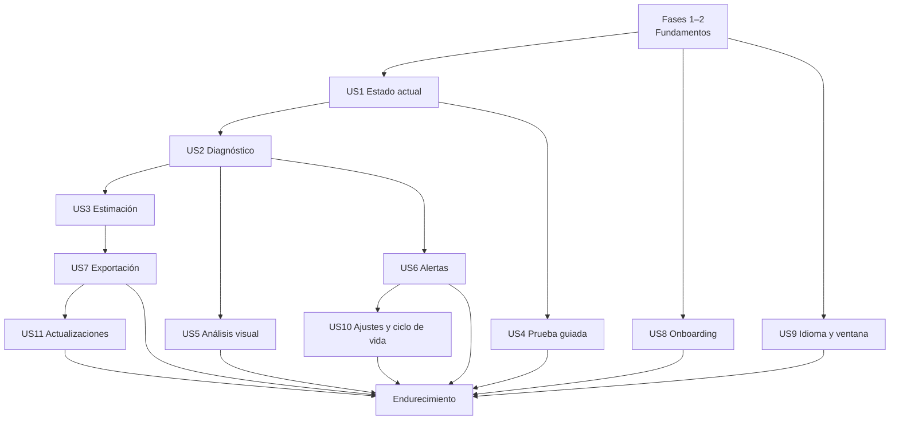

# Tareas: diagnóstico térmico de CPU

**Entrada**: `spec.md`, `plan.md`, `research.md`, `data-model.md`, `ux-visual-spec.md`, `contracts/`  
**Pruebas**: obligatorias según constitución; el motor debe desarrollarse contra trazas antes de conectarlo a hardware real.

Formato: `[ID] [P?] [Historia?] Descripción con ruta`.

## Fase 1 — Inicialización

- [ ] T001 Crear monorepo y estructura definida en `plan.md`.
- [ ] T002 Inicializar Tauri 2 + Svelte + TypeScript estricto en `apps/desktop/`.
- [ ] T003 [P] Crear solución .NET y proyecto `sensor-agent` en `apps/sensor-agent/`.
- [ ] T004 [P] Crear crates/módulos Rust `ipc`, `storage`, `diagnostics` y `export` en `apps/desktop/src-tauri/src/`.
- [ ] T005 [P] Configurar formatos, lint y análisis estático para TypeScript, Rust y C#.
- [ ] T006 Configurar scripts raíz de build/test/dev y fijar gestores/versiones en archivos de bloqueo.
- [ ] T007 [P] Configurar CI Windows x64 con cachés y artefactos de pruebas, sin requerir sensores reales.
- [ ] T008 [P] Crear inventario de licencias y plantilla de `THIRD-PARTY-NOTICES`.
- [ ] T009 Documentar decisiones ADR iniciales: sidecar, SQLite, `AnalysisChart` SVG, agregación temporal y baseline local en `docs/adr/`.

## Fase 2 — Fundamentos bloqueantes

- [ ] T010 Implementar tipos de contrato v1 compartidos a partir de `contracts/telemetry.schema.json`.
- [ ] T011 [P] Crear fixtures canónicos de handshake, capabilities, sample y error en `packages/contracts/fixtures/`.
- [ ] T012 [P] Crear tests C# de serialización de fixtures en `apps/sensor-agent/Tests/Protocol/`.
- [ ] T013 [P] Crear tests Rust de deserialización/validación de fixtures en `apps/desktop/src-tauri/src/ipc/tests/`.
- [ ] T014 Implementar handshake con nonce, versión y secuencia en sidecar y Rust.
- [ ] T015 Implementar supervisor de sidecar con estado, timeout, EOF y backoff limitado en `src-tauri/src/ipc/supervisor.rs`.
- [ ] T016 [P] Crear sidecar falso/replay en `packages/trace-fixtures/tools/`.
- [ ] T017 Integrar LibreHardwareMonitorLib con solo CPU habilitada en `apps/sensor-agent/Collector/`.
- [ ] T018 Implementar catálogo original de hardware/sensores sin normalización de negocio.
- [ ] T019 [P] Ejecutar spike de lectura sin privilegios en matriz Intel/AMD y documentar `docs/spikes/sensor-access.md`.
- [ ] T020 [P] Ejecutar spike de redistribución, instalación y retirada del acceso bajo nivel en `docs/spikes/low-level-driver.md`.
- [ ] T021 Resolver la arquitectura de privilegios mediante ADR; bloquear empaquetado si contradice la constitución.
- [ ] T022 Crear SQLite, migración v1 y repositorios base en `src-tauri/src/storage/`.
- [ ] T023 [P] Implementar reloj monotónico, detección de huecos y modelo de calidad de muestra.
- [ ] T024 [P] Crear `scripts/design-sync` que copie `design/{components,icons,illustrations,lib,tokens,brand}` a `apps/desktop/src/design-system/` y un test de CI que falle si la copia difiere; prohibir por lint la importación de `design/examples/` y `design/harness/`. Integrar `tokens.css` desde la copia para claro/oscuro, modo sistema y movimiento reducido.
- [ ] T025 Crear shell de navegación y estados globales de colector en `apps/desktop/src/`.
- [ ] T026 Configurar catálogos completos español/inglés, resolución especial de locales y verificador de igualdad/sin literales.

**Hito:** handshake, catálogo y muestras sintéticas atraviesan sidecar → Rust → UI → SQLite.

## Fase 2b — Ampliación del sistema de diseño (decisiones de 2026-09-18)

Estas tareas modifican `design/` **antes** de la primera sincronización (T024) y deben pasar `npm run check` y `npm run build` del harness. Ninguna añade copy incrustado ni dependencias. **Completadas el 2026-09-18** (batch 12 del sistema de diseño; harness y mockup compilan sin errores ni avisos; verificación visual en `examples/ShellPieces.example.svelte` y `design/mockup`).

- [x] T118 [P] `SettingsScreen`: sustituir `minimizeToTrayOnClose` por `closeAction: 'unset' | 'exit' | 'tray'` con `SegmentedControl` y texto «sin decidir»; eliminar `anonymizedDiagnostics` y el canal de actualizaciones; retención fija a 4 opciones; añadir movimiento (`appearance.motion`), `onBattery`, bloques `advanced` plegados por sección (intervalo, detalle por núcleo, periodo de silencio, nivel de registro), espacio usado, `Exportar…`, `Probar notificación`, `Repetir introducción`, enlaces de Acerca de (`Documentación`, `Documentación en línea`, `Licencias`, `Resumen técnico`, `Abrir carpeta de registros`); sección Diagnóstico con duración, exigir CA, avisar al terminar y límites en solo lectura.
- [x] T119 [P] `SettingsScreen.updates`: estados `idle|checking|upToDate|available|downloading|verified|installing|error`; botones `Descargar` (solo `available`) e `Instalar` (solo `verified`, con `installDisabledReason`); descripción de comprobación «cada 24 h».
- [x] T120 [P] Sustituir `advancedAccessAvailable: boolean` por `advancedAccess: 'not_needed'|'available'|'installable'|'denied'|'error'` en `OnboardingFlow` (slide 5) y `SettingsScreen.sensors`; solo `installable` muestra el botón de instalar/reparar.
- [x] T121 [P] Crear `CoverageMatrix` (magnitud × disponible/calidad/origen/motivo, pie con confianza máxima y estado de acceso, acciones Volver a comprobar / Copiar resumen técnico) y su ejemplo.
- [x] T122 [P] Crear `ContextStrip` (CPU + topología, alimentación/plan, estado del colector con frescura, Ver cobertura) con estados fresco/obsoleto/desconectado y su ejemplo.
- [x] T123 [P] Crear `ExportDialog` (alcance, formato, anonimizar, campos incluidos/excluidos, tamaño y nombre propuestos) e `ImportResultDialog` (validación, migración, avisos) y sus ejemplos.
- [x] T124 [P] Crear `FirstCloseDialog` (dos opciones, texto de bandeja «y seguir midiendo», enlace a Ajustes) y `CloseBlockedDialog` (prueba/exportación/descarga/instalación).
- [x] T125 [P] Crear `WhatsNewCards` (pila de tarjetas con «Entendido» y acción opcional) y `TechnicalSummary` (texto monoespaciado + Copiar) y `LicensesScreen` (lista desplegable de avisos de terceros).
- [x] T126 [P] `GuidedDiagnosticScreen`: añadir fase `rest` (omitible) al stepper (6 pasos), bloque estructurado `whatWillHappen[]` en la intro, tiempo restante por fase, `batteryState='blocked'` explicado, acción «Usar como referencia» en resultado.
- [x] T127 [P] Shell: `BottomBar` con ítem `Más` y menú (Sesiones, Diagnóstico guiado, Ajustes); `Banner` global fijo bajo `TitleBar` para prueba en curso (con Detener) y para estado del colector degradado (Reintentar / Ver resumen técnico); documentar en `AGENTS.md`.
- [x] T128 [P] `SessionCard`/`SessionsScreen`: marca «Referencia», acciones Usar/Retirar referencia, botón `Importar…` en cabecera, `statusLabel` obligatorio para `incomplete`. `ReportScreen`: acciones Exportar / Usar como referencia / Re-evaluar con reglas actuales y aviso «Provisional · sesión en curso».
- [x] T129 Actualizar `design/README.md`, `AGENTS.md` y `design-system.json` con los componentes nuevos y las props cambiadas; actualizar `design/mockup` a los contratos nuevos; ejecutar harness `check` y `build`.
- [x] T130 [P] Material de vidrio y catálogo de animaciones en `design/` (tokens `--glass-*`/`--motion-*`, niveles `data-glass`, fondo `tw-ambient`, utilidades `tw-enter`/`tw-pop`, animaciones por componente) según `ux-visual-spec.md` § «Material de vidrio» y § «Animación»; harness y mockup con conmutadores de vidrio y movimiento. (2026-09-18)
- [ ] T131 [US9] Implementar la preferencia `appearance.glass` (`system|full|reduced|off`): lectura de `UISettings.AdvancedEffectsEnabled`, escucha en caliente, aplicación de `data-glass` y degradación automática por rendimiento con histéresis; test de que `off` y sin `backdrop-filter` mantienen contraste AA.

## Fase 3 — Historia 1: estado térmico actual (P1)

- [ ] T027 [P] [US1] Crear pruebas del normalizador para Intel homogéneo/híbrido, AMD y legado.
- [ ] T028 [P] [US1] Implementar las reglas de selección de temperatura representativa (`package`/`Tdie` → máx. núcleos → `Tctl` con offset → `Tctl` sin offset) y margen en `sensor-agent/Normalization/`, según `spec.md` § Parámetros iniciales.
- [ ] T028a [P] [US1] Implementar en el sidecar la clasificación de grupos P/E/LP mediante `GetLogicalProcessorInformationEx` y CPUID (hoja 0x1A) con fallback `unknown`.
- [ ] T028b [P] [US1] Implementar en el sidecar la lectura opcional de banderas térmicas/eléctricas desde MSR (`IA32_THERM_STATUS`, `IA32_PACKAGE_THERM_STATUS`, `MSR_CORE_PERF_LIMIT_REASONS`; equivalentes AMD) cuando el acceso de bajo nivel lo permita; sin acceso, no emitir descriptores.
- [ ] T028c [P] [US1] Implementar en Rust el reloj efectivo derivado del contador PDH `% Processor Performance` × reloj base como descriptor `host`/`derived`, con test contra trazas `derived-clock-only`.
- [ ] T028d [P] [US1] Implementar en Rust la lectura del contexto energético (`GetSystemPowerStatus`, `PowerGetActiveScheme`, `WM_POWERBROADCAST`) y su persistencia por frame; detectar reanudación y aplicar FR-065.
- [ ] T029 [US1] Implementar normalización de temperatura, carga, reloj, potencia y flags conservando metadatos originales.
- [ ] T030 [US1] Implementar agregación de snapshot y frescura en `src-tauri/src/telemetry/`.
- [ ] T031 [P] [US1] Crear componente Hero de estado en `src/features/dashboard/StatusHero.svelte`.
- [ ] T032 [P] [US1] Crear tarjetas de temperatura, carga, reloj y potencia con mini-tendencias.
- [ ] T033 [P] [US1] Conectar `CoverageMatrix` y `ContextStrip` a `get_coverage`, `telemetry:snapshot`, `collector:state` y `power:context`; calcular «confianza máxima alcanzable» y el enum de acceso avanzado en Rust.
- [ ] T034 [US1] Conectar snapshots reales/replay a la pantalla `Ahora` sin lógica de sensor en UI.
- [ ] T035 [US1] Añadir pruebas UI para completo, parcial, obsoleto, desconectado y CPU híbrida.

**Prueba independiente:** abrir modo replay y comprender el estado; los ausentes dicen “No disponible”.

## Fase 4 — Historia 2: detectar y explicar limitaciones (P1)

- [ ] T036 [P] [US2] Definir `ruleset-v1.json` con los umbrales, ventanas, bandas de confianza y techos de `spec.md` § Parámetros iniciales, más códigos explicables; test que verifique que el fichero coincide con la spec.
- [ ] T037 [P] [US2] Crear corpus etiquetado para normal, hot-unproven, thermal probable/confirmed, power, mixed e indeterminate.
- [ ] T038 [US2] Implementar extracción de ventanas robustas y estabilidad de carga en `diagnostics/windows.rs`.
- [ ] T039 [US2] Implementar evidencia térmica directa e inferida en `diagnostics/thermal.rs`.
- [ ] T040 [P] [US2] Implementar evidencia de potencia/corriente/contexto en `diagnostics/power.rs`.
- [ ] T041 [US2] Implementar clasificador, confianza y causas alternativas como función pura.
- [ ] T042 [US2] Implementar segmentación y fusión de `limit_event` persistentes.
- [ ] T043 [P] [US2] Crear componentes `DiagnosisBanner`, `EvidenceList` y `AlternativeCauses`.
- [ ] T044 [US2] Crear narrativa causal solo cuando la secuencia esté sustentada.
- [ ] T045 [US2] Ejecutar regresión del corpus y fijar métricas de SC-003 a SC-005 en CI.

**Prueba independiente:** reproducir cada traza y obtener clasificación, confianza y evidencias esperadas.

## Fase 5 — Historia 3: estimación de rendimiento (P1)

- [ ] T046 [P] [US3] Crear tests de comparabilidad, invalidación y ausencia de baseline.
- [ ] T047 [US3] Implementar repositorio y ciclo de vida de baseline según `data-model.md`, incluidos los criterios del baseline aprendido, la caducidad de 30 días, la prioridad `guided > user_marked > learned` y `set_session_reference`.
- [ ] T047a [US3] Implementar límites de sesión pasiva (FR-067): apertura, partición por hueco > 60 s / 24 h, congelación del informe y diagnóstico en vivo provisional.
- [ ] T048 [US3] Implementar agrupación P/E/LP y ponderación por núcleos activos/carga.
- [ ] T049 [US3] Implementar ratio, dispersión, rango e impacto de calidad en `diagnostics/performance.rs`.
- [ ] T050 [US3] Aplicar restricción: no serializar porcentaje sin baseline válido.
- [ ] T051 [P] [US3] Crear visual `PerformanceRange` con rango, confianza y enlace a método.
- [ ] T052 [US3] Añadir pruebas negativas contra turbo máximo, media de núcleos inactivos y falsa precisión.

**Prueba independiente:** una traza con baseline muestra rango; la misma sin baseline lo omite y explica la ausencia.

## Fase 6 — Historia 4: diagnóstico guiado (P2)

- [ ] T053 [P] [US4] Ejecutar spike comparando carga integrada y observación externa en `docs/spikes/guided-load.md`.
- [ ] T054 [US4] Aprobar mediante ADR el modo seguro; si no, implementar guía para carga externa reproducible.
- [ ] T055 [P] [US4] Modelar máquina de estados y persistencia parcial de sesión guiada.
- [ ] T056 [US4] Implementar preflight de sensores, alimentación (`guided.require_ac`), perfil, espacio en disco y generador; fases y límites de parada según `spec.md` (comprobación, reposo omitible, calentamiento, carga según `guided.duration`, recuperación); cancelación al ocultar ventana o suspender; atajo `Ctrl+Shift+X`; `guided.notify_on_finish`.
- [ ] T057 [US4] Implementar controlador de fases, cancelación y watchdog fuera de workers.
- [ ] T058 [P] [US4] Crear UI de consentimiento, progreso, temperatura/límite y `Detener ahora`.
- [ ] T059 [US4] Probar cancelación, sensor perdido, proceso padre ausente, batería y umbral de seguridad.

**Prueba independiente:** completar o cancelar una sesión sin dejar carga activa; obtener informe o motivo explícito.

## Fase 7 — Historia 5: análisis visual (P2)

- [ ] T060 [P] [US5] Integrar el benchmark reproducible de `AnalysisChart` y validarlo en hardware objetivo con 4 pistas, 3.000 puntos por pista y eventos superpuestos.
- [ ] T061 [US5] Implementar consulta/agregación por resolución temporal en Rust conservando extremos, huecos, calidad y fronteras de eventos; objetivo 2.000–3.000 puntos por pista y 10.000–12.000 totales.
- [ ] T062 [P] [US5] Integrar el `AnalysisChart` SVG del sistema de diseño con cuatro pistas, huecos reales, cursor común y recarga de mayor resolución al hacer zoom.
- [ ] T063 [P] [US5] Crear bandas de eventos térmicos, potencia y mixtos con patrones accesibles.
- [ ] T064 [P] [US5] Crear mapa de topología por núcleo/grupo y tabla avanzada virtualizada.
- [ ] T065 [US5] Conectar selección temporal con panel de evidencia y exportación de rango.
- [ ] T066 [US5] Añadir pruebas visuales, rendimiento y accesibilidad para zoom, cursor/rango por teclado, tabla textual, huecos, calidad reducida y densidad alta.

**Prueba independiente:** inspeccionar una sesión y rastrear una conclusión hasta valores sincronizados.

## Fase 8 — Historia 6: bandeja y alertas (P2)

- [ ] T067 [P] [US6] Implementar lifecycle de ventana/bandeja y preferencia de monitorización, incluido que elegir bandeja en la primera X active `tray.monitoring_enabled`, la corrección atómica de FR-061 y la instancia única.
- [ ] T067a [P] [US6] Implementar menú de bandeja (Estado, Abrir, Pausar/Reanudar, Salir), clic para mostrar/ocultar y `set_tray_paused`.
- [ ] T068 [P] [US6] Diseñar iconos de bandeja para normal, aviso, crítico, desconocido y desconectado.
- [ ] T069 [US6] Implementar los cuatro tipos de alerta, persistencia ≥ 90 s, enfriamiento 30 min por tipo, periodo de silencio opcional y navegación al pulsar (`notification:opened`).
- [ ] T070 [US6] Integrar notificaciones Windows con texto prudente y acceso a sesión.
- [ ] T071 [US6] Implementar perfiles 5 s / 1 s / 500 ms, `sampling.on_battery` (`keep`/`low_power`/`pause`) y `sampling.per_core_history`.
- [ ] T072 [US6] Probar cierre de ventana, reinicio del sidecar y ausencia de alertas por picos breves.

**Prueba independiente:** minimizar, provocar una traza persistente y recibir una única alerta explicable.

## Fase 9 — Historia 7: exportación, importación y privacidad (P3)

- [ ] T073 [P] [US7] Definir esquema JSON de informe/exportación separado del IPC.
- [ ] T074 [P] [US7] Implementar exportador CSV por streaming y snapshot consistente.
- [ ] T075 [US7] Implementar informe JSON versionado con eventos, baseline y reglas.
- [ ] T076 [US7] Implementar anonimización por allowlist y test de fuga de identificadores.
- [ ] T077 [US7] Implementar importador/migrador, reproducción de sesión sin hardware y `reevaluate_report` (evaluación nueva junto a la original; baseline importado nunca local).
- [ ] T078 [US7] Conectar `ExportDialog` (tres alcances) e `ImportResultDialog` a `preview_export`, `export`, `import_session` y sus eventos; CSV según formato fijado en `spec.md`.

**Prueba independiente:** exportar anónimo, validar esquema, importar y reproducir con el mismo diagnóstico.

## Fase 10 — Historias 8 y 9: onboarding, idioma, tema y ventana (P1)

- [ ] T079 [P] [US8] Implementar repositorio y migración de `onboarding_state` con versión, progreso, completado y omitido.
- [ ] T080 [P] [US8] Crear las cinco diapositivas y glosario breve en ambos catálogos, sin literales visibles.
- [ ] T081 [US8] Conectar detección pasiva a la quinta diapositiva y a la salida anticipada hacia `Ahora`.
- [ ] T082 [US8] Implementar repetición desde Ayuda y `WhatsNewCards` versionadas independientes; omitir sin confirmación.
- [ ] T083 [P] [US9] Implementar resolución pura de locale `es/ca/gl/eu/ast/an → es`, resto incluido `pt → en`, y override manual.
- [ ] T084 [P] [US9] Implementar tema `system/light/dark`, escucha de Windows, preferencia de movimiento (`data-motion`) y montaje del fondo ambiental `tw-ambient` en el shell.
- [ ] T085 [P] [US9] Configurar ventana sin decoraciones y componente presentacional `TitleBar` con adaptador único de Tauri.
- [ ] T086 [US9] Persistir rectángulo restaurado/maximizado (mínimo 480×600, inicial 1100×760) y recuperar geometría fuera de monitores activos; formato de números/fechas con `Intl` según idioma efectivo.
- [ ] T087 [US9] Añadir pruebas de onboarding, locales, expansión de texto, tema, barra, doble clic y geometría multimonitor.

**Prueba independiente:** una instalación limpia puede completarse u omitirse en español/inglés, y al reiniciar conserva preferencias y una ventana visible.

## Fase 11 — Historia 10: ajustes y ciclo de vida (P2)

- [ ] T088 [P] [US10] Implementar almacén tipado/versionado de preferencias y validación de dependencias.
- [ ] T089 [P] [US10] Crear secciones de Ajustes y panel avanzado plegado según `ux-visual-spec.md`.
- [ ] T090 [US10] Implementar `FirstCloseDialog` y persistencia `exit/tray` (con `dismiss` sin persistir), `CloseBlockedDialog` para prueba/exportación/descarga/instalación, sin confundir minimizar con ocultar.
- [ ] T091 [US10] Integrar inicio con Windows en modo ventana/bandeja, desactivado por defecto y reversible.
- [ ] T092 [P] [US10] Implementar perfiles de muestreo y valores iniciales de avisos/retención/anonimización.
- [ ] T093 [US10] Implementar borrado de datos conservando preferencias y restablecimiento total como transacciones separadas con informe de fallos parciales (FR-063); `get_storage_usage`; `TechnicalSummary`, `LicensesScreen`, `open_logs_folder` y `open_external_url` con lista cerrada.
- [ ] T094 [US10] Probar reinicio, dependencias, confirmaciones, fallos parciales y valores de fábrica.

**Prueba independiente:** cada ajuste persiste y las dos acciones destructivas afectan exactamente a los datos documentados.

## Fase 12 — Historia 11: actualizaciones voluntarias firmadas (P3)

- [ ] T095 [P] [US11] Documentar ADR de endpoint fijo, plugin oficial, custodia Ed25519 y permisos mínimos.
- [ ] T096 [P] [US11] Crear estado persistente y máquina de estados del actualizador en Rust.
- [ ] T097 [US11] Implementar comprobación automática cada 24 h sin tráfico cuando está apagada.
- [ ] T098 [US11] Implementar `Buscar actualizaciones` como reintento manual independiente de la cadencia.
- [ ] T099 [US11] Implementar descarga con progreso, temporales seguros, descarte de parciales y verificación Ed25519, exponiendo el estado `verified` como paso separado.
- [ ] T100 [US11] Implementar confirmación de instalación, cierre ordenado y bloqueo por diagnóstico/exportación/importación/borrado con motivo.
- [ ] T101 [P] [US11] Crear UI de Ajustes y notificación nativa enlazada a la versión disponible.
- [ ] T102 [P] [US11] Configurar workflow de GitHub Releases para generar manifiesto y artefactos firmados sin exponer la clave privada.
- [ ] T103 [US11] Probar cero red desactivado, cadencias, firma inválida, interrupción, bloqueo y aislamiento de errores.

**Prueba independiente:** ningún artefacto se descarga sin gesto ni se instala sin firma y confirmación independientes.

## Fase 13 — Endurecimiento y entrega

- [ ] T104 [P] Implementar retención (incluida `session` = borrado al salir), purga segura, mantenimiento limitado de SQLite, modo solo memoria con disco lleno y recuperación de base de datos dañada (FR-075).
- [ ] T105 [P] Implementar logs estructurados rotados (5 × 5 MB, nivel `logging.level`) y resumen técnico anónimo.
- [ ] T106 [P] Completar teclado, lector de pantalla, contraste, ambos idiomas y movimiento reducido; ejecutar la matriz de ambos temas y tamaños compacto/medio/expandido sobre todas las pantallas.
- [ ] T107 Optimizar arranque, memoria, consultas y render hasta cumplir NFR-001 a NFR-003.
- [ ] T108 Ejecutar sesiones de una hora y pruebas de suspensión/reanudación.
- [ ] T109 Ejecutar matriz de hardware real y publicar cobertura observada.
- [ ] T110 Completar modelo de amenazas, CSP y revisión de comandos Tauri/sidecar/actualizador.
- [ ] T111 Completar obligaciones MPL 2.0, avisos, código fuente cubierto y SBOM.
- [ ] T112 Construir instalador NSIS x64 por usuario sin elevación, con WebView2 bootstrapper, pregunta de conservar datos al desinstalar, reparación y rollback; instalador separado por máquina para el acceso de bajo nivel si el spike lo aprueba.
- [ ] T113 Configurar firma de binarios/instalador y actualización segura.
- [ ] T114 Redactar ayuda en español e inglés, significado de métricas y límites del diagnóstico.
- [ ] T115 Ejecutar `speckit.converge`, resolver divergencias y registrar decisión de release.
- [ ] T116 [P] Incorporar a CI `npm ci`, `npm run check` y `npm run build` en `design/harness/` para impedir regresiones del sistema de diseño.
- [ ] T117 Auditar la aplicación contra `design/components/` y `design/examples/`, eliminar duplicados visuales casi equivalentes y documentar cualquier excepción aprobada.

## Dependencias

La fase 2b (T118–T129) precede a T024 y a cualquier pantalla que consuma los componentes modificados. US4 puede desarrollarse como observación externa si el spike de carga integrada no supera la puerta de seguridad. US5 puede comenzar con replay mientras se completa hardware real. US6 y US7 pueden avanzar en paralelo una vez estabilizados eventos e informes.

## Estrategia de MVP

El primer MVP demostrable incluye fundamentos, US1–US3, US8 y US9: onboarding bilingüe, apariencia/ventana, panel actual, diagnóstico explicable y estimación solo con baseline. Si el calendario exige recorte, pueden aplazarse carga integrada, bandeja, exportación avanzada y actualizaciones, pero no los dos idiomas, el tema claro/oscuro ni las salvaguardas que impiden mostrar porcentajes sin evidencia.
